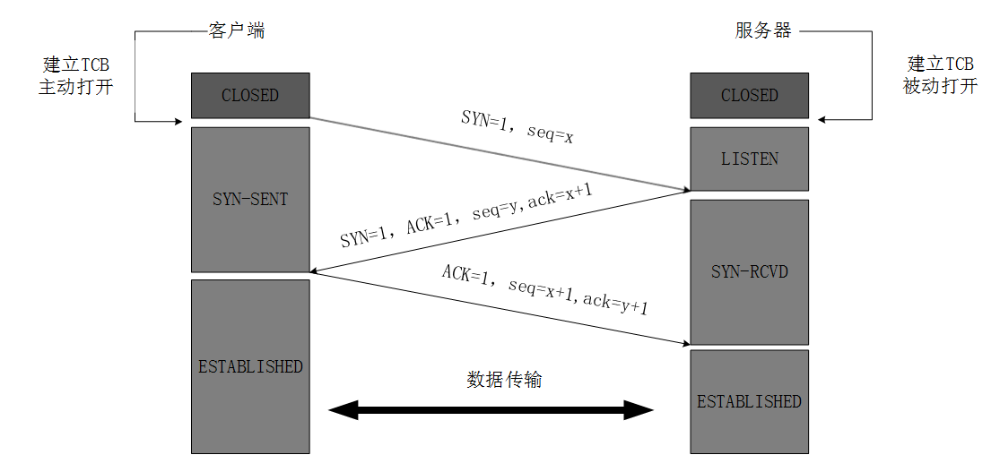
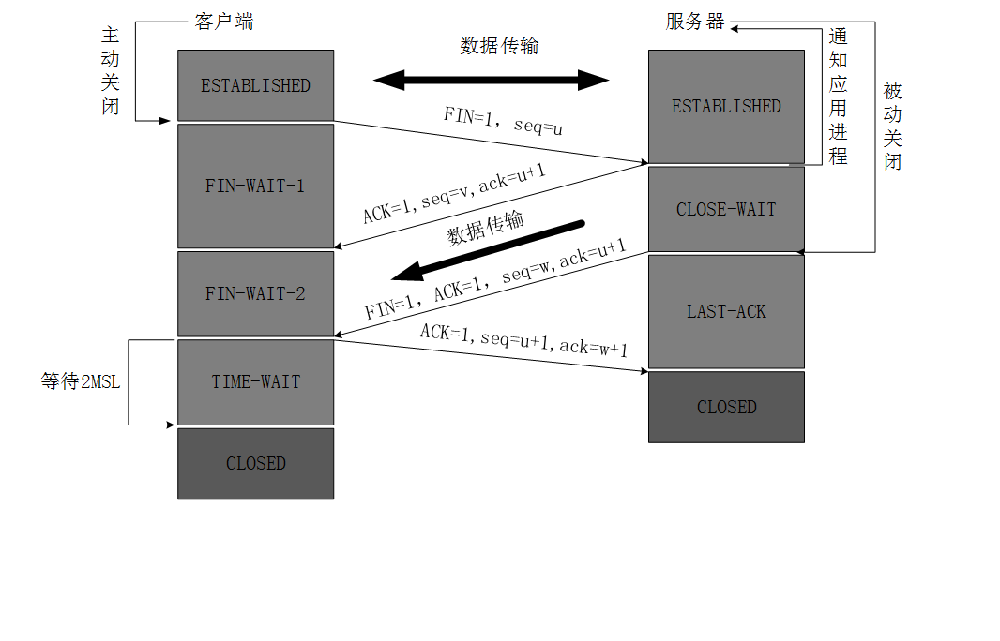

# TCP-传输控制协议

‍

## TCP 的特性

* TCP 提供一种**面向连接的、可靠的**字节流服务
* 在一个 TCP 连接中，仅有两方进行彼此通信。广播和多播不能用于 TCP
* TCP 使用校验和，确认和重传机制来保证可靠传输
* TCP 给数据分节进行排序，并使用累积确认保证数据的顺序不变和非重复
* TCP 使用滑动窗口机制来实现流量控制，通过动态改变窗口的大小进行拥塞控制

**注意**：TCP 并不能保证数据一定会被对方接收到，因为这是不可能的。TCP 能够做到的是，如果有可能，就把数据递送到接收方，否则就（通过放弃重传并且中断连接这一手段）通知用户。因此准确说 TCP 也不是 100% 可靠的协议，它所能提供的是数据的可靠递送或故障的可靠通知。

## 三次握手与四次挥手

所谓三次握手(Three-way Handshake)，是指建立一个 TCP 连接时，需要客户端和服务器总共发送3个包。

三次握手的目的是连接服务器指定端口，建立 TCP 连接，并同步连接双方的序列号和确认号，交换 TCP 窗口大小信息。在 socket 编程中，客户端执行 `connect()`​ 时。将触发三次握手。

* 第一次握手(SYN=1, seq=x):

  主机A发送标志位syn＝1，随机产生seq number=1234567的数据包到服务器，主机B由SYN=1知道，A要求建立联机；同时主机A进入 `SYN_SEND`​ 状态。
* 第二次握手(SYN=1, ACK=1, ACKnum=x+1, seq=y):

  主机B收到请求后要确认联机信息，向A发送ack number=(主机A的seq+1)，syn=1，ack=1，随机产生seq=7654321的包；发送完毕后，主机B进入 `SYN_RCVD`​ 状态。
* 第三次握手(ACK=1，ACKnum=y+1)

  主机A收到后检查ack number是否正确，即第一次发送的seq number+1，以及位码ack是否为1，若正确，主机A会再发送ack number=(主机B的seq+1)，ack=1，主机B收到后确认seq值与ack=1则连接建立成功。同时客户端进入 `ESTABLISHED`​ 状态，当服务器端接收到这个包时，也进入 `ESTABLISHED`​ 状态，TCP 握手结束。

​

三次握手的过程的示意图如下各字段在TCP三次握手中的作用：

**SYN**：用于**建立连接**。  
**ACK**：用于确定**收到了请求**。  
**seq**：发送**自己的**数据。  
**ack**：发送**接收到的对方的**数据

> 为什么TCP客户端最后还要发送一次确认呢？

一句话，主要防止已经失效的连接请求报文突然又传送到了服务器，从而产生错误。

如果使用的是两次握手建立连接，假设有这样一种场景，客户端发送了第一个请求连接并且没有丢失，只是因为在网络结点中滞留的时间太长了，由于TCP的客户端迟迟没有收到确认报文，以为服务器没有收到，此时重新向服务器发送这条报文，此后客户端和服务器经过两次握手完成连接，传输数据，然后关闭连接。此时此前滞留的那一次请求连接，网络通畅了到达了服务器，这个报文本该是失效的，但是，两次握手的机制将会让客户端和服务器再次建立连接，这将导致不必要的错误和资源的浪费。

如果采用的是三次握手，就算是那一次失效的报文传送过来了，服务端接受到了那条失效报文并且回复了确认报文，但是客户端不会再次发出确认。由于服务器收不到确认，就知道客户端并没有请求连接。

---

TCP 的连接的拆除需要发送四个包，因此称为四次挥手(Four-way handshake)，客户端或服务器均可主动发起挥手动作，在 socket 编程中，任何一方执行 `close()`​ 操作即可产生挥手操作。

* 第一次挥手(FIN=1，seq=u)

  假设客户端想要关闭连接，客户端发送一个 FIN 标志位置为1的包，表示自己已经没有数据可以发送了，但是仍然可以接受数据。

  发送完毕后，客户端进入 `FIN_WAIT_1`​ 状态。
* 第二次挥手(ACK=1，ACKnum=u+1, seq=v)

  服务器端确认客户端的 FIN 包，发送一个确认包，表明自己接受到了客户端关闭连接的请求，但还没有准备好关闭连接。

  发送完毕后，服务器端进入 `CLOSE_WAIT`​ 状态，客户端接收到这个确认包之后，进入 `FIN_WAIT_2`​ 状态，等待服务器端关闭连接。
* 第三次挥手(FIN=1，ACK=1, ACKnum=u+1, seq=w)

  服务器端准备好关闭连接时，向客户端发送结束连接请求，FIN 置为1。

  发送完毕后，服务器端进入 `LAST_ACK`​ 状态，等待来自客户端的最后一个ACK。
* 第四次挥手(ACK=1，seq=u+1, ACKnum=w+1)

  客户端接收到来自服务器端的关闭请求，发送一个确认包，并进入 `TIME_WAIT`​状态，等待可能出现的要求重传的 ACK 包。

  服务器端接收到这个确认包之后，关闭连接，进入 `CLOSED`​ 状态。

  客户端等待了某个固定时间（两个最大段生命周期，2MSL，2 Maximum Segment Lifetime）之后，没有收到服务器端的 ACK ，认为服务器端已经正常关闭连接，于是自己也关闭连接，进入 `CLOSED`​ 状态。

​

> 为什么客户端最后还要等待2MSL？_

MSL（最大段生命周期），TCP允许不同的实现可以设置不同的MSL值。

第一，保证客户端发送的最后一个ACK报文能够到达服务器，因为这个ACK报文可能丢失，站在服务器的角度看来，我已经发送了FIN+ACK报文请求断开了，客户端还没有给我回应，应该是我发送的请求断开报文它没有收到，于是服务器又会重新发送一次，而客户端就能在这个2MSL时间段内收到这个重传的报文，接着给出回应报文，并且会重启2MSL计时器。

第二，防止类似与“三次握手”中提到了的“已经失效的连接请求报文段”出现在本连接中。客户端发送完最后一个确认报文后，在这个2MSL时间中，就可以使本连接持续的时间内所产生的所有报文段都从网络中消失。这样新的连接中不会出现旧连接的请求报文。

## UDP 简介

UDP 是一个简单的传输层协议。和 TCP 相比，UDP 有下面几个显著特性：

* UDP 缺乏可靠性。UDP 本身不提供确认，序列号，超时重传等机制。UDP 数据报可能在网络中被复制，被重新排序。即 UDP 不保证数据报会到达其最终目的地，也不保证各个数据报的先后顺序，也不保证每个数据报只到达一次
* UDP 数据报是有长度的。每个 UDP 数据报都有长度，如果一个数据报正确地到达目的地，那么该数据报的长度将随数据一起传递给接收方。而 TCP 是一个字节流协议，没有任何（协议上的）记录边界。
* UDP 是无连接的。UDP 客户和服务器之前不必存在长期的关系。UDP 发送数据报之前也不需要经过握手创建连接的过程。
* UDP 支持多播和广播。

‍

‍

OSI（Open System Interconnect），即开放式系统互联。  一般都叫OSI参考模型，是ISO（国际标准化组织）组织在1985年研究的网络互连模型。ISO为了更好的使网络应用更为普及，推出了OSI参考模型。其含义就是推荐所有公司使用这个规范来控制网络。这样所有公司都有相同的规范，就能互联了。

‍

## TCP/IP四层与OSI七层模型

​

‍

|OSI七层网络模型|TCP/IP四层概念模型|对应网络协议|
| -------------------------| -----------------------------------------------| -----------------------------------------|
|应用层（Application）|应用层 |HTTP、TFTP,FTP, NFS, WAIS、SMTP|
|表示层（Presentation）||Telnet, Rlogin, SNMP, Gopher|
|会话层（Session）||SMTP, DNS|
|传输层（Transport）|传输层（报文段）|TCP, UDP|
|网络层（Network）|网络层（数据包）|IP, ICMP, ARP, RARP, AKP, UUCP|
|数据链路层（Data Link）|数据链路层（帧） |FDDI, Ethernet, Arpanet, PDN, SLIP, PPP|
|物理层（Physical）||IEEE 802.1A, IEEE 802.2到IEEE 802.11|

‍
