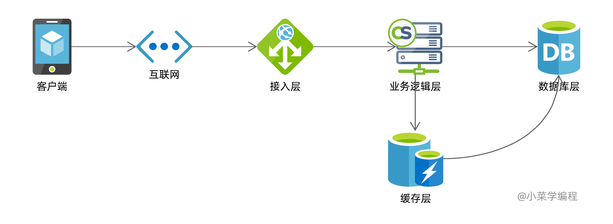
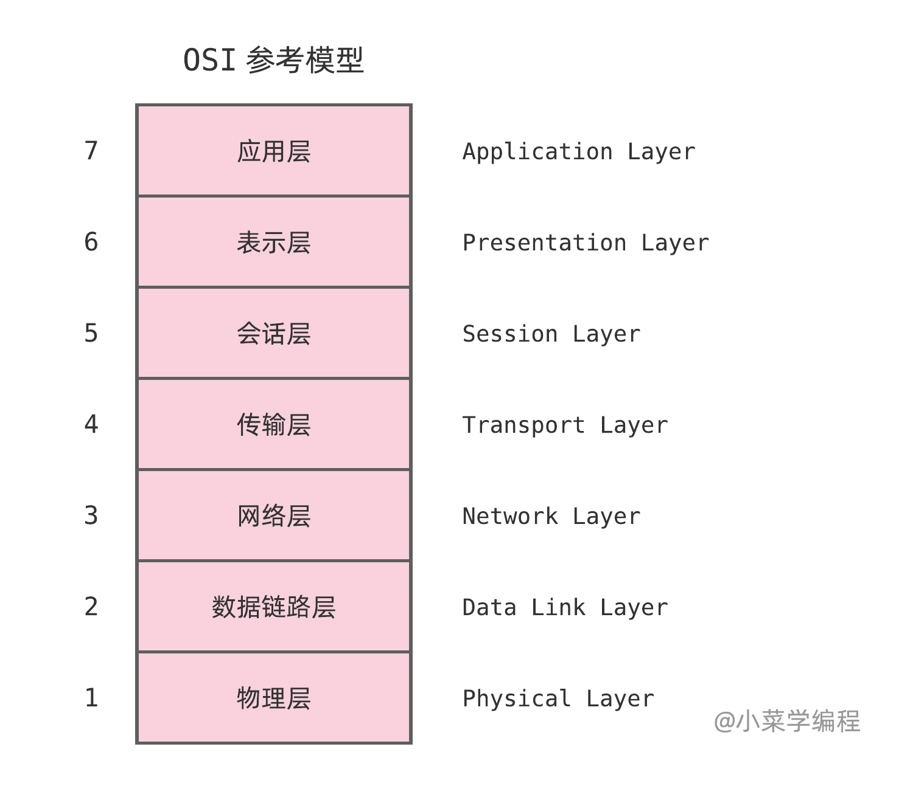
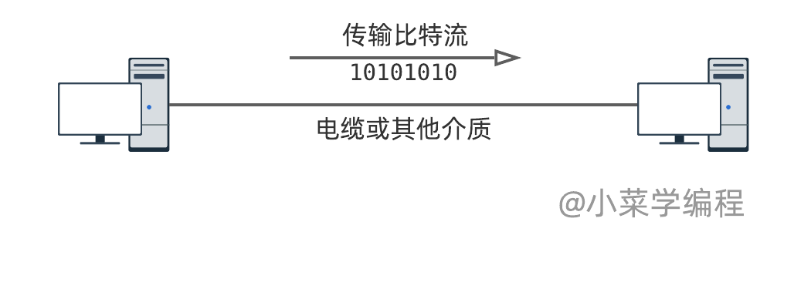
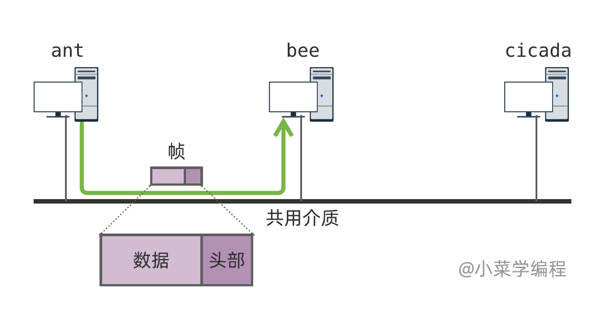
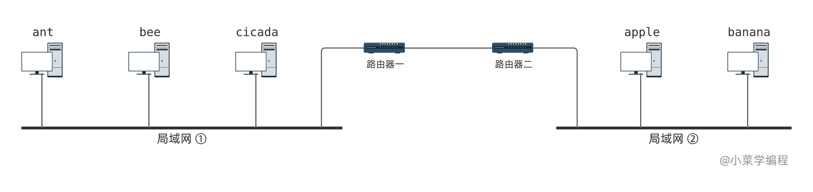
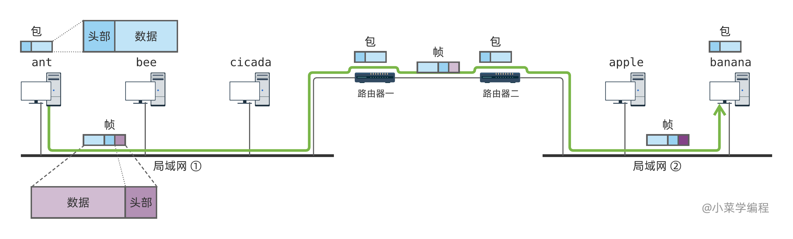

# 1.2OSI参考模型

　　为降低复杂度并提高灵活性，大型软件系统一般采用分层的思路进行设计。

　　电商平台是一个典型的例子，后端可能分成数据库层、缓存层、业务逻辑层、接入层等等。每个层只专注于本层的处理逻辑，复杂性大大降低；各个层互相配合，共同完成复杂的业务处理。

​​

## OSI模型

　　网络通信也是一个非常庞大的系统工程，网络协议势必也需要采用分层设计思想。为此，国际标准化组织提出了**开放式系统互联模型**（ *open system interconnection model* ），简称 **OSI模型** 。

　　OSI模型是一种概念模型，用于指导通信系统设计，并实现标准化。该模型将通信系统中的数据流划分为七个层：

​​

## 物理层

　　**物理层**（ *physical layer* ），负责管理通信设备和通信媒介，对设备的针脚、电压、线缆等做了详尽的定义。举个例子，对于一根电缆，只要规定好高低电平的电压以及高低电平与 `0/1`​ 比特的对应关系，就可以一个比特流信道。

　　在物理层的规范下，相邻网络设备，借助一定的物理介质，达到传输信息比特的目的：

​​

　　物理层为我们屏蔽了物理设备的底层细节，为上层提供信息比特传输能力。至于它对于线缆、电压等的规定，软件研发人员一般不需要关注。

## 数据链路层

　　**数据链路层** （ *data link layer* ）以 **帧** （ *frame* ）为传输单元，负责 **网络寻址** ，以及 **错误侦测** ，以此解决同一网络内多台主机的通信问题，最终实现 **局域网通信** 。

　　通信介质通常由多个参与方所共享，特别是在本地网络中。这时光有物理层是不够用的，因为物理层无法回答数据由谁接收的问题。

　　为此，我们需要将待传输的数据封装成帧，并在帧头部中加入地址信息，标识数据的目的地。由于数据链路层位于OSI模型第二层，因此该层地址也被称为 **二层地址** 。

​​

　　如果将帧比作一封信，那么头部就是信封，而数据就是信的正文。信封需要注明收件人的地址信息，帧头部则注明接收方的地址。

　　任何参与方收到帧后，需要检查帧头中的地址，判断该帧是否是发给自己的。二层网络设备，如 **交换机** ，则根据帧头中的地址，将帧准确转发到接收方。这就是所谓的网络寻址。

　　那么，错误侦测又该如何理解呢？

　　通信介质可能因周围环境的干扰而产生差错，导致数据在传输过程中出现错误。这时，就有大麻烦了！

　　通信领域通常采用校验和算法进行错误侦测：发送方为待发送的帧计算校验和，并将其保存在帧中，一并发送；接收方重新计算校验和并与原校验和进行对比，以此判断该帧在传输过程中是否有变化。

　　数据链路层以帧为传输单元，将数据从一个节点传输到另一节点，以此实现局域网通信。

## 网络层

　　**网络层** （ *network layer* ）以数据 **包** （ *packet* ）为传输单元，负责路径选择和数据包转发。

　　单个局域网的规模是非常有限的，但多个小型网络可以组合成一个更大更复杂的网络：

​​

　　数据链路层实现了局域网内的通信，对跨越局域网的通信就无能为力了。很显然，整个网络构成了一个图，每个通信参与方都是图中的节点，相邻节点通信已由数据链路层实现。

　　网络层为每个参与方分配一个地址，可唯一标识网络中的每个参与方。此外，网络层还引入新的信封—— **包** ，以及路径选择机制。以 *ant* 向 *banana* 发送数据为例：

​​

1. *ant* 将待发送数据封装成一个包，包头注明接收方 *banana* 的地址；
2. 该包需要通过路由器一和路由器二的转发，才能最终到达 *banana* ；
3. 由于 *ant* 和路由器一在同一局域网内，它俩可以在数据链路层直接通信；
4. *ant* 将包作为数据封装在帧中，通过数据链路层发给路由器一；
5. 路由器一接到该帧后，取出数据，知道这是发给 *banana* 的包，需要转发给路由器二；
6. 路由器一可以通过数据链路层与路由器二进行通信，它同样将包封装在帧中进行发送；
7. 经过层层转发，包最终送达 *banana* ；

　　网络层建立在数据链路层的基础上，它实现了全网通信能力，可以将数据传送到网络中任一的节点。数据链路层只实现了局域网内的通信能力，为网络层提供服务，将包送至下一节点。两者分工明确，彼此协作。

## 传输层

　　**传输层** （ *transport layer* ）在网络层基础上，为应用进程提供端到端的通信服务，支持面向连接的数据流、流量控制以及可靠性保障。

　　网络层提供了点到点的传输能力，负责将数据从网络中的一个节点传输到另一节点。一个节点上通常有许多应用进程，为此传输层引入了 **端口** 的概念，实现了从进程到进程的传输能力。

　　传输层同样有自己的信封，一般称为 **段** （ *segment* ） ，段头部中保存端口等控制信息。段作为数据封装在包中，由网络层负责送至目标节点。目标节点从包中取出段，再根据端口号送至目标进程。

​​

　　如上图，*banana* 是一台服务器，它运行着很多服务进程；*ant* 是一台 PC 机，它也运行着很多应用进程。当用户在 *ant* 上访问 *banana* 提供的网站时，浏览器进程需要与 *Web* 服务进程进行通信。

1. 当浏览器进程向 *Web* 服务进程发送数据时，系统将数据封装成一个段，段头部注明 *Web* 服务的端口号；
2. 段需要发送给 *banana* ，系统将其作为数据封装在包中，委托网络层进行发送，包目的地址是 *banana* ；
3. 网络层进行路径选择，该包需要经过路由一和路由二转发，才能最终达到 *banana* ；
4. 为了将包发给路由一，*ant* 将其封装成帧，委托数据链路层进行发送，帧目的地址是路由一；
5. 中间路由从帧中取出包，并根据包头中的地址进行转发，并不关心该包中承载的数据是什么；
6. 经过层层转发，包最终被送到 *banana* 手中；
7. *banana* 将搭载在包中的段取出，并根据段头部中的端口号，将数据提交给对应的进程；

## 会话层

　　**会话层** （ *session layer* ），为通信实体实现会话和连接管理功能，主要提供以下服务：

* 用户认证
* 权限控制
* *etc*

　　现行的协议栈没有实现独立的会话层，该层的功能由应用层承担，不再赘述。

## 表示层

　　**表示层** （ *presentation layer* ）为不同终端的用户提供一致的数据表示和变换方法，包括：

* 数据编码、解码；
* 数据加密、解密；
* 数据压缩、解压；
* *etc*

　　现行的协议栈没有实现独立的表示层，该层的功能由应用层承担，不再赘述。

## 应用层

　　**应用层** （ *application layer* ）负责应用的通信逻辑，并提供多样的网络应用服务。

　　传输层提供了一般化的进程间通信能力，将无差别的数据，传输到目标进程。进程提供的网络服务多种多样，每种应用都有自己的一套通信规则，这就是应用层负责的范畴。

　　举个例子，访问 *Web* 服务时，客户端需要根据 *Web* 应用协议，向服务端发请求；服务端则根据 *Web* 应用协议解析请求、处理请求并向客户端回复响应；请求和响应都要符合 *Web* 应用协议，才能被通信双方所理解。

　　网络应用琳琅满目，因此应用层协议也是种类繁多，后续我们将一饱眼福。

## 小结

* 物理层，在物理介质之上，实现比特传输；
* 数据链路层，在物理层之上，实现局域网通信；
* 网络层，在数据链路层之上，实现全网节点与节点间的通信（点到点）；
* 传输层，在网络层之上，实现进程到进程的通信（端到端）；
* 会话层，设计构想，并未独立实现，实际上归于应用层；
* 表示层，设计构想，并未独立实现，实际上归于应用层；
* 应用层，负责具体网络应用的通信逻辑；
