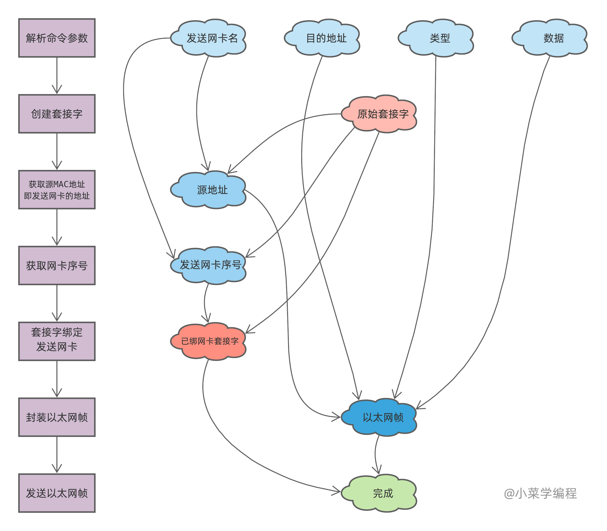
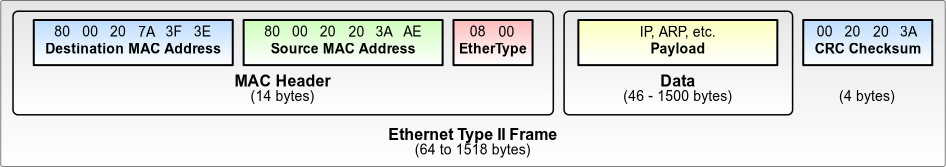

# 2.10编程发送以太网帧

为学习以太网编程技巧，本节带领大家编码实现 *sendether* 命令。*sendether* 是一个自制命令，用于发送以太网帧。我们将从最基础的知识入手，一步步朝着目标努力。

## 用法回顾

开始之前，我们先来回顾一下 *sendether* 的用法：

|选项|含义|
| ------------| --------------------------|
|-i –iface|用于发送以太网帧的网卡名|
|-t –to|目的MAC地址|
|-T –type|以太类型|
|-d –data|待发送数据|

下面是该命令的一个使用示例：

```shell
send_ether -i enp0s8 -t 0a:00:27:00:00:00 -T 0x1024 -d "Hello, world!"
```

使用 `enp0s8`​ 网卡，向 `0a:00:27:00:00:00`​ 发送一个类型为 `0x1024`​ 的以太网帧。

## 总体设计

动手编码之前，我们先梳理一下程序的设计思路。为达到发送以太网帧的目标，程序需要做两方面准备：

1. 封装以太网帧；
2. 准备用于网络通信的套接字；

封装以太网帧，需要 **源地址** 、 **目的地址** 、**帧类型** 以及 **数据** 四部分信息。除源地址外，其他信息都可以直接从命令行参数中取得。那么，源地址该如何决定呢？

由于命令行参数指定了用于发送以太网帧的网卡，这意味着待发送以太网帧的源地址就是发送网卡的 *MAC* 地址。因此，我们只需先通过套接字编程获取指定网卡的 *MAC* 地址即可，详见 *MAC* 地址一节。

网络编程离不开套接字，发送以太网帧也不例外。那么，发送以太网帧需要什么样的套接字呢？

1. 套接字必须是原始套接字，*domain* 为 `PF_PACKET`​ ， *type* 为 `SOCK_RAW`​ ；
2. 套接字必须与发送网卡进行绑定；

通过 *bind* 系统调用，我们可以将套接字与指定网卡进行绑定。套接字完成绑定后，即可调用指定网卡进行发送。不过 *bind* 系统调用以网卡序号识别网卡，因此我们需要先根据网卡名找到它的序号。好在这也没啥难度，方法与获取网卡地址差不多。

综上所述，*sendether* 命令的执行逻辑可以简单归纳如下：

​

1. 解析命令行参数，得到 **发送网卡名** 、**目的地址** 、**帧类型** 以及 **待发送数据** ；
2. 创建 **原始套接字** ；
3. 获取发送网卡的 *MAC* 地址，作为以太网帧的 **源地址** ；
4. 获取发送网卡的 **序号** ，为套接字绑定网卡做准备；
5. 根据网卡序号，将套接字与指定发送网卡进行绑定，为发送做准备；
6. 封装以太网帧；
7. 使用套接字将以太网帧发送出去；

## 原始套接字

发送以太网帧需要使用原始套接字，执行 *socket* 系统调用即可创建，代码片段如下：

```c
    int s = socket(PF_PACKET, SOCK_RAW | SOCK_CLOEXEC, 0);
    if (-1 == s) {
        perror("Fail to create socket: ");
        return -1;
    }
```

## 套接字绑定网卡

原始套接字需要与网卡绑定后，才能调用网卡发送以太网帧。为完成绑定，我们需要根据名字，获取网卡的序号。这个逻辑可以通过一个函数来实现：

```c
int fetch_iface_index(int s, const char *iface) {
    // fill iface name to struct ifreq
    struct ifreq ifr;
    strncpy(ifr.ifr_name, iface, 15);

    // call ioctl system call to fetch iface index
    if (ioctl(s, SIOCGIFINDEX, &ifr) == -1 ) {
        return -1;
    }

    return ifr.ifr_ifindex;
}
```

*fetch_iface_index* 函数需要传入两个参数：

- *s* ，可用的套接字，类型不限；
- *iface* ，待查询网卡名；

它调用 *ioctl* 系统调用获取网卡序号并将其返回，方法与获取网卡地址大同小异，不再赘述。

取得网卡序号后，可以执行 *bind* 系统调用，将套接字与网卡进行绑定。由于 *bind* 有一个复杂的 *sockaddr_ll* 参数需要填充，同样用一个函数来封装这部分处理逻辑：

```c
int bind_iface(int s, const char *iface) {
    // fetch iface index
    int if_index = fetch_iface_index(s, iface);
    if (if_index == -1) {
        return -1;
    }

    // fill iface index to struct sockaddr_ll for binding
    struct sockaddr_ll sll;
    bzero(&sll, sizeof(sll));
    sll.sll_family = AF_PACKET;
    sll.sll_ifindex = if_index;
    sll.sll_pkttype = PACKET_HOST;

    // call bind system call to bind socket with iface
    if(bind(s, (struct sockaddr *)&sll, sizeof(sll)) == -1) {
        return -1;
    }

    return 0;
}
```

*bind_iface* 函数需要传入两个参数：

- *s* ，待绑定套接字；
- *iface* ，待绑定网卡名；

它先调用上个函数获取网卡的序号，然后将序号填写到 *sockaddr_ll* 结构体中，最后执行 *bind* 系统调用完成绑定。

## 以太网帧封装

接下来，我们需要着手封装以太网帧了，还记得以太网帧的模样吗？

​

以太网帧分为 **头部** 、**数据** 和 **校验和** 三部分，校验和无须关心，由 *Linux* 内核负责计算即可。头部共 *14* 字节，分为 **目的地址** 、 **源地址** 以及 **以太类型** 三个字段。数据部分大小可变，最多不超过 *1500* 字节。

我们用 **宏** 定义头部长度和最大数据长度，以备后用：

```c
#define ETHERNET_HEADER_SIZE 14
#define MAX_ETHERNET_DATA_SIZE 1500
```

以太网帧则定义成一个结构体，字段依次是目的地址 、源地址、以太类型和数据 ：

```c
struct __attribute__((__packed__)) ethernet_frame {
    // destination MAC address, 6 bytes
    unsigned char dst_addr[6];

    // source MAC address, 6 bytes
    unsigned char src_addr[6];

    // type, in network byte order
    unsigned short type;

    // data
    unsigned char data[MAX_ETHERNET_DATA_SIZE];
};
```

注意到，我们为数据预留了最大的内存空间。这样一来，无论发多少数据，这个结构体都能胜任。此外，请留意结构体定义中的 `__attribute__((__packed__))`​ ，它告诉编译器：字段内存无须对齐，避免造成空洞。

至此，我们可以编写一个简单的函数，来完成以太网帧的封装：

```c
int pack_ether_frame(const unsigned char *fr, const unsigned char *to, short type,
        const char *data, int data_length, struct ethernet_frame *frame) {
    // fill destination MAC address
    memcpy(frame->dst_addr, to, 6);

    // fill source MAC address
    memcpy(frame->src_addr, fr, 6);

    // fill type
    frame->type = htons(type);

    // truncate if data is to long
    if (data_length > MAX_ETHERNET_DATA_SIZE) {
        data_length = MAX_ETHERNET_DATA_SIZE;
    }

    // fill data
    memcpy(frame->data, data, data_length);

    return ETHERNET_HEADER_SIZE + data_length;
}
```

*pack_ether_frame* 函数需要传入 *6* 个参数：

- *fr* ，源 *MAC* 地址；
- *to* ，目的 *MAC* 地址；
- *type* ，以太类型；
- *data* ，待发送数据；
- *data_length* ，待发送数据长度；
- *frame* ，带填充以太网帧；

函数处理逻辑很简单：首先，拷贝目的地址和源地址；然后，设置以太类型字段，*htons* 用于转换字节序（从主机序转成网络序）；接着，拷贝数据，数据太长将被截短；最后，将以太网帧的长度返回。

## 发送以太网帧

完成这一系列前期准备后，我们只需在套接字上执行 *sendto* 系统调用，即可将封装好的以太网帧发送出去。我们同样可以将这部分逻辑封装成一个函数：

```c
int send_ether_frame(int s, const unsigned char *fr, const unsigned char *to,
        short type, const char *data) {
    // construct ethernet frame, which can be 1514 bytes at most
    struct ethernet_frame frame;

    // pack frame
    int frame_size = pack_ether_frame(fr, to, type, data, strlen(data), &frame);

    // send the frame
    if (sendto(s, &frame, frame_size, 0, NULL, 0) == -1) {
        return -1;
    }

    return 0;
}
```

*send_ether_frame* 函数需要传入 *6* 个参数：

- *s* ，已绑定发送网卡的套接字；
- *fr* ，源 *MAC* 地址；
- *to* ，目的 *MAC* 地址；
- *type* ，以太类型；
- *data* ，待发送字符串，以 `'\0'`​ 结尾；

该函数先为以太网帧准备内存空间，然后调用 *pack_ether_frame* 函数进行填充，最后调用 *sendto* 将它发送出去。

至此，我们大功告成！完整源码可从 [Github](https://github.com/coding-fans/netcode/tree/master/src/c/sendether) 获取。进入源码目录，执行 *make* 命令即可编译。

‍
