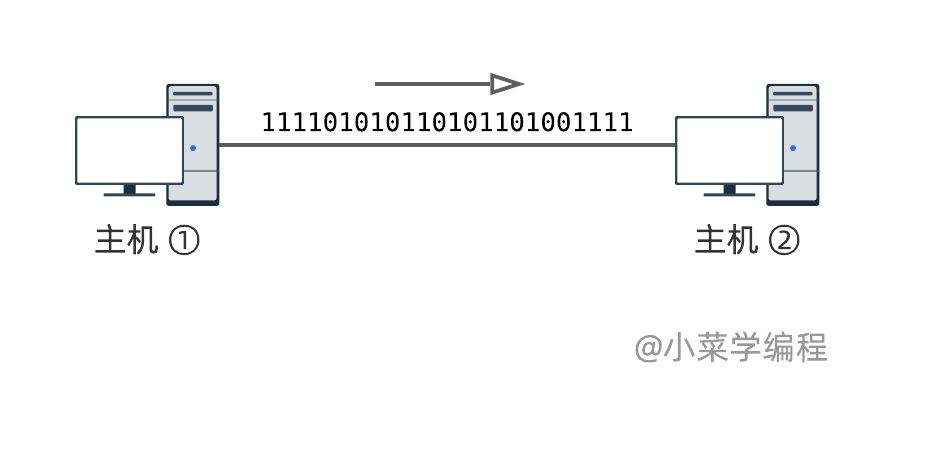
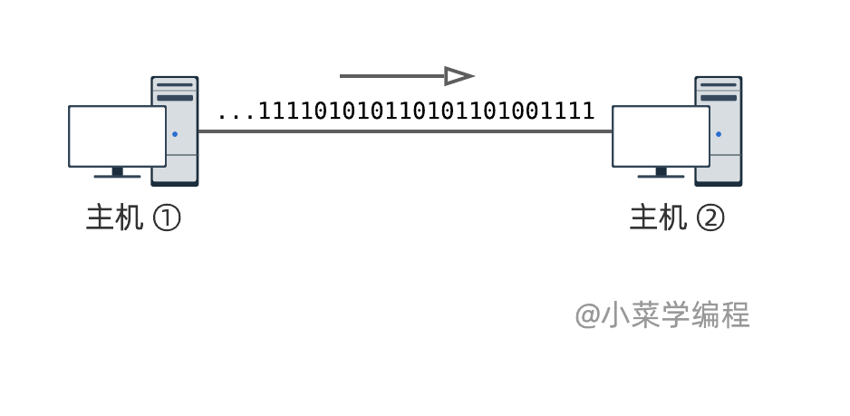
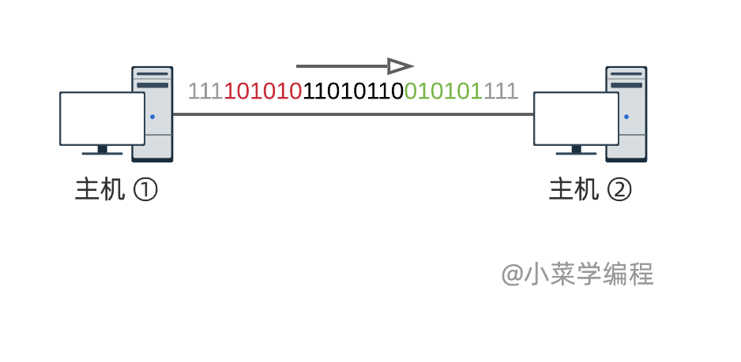
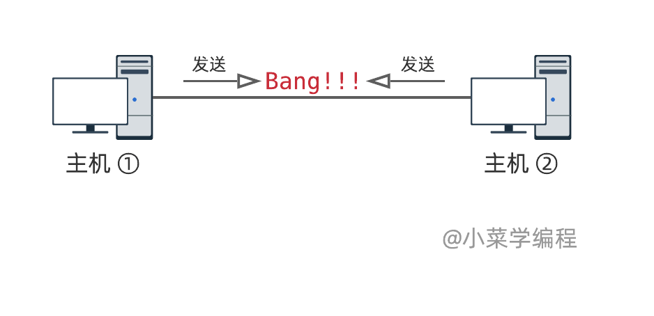
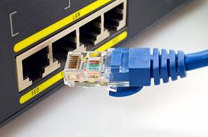
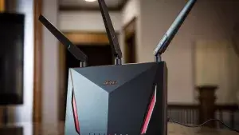

# 2.1物理层概述

## 通讯模型

　　假设，计算机网络现在还没有被发明出来，作为计算机科学家的你，想在两台主机间传输数据，该怎么办呢？

​​

　　这时，你可能会想到，用一根电缆将两台主机连接起来：

​​

　　物理课大家都学过，电压可以分为 **低电平** 和 **高电平** 。因此，我们可以通过控制电平高低，来达到传输信息的目的： 主机①控制电缆电平的高低， 主机②检测电平的高低，主机间数据传输便实现了！

　　用数学语言进一步抽象：以低电平表示 `0`​ ，高电平表示 `1`​ 。这样就得到一个理想化的信道：

​​

　　通过信道，双方可以传输由 `0`​ 和 `1`​ 组成的比特流，上图中传输的比特流是 `1111001011...`​ (从右往左看)。比特流可以编码任意信息，例如：用 `1111`​ 告诉对方本地开机了，用 `0000`​ 告诉对方本地准备关机了。

　　至此，我们是否得到一个可靠的比特流信道，万事具备了呢？ ——理论上是这样的，但现实世界往往要比理想化的模型更复杂一些。

## 收发控制

　　信道是无穷无尽的，状态要么为 `0`​ ，要么为 `1`​ ，没有一种表示空闲的特殊状态：

​​

　　举个例子，主机①向主机②发送比特序列 `101101001101`​ ，如下图(从右往左读)。最后一个比特是 `1`​ ，对应的电平是高电平。发送完毕后，主机①停止控制电缆电平，所以仍保持着高电平状态：

​​

　　换句话讲，信道看起来仍按照既定节拍，源源不断地发送比特 `1`​ (灰色部分)， 主机②如何检测比特流结尾呢？

　　我们可以定义一些特殊的比特序列，用于标识开头和结尾。例如， `101010`​ 表示开头， `010101`​ 表示结尾：

​​

1. 主机①首先发送 `101010`​ (绿色)，告诉主机②，它开始发数据了；
2. 主机①接着发送数据 `01101011`​ (黑色部分)；
3. 主机①最后发送 `010101`​ (红色)，告诉主机②，数据发送完毕；

　　注意到，平时信道为 `1`​ (灰色)，也就是代表空闲状态。

## 冲突仲裁

　　如果两台服务器同时向信道发送数据，会发生什么事情呢？

​​

　　一边发 `0`​ ，一边发 `1`​ ，那信道到底应该是 `0`​ 还是 `1`​ 呢？ 肯定冲突了嘛！有什么办法可以解决冲突吗？

　　方案①，引入一根新电缆，组成双电缆结构，每根电缆只负责一个方向的传输。这样一来，两个方向的传输保持独立，互不干扰，可以同时进行。这样的传输模式在通讯领域称为 **全双工模式** 。

​​

　　方案②，在硬件层面实现一种仲裁机制：当检测到多台主机同时传输数据时，及时叫停，并协商哪一方先发。这样一来，信道同样支持双向通讯，但不可同时进行。这种传输模式则称为 **半双工模式** 。

* **单工** ( *simplex* )，只支持单向通讯，即从其中一端发往另一端，反之不行；
* **半双工** ( *half duplex* )，支持双向通讯，但不可同时进行；
* **全双工** ( *full duplex* )，支持双向通讯，而且可以同时进行；

## 常见物理介质

　　除了电信号，还有其他物理信号亦可充当通讯介质。那么，常见的物理介质都有哪些呢？

​​

​​

​​

* 电信号，例如电缆，网线就是电缆中的一种；
* 光信号，例如光纤；
* 电磁波，例如 *WiFi* ，无线网卡，蓝牙等；
