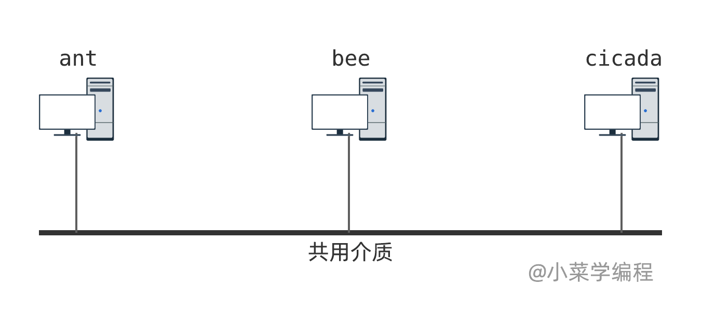
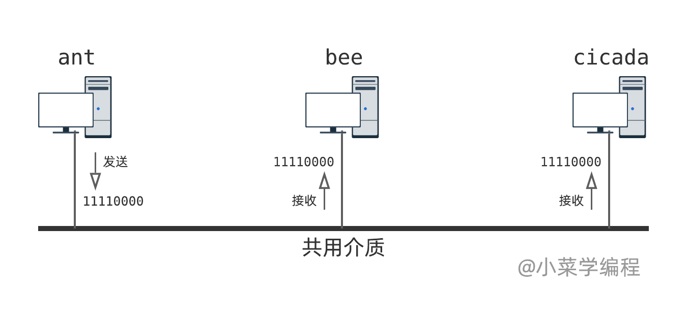
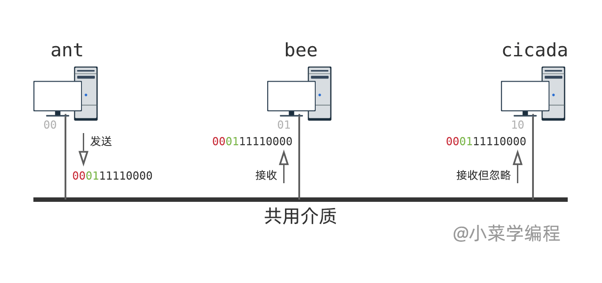
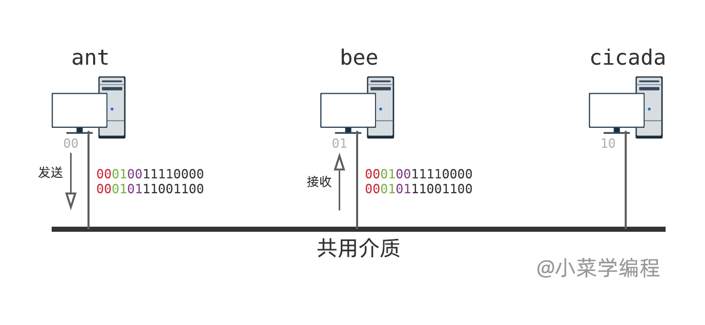
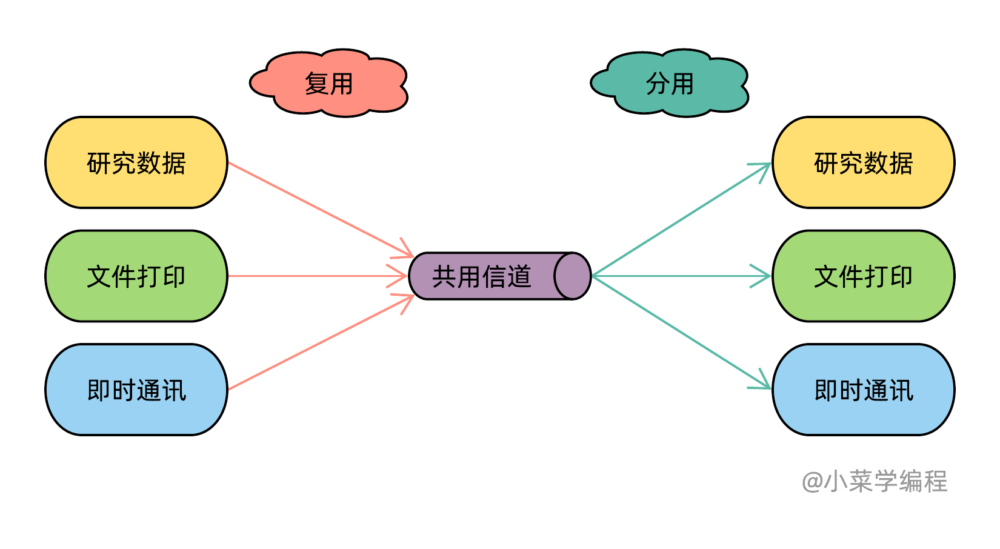

# 2.2数据链路层概述

　　上一小节，我们以两台主机为例，讨论了一个理想化的物理层模型。 现在，我们将问题进一步延伸：多台主机如何实现两两通讯呢？我们以三台主机为例进行讨论：

​​

　　如上图，有 *3* 台主机，名字分别是： *ant* 、 *bee* 以及 *cicada* 。 为了实现主机间通讯，我们将三者连接到一根共用导线。每台主机都可以改变导线电平，也可以检测导线电平。 与此同时，假设在硬件层面，多方通讯冲突仲裁机制已经实现并且可用。 这样，是否就解决了多主机通讯问题呢？

## 主机寻址

　　假设， *ant* 向 *bee* 发送一个数据 `11110000`​ (粗体)。由于导线是共享的，所有主机都可以检测到电平信号。换句话讲， *bee* 和 *cicada* 都会收到这个数据 `11110000`​ ，而 *cicada* 本不应该接收这个数据！另一方面， *bee* 收到数据后，也不知道数据到底是谁发给它的。

​​

> 为了简化接下来的讨论，我们省略了物理层起止控制比特 `1010`​ 和 `0101`​ 。

　　数据不禁产生困惑：*我从哪来？去往何方？*

　　为此，我们需要引入一些比特，用来标识数据的 **来源** 以及 **目的地** 。例子中只有 *3* 台主机，两个比特就足以唯一确定一台主机：

|**机器**|**比特**|
| --------| ----|
|ant|00|
|bee|01|
|cicada|10|

　　那么，发送数据时，再加上两个比特用于表示来源主机，两个比特表示目标主机，问题不就解决了吗？

　　如图，主机下方的灰色比特唯一标识一台主机：

​​

　　*ant* 发送数据时，在最前面加上两个比特(红色)用于标识来源机器， `00`​ 表示 *ant* ；另外两个比特(绿色)用于标识目标机器， `01`​ 表示 *bee* 。

　　当 *bee* 收到数据后，检查前两个比特(红色)，值为 `00`​ ，便知道它是 *ant* 发出来的；检查紧接着的两个比特(绿色)，值为 `01`​ ，与自己匹配上，便愉快地收下了。相反， *cicada* 收到数据后，发现 `01`​ 和自己 `10`​ 匹配不上，便丢弃这个数据。

　　新引入比特所起的作用，在计算机网络中称为 **寻址** 。 这两个比特也就称为 **地址** ，其中，红色为源地址，绿色为目的地址。 引入寻址机制后，我们完美地解答了数据从哪来，到哪去的困惑。

## 信道复用

　　信道只有一个，但是通讯需求是无穷无尽的——传输研究数值、文件打印、即时通讯，不一而足。 如何解决这个矛盾呢？套路还是一样的——引入新的比特标识数据类型。

　　假设，总的通讯需求就上面这 *3* 个。那么， *2* 个额外的比特即可解决问题。

|**类型**|**比特**|
| ----------| ----|
|研究数据|00|
|文件打印|01|
|即时通讯|10|

　　举个例子，假设 *ant* 向 *bee* 上报研究数据并打印一个文件：

​​

　　*bee* 接收到数据后，根据紫色比特，决定数据如何处理。通过新引入的紫色比特，我们在同个信道上实现了不同的通讯！

　　接下来，从理论的视角来审视这个场景：

​​

　　信道只有一个，却要承载多样的通讯任务。在发送端，通过加入紫色比特，将不同的数据通过一个共用信道发送出去，这个过程叫做 **复用** ( *Multiplexing* )；在接收端，从共用信道上接收数据，然后检查紫色比特决定数据如何处理，这个过程叫做 **分用** ( *Demultiplexing* )。

　　在接下来的章节，我们将看到 **复用分用** 的思想贯彻计算机网络的始终。

　　到目前为止，我们引入了 *3* 种不同的比特，分别是 **源地址** 、 **目的地址** 以及 **数据类型** 。 对于这些比特的位数以及含义的约定，便构成 **网络协议** 。

　　至此，我们解决了多台共用信道主机间的通讯问题，这相当于网络分层结构中的 **数据链路层** 。数据链路层负责为上层提供链路通讯能力，主要作用是：

* 寻址
* 数据复用/分用
