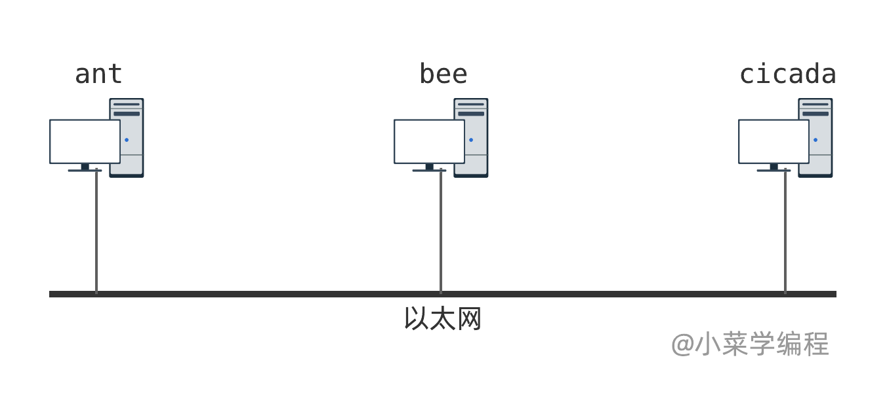
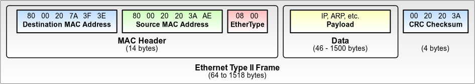

# 2.3以太网帧结构

　　上一小节，我们通过一个虚构的协议，初步认识了数据链路层的工作原理。数据链路层主要解决由若干主机组成的本地网络的通讯问题，**寻址** 和 **复用分用** 思想在其中发挥着关键作用。

　　数据链路层有一个非常重要的协议—— **以太网协议** 。接下来，我们一起来揭开它的神秘面纱！

　　使用以太网协议进行通信的主机间，必须通过某种介质直接相连。通信介质可以是真实的物理设备，如网线、网卡等；也可以是通过虚拟化技术实现的虚拟设备。

​​

## 以太网帧

　　在以太网中，数据通信的基本单位是 **以太网帧** ( *frame* )，由 **头部** ( *header* )、**数据** ( *data* )以及 **校验和** ( *checksum* )三部分构成：

​​

> 请注意，这图中的单位为字节，而不是比特了。

### 头部

　　以太网帧头部包含 *3* 个字段，依次是：

* **目的地址** ，长度是 *6* 字节，用于标记数据由哪台机器接收；
* **源地址** ，长度也是 *6* 字节，用于标记数据由哪台机器发送；
* **类型** ，长度是 *2* 字节，用于标记数据该如何处理， `0x0800`​ 表示该帧数据是一个 *IP* 包(后续章节介绍)。

　　除了字段长度有所拓展之外，以太网帧跟我们虚构出来的协议如出一辙。对了，我们注意到一点小差异——在以太网帧中， **目的地址** 放在最前面。 这其中有什么特殊考虑吗？

　　确实是有的。接收方收到一个以太网帧后，最先处理 **目的地址** 字段。如果发现该帧不是发给自己的，后面的字段以及数据就不需要处理了。基础网络协议影响方方面面，设计时处理效率也是一个非常重要的考量。

### 数据

　　**数据** 可以是任何需要发送的信息，长度可变， *46* 至 *1500* 字节均可。

　　上层协议报文，例如 *IP* 包，可以作为数据封装在以太网帧中，在数据链路层中传输。因此，数据还有另一个更形象的称谓，即 **负荷** ( *payload* )。请自行脑补数据 **搭载** 在以太网帧这个交通工具上旅行的画面。

### 校验和

　　由于物理信号可能受到环境的干扰，网络设备传输的比特流可能会出错。一个以太网帧从一台主机传输到另一台主机的过程中，也可能因各种因素而出错。那么当主机收到以太网帧时，如何确定它是完好无损的呢？

　　答案是： **校验和** 。我们可以用诸如 **循环冗余校验** ( *CRC* )算法，为以太网帧计算校验和。如果以太网帧在传输的过程出错，校验和将发生改变。

　　注意到，以太网帧最后面有一个 *4* 字节字段，用于保存校验和。发送者负责为每个以太网帧计算校验和，并将计算结果填写在校验和字段中；接收者接到以太网帧后，重新计算校验和并与校验和字段进行对比；如果两个校验和不一致，说明该帧在传输时出错了。

　　‍
