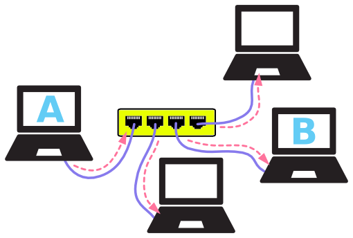
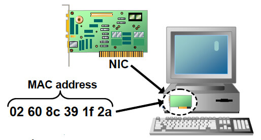
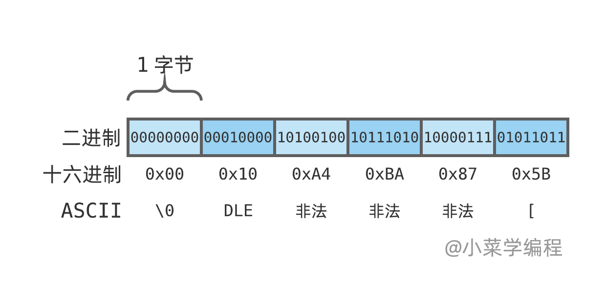
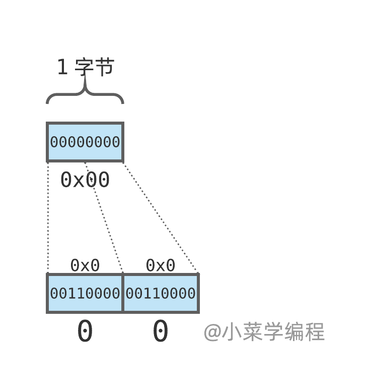
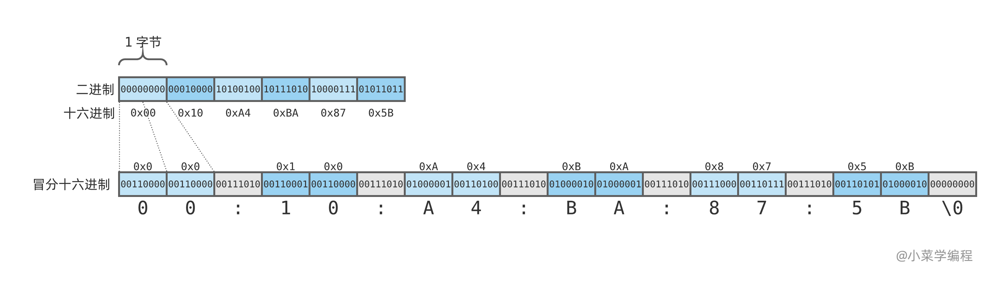

# 2.4MAC 地址

上一小节介绍了以太网帧的结构，以及帧中各个字段的作用。参与以太网通讯的实体，由以太网地址唯一标识。以太网地址也叫做 *MAC* 地址，我们对它仍知之甚少。

> 以太网地址在不同场景，称谓也不一样，常用叫法包括这些：
>
> - 以太网地址
> - *MAC* 地址
> - 硬件地址
> - 物理地址
> - 网卡地址

## 网卡

在以太网中，每台主机都需要安装一个物理设备并通过网线连接到一起：



这个设备就是 **网卡** ( *NIC* )，**网络接口卡** ( *network interface card* )的简称。有些文献也将网卡称为 **网络接口控制器** ( *network interface controller* )。

从物理的层面看，网卡负责将比特流转换成电信号发送出去； 反过来，也负责将检测到的电信号转换成比特流并接收。

从软件的层面看，发送数据时，内核协议栈负责封装以太网帧(填充 **目的地址** ， **源地址** ， **类型** 和 **数据** 并计算 **校验和**)，并调用网卡驱动发送； 接收数据时，负责验证 **目的地址** 、 **校验和** 并取出数据部分，交由上层协议栈处理。



每块网卡出厂时，都预先分配了一个全球唯一的 **MAC地址** ，并烧进硬件。 不管后来网卡身处何处，接入哪个网络，*MAC* 地址均不变。 当然，某些操作系统也允许修改网卡的 *MAC* 地址。

## MAC地址

*MAC* 地址由 *6* 个字节组成( *48* 位)，可以唯一标识

 ，即 *281474976710656* 个网络设备(比如网卡)。

*MAC* 地址 *6* 个字节可以划分成两部分，如下图：


- *3* 字节长的 **厂商代码** ( *OUI* )，由国际组织分配给不同的网络设备商；
- *3* 字节长的 **序列号** ( *SN* )，由厂商分配给它生产的网络设备；

厂商代码和序列号都是唯一分配，因此 *MAC* 地址是 **全球唯一** 的。

## 冒分十六进制表示法

*MAC* 地址 *6* 个字节如何展示呢？ 是否能够作为 *ASCII* 来解读并显示？

恐怕不能。一个字节总共有 *8* 个位，而 *ASCII* 只定义了其中的 *7* 位。况且 *ASCII* 中定义了很多控制字符，能显示的也只有字母、数字以及一些常用符号。以上述地址为例，只有 `0x5B`​ 这个字节是可以显示的，对应着字符 `[`​ 。

​

好在，我们可以用多个可读字符来表示一个原始字节。我们将一个字节分成两部分，高 `4`​ 位以及低 `4`​ 位，每部分可以用一个十六进制字符来表示。以 `0x00`​ 这个字节为例，可以用两个字符 `00`​ 表示：

​

这样一来，整个地址可以用一个 *12* 字节长的字符串表示： `0010A4BA875B`​ 。 为了进一步提高可读性，可以在中间插入冒号 `:`​ ： `00:10:A4:BA:87:5B`​ 。

​

这就是 **冒分十六进制表示法** ( *colon hexadecimal notation* )。

注意到，冒分十六进制总共需要 `17`​ 个字节。 如果算上字符串结尾处的 `\0`​ ，将达到 *18* 个字节，原始 *MAC* 地址的整整 *3* 倍！顺便提一下，十六进制字母字符用大小写都可以。

## 网卡管理

*Linux* 上有不少工具命令可以查看系统当前接入的网卡以及每张网卡的详细信息。

首先是 *ifconfig* 命令，他默认显示已启用的网卡，详情中可以看到每张网卡的物理地址：

```txt
fasion@u2004 [ ~ ]  ➜ ifconfig
enp0s3: flags=4163<UP,BROADCAST,RUNNING,MULTICAST>  mtu 1500
        inet 10.0.2.15  netmask 255.255.255.0  broadcast 10.0.2.255
        inet6 fe80::a00:27ff:fe49:50dd  prefixlen 64  scopeid 0x20<link>
        ether 08:00:27:49:50:dd  txqueuelen 1000  (Ethernet)
        RX packets 3702  bytes 4881568 (4.8 MB)
        RX errors 0  dropped 0  overruns 0  frame 0
        TX packets 538  bytes 42999 (42.9 KB)
        TX errors 0  dropped 0 overruns 0  carrier 0  collisions 0

enp0s8: flags=4163<UP,BROADCAST,RUNNING,MULTICAST>  mtu 1500
        inet 192.168.56.2  netmask 255.255.255.0  broadcast 192.168.56.255
        inet6 fe80::a00:27ff:fe56:831c  prefixlen 64  scopeid 0x20<link>
        ether 08:00:27:56:83:1c  txqueuelen 1000  (Ethernet)
        RX packets 4183  bytes 1809871 (1.8 MB)
        RX errors 0  dropped 0  overruns 0  frame 0
        TX packets 2674  bytes 350013 (350.0 KB)
        TX errors 0  dropped 0 overruns 0  carrier 0  collisions 0

lo: flags=73<UP,LOOPBACK,RUNNING>  mtu 65536
        inet 127.0.0.1  netmask 255.0.0.0
        inet6 ::1  prefixlen 128  scopeid 0x10<host>
        loop  txqueuelen 1000  (Local Loopback)
        RX packets 679  bytes 1510416 (1.5 MB)
        RX errors 0  dropped 0  overruns 0  frame 0
        TX packets 679  bytes 1510416 (1.5 MB)
        TX errors 0  dropped 0 overruns 0  carrier 0  collisions 0
```

例子中，系统总共有 *3* 块已启用网卡，名字分别是 *enp0s3* 、 *enp0s8* 以及 *lo* 。其中 *lo* 是环回网卡，用于本机通讯。`ether 08:00:27:49:50:dd`​ 表明，网卡 *enp0s3* 的物理地址是 `08:00:27:49:50:dd`​ 。

> 请注意，*ifconfig* 是一个比较老旧的命令，正在慢慢淡出历史舞台。

*ip* 命令也可以查看系统网卡信息，默认显示所有网卡：

```txt
fasion@u2004 [ ~ ]  ➜ ip link
1: lo: <LOOPBACK,UP,LOWER_UP> mtu 65536 qdisc noqueue state UNKNOWN mode DEFAULT group default qlen 1000
    link/loopback 00:00:00:00:00:00 brd 00:00:00:00:00:00
2: enp0s3: <BROADCAST,MULTICAST,UP,LOWER_UP> mtu 1500 qdisc fq_codel state UP mode DEFAULT group default qlen 1000
    link/ether 08:00:27:49:50:dd brd ff:ff:ff:ff:ff:ff
3: enp0s8: <BROADCAST,MULTICAST,UP,LOWER_UP> mtu 1500 qdisc fq_codel state UP mode DEFAULT group default qlen 1000
    link/ether 08:00:27:56:83:1c brd ff:ff:ff:ff:ff:ff
```

*ip* 命令输出信息比较紧凑， `link/ether 08:00:27:49:50:dd`​ 这行展示网卡的物理地址。

*ip* 命令是一个比较新的命令，功能非常强大。它除了可以用于管理网络设备，还可以用于管理路由表，策略路由以及各种隧道。因此，推荐重点学习掌握 *ip* 命令的用法。

## 编程获取网卡地址

如果程序中需要用到网卡地址，如何获取呢？

有个方法是执行 *ip* 命令输出网卡详情，然后从输出信息中截取网卡地址。例如：

```txt
fasion@u2004 [ ~ ]  ➜ ip link show dev enp0s3 | grep 'link/ether' | awk '{print $2}'
08:00:27:49:50:dd
```

这种方法多用于 *Shell* 编程中。

更优雅的办法是通过套接字编程，直接向操作系统获取。*Linux* 套接字支持通过 *ioctl* 系统调用获取网络设备信息，大致步骤如下：

1. 创建一个套接字，任意类型均可；
2. 准备 *ifreq* 结构体，用于保存网卡设备信息；
3. 将待查询网卡名填充到 *ifreq* 结构体；
4. 调用 *ioctl* 系统调用，向套接字发起 `SIOCGIFHWADDR`​ 请求，获取物理地址；
5. 如无错漏，内核将被查询网卡的物理地址填充在 *ifreq* 结构体 *ifr_hwaddr* 字段中；

最后，附上一个完整的例子：

```c
#include <net/if.h>
#include <stdio.h>
#include <string.h>
#include <sys/ioctl.h>
#include <sys/socket.h>

/**
 *  Convert binary MAC address to readable format.
 *
 *  Arguments
 *      n: binary format, must be 6 bytes.
 *
 *      a: buffer for readable format, 18 bytes at least(`\0` included).
 **/
void mac_ntoa(unsigned char *n, char *a) {
    // traverse 6 bytes one by one
    sprintf(a, "%02x:%02x:%02x:%02x:%02x:%02x", n[0], n[1], n[2], n[3], n[4], n[5]);
}


int main(int argc, char *argv[]) {
    if (argc < 2) {
        fprintf(stderr, "no iface given\n");
        return 1;
    }

    // create a socket, any type is ok
    int s = socket(AF_INET, SOCK_STREAM, 0);
    if (-1 == s) {
        perror("Fail to create socket");
        return 2;
    }

    // fill iface name to struct ifreq
    struct ifreq ifr;
    strncpy(ifr.ifr_name, argv[1], 15);

    // call ioctl to get hardware address
    int ret = ioctl(s, SIOCGIFHWADDR, &ifr);
    if (-1 == ret) {
        perror("Fail to get mac address");
        return 3;
    }

    // convert to readable format
    char mac[18];
    mac_ntoa((unsigned char *)ifr.ifr_hwaddr.sa_data, mac);

    // output result
    printf("IFace: %s\n", ifr.ifr_name);
    printf("MAC: %s\n", mac);

    return 0;
}
```

其中，*mac_ntoa* 函数调用字符串格式化函数 *sprintf* 将原始 *MAC* 地址转换成冒分十六进制形式。
