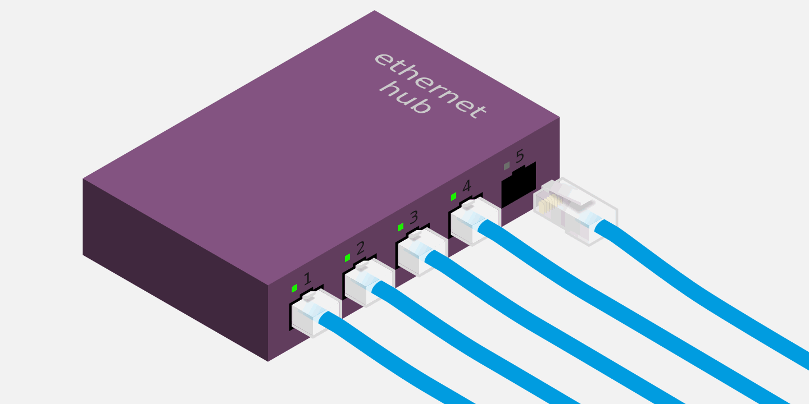
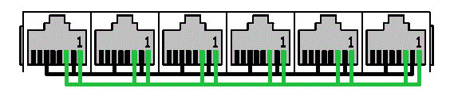
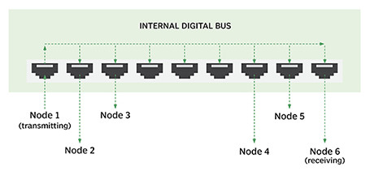
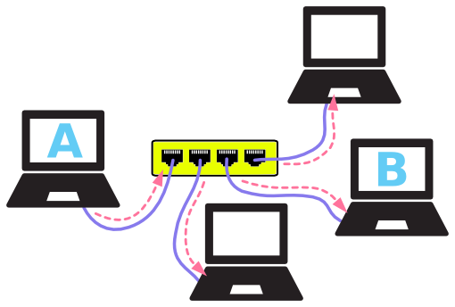

# 2.5集线器

采用以太网进行通信的主机，需要通过网线之类的介质连接到一起。那么，如何将多根网线连接在一起呢？

最简单的方式是将所有网线接到一个 **集线器** ( *hub* )上，如下图：

​

## 集线器构造

集线器内部构造很简单，可以理解成只是把所有网线连接起来而已。换句话讲，集线器充当了 **共用导线** 的功能。

这样一来，从某个端口发送出去的电信号，将被传送到所有其他端口：

> 注释：这里 **端口** ( *port* )是指集线器的插口，或称为网口。

换句话讲，从一台主机发送出来的数据，将被传送到所有其他主机上。 以 *A* 往 *B* 发送数据为例：

看起来就像 *A* 发起了 **广播** ，其他所有主机都可以收到这个数据。 由于数据帧中包含 **目的地址** ，最终只有 *B* 接收并处理这个数据。 因此并无大碍，至少是可以正常工作的。

尽管如此，集线器还是存在一些缺陷，主要体现在两方面：

1. 所有主机(端口)共享带宽；
2. 所有主机(端口)处于同一 **冲突域** (一台主机发送，其他只能等待)；

这两方面缺陷严重制约着集线器的传输效率，在接入端口数较多的情况下更是如此。

总结一下，集线器工作于物理层，主要特点如下：

- 扩展终端数量；
- 中继放大物理信号；
- 延伸网络传输距离；
- 所有端口同属一个冲突域；
- 所有端口共享带宽；

‍
