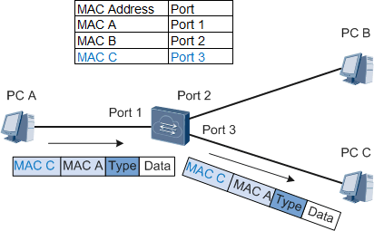
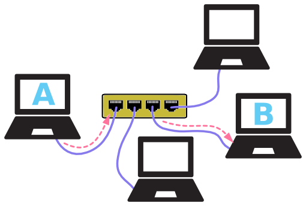
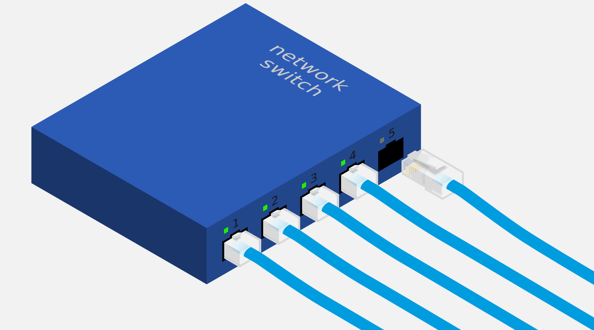
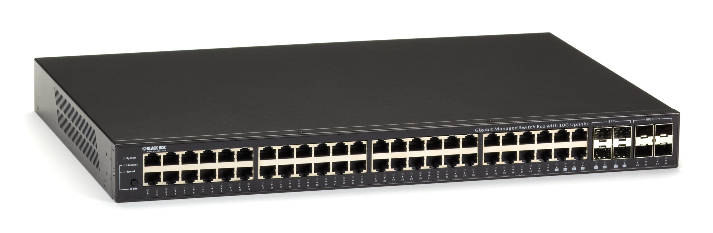
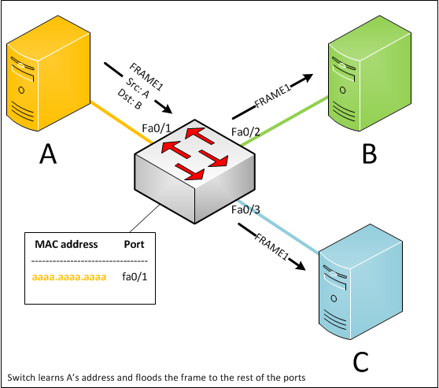
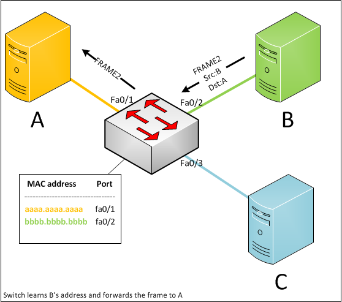
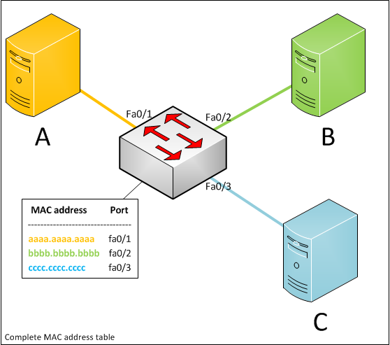

# 2.6交换机与MAC地址学习

　　上一小节介绍了 **集线器** ，一种工作于物理层的简单网络设备。由于集线器采用广播的方式中继、转发物理信号，传输效率受到极大制约。

## 精准转发

　　为了解决集线器工作效率低下的尴尬，我们需要设计一种更高级的网络设备。新设备根据以太网帧的目的 *MAC* 地址，将它精准地转发到正确端口：

​​

> 注释：这里 **端口** ( *port* )指的是转发设备的插口，也可叫做网口。

　　如上图，中间节点是转发设备，它在内部维护着一张主机 *MAC* 地址与对应端口的映射表，现与 *3* 台主机相连。这样一来， 当转发设备接到主机 *A* 发给主机 *C* 的数据后，根据目的 *MAC* 地址搜索映射表，便可将数据准确地转发到对应的端口 *3* 。

　　现在，传输模式变得更有针对性了——数据帧被精准转发到正确的端口，其他端口不再收到多余的数据：

​​

　　不仅如此，主机 *A* 与 *B* 通讯的同时，其他计算机也可通讯，互不干扰。转发设备每个端口是一个独立的冲突域，带宽也是独立的。

　　集线器的缺陷全部避免了！

## 交换机

　　能够根据以太网帧目的地址转发数据的网络设备就是 **以太网交换机** ( *ethernet switch* )：

​​

　　交换机长相跟集线器没啥区别嘛。当然了，大部分网络设备都是一个布满端口的盒子，关键在于内部构造。

　　再看看现实中的交换机长啥样：

​​

　　总结起来，以太网交换机属于 **二层网络设备** ，特点如下：

* 根据目的地址转发以太网帧；
* 每个端口是独立冲突域；
* 每个端口带宽独立；

## Mac地址学习

　　交换机完美地解决集线器的缺点，但新问题又来了，映射表如何获得呢？

　　最原始的方式是：维护一张静态映射表。当新设备接入，向映射表添加一条记录；当设备移除，从映射表删除对应记录。然而，纯手工操作方式多少有些烦躁。

　　好在计算机领域可以实现各种花样的自动化——通过算法自动学习映射表。我们先来看看大致思路：

​​

　　初始状态下，映射表是空的。现在，主机 *A* 向 *B* 发送一个数据帧 *FRAME1* 。因为映射表中没有地址 *B* 的记录，交换机便将数据帧广播到其他所有端口。

　　由于交换机是从 `Fa0/1`​ 端口收到数据帧的，便知道 *A* 连接 `Fa0/1`​ 端口，而数据帧的源地址就是 *A* 的地址！此时，交换机可以将 *A* 的地址和端口 `Fa0/1`​ 作为一条记录加入映射表。交换机学习到 *A* 的地址！

​​

　　接着，主机 *B* 向 *A* 回复一个数据帧 *FRAME2*  。由于映射表中已经存在地址 *A* 的记录了，因此交换机将数据帧精准转发到端口 `Fa0/1`​ 。同理，交换机学习到主机 *B* 的地址。

　　当主机 *C* 开始发送数据时，交换机同样学到其地址，学习过程完成！

​​

　　这就是 **MAC地址自动学习** 的基本原理。
