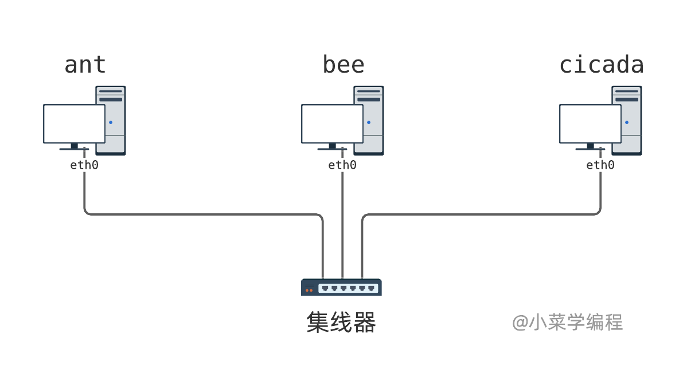
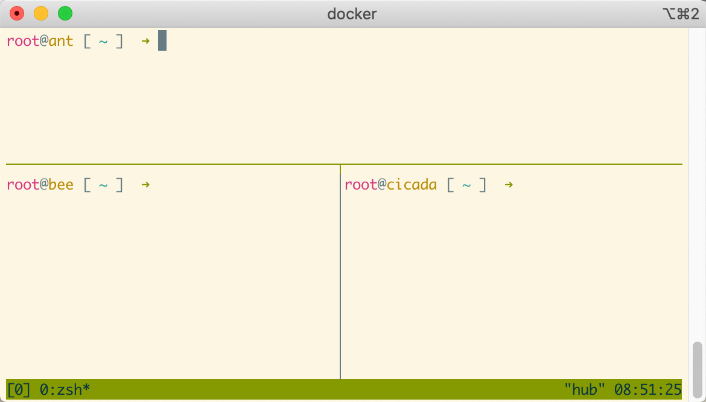
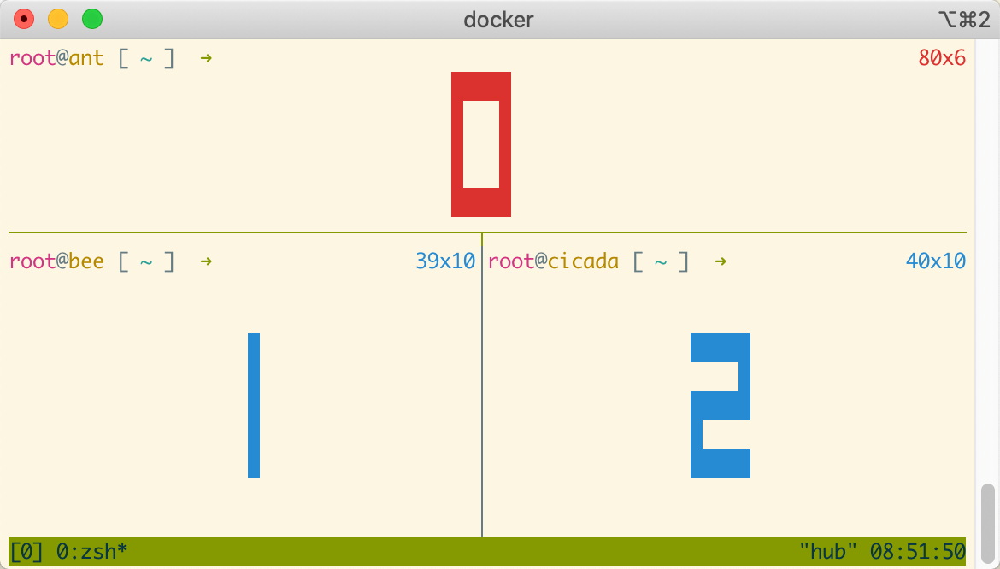
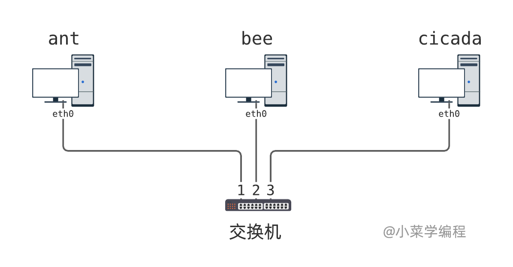

# 2.7网络实验：观察集线器和交换机

　　集线器和交换机是两种典型的网络设备，**集线器** 位于 **物理层**，而 **交换机** 位于 **数据链路层** ，行为明显不同。本节准备了两个简单实验，旨在通过实践加深对理论知识的理解，逐步掌握 *Linux* 主机网络操作。

## 实验一：观察以太网集线器

　　本实验将 *3* 台 *Linux* 主机连到一个集线器上，以此观察集线器的工作行为，网络拓扑图如下：

​​

　　实验环境以 *docker* 容器的形式提供，执行这个 *docker* 命令即可一键打开：

```txt
docker run --name hub-lab --rm -it --privileged --cap-add=NET_ADMIN --cap-add=SYS_ADMIN -v /data -h hub-lab fasionchan/netbox:0.10 launch-netenv hub-lab
```

　　实验环境打开后，可以看到 *3* 个窗口，各自代表一台主机：

​​

　　这是用 *tmux* 命令实现的窗口划分，按下\_ Ctrl-B\_ 后再按方向键，即可在不同主机窗口间切换。

> 请特别注意，按下 *Ctrl-B* 后要松手，然后再按方向键，才能切到想要操作的主机窗口。

　　还有一种更快捷的切换方法，先按下 *Ctrl-B* ，松手后再按 *Q* 。这时，每个窗口都会显示一个数字。接着，按下对应的数字即可切到想要的窗口：

​​

　　我们先切到主机 *ant* ，观察它的网卡信息，*ifconfig* 或 *ip* 命令均可：

```txt
root@ant [ ~ ]  ➜ ifconfig
eth0: flags=4163<UP,BROADCAST,RUNNING,MULTICAST>  mtu 1500
        ether 32:90:b9:9f:35:56  txqueuelen 1000  (Ethernet)
        RX packets 6  bytes 540 (540.0 B)
        RX errors 0  dropped 0  overruns 0  frame 0
        TX packets 3  bytes 270 (270.0 B)
        TX errors 0  dropped 0 overruns 0  carrier 0  collisions 0

lo: flags=73<UP,LOOPBACK,RUNNING>  mtu 65536
        inet 127.0.0.1  netmask 255.0.0.0
        inet6 ::1  prefixlen 128  scopeid 0x10<host>
        loop  txqueuelen 1000  (Local Loopback)
        RX packets 0  bytes 0 (0.0 B)
        RX errors 0  dropped 0  overruns 0  frame 0
        TX packets 0  bytes 0 (0.0 B)
        TX errors 0  dropped 0 overruns 0  carrier 0  collisions 0
```

```txt
root@ant [ ~ ]  ➜ ip link
1: lo: <LOOPBACK,UP,LOWER_UP> mtu 65536 qdisc noqueue state UNKNOWN mode DEFAULT group default qlen 1000
    link/loopback 00:00:00:00:00:00 brd 00:00:00:00:00:00
2: tunl0@NONE: <NOARP> mtu 1480 qdisc noop state DOWN mode DEFAULT group default qlen 1000
    link/ipip 0.0.0.0 brd 0.0.0.0
3: ip6tnl0@NONE: <NOARP> mtu 1452 qdisc noop state DOWN mode DEFAULT group default qlen 1000
    link/tunnel6 :: brd ::
6: eth0@if5: <BROADCAST,MULTICAST,UP,LOWER_UP> mtu 1500 qdisc noqueue state UP mode DEFAULT group default qlen 1000
    link/ether 32:90:b9:9f:35:56 brd ff:ff:ff:ff:ff:ff link-netnsid 0
```

　　接着，切到主机 *bee* 和 *cicada* ，继续观察它们的网卡信息：

```txt
root@bee [ ~ ]  ➜ ip link
1: lo: <LOOPBACK,UP,LOWER_UP> mtu 65536 qdisc noqueue state UNKNOWN mode DEFAULT group default qlen 1000
    link/loopback 00:00:00:00:00:00 brd 00:00:00:00:00:00
2: tunl0@NONE: <NOARP> mtu 1480 qdisc noop state DOWN mode DEFAULT group default qlen 1000
    link/ipip 0.0.0.0 brd 0.0.0.0
3: ip6tnl0@NONE: <NOARP> mtu 1452 qdisc noop state DOWN mode DEFAULT group default qlen 1000
    link/tunnel6 :: brd ::
8: eth0@if7: <BROADCAST,MULTICAST,UP,LOWER_UP> mtu 1500 qdisc noqueue state UP mode DEFAULT group default qlen 1000
    link/ether a2:17:41:bb:cd:98 brd ff:ff:ff:ff:ff:ff link-netnsid 0
```

```txt
root@cicada [ ~ ]  ➜ ip link
1: lo: <LOOPBACK,UP,LOWER_UP> mtu 65536 qdisc noqueue state UNKNOWN mode DEFAULT group default qlen 1000
    link/loopback 00:00:00:00:00:00 brd 00:00:00:00:00:00
2: tunl0@NONE: <NOARP> mtu 1480 qdisc noop state DOWN mode DEFAULT group default qlen 1000
    link/ipip 0.0.0.0 brd 0.0.0.0
3: ip6tnl0@NONE: <NOARP> mtu 1452 qdisc noop state DOWN mode DEFAULT group default qlen 1000
    link/tunnel6 :: brd ::
10: eth0@if9: <BROADCAST,MULTICAST,UP,LOWER_UP> mtu 1500 qdisc noqueue state UP mode DEFAULT group default qlen 1000
    link/ether ee:76:f2:37:5e:69 brd ff:ff:ff:ff:ff:ff link-netnsid 0
```

　　经过观察，*3* 台主机网卡及 *MAC* 地址信息整理如下：

|**主机**|**网卡**|**MAC地址**|
| --------| ------| -------------------|
|ant|eth0|32:90:b9:9f:35:56|
|bee|eth0|a2:17:41:bb:cd:98|
|cicada|eth0|ee:76:f2:37:5e:69|

　　现在，我们从主机 *ant* 向主机 *bee* 发送一句话，看主机 *bee* 是否可以收到这个信息，于此同时观察主机 *cicada* 是否也可以收到。开始发送之前，我们先在 *bee* 和 *cicada* 执行抓包工具 *tcpdump* 命令，嗅探网络流量：

```txt
root@bee [ ~ ]  ➜ tcpdump -ni eth0
tcpdump: verbose output suppressed, use -v or -vv for full protocol decode
listening on eth0, link-type EN10MB (Ethernet), capture size 262144 bytes
```

```txt
root@cicada [ ~ ]  ➜ tcpdump -ni eth0
tcpdump: verbose output suppressed, use -v or -vv for full protocol decode
listening on eth0, link-type EN10MB (Ethernet), capture size 262144 bytes
```

> *tcpdump* 命令  *-i* 选项指定嗅探网卡，这里我们嗅探每台主机 *eth0* 网卡上的流量。

　　一切准备就绪，我们在主机 *ant* 上执行自制工具 *sendether* 给 *bee* 发一段文本：

```txt
root@ant [ ~ ]  ➜ sendether -i eth0 -t a2:17:41:bb:cd:98 -T 0x0900 -d 'hello, world!'
```

> *sendether* 是一个自制命令，用于发送以太网帧。其中， *-i* 指定发送网卡， *-t* 指定目的地址， *-T* 指定数据类型， *-d* 指定要发送的数据。后续的编程环节，我们会讲解 *sendether* 是如何封装、发送以太网帧的。

　　我们立马看到主机 *bee* 上的 *tcpdump* 抓到一个以太网帧，它就是 *ant* 发出来的 `hello, world!`​ ：

```txt
root@bee [ ~ ]  ➜ tcpdump -ni eth0
tcpdump: verbose output suppressed, use -v or -vv for full protocol decode
listening on eth0, link-type EN10MB (Ethernet), capture size 262144 bytes
16:37:27.254658 32:90:b9:9f:35:56 > a2:17:41:bb:cd:98, ethertype Unknown (0x0900), length 27:
	0x0000:  6865 6c6c 6f2c 2077 6f72 6c64 21         hello,.world!
```

​​

　　注意到，主机 *cicada* 也收到这个帧，这符合集线器的行为：

```txt
root@cicada [ ~ ]  ➜ tcpdump -ni eth0
tcpdump: verbose output suppressed, use -v or -vv for full protocol decode
listening on eth0, link-type EN10MB (Ethernet), capture size 262144 bytes
16:37:27.254624 32:90:b9:9f:35:56 > a2:17:41:bb:cd:98, ethertype Unknown (0x0900), length 27:
	0x0000:  6865 6c6c 6f2c 2077 6f72 6c64 21         hello,.world!
```

　　由于这个帧的目的主机并不是 *cicada* ，*cicada* 协议栈将丢弃它。

## 实验二：观察以太网交换机

　　本实验将 *3* 台 *Linux* 主机连到一个交换机上，以此观察交换机的工作行为，网络拓扑图如下：

​​

　　实验环境同样通过 *docker* 容器提供，执行以下命令即可一键打开：

```txt
docker run --name switch-lab --rm -it --privileged --cap-add=NET_ADMIN --cap-add=SYS_ADMIN -v /data -h switch fasionchan/netbox:0.10 launch-netenv switch-lab
```

　　实验环境启动后，可以看到 *4* 个由 *tmux* 命令划分的窗口，分别代表 *3* 台主机以及交换机。

　　为了方便观察交换机 *MAC* 地址学习的过程，我们为每台主机设置了一个很好分辨的 *MAC* 地址：

|**主机**|**网卡**|**MAC地址**|**交换机端口**|
| --------| ------| -------------------| ---|
|ant|eth0|40:aa:aa:aa:aa:aa|1|
|bee|eth0|40:bb:bb:bb:bb:bb|2|
|cicada|eth0|40:cc:cc:cc:cc:cc|3|

　　实验环境中的交换机由 *bridge* 虚拟设备模拟，设备名为 `switch0`​ ：

```txt
root@switch [ ~ ]  ➜ ip link show switch0
4: switch0: <BROADCAST,MULTICAST,UP,LOWER_UP> mtu 1500 qdisc noqueue state UP mode DEFAULT group default qlen 1000
    link/ether 4a:9e:f8:3c:75:40 brd ff:ff:ff:ff:ff:ff
```

　　执行 *brctl* 命令，可以查看交换机当前的 *MAC* 地址表：

```txt
root@switch [ ~ ]  ➜ brctl showmacs switch0
port no	mac addr		is local?	ageing timer
  3	4a:9e:f8:3c:75:40	yes		   0.00
  3	4a:9e:f8:3c:75:40	yes		   0.00
  2	6a:64:44:0d:d1:55	yes		   0.00
  2	6a:64:44:0d:d1:55	yes		   0.00
  1	be:24:47:bd:f2:52	yes		   0.00
  1	be:24:47:bd:f2:52	yes		   0.00
```

　　噫？怎么 *MAC* 地址表已经有一些条目了？我们明明还没有在任何主机上发数据，地址表按理说应该是空的呀！

　　其实，这些 *MAC* 地址是交换机自己的， `is local`​ 列值都是 `yes`​ 。如果将该列值为 `yes`​ 的记录过滤掉，就可以确认 *MAC* 地址表确实为空(暂未学习到任何地址)：

```txt
root@switch [ ~ ]  ➜ brctl showmacs switch0 | grep -v yes
port no	mac addr		is local?	ageing timer
```

　　现在，我们在主机 *ant* 上往主机 *bee* 发送一个以太网帧，来观察交换机行为。开始之前，我们先在主机 *bee* 和 *cicada* 上运行 *tcpdump* 命令来嗅探网络流量。

```txt
root@bee [ ~ ]  ➜ tcpdump -ni eth0
```

```txt
root@cicada [ ~ ]  ➜ tcpdump -ni eth0
```

```txt
root@ant [ ~ ]  ➜ sendether -i eth0 -t 40:bb:bb:bb:bb:bb -d 'hello, bee!'
```

　　这个帧成功发出去后，我们同时在主机 *bee* 和 *cicada* 上观察它。原因在于，交换机还没学到主机 *bee* 的 *MAC* 地址，只能将这个帧转发到其他所有端口，因此 *cicada* 也会收到它。

```txt
root@bee [ ~ ]  ➜ tcpdump -ni eth0
tcpdump: verbose output suppressed, use -v or -vv for full protocol decode
listening on eth0, link-type EN10MB (Ethernet), capture size 262144 bytes
16:40:34.437330 40:aa:aa:aa:aa:aa > 40:bb:bb:bb:bb:bb, ethertype Unknown (0x0900), length 25:
	0x0000:  6865 6c6c 6f2c 2062 6565 21              hello,.bee!
```

```txt
root@cicada [ ~ ]  ➜ tcpdump -ni eth0
tcpdump: verbose output suppressed, use -v or -vv for full protocol decode
listening on eth0, link-type EN10MB (Ethernet), capture size 262144 bytes
16:40:34.437152 40:aa:aa:aa:aa:aa > 40:bb:bb:bb:bb:bb, ethertype Unknown (0x0900), length 25:
	0x0000:  6865 6c6c 6f2c 2062 6565 21              hello,.bee!
```

　　交换机从端口 *1* 接到主机 *ant* 发送的以太网帧，源地址是 `40:aa:aa:aa:aa:aa`​ ，便知道以后发给这个地址的帧应该转发给端口 *1* 。这样一来，交换机机智地学习到主机 *ant* 的 *MAC* 地址：

```txt
root@switch [ ~ ]  ➜ brctl showmacs switch0 | grep -v yes
port no	mac addr		is local?	ageing timer
  1	40:aa:aa:aa:aa:aa	no		   1.97
```

　　接着，我们在主机 *bee* 向 *ant* 回复一个信息：

```txt
root@bee [ ~ ]  ➜ sendether -i eth0 -t 40:aa:aa:aa:aa:aa -d 'how are you?'
```

　　由于交换机已经学习到 *ant* 的地址，知道去往 `40:aa:aa:aa:aa:aa`​ 的帧应该转发到端口 *0* ，位于端口 *3* 的 *cicada* 主机便不会收到这个帧了。

　　同理，在这个过程中，交换机学习到主机 *bee* 的 *MAC* 地址 `40:bb:bb:bb:bb:bb`​ ：

```txt
root@switch [ ~ ]  ➜ brctl showmacs switch0 | grep -v yes
port no	mac addr		is local?	ageing timer
  1	40:aa:aa:aa:aa:aa	no		  60.17
  2	40:bb:bb:bb:bb:bb	no		  50.14
```

　　这样一来，主机 *ant* 再给 *bee* 发数据，*cicada* 同样也不会收到了：

```txt
root@ant [ ~ ]  ➜ sendether -i eth0 -t 40:bb:bb:bb:bb:bb -d 'fine, thank you!'
```
