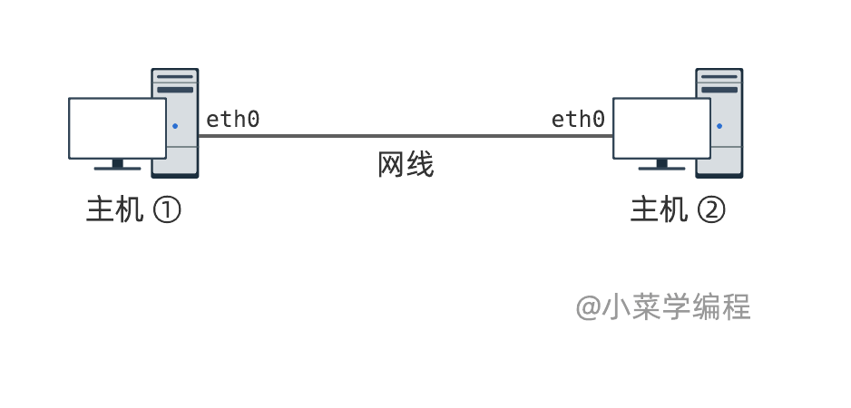

# 2.8最大传输单元MTU

不同的以太网接入设备，一帧能传输的数据量是有差异的。

普通的以太网卡，一帧最多能够传输 *1500* 字节的数据；而某些虚拟设备，传输能力要打些折扣。此外，链路层除了以太网还有其他协议，这些协议中数据帧传输能力也有差异。

## 最大传输单元

如果待发送的数据超过帧的最大承载能力，就需要先对数据进行分片，然后再通过若干个帧进行传输。

下面是一个典型例子，待发送的数据总共 *4000* 字节，假设以太网设备一帧最多只能承载 *1500* 字节。很明显，数据需要划分成 *3* 片，再通过 *3* 个帧进行发送：

​

换句话讲，我们需要知道接入设备一帧最多能发送多少数据。这个参数在网络领域被称为 **最大传输单元** ( *maximum transmission unit* )，简称 *MTU* 。*MTU* 描述链路层能够传输的最大数据单元。

## 查看、设置MTU

我们知道，在 *Linux* 系统可以用 *ifconfig* 或者 *ip* 这两个命令来查看网卡信息，其中包括 *MTU* 。

接下来，我们打开 *docker* 进入 *netbox* 环境进行演示：

```shell
docker run --name netbox --rm -it --privileged --cap-add=NET_ADMIN --cap-add=SYS_ADMIN -v /data -h netbox fasionchan/netbox:0.10 launch-netenv netbox
```

先以 *ifconfig* 命令为例：

```shell
root@netbox [ ~ ]  ➜ ifconfig
eth0: flags=4163<UP,BROADCAST,RUNNING,MULTICAST>  mtu 1500
        inet 192.168.1.2  netmask 255.255.255.0  broadcast 0.0.0.0
        ether 5a:ff:7e:28:81:bc  txqueuelen 1000  (Ethernet)
        RX packets 24  bytes 2165 (2.1 KB)
        RX errors 0  dropped 0  overruns 0  frame 0
        TX packets 27  bytes 2164 (2.1 KB)
        TX errors 0  dropped 0 overruns 0  carrier 0  collisions 0

lo: flags=73<UP,LOOPBACK,RUNNING>  mtu 65536
        inet 127.0.0.1  netmask 255.0.0.0
        inet6 ::1  prefixlen 128  scopeid 0x10<host>
        loop  txqueuelen 1000  (Local Loopback)
        RX packets 0  bytes 0 (0.0 B)
        RX errors 0  dropped 0  overruns 0  frame 0
        TX packets 0  bytes 0 (0.0 B)
        TX errors 0  dropped 0 overruns 0  carrier 0  collisions 0

```

*ip* 命令也可以，我们更推荐使用这个：

```shell
root@netbox [ ~ ]  ➜ ip link
1: lo: <LOOPBACK,UP,LOWER_UP> mtu 65536 qdisc noqueue state UNKNOWN mode DEFAULT group default qlen 1000
    link/loopback 00:00:00:00:00:00 brd 00:00:00:00:00:00
2: tunl0@NONE: <NOARP> mtu 1480 qdisc noop state DOWN mode DEFAULT group default qlen 1000
    link/ipip 0.0.0.0 brd 0.0.0.0
3: ip6tnl0@NONE: <NOARP> mtu 1452 qdisc noop state DOWN mode DEFAULT group default qlen 1000
    link/tunnel6 :: brd ::
6: eth0@if5: <BROADCAST,MULTICAST,UP,LOWER_UP> mtu 1500 qdisc noqueue state UP mode DEFAULT group default qlen 1000
    link/ether 5a:ff:7e:28:81:bc brd ff:ff:ff:ff:ff:ff link-netnsid 0
```

我们可以用 *ip* 命令，来修改 *eth0* 的 *MTU* ， 以修改 *eth0* 网卡 *MTU* 为例：

```shell
root@netbox [ ~ ]  ➜ ip link set eth0 mtu 68
```

不同的接入设备，支持的 *MTU* 范围不一样。如果我们将 *MTU* 设置得太小，设备将报错：

```shell
root@netbox [ ~ ]  ➜ ip link set eth0 mtu 40
Error: mtu less than device minimum.
```

## MTU 对发送环节的影响

我们以两台用网线直接相连的主机作为实验环境，来观察网卡 *MTU* 对发送、接收以太网帧的影响：

​

实验环境同样通过 *docker* 来启动：

```shell
docker run --name mtu-lab --rm -it --privileged --cap-add=NET_ADMIN --cap-add=SYS_ADMIN -v /data -h mtu-lab fasionchan/netbox:0.10 launch-netenv cable-lab
```

我们将 *ant* 主机 *eth0* 网卡的 *MTU* 设置成 *68* ，发现数据大于 *68* 字节的以太网帧将无法发送：

```shell
root@ant [ ~ ]  ➜ ip link set eth0 mtu 68
root@ant [ ~ ]  ➜ sendether -i eth0 -t 32:65:21:d3:01:2f -d 'hello, world!hello, world!hello, world!hello, world!hello, world!hello, world!hello, world!hello, world!hello, world!hello, world!'
Fail to send ethernet frame: : Message too long
```

将 *MTU* 恢复为默认值 *1500* 以后，可以成功发送：

```shell
root@ant [ ~ ]  ➜ ip link set eth0 mtu 1500
root@ant [ ~ ]  ➜ sendether -i eth0 -t 32:65:21:d3:01:2f -d 'hello, world!hello, world!hello, world!hello, world!hello, world!hello, world!hello, world!hello, world!hello, world!hello, world!'
```

这就是 *MTU* 对发送环节的影响：如果数据量大于 *MTU* ，则无法通过单个以太网帧发送出去，只能以 *MTU* 为单位对数据进行分片，再封装成若干个帧进行发送。

## MTU 对接收环节的影响

那么，*MTU* 对接收环节有什么影响呢？

我们将 *bee* 主机 *eth0* 网卡的 *MTU* 设置成 *68* ，并启动 *tcpdump* 进行抓包：

```shell
root@bee [ ~ ]  ➜ ip link set eth0 mtu 68
root@bee [ ~ ]  ➜ tcpdump -ni eth0
```

接着，我们在主机 *ant* 上，向主机 *bee* 发送一个数据大于 *68* 字节的以太网帧：

```shell
root@ant [ ~ ]  ➜ sendether -i eth0 -t 32:65:21:d3:01:2f -d 'hello, world!hello, world!hello, world!hello, world!hello, world!hello, world!hello, world!hello, world!hello, world!hello, world!'
```

然而，主机 *bee* 上的 *tcpdump* 程序告诉我们，*eth0* 网卡并没有收到这个帧！由此可见，以太网帧数据长度一旦大于接收设备 *MTU* ，将被丢弃。

## 结论

- 待发送以太网帧数据长度大于发送设备 *MTU* ，则无法发送；
- 待接收以太网帧数据长度大于接收设备 *MTU* ，则无法接收；
