# 2.9以太网组建与冲突域

　　通过以太网通信的主机，可以用 **集线器** 或者 **交换机** 连接起来。无论集线器还是交换机，端口数量都是有限的。普通交换机一般有 *4* 口， *8* 口、 *16* 口或 *24* 口，最多也有 *48* 口的。

　　这是一台典型的 *48* 口交换机：

​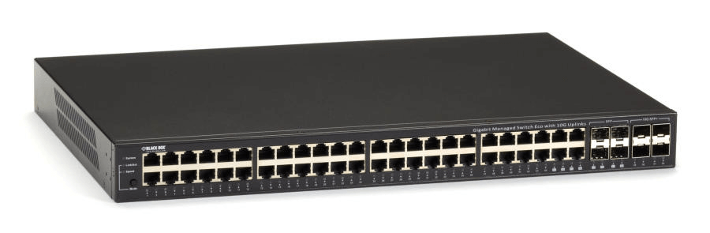​

　　现在问题来了：当主机数量超过端口数后，该怎么办呢？

　　我们可以将多台以太网设备连接起来，组成更大的网络：

​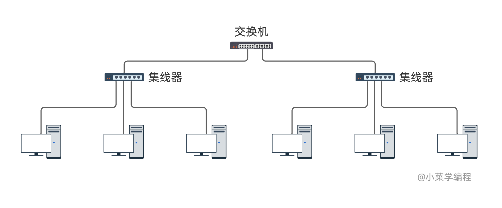​

　　那么，组建以太网一般采用什么拓扑结构？需要考虑哪些因素呢？开始讨论之前，我们先来认识一下冲突域的概念。

## 冲突域

　　我们知道，集线器是一种很低级的物理层设备，本质可以理解成共用导线。因此，连接在集线器上的主机，不能同时通信。如下图，当主机①与主机③正在通信时，其他主机是无法通信的：

​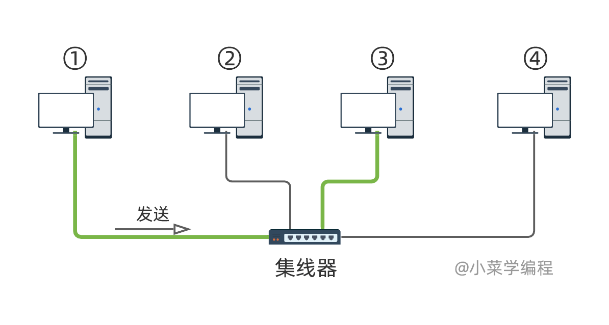​

　　如果一个以太网区域内，多台主机由于冲突而无法同时通信，这个区域构成一个 **冲突域** ( *collision domain* )。很显然，连接在同个集线器下的所有主机处于同一冲突域，它们的通信效率是非常低下的：

​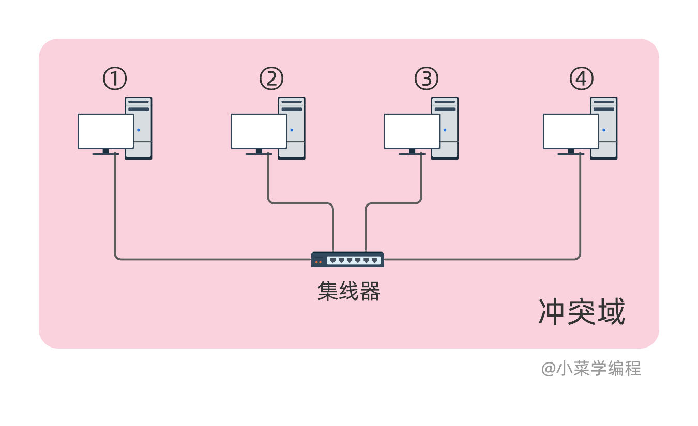​

　　交换机就不一样了，它工作在数据链路层，根据目的 *MAC* 地址转发以太网帧。由于交换机端口内部不会共用导线，因此不同端口可以同时通信。如下图，就算主机①和主机③正在通信，但并不影响其他端口上的主机：

​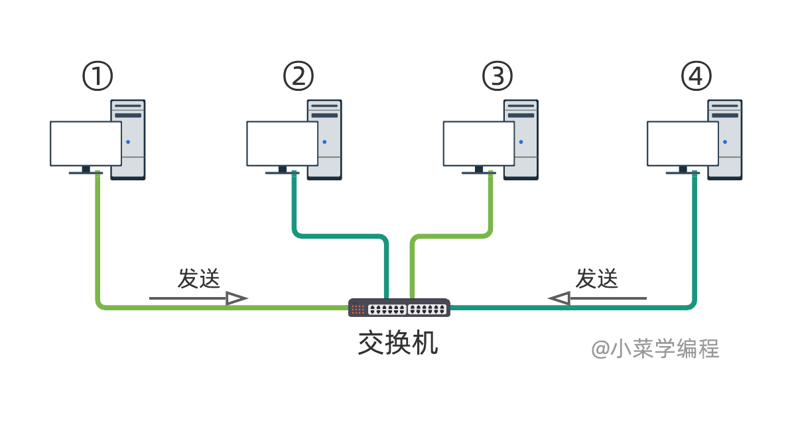​

　　这时，主机④仍可以向主机②发送数据，完全不受任何影响；但其他主机不能给主机③发数据。

　　因此，交换机每个端口都是一个独立的冲突域：

​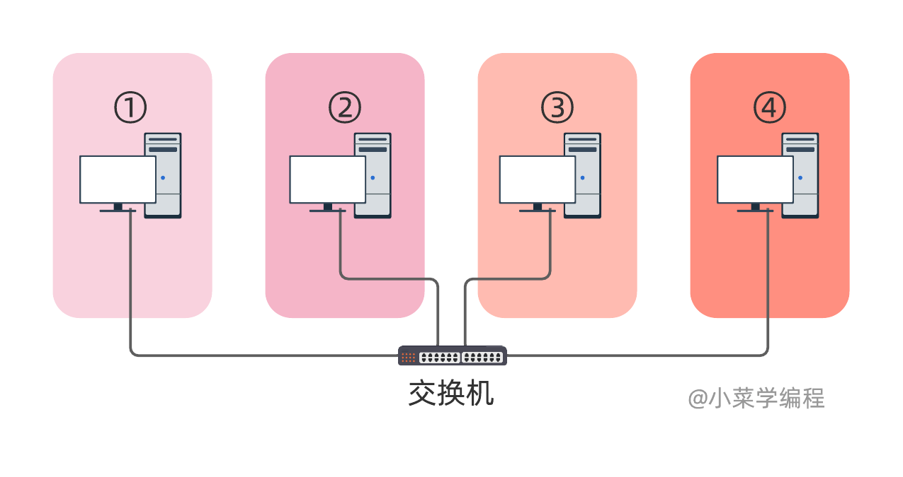​

　　回到前面的拓扑图，由于交换机每个端口都是独立的冲突域，而整个集线器是一个冲突域，因此整个拓扑构成了两个互相独立的冲突域：

​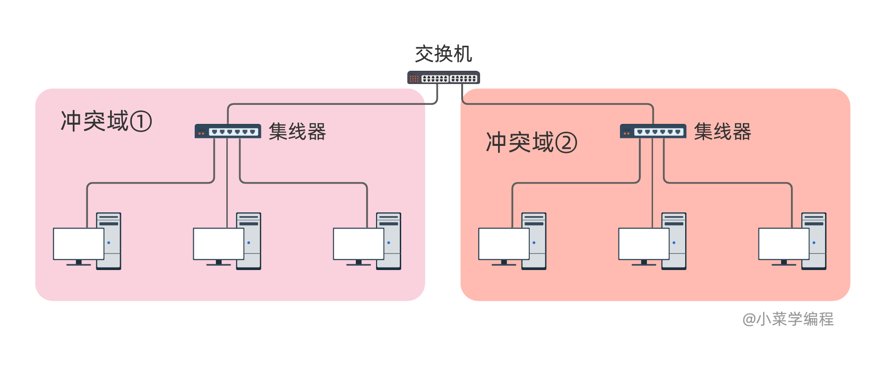​

　　由于集线器无法隔离冲突域，因此现在已经很少用了，更不用说通过连接多个集线器来组网：

​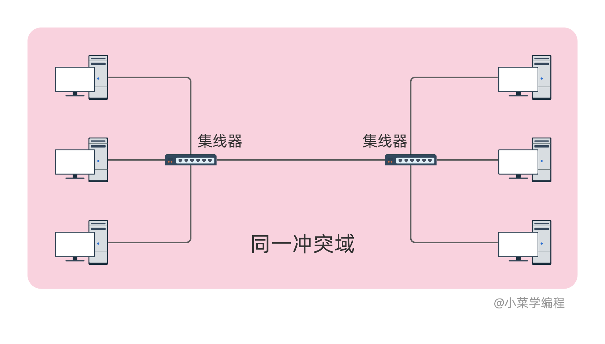​

## 交换机级联

　　级联是连接多台以太网交换机的传统方法，只需用网线将交换机端口连接起来。以两台交换机为例：

​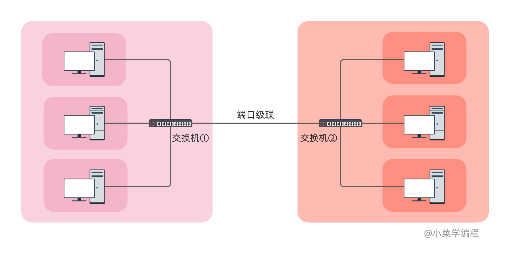​

　　图中的两台交换机，各有一个端口通过网线连接起来。这样一来，左边主机与右边主机通信，都需要通过中间的这根网线，共享带宽。因此，在左边主机看来，右边主机都在一个冲突域内，左右两边通信效率较差。

　　尽管如此，同个交换机下的不同主机，冲突域是独立，因而通信效率更高。

　　由于左右两边的主机通信都要经过中间的网线，这根小水管应该最先面临瓶颈。那么，如何提高左右两边的通信带宽呢？一根网线不够用，那就两根嘛，分别插两个端口。

​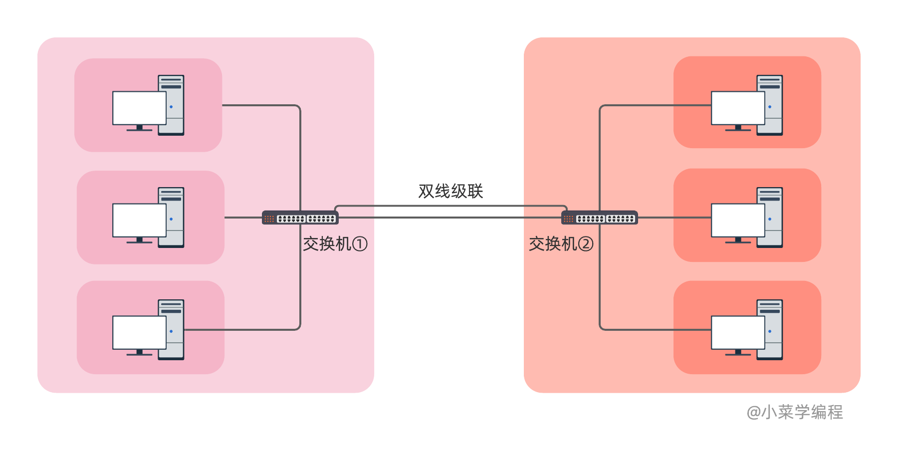​

　　这样的双线级联结构，左右两边的通信带宽理论上可以达到原来的两倍，不够还可以再加。

## 交换机堆叠

　　有些交换机还支持堆叠，堆叠一般通过专门的堆叠口和堆叠线进行：

​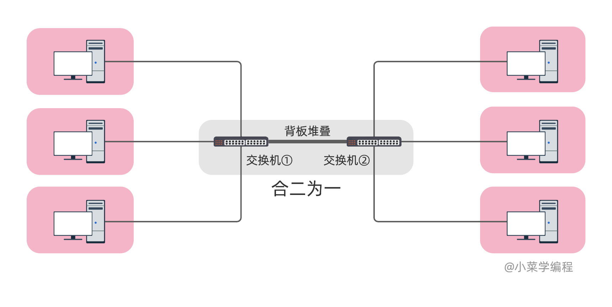​

　　以堆叠方式连接的交换机，组成一个有机整体，在外部看来就是一台，如上图。因此，堆叠交换机每个端口都是独立的冲突域。此外，堆叠端口带宽也比普通网络端口大得多，更不容易遇到瓶颈。

　　美中不足的是，不是所有交换机都支持堆叠，而且一般只有同个品牌型号的交换机才能堆叠。此外，堆叠对交换机距离也有要求，不能离得太远。

|**连接方式**|**优点**|**缺点**|
| ------| --------------------------------------------------------| --------------------------------------------|
|级联|实现简单; 节约成本; 距离基本不受限制; 兼容不同品牌设备|性能较差|
|堆叠|性能更好; 信号不易衰减|实现困难; 投入较大; 距离受限; 要求同一品牌|
