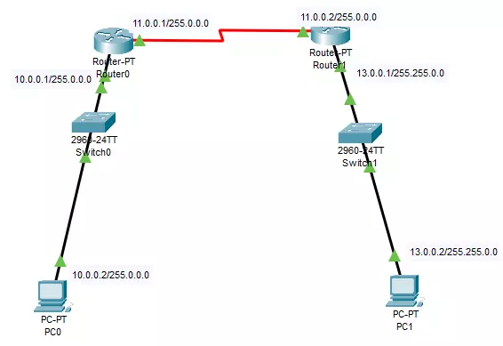

# 创建一个简单的网络

​​

## 为计算机配置IP，网关，子网掩码

```bash
PC1  10.0.0.2  255.0.0.0  10.0.0.1
PC2  13.0.0.2  255.0.0.0  13.0.0.1
```

## 为路由器配置IP以及路由表

　　在路由器中，我们需要配置两个端口，一个是针对10.0.0.1/255.0.0.0网段接口，一个连接到下一个路由器的接口11.0.0.1/255.0.0.0 。

#### 路由器serial 2/0接口11.0.0.1/255.0.0.0

```bash
enable                          # 进入特权模式
configure terminal              # 进入配置模式
interface serial 2/0            # 选择serial 2/0接口
ip address 11.0.0.1 255.0.0.0   # 配置IP，子网掩码
no shutdown                     # 启用这个接口
end                             # 退出配置模式
show ip interface serial 2/0    # 显示serial 2/0接口信息，输出如下
```

　　现在，我们已经看到serial 2/0接口的IP地址是我们所设置的IP地址。接下来我们设置Router0的在10.0.0.1/255.0.0.0网段上的接口

　　‍

#### 路由器fastEthernet 0/0接口10.0.0.1/255.0.0.0

```bash
enable #进入特权模式


configure terminal                 # 进入配置模式
interface fastEthernet 0/0         # 
ip address 10.0.0.1 255.0.0.0      # 配置IP，子网掩码
no shutdown                        # 启用这个接口
end                                # 退出配置模式
show ip interface fastEthernet 0/0 # fastEthernet 0/0接口信息，输出如下
```

　　现在，我们已经设置完Router0的配置，至于Router1这里不再描述，与操作Router0命令类似，只需要把接口，IP地址改一下即可。

### 配置路由表

　　路由表为当前路由指示着下一跳可以到那个网段，它是跨网段通讯的桥梁。路由表可以是静态或者动态的，动态的路由表，即路由自己发现下一跳路由地址与网段，不需要手动添加，这里我们将设置静态路由表。

```bash
enable #进入特权模式
configure terminal #进入配置模式
ip route 13.0.0.0 255.255.0.0 11.0.0.2 
exit
```

　　​`ip route 13.0.0.0 255.255.0.0 11.0.0.2`​ 这里说说这个命令含义，ip route即添加路由，`13.0.0.0 255.255.0.0`​ 指示着下一个网段，`11.0.0.2`​ 下一跳的路由器的IP地址。整体来说就是告知路由器Router0可以在`11.0.0.2`​ 路由器到达`13.0.0.0 255.255.0.0`​ 网段

　　‍
