# 1. 交换机参数

交换机作为弱电工程中最常用的设备之一，从便宜的几十块到几十万都有，如何选择交换机，实现最优选，今天给大家讲讲交换机选型，作为网工设计一个网络就会涉及到交换机选型，交换机选型需要关注哪些要点呢？

**交换机选型要点:**

 **（1）制式 （盒式交换机/框**式交换机 **）**

 **（2）功能（二层交换机/三层交换机）**

 **（3）端口数量**

 **（4）端口带宽**

 **（5）交换容量**

 **（6）包转发率**

‍

### 制式

**1、交换机制式：**

当前的交换机主要分为盒式和框式。

盒式交换机样例图：

​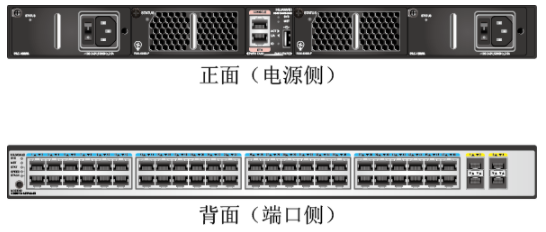​

框式交换机样例图：

​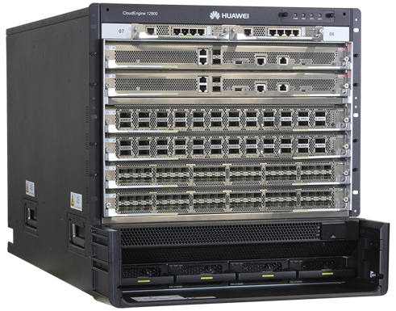​

‍

**2、盒式交换机**

（1）盒式交换机皆可以理解成一个铁盒子，一般情况下盒式交换机是固定配置，固定端口数量，固定电源模块、风扇等；因此盒式交换机不具备扩展性。

（2）为了提高扩展性，盒式交换机可以支持堆叠技术，可以将多台盒式交换机逻辑上组成一台交换机。

​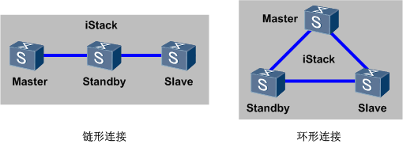​

 （3）正常情况下，盒式交换机应用在一个网络的接入层或者汇聚层。

**3、框式交换机**

框式交换机基于机框，接口板卡、交换板卡、电源模块等都可以按照需求独立配置，框式交换机的扩展性一般基于槽位数量。

框式交换机一般应用在一个网络的核心位置。

​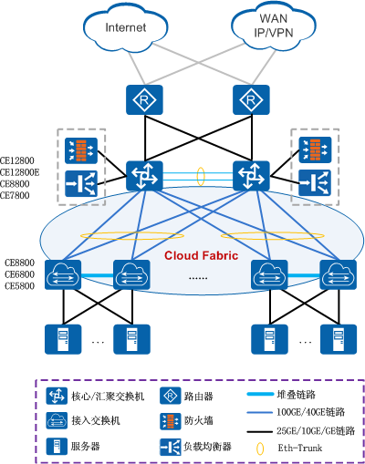​

 如上图组网所示：数据中心网络中，CE5800、CE6800、CE8800都是盒式设备，一般作为接入层使用；CE128是框式设备，一般作为核心层使用。

因此，在设备选型的时候可以根据实际交换机的使用层级判断选择盒式交换机还是框式交换机。

### 功能

**1、交换机按照工作协议层分类：**

交换机可以分为二层交换机和三层交换机。

**2、二层交换机、三层交换机区别**

（1）二层交换机：

工作在OSI参考模型的第二层数据链路层上交换机，主要功能包括物理编址、错误校验、帧序列以及流控。（如下图所示，二层交换机工作在数据链路层，可以处理数据帧）

​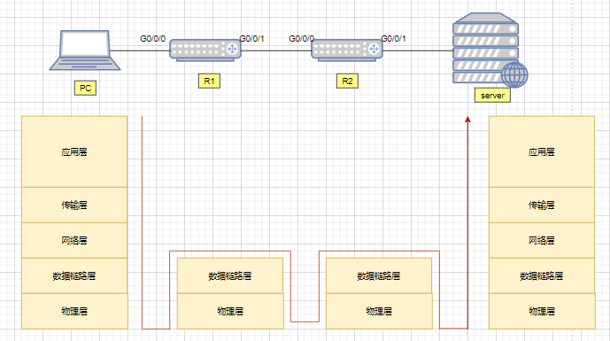​

（2）三层交换机：

一个具有三层交换功能的设备，即带有第三层路由功能的第二层交换机，但它是二者的有机结合，并不是简单地把路由器设备的硬件及软件叠加在局域网交换机上。（如下图三层交换机工作在网络层，可以处理数据包）

​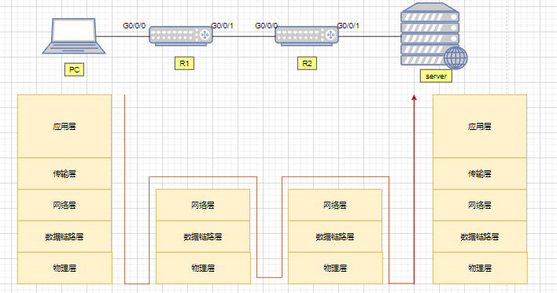​

### 端口数量

**1、交换机端口数量：**

(1)盒式交换机

一台交换机可以提供的端口数量，对于盒式交换机每一种型号基本是固定的，一般提供24个或48个接入口，2-4个上连接口。

这里以华为CE5850-48T4S2Q-EI为例（如下如所示），一共有48个1000M接入口，4个10G上行口，2个40G上行口；

​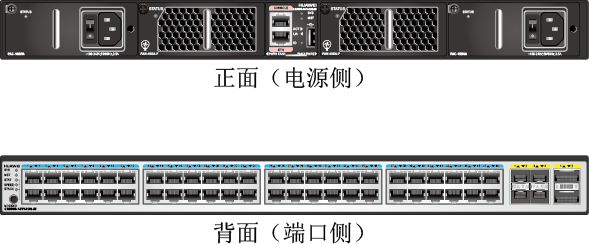​

(2)框式交换机

框式交换机则跟配置的单板数量有关，一般指配置最高密度的接口板的时候每个机框能够支持的最大端口数量。

这里以华为的CE12804为例，支持4块业务板LPU，端口和具体的单板型号相关，我们以36端口100G单板为例，那么插满单板一共有144个100G端口。

​​

**2、如何根据端口数量选择一款交换机：**

在选择交换机时需要基于当前的业务情况，和未来的可扩展性，交换机端口数量代表你需要接入的终端数量。

以一个48个接入口的交换机为例，那么如果1个终端占用一个端口，那么一台交换机就可以接48个终端，如果是一个200人的公司，那么就需要这样的交换机5台。

### 端口速率

**1、交换机支持端口速率：**

当前交换机提供的端口速率有100Mbps/1000Mbps/10Gbps/25Gbps等。

**2、交换机端口速率单位：**

交换机的端口速率的单位是bps（bit per second），即**每秒多少比特。**

### 交换容量

**1、交换机交换容量：** 也称为背板带宽或交换带宽。

交换容量是交换机接口处理器（或接口卡）和数据总线之间所能吞吐的最大数据量。

​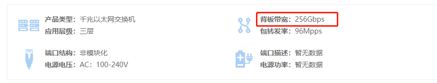​

背板带宽标志了交换机总的数据交换能力，单位为Gbit/s。一台交换机的交换容量越高，所能处理数据的能力就越强，但同时设计成本也会越高。所有端口容量端口数量之和的两倍应该小于交换容量，从而实现全双工无阻塞交换。

**2、交换容量跟交换机的制式有关:**

(1)对于总线式交换机来说，交换容量指的是背板总线的带宽;

​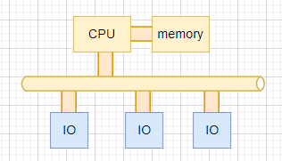​

(2)对于交换矩阵式交换机来说，交换容量是指交换矩阵的接口总带宽。

​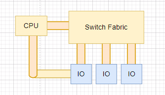​

这个交换容量是一个理论计算值，但是它代表了交换机可能达到的最大交换能力。当前交换机的设计保证了该参数不会成为整台交换机的瓶颈。

### 包转发率

**1、交换机包转发率：**

包转发率也称为接口吞吐量，是指通信设备某接口上的数据包转发能力，单位通常为pps（packet per second）。交换机的包转发率一般是实测的结果，代表交换机实际的转发性能。

​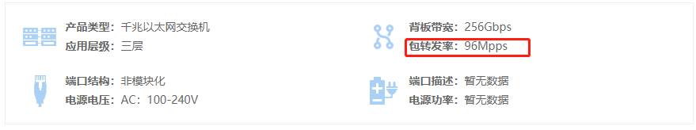​

**2、包转发率计算方式：**

包转发率的衡量标准是以单位时间内发送64字节的数据包（最小包）的个数作为计算基准的。当计算包转发率时，需考虑前导码和帧间隙的固定开销。

缺省情况下，帧间隙为最大值12字节，建议用户使用缺省配置。如果用户修改接口的帧间隙为较小值，则接收端在接收一个数据帧以后，可能会没有充足的时间接收下一帧，导致无法及时处理转发报文而出现丢包现象。

​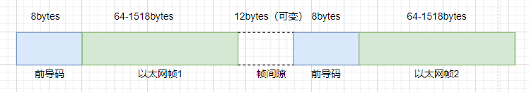​

我们知道以太帧的长度是可变的，但是交换机处理每一个以太帧所用的处理能力跟以太帧的长度无关。所以，在交换机的接口带宽一定的情况下，以太帧长度越短，交换机需要处理的帧数量就越多，需要耗费的处理能力也越多。

### 视频监控交换机选择

高清网络视频监控系统中，经常有客户反馈画面延时、卡顿等现象，造成这种现象的原因有很多，但大多数情况下还是交换机的配置不够合理，导致带宽不足造成的。

从网络拓扑结构来讲，一个中大型高清网络视频监控系统需采用三层网络架构：**接入层、汇聚层、核心层**。

‍

**1、接入层交换机的选择**

接入层交换机主要下联前端网络高清摄像机，上联汇聚交换机。以720P网络摄像机4M码流计算，一个百兆口接入交换机最大可以接入几路720P网络摄像机呢？

我们常用的交换机的实际带宽是理论值的50%-70%，所以一个百兆口的实际带宽在50M-70M。4M\*12=48M，因此建议一台百兆接入交换机最大接入12台720P网络摄像机。

同时考虑目前网络监控采用动态编码方式，摄像机码流峰值可能会超过4M带宽，同时考虑带宽冗余设计，因此一台百兆接入交换机控制在8台以内时最好的，超过8台建议采用千兆口。

‍

**2、汇聚层交换机的选择**

汇聚层交换机主要下联接入层交换机，上联监控中心核心交换机。一般情况下汇聚交换机需选择带千兆上传口的二层交换机。

还是以720P网络摄像机4M码流计算，前端每台接入层交换机上有6台720P网络摄像机，该汇聚交换机下联5台接入层交换机。该汇聚层交换机下总带宽为4M\*6\*5=120M，因此汇聚交换机与核心交换机级联口应选千兆口。

‍

**3、核心层交换机的选择**

核心层交换机主要下联汇聚层交换机，上联监控中心视频监控平台，存储服务器，数字矩阵等设备，是整个高清网络监控系统的核心。在选择核心交换机是必须考虑整个系统的带宽容量及如何核心层交换机配置不当，必然导致视频画面无法流畅显示。因此监控中心需选择全千兆口核心交换机。如点位较多，需划分VLAN，还应选择三层全千兆口核心交换机。

‍

**附：决定交换机性能的参数**

**背板带宽：**

背板带宽计算方法：端口数\*端口速度\*2=背板带宽，以华为S2700-26TP-SI为例，该款交换机有24个百兆口，两个千兆上联口。

背板带宽=24\*100\*2/1000+2\*1000\*2/1000=8.8Gbps。

**包转发率：**

包转发率的计算方法：满配置GE端口数×1.488Mpps+满配置百兆端口数×0.1488Mpps=包转发率 （1个千兆端口在包长为64字节时的理论吞吐量为1.488Mpps，1个百兆端口在包长为64字节时的理论吞吐量为0.1488Mpps）。拿华为S2700-26TP-SI为例，该款交换机有24个百兆口，两个千兆上联口。

包转发率=24\*0.1488Mpps+2\*1.488Mpps=6.5472Mpps。
