# 网络基础-子网划分

## 子网划分

### 子网划分的定义

可以自由的加减子网掩码长度，也就是不限制于A/B/C类默认的掩码长度，A类地址不必须使用8/位的掩码，也可以用诸如：10/位掩码或者7/位掩码。

### 子网划分的原因

子网就是把一个大网划分为几个小网，而如果按照默认的A\\B\\C类默认使用的话，比如一个B类地址，默认掩码为255.255.0.0，意味着这个地址空间里有2的16次方个IP，并且该网络号只能用于一个广播域，造成了IP地址的极大浪费，如果一个广播域中的PC数量过于庞大，网络可能被广播报文消耗大量资源。把一个大网络划分成几个不同的小网络以后，他们之间的网络号和广播地址各不相同，可以尽可能多的使用IP地址避免浪费，一个网段中的主机数量相对少一些的话，广播报文消耗的资源也会少很多，使得网络更有层次性。

为了解决IPv4的不足，提高网络划分的灵活性，诞生了两种非常重要的技术，那就是**VLSM（可变长子网掩码）** 和**CIDR（无类别域间路由）** ，把传统标准的IPv4有类网络演变成一个更为高效，更为实用的无类网络。

VLSM用于IPv4子网的划分，也就是把一个大的网络划分成多个小的子网；而CIDR则用于IPv4子网的聚合，当然主要是指路由方面的聚合，也就是路由汇总。通过CIDR可以把多个小的子网路由条目汇总成一个大网络的路由条目，以减少路由器中路由条目的数量，提高路由效率。

### 子网掩码的作用

知道划分子网的实质就是把host-id主机位分出若干位数来作net-id网络位，这时外界是怎样和划分好了的子网内的主机联系的呢？

在没有子网掩码的情况下，外界要和子网内的主机联系必须通过先前没划分的总的网络路由器，然后由路由器查找网内的各主机，这样效率就很低下。可不可以让各个子网独自通过自己的路由和外界通信呢？掩码正是为了解决这个问题。

各个子网要和外界独自通信，必须让外界知道你是划分了的子网，你的具体网络ID。但路由表并没有划分子网的具体信息，所以外界也无法通过你的路由器和你联系。掩码就是在你划分了的子网IP地址中，net-id相对应的地方标上1, host-id相对应的地方标上0.再在路由表中添加掩码这一项，这样外界就很容易知道你的具体网络ID了。这就是掩码的作用。

### 子网划分的方法

子网划分的总体思路是借用现有网段的主机位的最左边某几位作为子网位，划分出多个子网：

1. 把原来有类网络IPv4地址中的“网络ID”部分向“主机ID”部分借位
2. 把一部分原来属于“主机ID”部分的位变成“网络ID”的一部分（通常称之为“子网ID”）。
3. 原来的“网络ID”+“子网ID”=新“网络ID”。“子网ID”的长度决定了可以划分子网的数量。

网络ID等同于网络位，主机ID等同于主机位，翻译方式不同。

**必须注意的是，子网ID和网络位、主机位概念类似，都是一个范围，根据借位的多少有所区别，因为IP地址都是二进制的，所以接1位会多出2个子网，借两位多出4个子网，借三位多出8个子网，以此类推。后面会结合实际例子进一步说明，这里一定要记住这个概念。**

​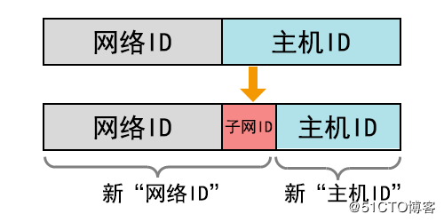​

**全0子网与全1子网**

①、“全0子网”代表的是对应子网的“子网ID”部分各位都是0，是第一个子网。

②、“全1子网”代表的是对应子网的“子网ID”部分各位都是1，是最后一个子网。

③、按照RFC950参考规定，划分子网后，只有n-2个可用的子网（n表示总的子网数）。

④、后来**RFC1878**参考规定，划分子网后，可以有n个可用的子网（n表示总的子网数）。

> RFC950参考规定：第一个子网（也就是“全0子网”）和最后一个子网（也就是“全1子网”）不可用，为的就是避免全0子网的网络地址和全1子网的广播地址分别与没有划分子网前的网络地址和广播地址相冲突。 但是在后来RFC1878规定中，该项规定已被废止了，现在的设备基本上都普遍支持RFC1878。

**子网划分的任务：**

①、确定子网掩码的长度。

②、确定子网下的主机可用地址范围（第一个可用IP和最后一个可用IP）。

③、确定网络地址（主机位全为0）和广播地址（主机位全为1），不能分配计算机主机用。

### 等长子网划分

等长子网划分就是将一个有类网络等分成多个网络，也就是等分成多个子网，所有子网的子网掩码都相同。

#### C类网络子网划分示例

##### 等分位两个字网

将192.168.0.0 255.255.255.0这个网络等分成2个子网，并写出每个子网的地址信息

分析步骤：

该子网掩码位/24位，要划分成2个子网，**网络位向主机位接用1位作为子网位**，因为IP地址都是2进制，1位2进制数字有两种可能，0以及1，0是A子网，1是B子网。

接用主机位1位，所以子网掩码+1位，由原来的255.255.255.0（/24）变为255.255.255.128（/25）

**结论：C类网络等分成2个子网，子网掩码往右移动1位，就能等分成2个子网，即2^1。**

​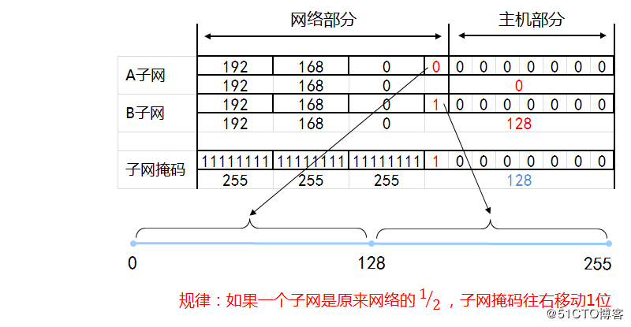​

​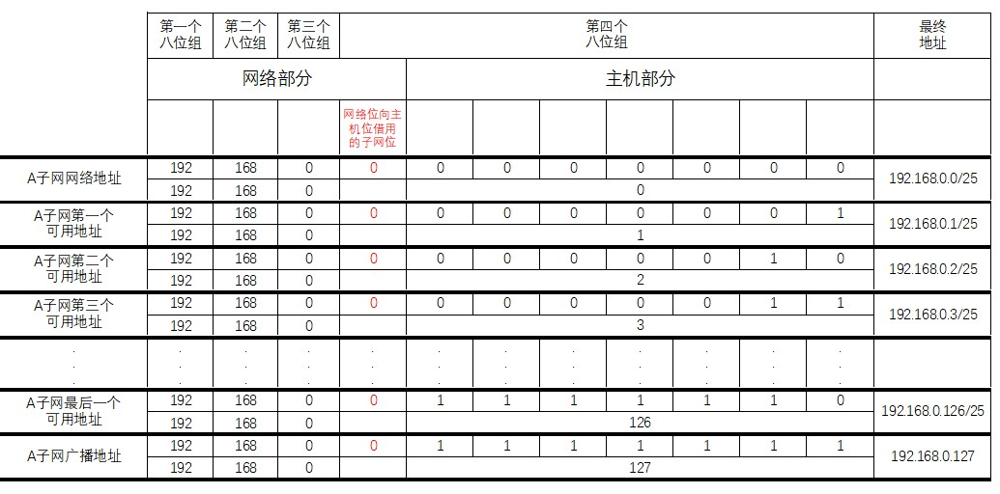​

​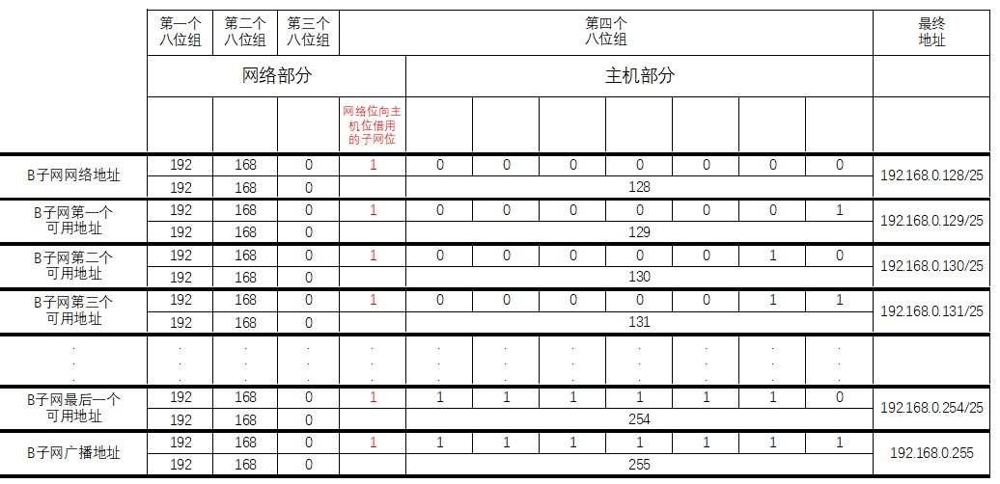​

**最终结果：**

A子网的网络地址：192.168.0.0/25，可用地址（192.168.0.1、192.168.0.2….～192.168.0.126），广播地址：192.168.0.127。

B子网的网络地址：192.168.0.128/25，可用地址（192.168.0.129、192.168.130….～192.168.0.254），广播地址：192.168.0.255。

##### 等分为四个子网

同样将192.168.0.0 255.255.255.0 这个网络等分成4个子网

分析：要想分成4个子网，需要将子网掩码往右移动两位，这样第1位和第2位就变为网络位，就可以分成4个子网，因为二进制数0和1按两位排列组合，只有这4种，分别为：00，01，10，11，如下图所示：

* 00为A子网
* 01为B子网
* 10为C子网
* 11为D子网

借用主机2位，所以子网掩码+2位，由原来的255.255.255.0 （/24）变为255.255.255.192 （/26）

结论：C类网络等分成4个子网，子网掩码往右移动2位，就能等分成4个子网，即2^2。

​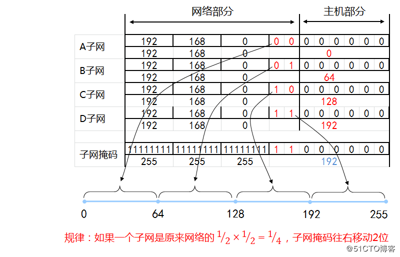​

​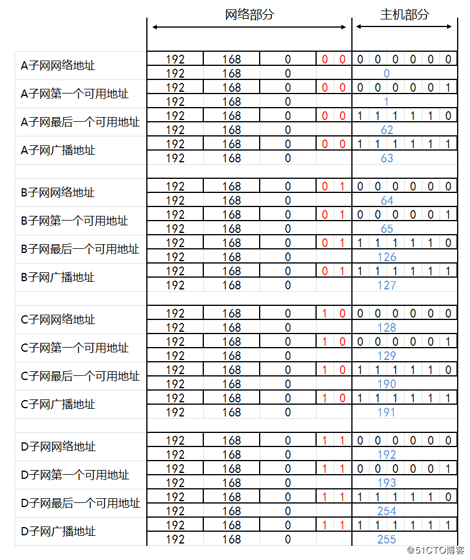​

最终结果：

A子网的网络地址：192.168.0.0/26，可用地址（192.168.0.1～192.168.0.62），广播地址：192.168.0.63/26。

B子网的网络地址：192.168.0.64/26，可用地址（192.168.65～192.168.0.126），广播地址：192.168.0.127。

C子网的网络地址：192.168.0.128/26，可用地址（192.168.129～192.168.0.190），广播地址：192.168.0.191。

D子网的网络地址：192.168.0.192/26，可用地址（192.168.193/26～192.168.0.254），广播地址：192.168.0.255。

##### 等分为八个子网

同样将192.168.0.0 255.255.255.0 这个网络等分成8个子网

分析：要想分成8个子网，需要将子网掩码往右移动三位

这样第1位、第2位和第3位就变为网络位，就可以分成8个子网

因为二进制数0和1按两位排列组合，只有这8种，分别为：000，001，010，011，100，101,110,111，

借用主机3位，所以子网掩码+3位，由原来的255.255.255.0 （/24）变为255.255.255.192 （/29）

结论：C类网络等分成8个子网，子网掩码往右移动3位，就能等分成8个子网，即2^3。

​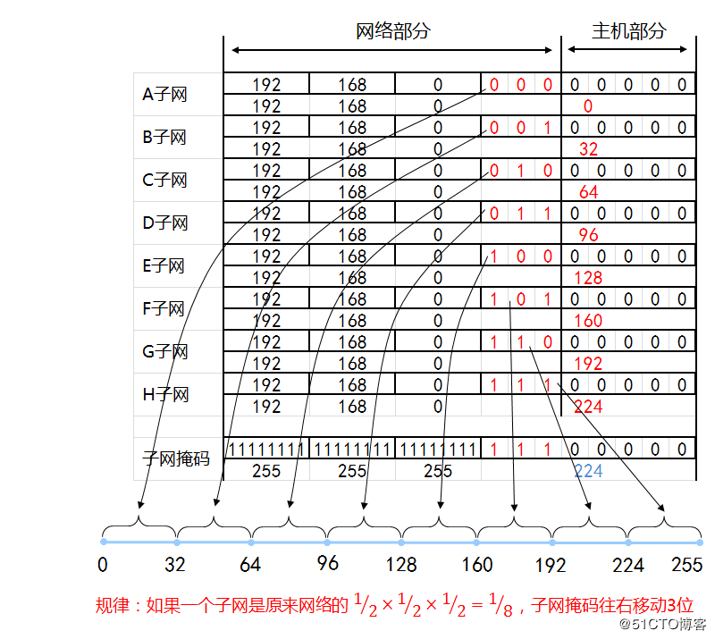​

最终结果：

子网掩码：255.255.255.224 （/27）

A子网的网络地址：192.168.0.0/27，可用地址（192.168.0.1～192.168.0.30），广播地址：192.168.0.31。

B子网的网络地址：192.168.0.32/27，可用地址（192.168.33～192.168.0.62），广播地址：192.168.0.63。

C子网的网络地址：192.168.0.64/27，可用地址（192.168.65～192.168.0.94），广播地址：192.168.0.95。

D子网的网络地址：192.168.0.96/27，可用地址（192.168.97～192.168.0.126），广播地址：192.168.0.127。

E子网的网络地址：192.168.0.128/27，可用地址（192.168.129～192.168.0.158），广播地址：192.168.0.159。

F子网的网络地址：192.168.0.160/27，可用地址（192.168.161～192.168.0.190），广播地址：192.168.0.191。

G子网的网络地址：192.168.0.192/27，可用地址（192.168.193～192.168.0.222），广播地址：192.168.0.223。

H子网的网络地址：192.168.0.224/27，可用地址（192.168.225～192.168.0.254），广播地址：192.168.0.255。

#### B类网络子网划分示例

将131.107.0.0/16等分成2个子网，写出各个子网的第一个和最后一个可用的IP地址

分析：要划分为2个子网，就要借用主机位1位作为子网位。

* 0是A子网
* 1是B子网

借用主机1位，所以子网掩码+1位，由原来的255.255.0.0 （/16）变为255.255.128.0（/17）

结论：B类网络等分成2个子网，子网掩码往右移动1位，就能等分成2个子网，即2^1。

最终结果：

A子网
网络地址：131.107.0.0/17，
可用地址（131.107.0.1 ~ 131.107.127.254）
广播地址：131.107.127.255

B子网
网络地址：131.107.128.0/17
可用地址（131.107.128.1 ~ 131.107.255.254）
广播地址：131.107.255.255

​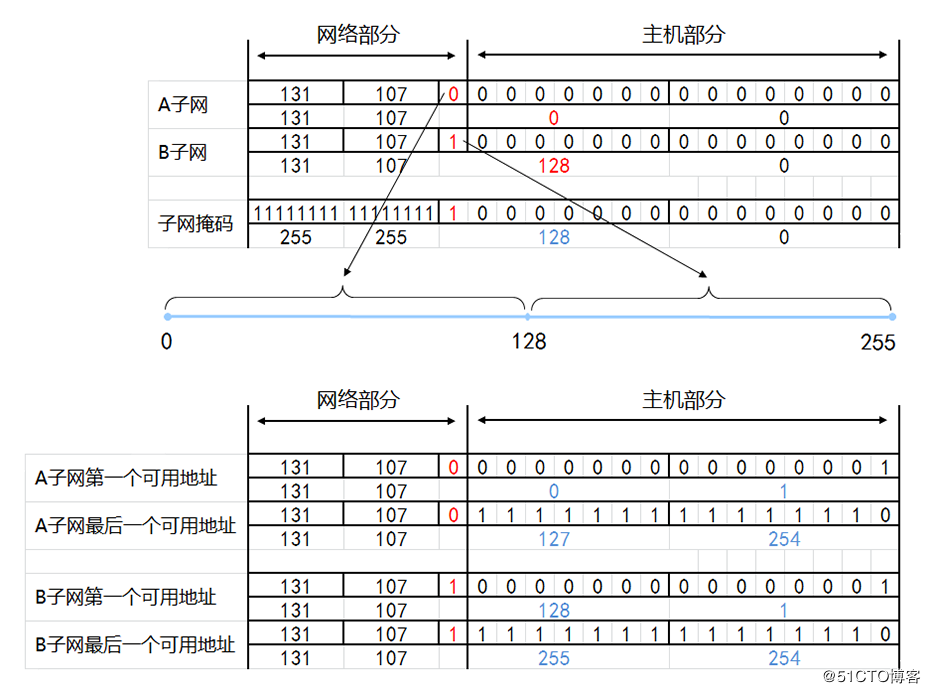​

#### A类网络子网划分示例

将A类网络42.0.0.0/8等分成4个子网，写出各个子网的第一个和最后一个可用的IP地址？

分析：要划分为4个子网，就要借用主机位2位作为子网位

* 00是A子网
* 01是B子网
* 10是C子网
* 11是D子网

借用主机2位，所以子网掩码+2位，由原来的255.0.0.0 （/8）变为255.192.0.0（/10）

结论：A类网络等分成4个子网，子网掩码往右移动2位，就能等分成4个子网，即2^2。

最终结果：

A子网的网络地址：42.0.0.0/10，可用地址（42.0.0.1 ~ 42.63.255.254），广播地址：42.63.255.255

B子网的网络地址：42.64.0.0/10，可用地址（42.64.0.1 ~ 42.127.255.254），广播地址：42.127.255.255

C子网的网络地址：42.128.0.0/10，可用地址（42.128.0.1 ~ 42.191.255.254），广播地址：42.191.255.255

D子网的网络地址：42.192.0.0/10，可用地址（42.192.0.1 ~ 42.255.255.254），广播地址：42.255.255.255

​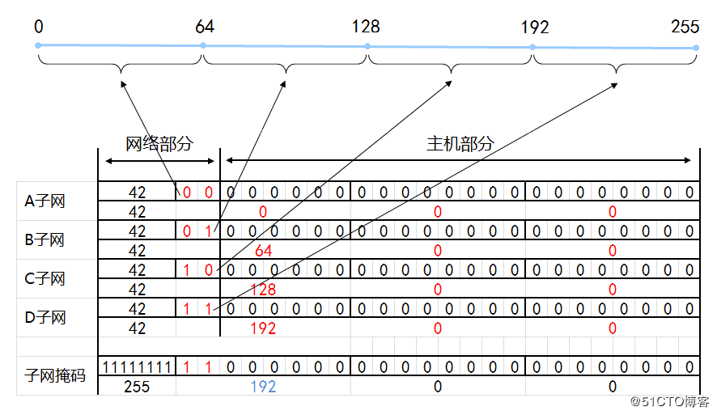​

### 变长子网划分

VLSM规定了如何在一个进行了子网划分的网络中，不同子网使用不同的子网掩码。这对于网络内部不同网段需要不同大小子网的情形来说很有效，这种划分子网的方式叫变长子网划分。

变长子网划分其实就是在等长子网的划分上，分别取不同等分子网中的某个或者多个子网。

​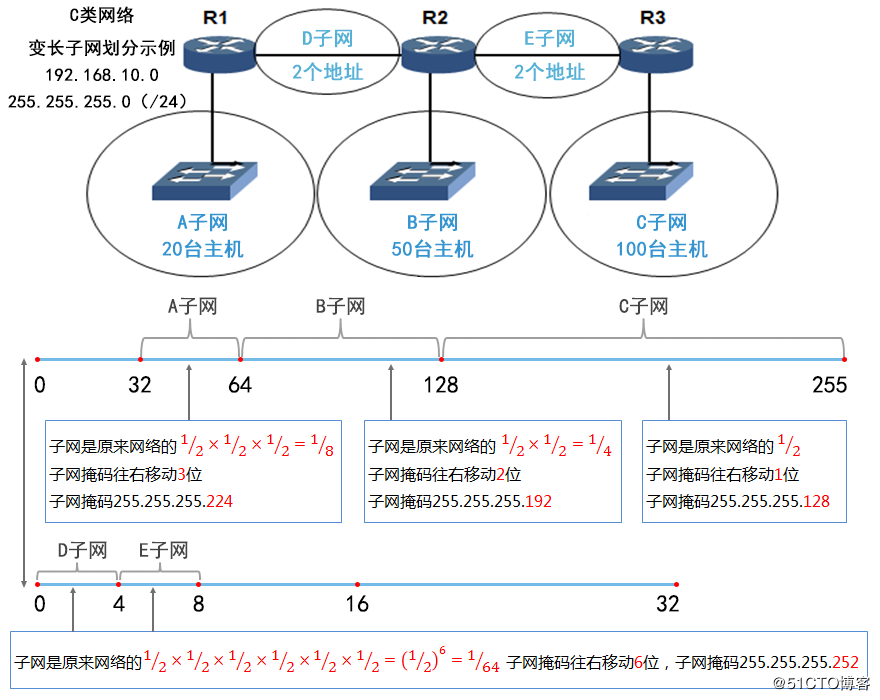​

如上示例划分分析结果：

A子网
网络地址：192.168.10.32，255.255.255.224（/27），可用地址（192.168.10.33 ~ 192.168.10.62），广播地址：192.168.10.63
相当于取了等长子网划分为8个子网中的一个子网

B子网
网络地址：192.168.10.64，255.255.255.192（/26），可用地址（192.168.10.65 ~ 192.168.10.126），广播地址：192.168.10.127
相当于取了等长子网划分为4个子网中的一个子网

C子网
网络地址：192.168.10.128，255.255.255.128（/25），可用地址（192.168.10.129 ~ 192.168.10.254），广播地址：192.168.10.255
相当于取了等长子网划分为2个子网中的一个子网

D子网
网络地址：192.168.10.0，255.255.255.252（/30），可用地址（192.168.10.1 ~ 192.168.10.2），广播地址：192.168.10.3
相当于取了等长子网划分为64个子网中的第一个子网

E子网
网络地址：192.168.10.4，255.255.255.252（/30），可用地址（192.168.10.5 ~ 192.168.10.6），广播地址：192.168.10.7
相当于取了等长子网划分为64个子网中的第二个子网

**变长子网划分总结**

①、变长子网划分规律

如果一个子网地址块是原来网段的(1/2)^n，子网掩码就在原网段的基础上右移n位，不等长子网，子网掩码也不同。

②、点到点网络的子网掩码

每个子网是原来网络的(1/2)×(1/2)×(1/2)×(1/2)×(1/2)×(1/2)，也就是(1/2)^6，子网掩码往右移动6位。

例如：11111111.11111111.11111111.11111100写成十进制子网掩码也就是255.255.255.252。

### 子网划分总结和技巧

​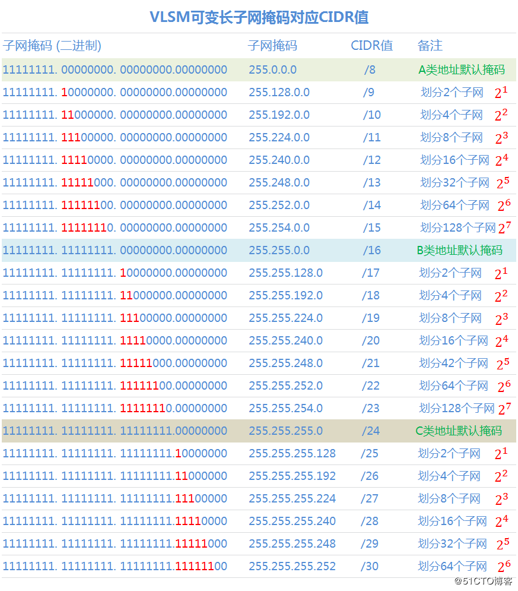​

1、确定划分子网数

子网数 = 2^n，n代表子网掩码往右移动的位数例如：要划分2个子网，子网掩码需要往右移动1位，2^1=2
要划分4个子网，子网掩码需要往右移动2位，2^2=4要划分8个子网，子网掩码需要往右移动3位，2^3=8
……
子网数只能为2倍的关系划分。

2、确定子网划分后的地址

每个子网地址块大小（IP\_block）= 2^(8-n)每个子网可用地址个数（IP_num）= 2^(8-n)-2
①、子网的网络地址 = 从0到255，取每段地址块的首个值
②、子网的广播地址 = 下一个子网的网络地址-1
③、子网的可用地址 = 子网的网络地址到子网的广播地址区间

例如：
要划分为4个网段（2^2），子网掩码右移2位每个子网地址块大小（IP_block）= 2^(8-4) = 64
每个子网可用地址个数（IP\_num）= 2^(8-4)-2 = 62
每段取值分别为：0，64，128，192
第一个子网
①、网络地址 = 0
②、广播地址 = 63
③、可用地址 = 1到62

第二个子网
①、网络地址 = 64
②、广播地址 = 127
③、可用地址 = 65到126

第三个子网
①、网络地址 = 128
②、广播地址 = 191
③、可用地址 = 129到190

第四个子网
①、网络地址 = 192
②、广播地址 = 255
③、可用地址 = 193到254

3、确定子网掩码

划分后的子网掩码CIDR = 原网络的子网掩码CIDR+n，如要写成十进制：256-2^(8-n)例如：原来子网掩码：255.255.255.0（/24），往右移动3位，则划分为8个子网子网掩码就变为为 /27，256-2^(8-3) = 256-2^5 = 256-32 = 224
最后子网掩码结果：255.255.255.224（/27）

如还有不明白的，请参照上面给出的VLSM可变长子网掩码对应CIDR值这个图就一目了然。

### 子网划分举例

1、计算一下172.16.1.0/27这个子网的网络号、广播号，及可用IP地址

答案：

​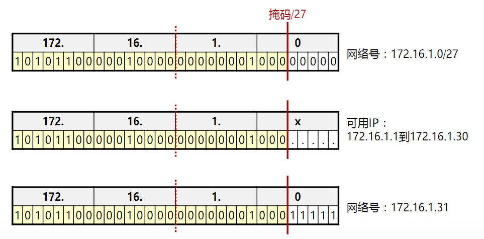​

2、200.200.200.0是一个C类地址。要求划分一个子网100主机，另外四个子网20主机。

解析过程：

我们可以先把该网络划分成两个子网。一个给100主机的子网，一个给另外20主机的四子网。

C类地址有8bit的主机号，划分子网就是把主机号拿出若干位来作网络ID。

具体要拿出多少位这里有一个公式：子网内主机数=2的x次方-2（x是主机号的位数）

现在主机数是100，我们取2的x次方-2略大于100。即x=7。

也就是说主机号位数是7位，这个子网才能够连100台主机。本来有8位的，剩下的一位拿去当网络号。（也实在是巧，这一位刚好可以标识两个子网（0或者1）下面的红色部分！）

NET ID 200.200.200.00000000

NETMASK 255.255.255.00000000

子网1:

NET ID 200.200.200.00000000

NETMASK 255.255.255.10000000 （掩码就是用1标识网络ID，看蓝色部分）

子网2:

NET ID 200.200.200.10000000

NETMASK 255.255.255.10000000

接下来划分四个子网，用上面任何一个子网划分都行。这里用子网2吧。

由上面的公式，子网内主机数=2的x次方-2

取2的x次方-2略大于20，也即x=5.

也就是主机号位数是5位，刚才是7位，剩下2位作网络ID,

子网2.1:

NET ID 200.200.200.10000000

NETMASK 255.255.255.11100000

子网2.2:

NET ID 200.200.200.10100000

NETMASK 255.255.255.11100000

子网2.3:

NET ID 200.200.200.11000000

NETMASK 255.255.255.11100000

子网2.4:

NET ID 200.200.200.11100000

NETMASK 255.255.255.11100000

这样，子网划分就完成了。

接下来写出五个子网的子网掩码、网络地址、第一个主机地址、最后一个主机地址、广播地址就比较简单了。

记住这一条：

**主机号全0是网络地址,网络地址+1是第1个主机地址,主机号全1是广播地址.广播地址-1是最后的主机地址.**

子网一主机号全是0的：NET ID 200.200.200.00000000 后面八个0是二进制，换成十进制就是它的网络地址了，然后+1是主机地址；广播地址要注意，那个红色0已是网络ID，主机号是后面七个0，把7个0全置为1就是他的广播地址。

接下来以此类推。

​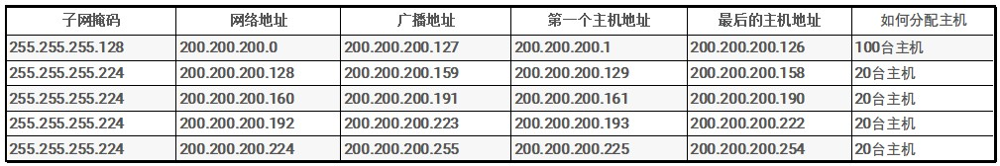​

这篇[子网划分详解与子网划分实例精析](https://blog.csdn.net/gui951753/article/details/79412524)的博客写的非常不错，就不搬运了，贴出链接可以自己做一下后面的子网划分题目。

## 超网

### 超网的概念

超网(Supernetting)是与子网类似的概念，IP地址根据子网掩码被分为独立的网络地址和主机地址。超网，也称无类别域间路由选择（CIDR），它是集合多个同类互联网地址的一种方法。

与子网划分（把大网络分成若干小网络）相反，它是把一些小网络组合成一个大网络，就是超网。

#### 合并网段

示例：某企业有一个网段，该网段有200台主机，使用192.168.0.0 255.255.255.0网段。

后来计算机数量增加到400台，为后来增加的200台主机使用192.168.1.0 255.255.255.0网段，如下图：

​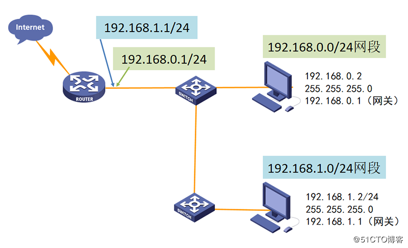​

在路由器配置了192.168.0.1的IP地址接口，再添加192.168.1.1地址后，这样192.168.0.0和192.168.1.0这两个网段内的主机就通过路由器转发来实现通信了。

那么有没有更好的办法，让这两个C类网段的计算机认为在一个网段？

这就需要将192.168.0.0/24和192.168.1.0/24 两个C类网络合并。

​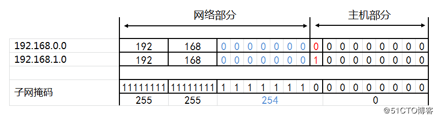​

网段合并：子网掩码向前移动1位，使得网络部分保持前部分相同。

注：子网掩码往左移1位，能够合并2个连续的网段，但**不是任何连续的网段都能合并**。

合并网段之后，如下图，这样所有主机相互通信就不再经过路由器转发了。

​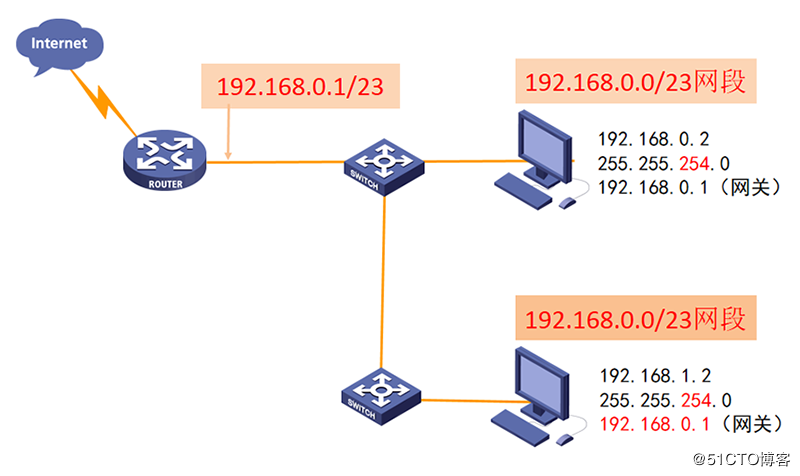​

①、合并之后网段为：192.168.0.0/23，IP分配如下图：

②、合并之后IP地址192.168.0.255/23也是可以给计算机使用的，因为主机部分往左增加了一位0（并不是全1），如下图：

​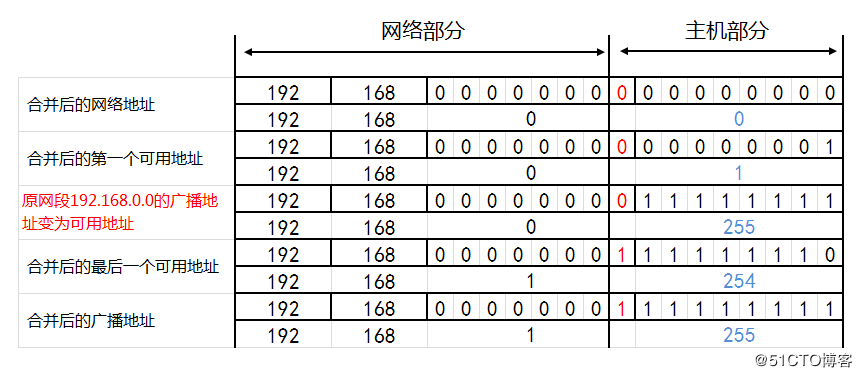​

#### 不是任何连续的网段都能合并

示例，如下两个连续的网段是不能合并（往前移动1位，网络部分不能保持相同）的。

​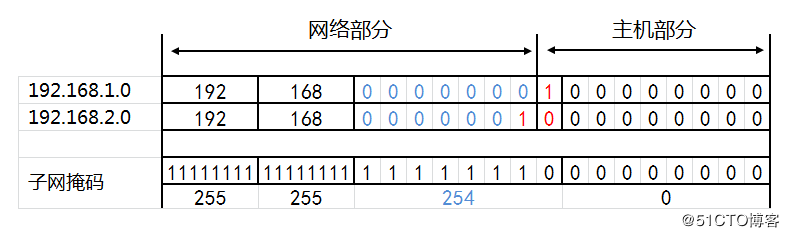​

如果非要合并，就要往前移动2位，这时候网络部分保持相同，这样一来，等于合并了4个网段，如下图：

​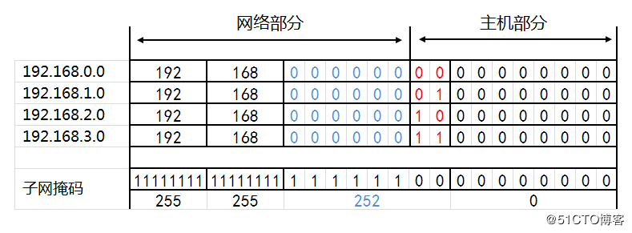​

#### 哪些连续的网段能够合并

（1）判断2个网段是否能够合并

​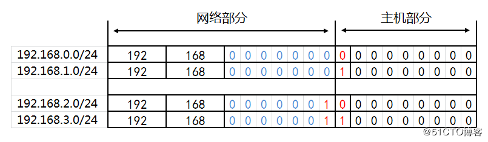​

子网掩码往左移动相应位数后，网络部分保持相同才能合并。

**结论：判断连续的2个网段是否能够合并，只要第一个网络号能被2整除，就能够通过左移1位子网掩码合并。**

（2）判断4个网段是否能够合并

​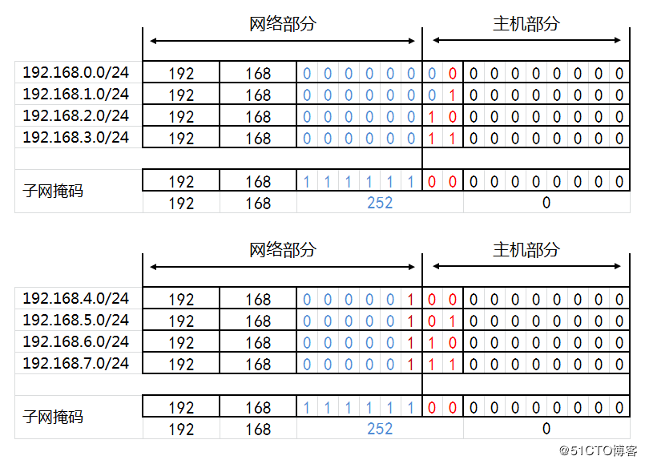​

**结论：判断连续的4个网段是否能够合并，只要第一个网络号能被4整除，就能够通过左移2位子网掩码合并。**

依次类推，要想判断连续的8个网段是否能够合并，只要第一个网络号能被8整除，这8个连续的网段就能够通过左移3位子网掩码合并。

#### 网段合并的规律

子网掩码左移1位能够将能够合并两个网段，左移2位，能够合并四个网段，左移3位，能够合并8个网段。

​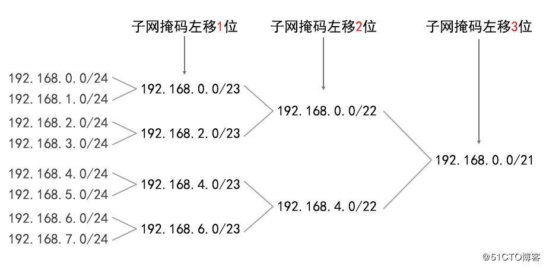​

#### 判断一个网段是超网还是子网

1. 通过左移子网掩码合并多个网段，右移子网掩码将一个网段划分成多个子网，使得IP地址打破了传统的A类、B类、C类的界限。
2. 判断一个网段到底是子网还是超网，就要看该网段是A类网络、还是B类网络、还是C类网络，默认A类子网掩码/8，B类子网掩码是/16，C类子网掩码是/24。
3. 如果该网段的子网掩码比默认子网掩码长，就是子网，如果该网段的子网掩码比默认子网掩码短，则是超网。
