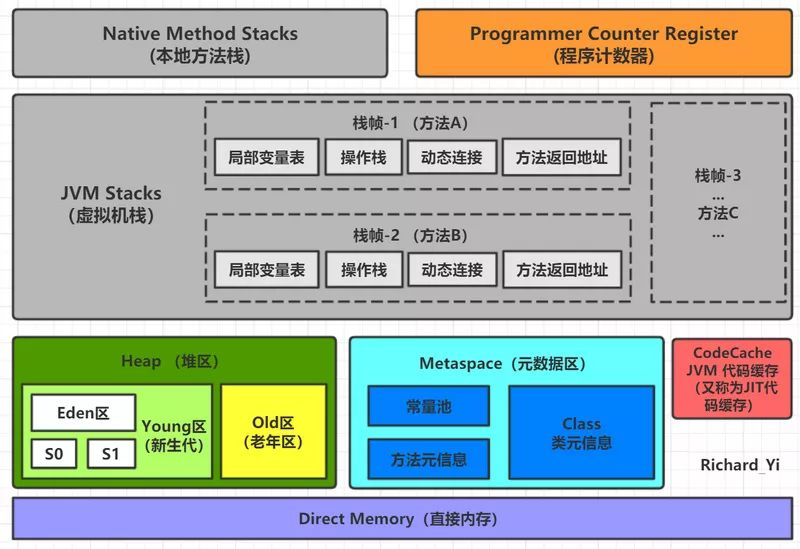
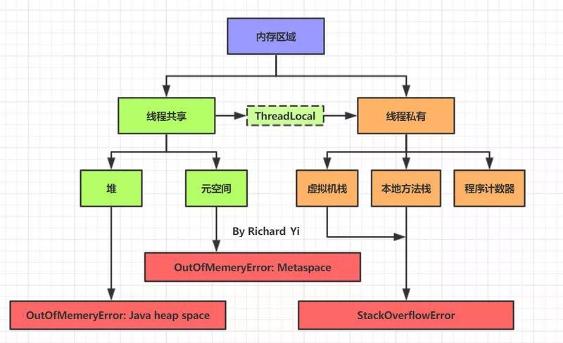

# jdk

# jdk 部署

jdk下载地址：[https://www.oracle.com/java/technologies/downloads/archive/](https://www.oracle.com/java/technologies/downloads/archive/)

```bash
mkdir -p /usr/local/java
tar -zxf jdk-8u333-linux-x64.tar.gz -C /usr/local/java
#配置环境变量
vim /etc/profile
--------------------------------------------------------
export JAVA_HOME=/usr/local/java/jdk1.8.0_333
export JRE_HOME=${JAVA_HOME}/jre
export CLASSPATH=$JAVA_HOME/lib/dt.jar:$JAVA_HOME/lib/tools.jar
export PATH=$PATH:$JAVA_HOME/bin


source /etc/profile
#验证JDK
java -version
```

# jdk 调优





一般JVM调优，重点在于**调整JVM堆大小、调整垃圾回收器**
jvm调优的目的是：减少full gc、降低gc停顿时间、提高吞吐量；
调优的顺序：“提高吞吐量”>“降低gc停顿时间”；在满足吞吐量的前提下，再降低gc停顿时间

**JVM调优常用参数**

```bash
######## 堆、元空间 优化 ###############
-Xms          # 堆空间最小值
-Xmx          # 堆空间最大值
-Xmn          # 新生代占堆空间的大小
-XX:MetaspaceSize     # 方法区（元空间）初始值
-XX:MaxMetaspaceSize  # 方法区（元空间）最大值
######## 栈 优化 ###############
-Xss          # 设置栈空间参数的
```

## 堆区

Java 中的堆是 JVM 所管理的最大的一块内存空间，主要用于存放各种类的实例对象。

在 Java 中，堆被划分成两个不同的区域：新生代 ( Young )、老年代 ( Old )。新生代 ( Young ) 又被划分为三个区域：Eden、From Survivor、To Survivor。这样划分的目的是为了使 JVM 能够更好的管理堆内存中的对象，包括内存的分配以及回收。

Java 中的堆也是 GC 收集垃圾的主要区域。GC 分为两种：Minor GC、FullGC ( 或称为 Major GC )。

Minor GC 是发生在新生代中的垃圾收集动作，新生代几乎是所有 Java 对象出生的地方，即 Java 对象申请的内存以及存放都是在这个地方。Java 中的大部分对象通常不需长久存活，具有朝生夕灭的性质。当一个对象被判定为 "死亡" 的时候，GC 就有责任来回收掉这部分对象的内存空间。新生代是 GC 收集垃圾的频繁区域。

## 元空间

> **元空间有一个特点: 可以动态扩容。**  如果, 我们没有设置元空间的上限, 那么他可以扩大到整个内存. 比如内存条是8G的, 堆和栈分配了4G的空间, 那么元空间最多可以使用4G。
> 我们可以通过参数来设置使用的元空间内存。对于64位的JVM来说,**元空间默认大小是21M**, 元空间的默认最大值是无上限的, 他的上限就是内存空间。

* \-XX:MetaspaceSize: 元空间的初始空间大小, 以字节位单位, **默认是21M**,达到该值就**会触发full GC**, 同时收集器会对该值进行调整, 如果释放了大量的空间, 就适当降低该值, 如果释放了很少的空间, 提升该值,但最到不超过-XX:MaxMetaspaceSize设置的值

  比如: 初始值是21M, 第一次回收了20M, 那么只有1M没有被回收, 下一次, 元空间会自动调整大小, 可能会调整到15M初始大小依然是21M, 第二次回收发现回收了1M, 有20M没有被回收, 他就会自动扩大空间, 可能扩大到30M,也可能是40M
* \-XX:MaxMetaspaceSize: 设置元空间的最大值, 默认是-1, 即不限制, 或者说只受限于本地内存的大小

  由于调整元空间的大小需要full GC, 这是非常昂贵的操作, 如果应用在启动的时候发生大量的full GC, 通常都是由于永久代或元空间发生了大小的调整, 基于这种情况, 一般建议在JVM参数中将-XX:MetaspaceSize和-XX:MaxMetaspaceSize设置成一样的值, 并设置的比初始值还要大, 对于8G物理内存的机器来说, 一般会将这两个值设置为256M或者512M都可以

## 线程栈
