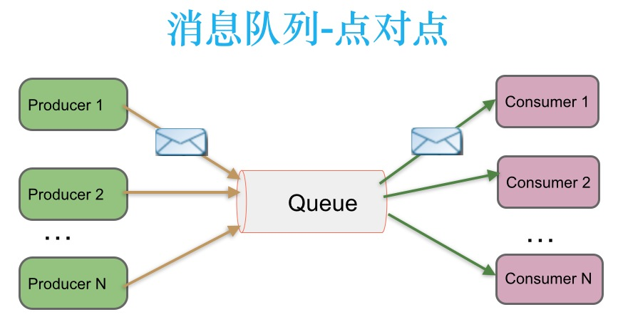
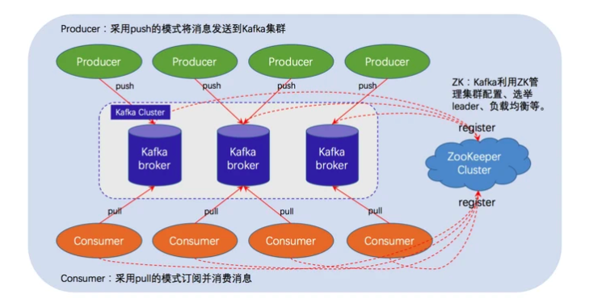

# kafka 概述

‍

**Kafka**是由[Apache软件基金会](https://zh.wikipedia.org/wiki/Apache%E8%BD%AF%E4%BB%B6%E5%9F%BA%E9%87%91%E4%BC%9A "Apache软件基金会")开发的一个[开源](https://zh.wikipedia.org/wiki/%E5%BC%80%E6%BA%90 "开源")​[流处理](https://zh.wikipedia.org/wiki/%E6%B5%81%E5%A4%84%E7%90%86 "流处理")平台，由[Scala](https://zh.wikipedia.org/wiki/Scala "Scala")和[Java](https://zh.wikipedia.org/wiki/Java "Java")编写。该项目的目标是为处理实时数据提供一个统一、高吞吐、低延迟的平台。其持久化层本质上是一个“按照分布式事务日志架构的大规模发布/订阅消息队列”，^^这使它作为企业级基础设施来处理流式数据非常有价值。此外，Kafka可以通过Kafka Connect连接到外部系统（用于数据输入/输出），并提供了Kafka Streams——一个[Java](https://zh.wikipedia.org/wiki/Java "Java")流式处理[库](https://zh.wikipedia.org/wiki/%E5%BA%93_(%E8%AE%A1%E7%AE%97%E6%9C%BA)) "库 (计算机)")。

Kafka拥有三个非常重要的角色特性：

* 1.消息系统。与传统的消息队列或者消息系统类似。
* 2.存储系统。可以把消息持久化到磁盘，有较好的容错性。
* 3.流式处理平台。可以在流式记录产生时就进行处理。

‍

## 点对点消息传递模式

在点对点消息系统中，消息持久化到一个队列中。此时，将有一个或多个消费者消费队列中的数据。但是一条消息只能被消费一次。当一个消费者消费了队列中的某条数据之后，该条数据则从消息队列中删除。该模式即使有多个消费者同时消费数据，也能保证数据处理的顺序。这种架构描述示意图如下：

​​

**生产者发送一条消息到queue，只有一个消费者能收到**。

‍

‍

## 发布-订阅消息传递模式

在发布-订阅消息系统中，消息被持久化到一个topic中。与点对点消息系统不同的是，消费者可以订阅一个或多个topic，消费者可以消费该topic中所有的数据，同一条数据可以被多个消费者消费，数据被消费后不会立马删除。在发布-订阅消息系统中，消息的生产者称为发布者，消费者称为订阅者。该模式的示例图如下：

​​

**发布者发送到topic的消息，只有订阅了topic的订阅者才会收到消息**。

‍

## zookeeper与kafka的关系呢

​​​​

**==Kafka 就是强依赖于ZooKeeper，没有ZooKeeper 的话Kafka 都无法运行。==**

**==​ ZooKeeper 为Kafka 提供了元数据的管理，例如一些Broker 的信息、主题数据、分区数据等等。==**

‍

在 Kafka 集群中存在以下几种节点角色：

* **Producer**：生产者，生产消息并推送到 Kafka 集群中。
* **Consumer**：消费者，从 Kafka 集群中拉取并消费消息。可以将一个和多个 Consumer 指定为一个 Consumer Group（消费者组），一个消费者组在逻辑上是一个订阅者，不同消费者组之间可以消费相同的数据，消费者组之间互不干扰。
* **Broker**：一台 Kafka 服务器就是一个 Broker，一个 Kafka 集群由多个 Broker 组成。
* **Controller**：Kafka 集群中的其中一台 Broker，负责集群中的成员管理和 Topic 管理。
* **Zookeeper**：Kafka 集群通过外部的 Zookeeper 来协调管理节点角色，存储集群的元数据信息。不过在 Kafka 2.8 版本开始可以不用 Zookeeper 作为依赖组件了，官网把这种模式称为 KRaft 模式，Kafka 使用的内置共识机制进行集群选举并且将元数据信息保存在 Kafka 集群中。

‍
