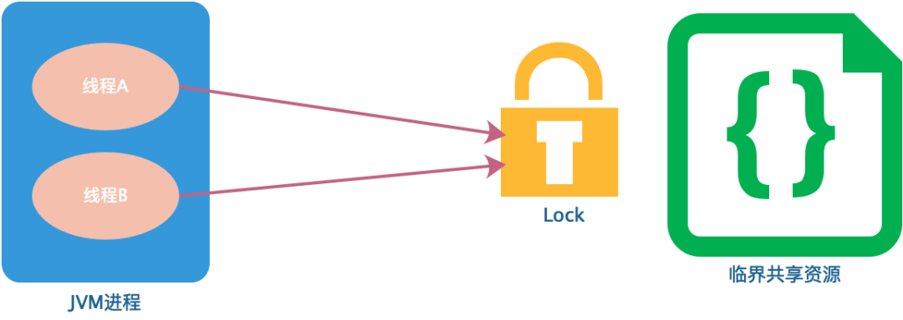
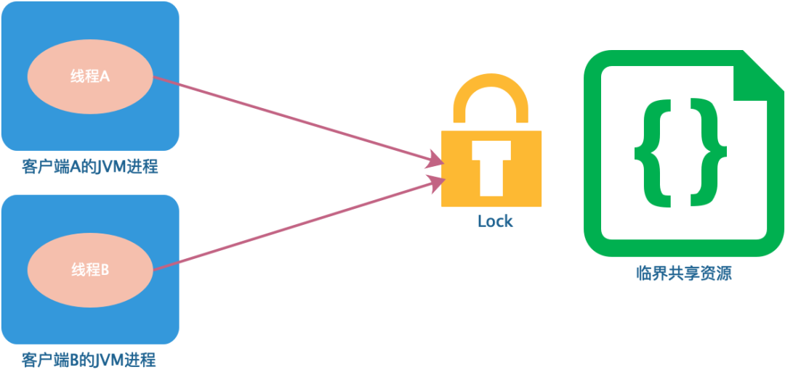
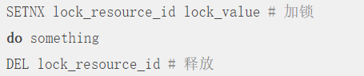
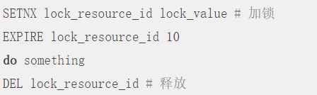
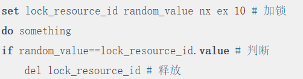
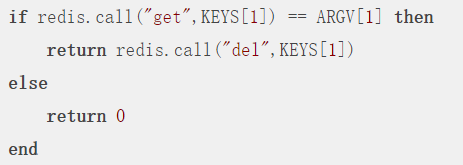
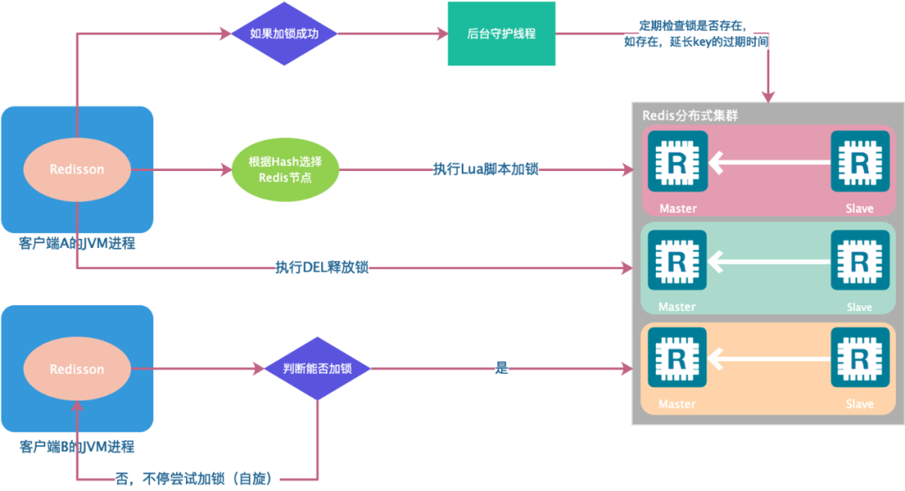
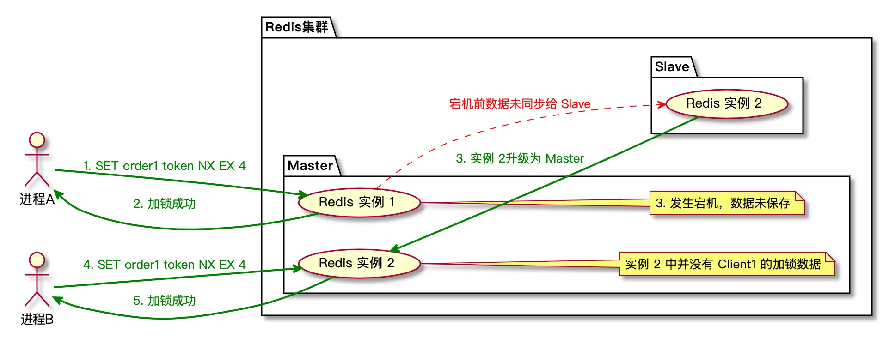
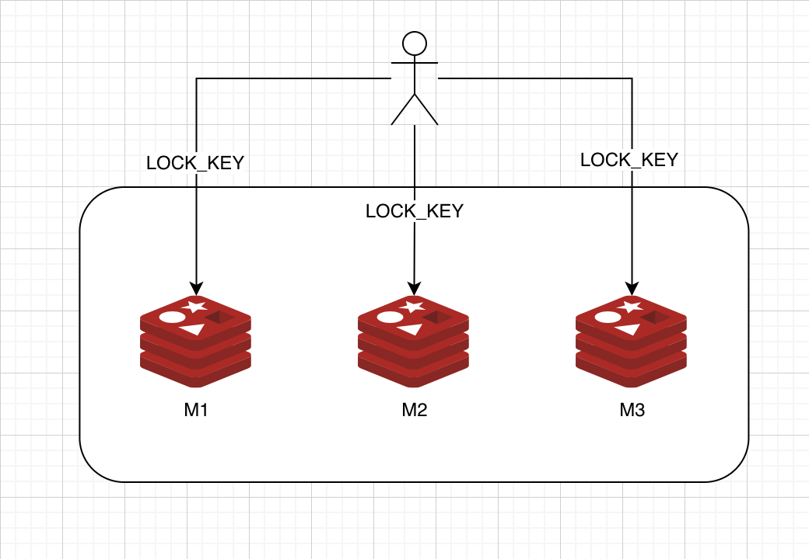
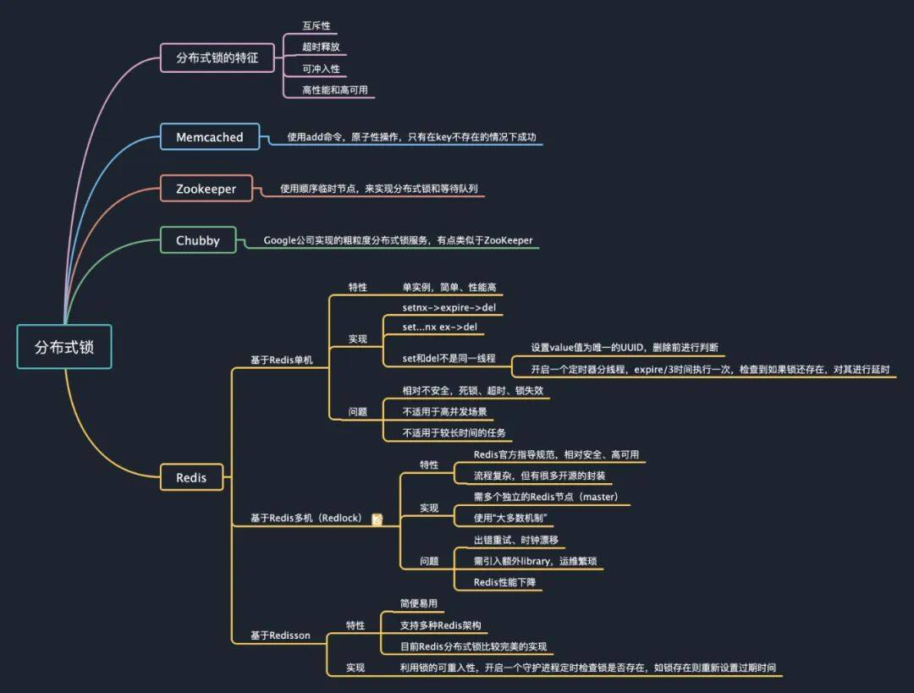

# redis 分布式锁

## 1 背景

我们日常在电商网站购物时经常会遇到一些高并发的场景，例如电商 App 上经常出现的秒杀活动、限量优惠券抢购，还有我们去哪儿网的火车票抢票系统等，这些场景有一个共同特点就是访问量激增，虽然在系统设计时会通过限流、异步、排队等方式优化，但整体的并发还是平时的数倍以上，为了避免并发问题，防止库存超卖，给用户提供一个良好的购物体验，这些系统中都会用到锁的机制。

对于单进程的并发场景，可以使用编程语言及相应的类库提供的锁，如 Java 中的 synchronized 语法以及 ReentrantLock 类等，避免并发问题。

​​

如果在分布式场景中，实现不同客户端的线程对代码和资源的同步访问，保证在多线程下处理共享数据的安全性，就需要用到分布式锁技术。

​​

那么何为分布式锁呢？分布式锁是控制分布式系统或不同系统之间共同访问共享资源的一种锁实现，如果不同的系统或同一个系统的不同主机之间共享了某个资源时，往往需要互斥来防止彼此干扰保证一致性。

一个相对安全的分布式锁，一般需要具备以下特征：

- 互斥性。互斥是锁的基本特征，同一时刻锁只能被一个线程持有，执行临界区操作。
- 超时释放。通过超时释放，可以避免死锁，防止不必要的线程等待和资源浪费，类似于 MySQL 的 InnoDB 引擎中的 innodblockwait\_timeout 参数配置。
- 可重入性。一个线程在持有锁的情况可以对其再次请求加锁，防止锁在线程执行完临界区操作之前释放。
- 高性能和高可用。加锁和释放锁的过程性能开销要尽可能的低，同时也要保证高可用，防止分布式锁意外失效。

可以看出实现分布式锁，并不是锁住资源就可以了，还需要满足一些额外的特征，避免出现死锁、锁失效等问题。

## 2 分布式锁的实现方式

目前实现分布式锁的方式有很多，常见的主要有：

- **Memcached 分布式锁**
- 利用 Memcached 的 add 命令。此命令是原子性操作，只有在 key 不存在的情况下，才能 add 成功，也就意味着线程得到了锁。
- **Zookeeper 分布式锁**
- 利用 Zookeeper 的顺序临时节点，来实现分布式锁和等待队列。ZooKeeper 作为一个专门为分布式应用提供方案的框架，它提供了一些非常好的特性，如 ephemeral 类型的 znode 自动删除的功能，同时 ZooKeeper 还提供 watch 机制，可以让分布式锁在客户端用起来就像一个本地的锁一样：加锁失败就阻塞住，直到获取到锁为止。
- **Chubby**
- Google 公司实现的粗粒度分布式锁服务，有点类似于 ZooKeeper，但也存在很多差异。Chubby 通过 sequencer 机制解决了请求延迟造成的锁失效的问题。
- **Redis 分布式锁**
- 基于 Redis 单机实现的分布式锁，其方式和 Memcached 的实现方式类似，利用 Redis 的 SETNX 命令，此命令同样是原子性操作，只有在 key 不存在的情况下，才能 set 成功。而基于 Redis 多机实现的分布式锁 Redlock，是 Redis 的作者 antirez 为了规范 Redis 分布式锁的实现，提出的一个更安全有效的实现机制。

本文主要讨论分析基于 Redis 的分布式锁的几种实现方式以及存在的问题。

## 3 Redis 分布式锁

使用 Redis 作为分布式锁，本质上要实现的目标就是一个进程在 Redis 里面占据了仅有的一个“茅坑”，当别的进程也想来占坑时，发现已经有人蹲在那里了，就只好放弃或者等待稍后再试。

目前基于 Redis 实现分布式锁主要有两大类，一类是基于单机，另一类是基于 Redis 多机，不管是哪种实现方式，均需要实现加锁、解锁、锁超时这三个分布式锁的核心要素。

### 3.1 基于 Redis 单机实现的分布式锁

**3.1.1 使用 SETNX 指令**

最简单的加锁方式就是直接使用 Redis 的 SETNX 指令，该指令只在 key 不存在的情况下，将 key 的值设置为 value，若 key 已经存在，则 SETNX 命令不做任何动作。key 是锁的唯一标识，可以按照业务需要锁定的资源来命名。

比如在某商城的秒杀活动中对某一商品加锁，那么 key 可以设置为  lock\_resource\_id ，value 可以设置为任意值，在资源使用完成后，使用 DEL 删除该 key 对锁进行释放，整个过程如下：

很显然，这种获取锁的方式很简单，但也存在一个问题，就是我们上面提到的分布式锁三个核心要素之一的锁超时问题，即如果获得锁的进程在业务逻辑处理过程中出现了异常，可能会导致 DEL 指令一直无法执行，导致锁无法释放，该资源将会永远被锁住。

所以，在使用 SETNX 拿到锁以后，必须给 key 设置一个过期时间，以保证即使没有被显式释放，在获取锁达到一定时间后也要自动释放，防止资源被长时间独占。由于 SETNX 不支持设置过期时间，所以需要额外的 EXPIRE 指令，整个过程如下：

这样实现的分布式锁仍然存在一个严重的问题，由于 SETNX 和 EXPIRE 这两个操作是非原子性的， 如果进程在执行 SETNX 和 EXPIRE 之间发生异常，SETNX 执行成功，但 EXPIRE 没有执行，导致这把锁变得“长生不老”，这种情况就可能出现前文提到的锁超时问题，其他进程无法正常获取锁。

​​

**3.1.2 使用 SET 扩展指令**

为了解决 SETNX 和 EXPIRE 两个操作非原子性的问题，可以使用 Redis 的 SET 指令的扩展参数，使得 SETNX 和 EXPIRE 这两个操作可以原子执行，整个过程如下：

在这个 SET 指令中：

- NX 表示只有当 lock\_resource\_id 对应的 key 值不存在的时候才能 SET 成功。保证了只有第一个请求的客户端才能获得锁，而其它客户端在锁被释放之前都无法获得锁。
- EX 10 表示这个锁 10 秒钟后会自动过期，业务可以根据实际情况设置这个时间的大小。

但是这种方式仍然不能彻底解决分布式锁超时问题：

- 锁被提前释放。假如线程 A 在加锁和释放锁之间的逻辑执行的时间过长（或者线程 A 执行过程中被堵塞），以至于超出了锁的过期时间后进行了释放，但线程 A 在临界区的逻辑还没有执行完，那么这时候线程 B 就可以提前重新获取这把锁，导致临界区代码不能严格的串行执行。
- 锁被误删。假如以上情形中的线程 A 执行完后，它并不知道此时的锁持有者是线程 B，线程 A 会继续执行 DEL 指令来释放锁，如果线程 B 在临界区的逻辑还没有执行完，线程 A 实际上释放了线程 B 的锁。

为了避免以上情况，建议不要在执行时间过长的场景中使用 Redis 分布式锁，同时一个比较安全的做法是在执行 DEL 释放锁之前对锁进行判断，验证当前锁的持有者是否是自己。

具体实现就是在加锁时将 value 设置为一个唯一的随机数（或者线程 ID ），释放锁时先判断随机数是否一致，然后再执行释放操作，确保不会错误地释放其它线程持有的锁，除非是锁过期了被服务器自动释放，整个过程如下：

但判断 value 和删除 key 是两个独立的操作，并不是原子性的，所以这个地方需要使用 Lua 脚本进行处理，因为 Lua 脚本可以保证连续多个指令的原子性执行。

​​

基于 Redis 单节点的分布式锁基本完成了，但是这并不是一个完美的方案，只是相对完全一点，因为它并没有完全解决当前线程执行超时锁被提前释放后，其它线程乘虚而入的问题。

**3.1.3 使用 Redisson 的分布式锁**

怎么能解决锁被提前释放这个问题呢？

可以利用锁的可重入特性，让获得锁的线程开启一个定时器的守护线程，每 expireTime/3 执行一次，去检查该线程的锁是否存在，如果存在则对锁的过期时间重新设置为 expireTime，即利用守护线程对锁进行“续命”，防止锁由于过期提前释放。

当然业务要实现这个守护进程的逻辑还是比较复杂的，可能还会出现一些未知的问题。

目前互联网公司在生产环境用的比较广泛的开源框架 Redisson 很好地解决了这个问题，非常的简便易用，且支持 Redis 单实例、Redis M-S、Redis Sentinel、Redis Cluster 等多种部署架构。

感兴趣的朋友可以查阅下官方文档或者源码：[*https://github.com/redisson/redisson/wiki*](https://github.com/redisson/redisson/wiki)

其实现原理如图所示（图中以 Redis 集群为例）：

​​

### 3.2 基于 Redis 多机实现的分布式锁 Redlock

以上几种基于 Redis 单机实现的分布式锁其实都存在一个问题，就是加锁时只作用在一个 Redis 节点上，即使 Redis 通过 Sentinel 保证了高可用，但由于 Redis 的复制是异步的，Master 节点获取到锁后在未完成数据同步的情况下发生故障转移，此时其他客户端上的线程依然可以获取到锁，因此会丧失锁的安全性。

整个过程如下：

进程 A 发送 SET 命令对 order1 进行加锁操作后，Master 实例宕机了，但是数据还没来得及同步给 Slave 实例，所以 Slave 也就没有这条数据。进行主从切换后，Slave 升级为 Master 提供服务，然后进程 B 对 order1 也能够加锁成功，这时候就有两个进程同时对同一个资源进行操作，所以锁也就失去了作用。

​​

**Redlock 的介绍**

首先，我们要掌握RedLock的第一步就是了解它的定义。这一点，官方网站肯定是最权威的。接下来的这段文字摘自 [http://redis.cn/topics/distlock.html](http://redis.cn/topics/distlock.html)

在Redis的分布式环境中，我们假设有N个Redis Master。这些节点完全互相独立，不存在主从复制或者其他集群协调机制（这句话非常重要，如果没有理解这句话，也就无法理解RedLock。并且由这句话我们可以得出，RedLock依赖的环境不能是一个由N主N从组成的Cluster集群模式，因为Cluster模式下的各个Master并不完全独立，而是存在Gossip协调机制的）。

接下来，我们假设有3个完全相互独立的Redis Master单机节点，所以我们需要在3台机器上面运行这些实例，如下图所示（请注意这张图中3个Master节点完全相互独立）：

​​

为了取到锁，客户端应该执行以下操作:

1. 获取当前Unix时间，以毫秒为单位。
2. 依次尝试从N个Master实例使用相同的key和随机值获取锁（假设这个key是LOCK_KEY）。当向Redis设置锁时，客户端应该设置一个网络连接和响应超时时间，这个超时时间应该小于锁的失效时间。例如你的锁自动失效时间为10秒，则超时时间应该在5-50毫秒之间。这样可以避免服务器端Redis已经挂掉的情况下，客户端还在死死地等待响应结果。如果服务器端没有在规定时间内响应，客户端应该尽快尝试另外一个Redis实例。
3. 客户端使用当前时间减去开始获取锁时间（步骤1记录的时间）就得到获取锁使用的时间。当且仅当从大多数的Redis节点都取到锁，并且使用的时间小于锁失效时间时，锁才算获取成功。
4. 如果取到了锁，key的真正有效时间等于有效时间减去获取锁所使用的时间（步骤3计算的结果）。
5. 如果因为某些原因，获取锁失败（没有在至少N/2+1个Redis实例取到锁或者取锁时间已经超过了有效时间），客户端应该在所有的Redis实例上进行解锁（即便某些Redis实例根本就没有加锁成功）。

## 4 总结

在本文中，先介绍了单实例 Redis 锁的一些问题以及解决方法，然后又介绍了基于多实例的 Redlock 分布式锁的实现，Redlock 在解决了单实例以及集群可能会出现的一些问题。

但是 Redlock 本身还是存在一些问题，比如：

- 加锁/解锁的效率会随着实例数量增加而降低。
- 客户端无法感知锁失效：客户端获取到锁后，处理业务逻辑时锁失效了，客户端是无法感知的，可能会被其它客户端再次获取到。
- 过期时间依赖系统时钟：如果系统发生时钟漂移，那么会影响到 Redis 计算过期时间，导致锁提前失效或持有时间比原来更久。
- …

所以在业务选型的过程中，我们需要结合实际业务情况使用合适的分布式锁组件。

- 业务比较简单或者对锁的可靠性要求不高时，可以直接使用单实例的 Redis 锁。
- 对于锁的可靠性有一定要求，又不想引入其它组件时，可以使用 Redlock。
- 对于锁的可靠性要求比较高时，可以使用 ZooKeeper、Etcd 等组件。

​​

‍
