# 服务器BIOS和BMC等知识详解

‍

**引言：** 以BIOS为核心的固件产业，是信创产业链的重要组成部分，可被誉为信创产业的“山海关”。在计算机体系中，BIOS 有着比操作系统更为底层和基础性的作用，是机器点亮后第一个被激活的系统程序，主要负责检测、访问与调试底层硬件资源，并分配给操作系统，以保障整个机器顺利安全运转。

目前，全球 X86 授权 BIOS 厂商共计 4家，它们分别是 AMI、Phoenix、Insyde 和百敖，而百敖（卓易信息旗下）又是境内唯一一家 BIOS 厂商。本文将聚焦BIOS产业生态，围绕10个核心问题，从技术和产品定义、产业市场规模、纵观竞争格局、投资机会等多维度进行深入剖析，以期辅助投资决策。

**一、计算机核心基础部件：BIOS 、BMC**

**1、BIOS 是什么？**

**BIOS（Basic Input Output System）** ，即基础输入输出系统，是刻在主板 ROM 芯片上不可篡改的启动程序，BIOS 负责计算系统自检程序（POST，Power On Self Test）和系统自启动程序，因此是计算机系统启动后的第一道程式。由于不可篡改性，故程序存储在 ROM 芯片中，并且在断电后，依然可以维持原有设置。

BIOS 主要功能是控制计算机启动后的基本程式，包括硬盘驱动（如装机过程中优先选择 DVD 或者 USB 启动盘），键盘设置，软盘驱动，内存和相关设备。

**表1、BIOS 主要程序及实现功能**

​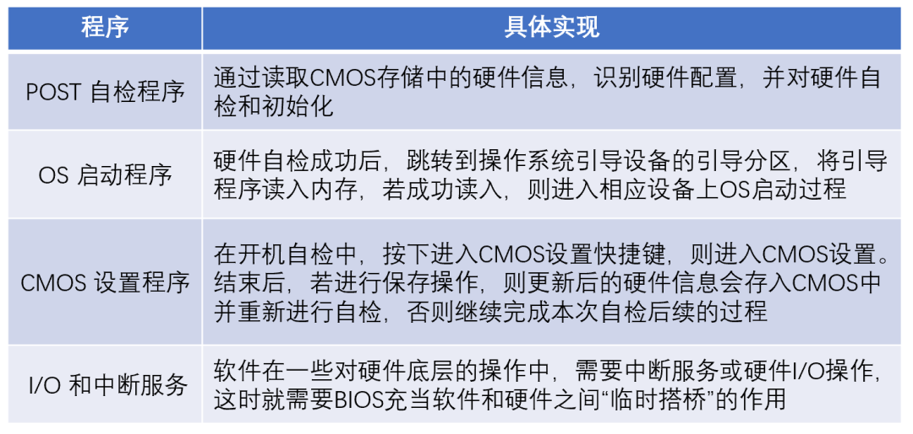​

资料来源：IT之家，兴业证券经济与金融研究院整理

**2、BMC和IPMI 是什么？**

**BMC（Baseboard Management Controller）与IPMI（Intelligent Platform Management Interface）** ，即基板管理控制器与智能型平台管理接口，是服务器的基本核心功能子系统，负责服务器的硬件状态管理、操作系统管理、健康状态管理、功耗管理等核心功能。

**BMC** **是独立于服务器系统之外的小型操作系统****，** 是一个集成在主板上的芯片，也有产品是通过 PCIE 等形式插在主板上，对外表现形式只是一个标准的 RJ45 网口，拥有独立 IP 的固件系统。服务器集群一般使用 BMC 指令进行大规模无人值守操作，包括服务器的远程管理、监控、安装、重启等。

**IPMI** **是一组交互标准管理规范**，由 Intel、HP、Dell 和 NEC 公司于1998年9月16日共同提出，主要用于服务器系统集群自治，监视服务器的物理健康特征，如温度、电压、风扇工作状态、电源状态等。同时，IPMI 还负责记录各种硬件的信息和日志记录，用于提示用户和后续问题的定位。目前，IPMI 已经为超过 200 多家计算机供应商所支持。

**IPMI 是独立于主机系统 CPU、BIOS/UEFI 和 OS 之外，可独立运行的板上部件，其核心部件即为 BMC。** 或者说，BMC 与其他组件如 BIOS/UEFI、CPU 等交互，都是经由 IPMI 来完成。在 IPMI 协助下，用户可以远程对关闭的服务器进行启动、重装、挂载 ISO 镜像等。

**图1、IPMI 逻辑图**

​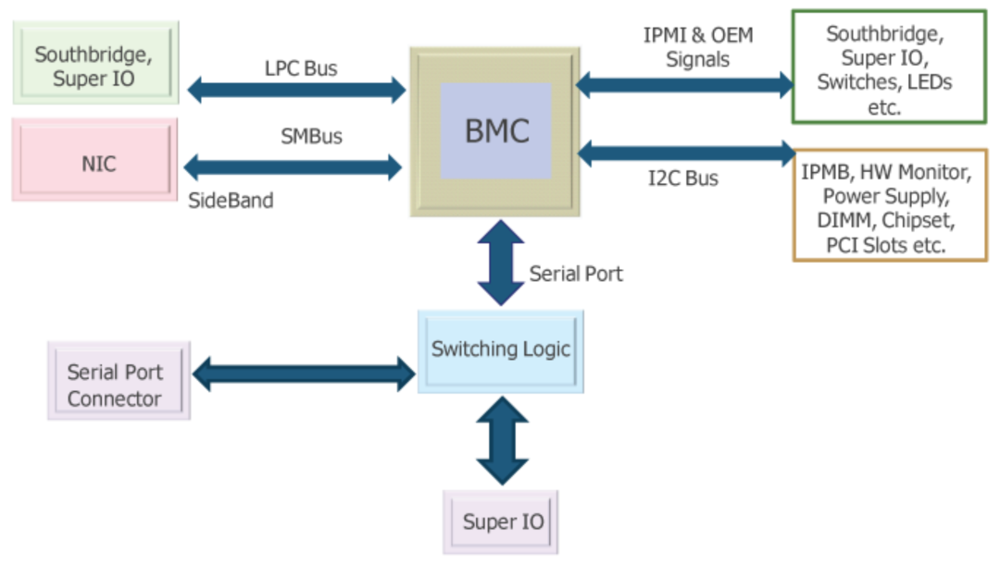​

资料来源：Wiki，兴业证券经济与金融研究院整理

**3、EFI 与 UEFI 是什么？**

**EFI（Extensible Firmware Interface），是可扩展固件接口**，由于传统的 BIOS 是基于 16 位处理器开发的汇编程序，在面对 32/64 处理器时，效率低下的短板即暴露出来，因此， Intel 推出的一种计算系统中 BIOS 新的替代升级方案。

**UEFI（Unified Extensible Firmware Interface），统一可扩展固件接口**，是 EFI 的规范化版本，也是BIOS的进化版。为便于将UEFI BIOS与传统BIOS区分，传统BIOS又被称为Legacy BIOS 。2005年，Intel 将 EFI 交由 UEFI Forum 来推广与发展，EFI 更名 UEFI。UEFI 负责加电自检（POST）、联系操作系统以及提供连接操作系统与硬件的接口。

**现有主流 BIOS 固件公司已基本采用 UEFI。**

​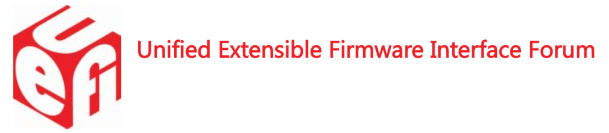​

从主要功能上来说，UEFI BIOS 和 Legacy BIOS 都是为了初始化硬件平台并引导操作系统。两者主要差异在于 Legacy BIOS 无统一标准，而 UEFI BIOS 统一定义了固件和操作系统之间的接口标准。二者优劣势表现在：

> 1、UEFI BIOS 主要以 C 语言编写，易于实现跨架构跨平台支持并共享代码模块，而 Legacy BIOS 通过则是汇编语言编写
>
> 2、UEFI BIOS 完整支持新固件安全功能，从最大程度上降低固件被攻击的风险
>
> 3、Legacy BIOS 移植性差，重复开发现象严重。整体而言，UEFI BIOS 较 Legacy BIOS 的优势明显

**二、BIOS/BMC 产业链，从 CPU 到整机**

**4、BIOS 处于产业链哪个环节？**

**在整个计算机体系中，CPU 处于核心关键环节。** 根据指令集不同，又可分为 X86（CISC，复杂指令集）和 非 X86 架构（RISC，精简指令集），前者主要厂商包括 Intel/AMD/海光/兆芯；后者包括鲲鹏（ARM）、飞腾（ARM）、龙芯（MIPS）和申威（Alpha）。

在 BIOS/BMC 产业链中，CPU 处于产业上游，且上游 CPU 厂商系统核心代码授权与 BIOS/BMC 经营密切相关，固件厂商只有在获得 CPU 相关核心参数后，才有资质开发基于其版本的 BIOS/BMC 程序。

当前，全球 X86 计算设备中，PC、服务器等采用的芯片主要是 Intel 的 X86 架构芯片，因此，Intel 授权代码是 BIOS/BMC 工作开展的前提，全球目前只有四家公司与英特尔签订合作协议，用于独立开发商业化用途的 X86 架构 BIOS，它们分别是美国的 AMI、Phoenix、中国台湾 Insyde，以及卓易信息全资子公司南京百敖。

**固件业务下游主要是计算设备厂商。** 下游整机厂商出货量多少直接决定固件 BIOS/BMC 厂商需求量，当前国内市场主流整机厂商包括浪潮、华为、联想、新华三、中科曙光、中国长城等。

**图2、BIOS/BMC 产业链一览**

​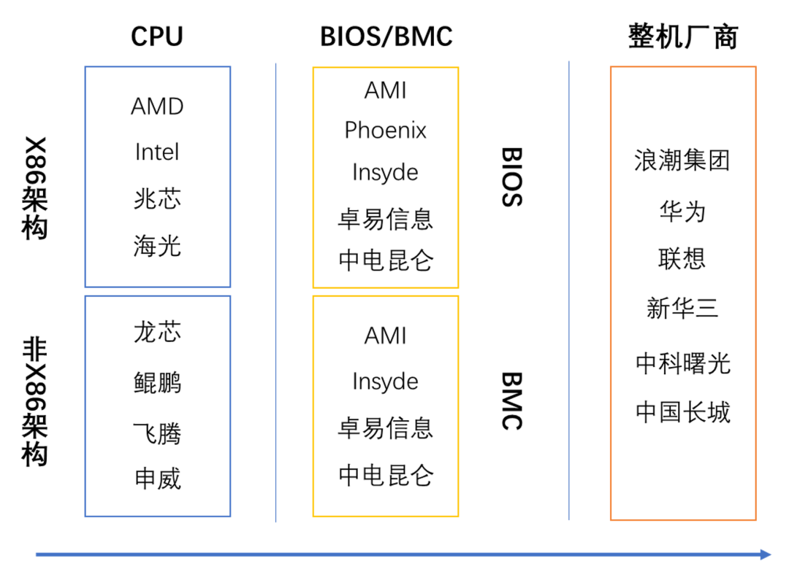​

资料来源：公开信息，兴业证券经济与金融研究院整理

**5、BIOS 市场空间？**

近年来，以PC、服务器和 IoT 设备为代表的设备出货量不断增长，为 BIOS 和 BMC 固件市场规模扩张奠定了良好的基础。根据 Gartner 的数据，2019年，全球 X86 架构的服务器、PC 出货量分别为 1249.7 万、2.61 亿台。

**图3、国内 X86 服务器出货量**

​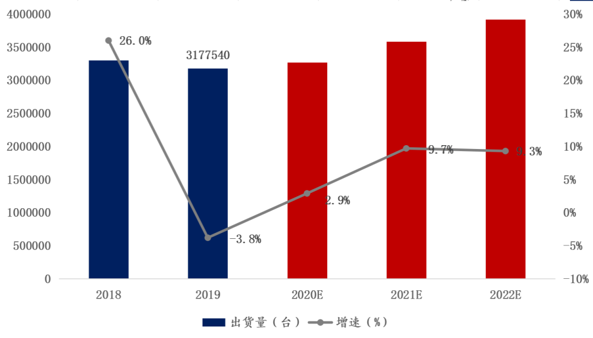​

资料来源：IDC，兴业证券经济与金融研究院整理

按照每台X86架构服务器 BIOS/BMC 固件 300元单价测算，服务器固件市场规模可达到 37 亿元；按照每台 X86 架构 PC 的 BIOS 固件 15 元单价测算，PC固件市场规模可达到 39 亿元。BIOS和BMC固件合计的市场规模在76亿元人民币左右。

此外，随着 IOT 设备快速增长，预计 2020 年全球 IOT 设备数量将达到 204 亿台，IOT 设备由于种类多、技术开发难度不同，其 BIOS 价格不同，但整体低于 PC 固件价格，考虑其百亿出货量，预计全球固件整体市场规模超过百亿元。

**图4、2014-2019E 国内 PC 出货量**

​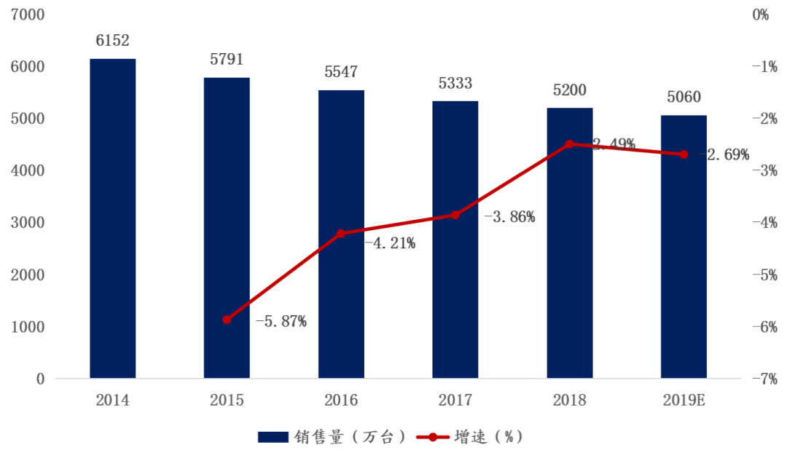​

资料来源：IDC，兴业证券经济与金融研究院整理

**三、BIOS 主要公司一览**

目前，全球主流 X86 架构 BIOS 固件产品和技术，长期垄断在美国的 AMI、 Phoenix，中国台湾 Insyde 三家公司手中，其中Phoenix起步最早，AMI当前规模最大，而Insyde为后起之秀。

大陆 X86 架构独立厂商，仅卓易信息旗下全资子公司百敖具备 BIOS、BMC 固件产品研发能力，但整体市场规模、技术实力与上述厂商仍有差距。

**6、AMI 业务画像**

**AMI（American Megatrends Inc.），BIOS 领导者**。AMI 公司 1985年成立于美国亚特兰大，创始人为 Pat Sarma 和 Subramonian Shankar。AMI 起初主要生产完整主板，服务定位于高端客户，其第一名客户为 PCs Ltd，即现在的 Dell，是世界上最先推出适用于 Intel 386 处理器主板的公司。

由于主板制造产业逐渐往中国台湾转移，AMI 则将业务聚焦于 OEM、ODM（主要为 BIOS 固件）技术。目前 AMI 在全球拥有近1500名员工，其中 85% 为工程开发相关人员。

AMI 主要产品线有 UEFI BIOS 固件与控制器（EC）、MegaRAC 远程固件管理解决方案、AMI 背板控制器产品系列、诊断实用程序和工程服务。其中，Aptio V 是 AMI 的最新一代 UEFI BIOS 固件，可满足所有平台（X86与非X86）的需求。Aptio 4则从传统 BIOS 演化而来，同样符合 UEFI 规范。在针对 UEFI 的支持服务方面，AMIDiag 目前是市场上唯一可用的硬件诊断解决方案。

**图5、AMI BIOS/UEFI 固件产品**

​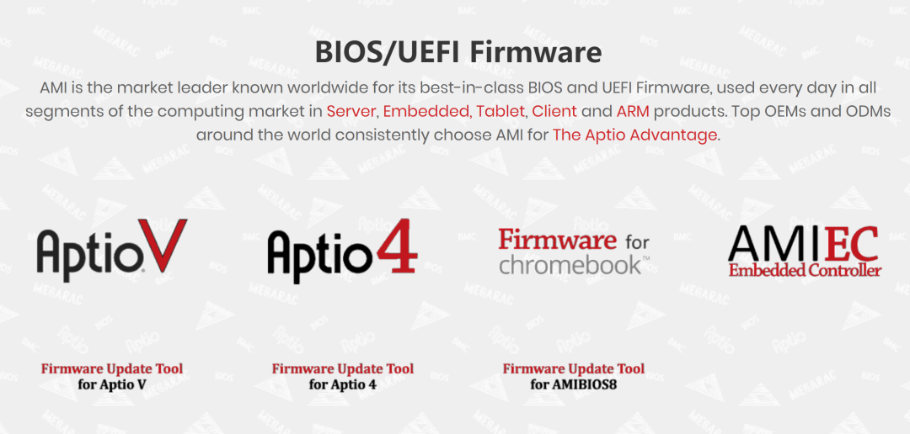​

资料来源：公司官网，兴业证券经济与金融研究院整理

**7、Phoenix 业务画像**

**Phoenix（Phoenix technologies Ltd.），BIOS 先行者。** 1979 年 9 月，Phoenix 在美国马萨诸塞州波士顿成立，总部位于加利福尼亚州帕萨迪纳。Phoenix 率先开创了净室设计（也称防火墙技术），通过逆向工程来克隆出了自有BIOS。Phoenix依托自主知识产权进入了发展的黄金期。

1988年，Phoenix 成功 IPO 上市（PTEC），并于 20世纪90年代收购 Quadtel 和 Award 两家实力 BIOS 厂商，逐渐成为当时 BIOS 产业的龙头，产品涵盖了低端到高端的各类市场。

**图6、Phoenix 1988-2009 股价表现**

​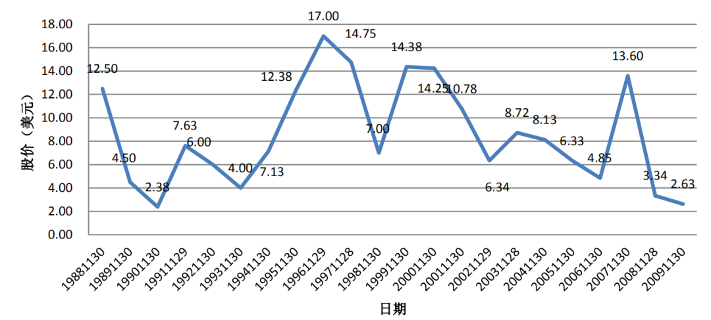​

资料来源：CRSP，兴业证券经济与金融研究院整理

21世纪初，受 PC 市场衰退的影响，BIOS 固件单价下滑，公司采取了一次性授权 BIOS 的方式，以提高公司短期收入。此外，不成熟的并购和市场探索也导致了 Phoenix 经营状况恶化，公司于2006年出现巨亏。2010 年 8 月，美国投资公司 Marlin Equity Partners 以 1.39 亿美元收购了 Phoenix 流通股，Phoenix 宣布退市，同时也逐渐剥离了非 BIOS 业务群。截至 2009 年，公司约有300名员工。

中国市场方面，2000 年，Phoenix 在南京成立了中国分公司菲尼克斯软件（中国），2009 年，由于经营问题，退出中国市场。

**图7、Phoenix 合作伙伴**

​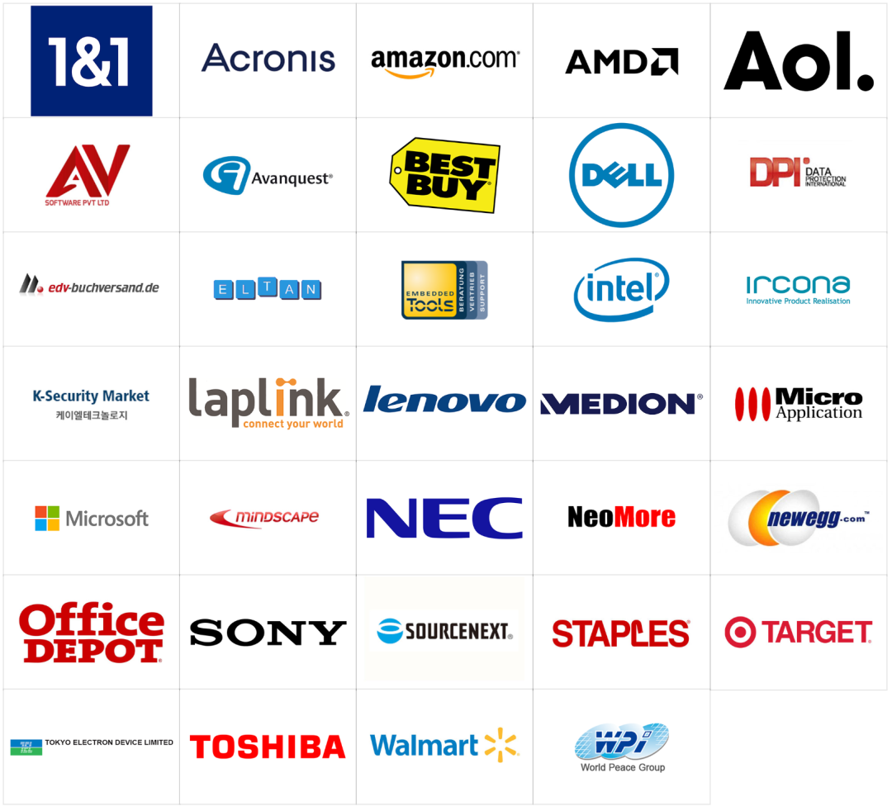​

资料来源：公司官网，兴业证券经济与金融研究院整理

**8、Insyde 业务画像**

**Insyde（系微），是BIOS 后起之秀。** 1998年，Insyde 通过收购美国系腾科技（SystemSoft）成立，并于2003年于中国台湾上市（6231.TWO）。不同于 AMI 和 Phoenix，Insyde 在切入 BIOS 领域之时就着眼于 UEFI，其业务高度集中于 BIOS/BMC 技术，覆盖Intel、AMD、微软等 大厂。受益于中国台湾 PC 市场发展和 Intel 对 UEFI BIOS 的强制推广，Insyde 快速跃居至 BIOS 市场的第二把交椅。

2018年，Insyde旗舰产品 Insyde H2O BIOS 实现营收 7.81亿新台币，占总营收比为 92%；BMC 产品 Supervyse 实现营收 0.58亿新台币，占比 7%；其他业务实现营收 0.10亿新台币，占比 1%。截止至2018年12月31日，Insyde共有员工439人，其中384人为研发技术人员，占比87.5%。

**图8、Insyde营收与净利润 单位：百万美元，****%**

​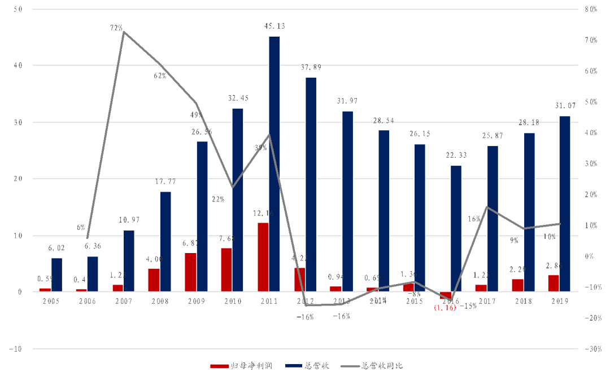​

资料来源：汤森路透，兴业证券经济与金融研究院整理

**9、Easytec（卓易信息）业务画像**

**卓易信息（688258.SH），BIOS X86 中国大陆地区独此一家。** 公司成立于 2008 年，其全资子公司百敖是全球第四家获得 Intel X86 架构授权的 BIOS/BMC 厂商，也是中国大陆地区唯一掌握X86架构、为数不多掌握ARM、MIPS架构的 BIOS/BMC 固件开发技术的厂商。

基于此种技术能力，公司可根据需求开发满足国内外各种 PC、服务器芯片需求。其商业模式为：为 CPU 厂商完成技术开发，包括解决个别固件问题或进行完整功能开发，再实现对计算机设备的批量销售。

**表2、公司BIOS、BMC的应用案例**

​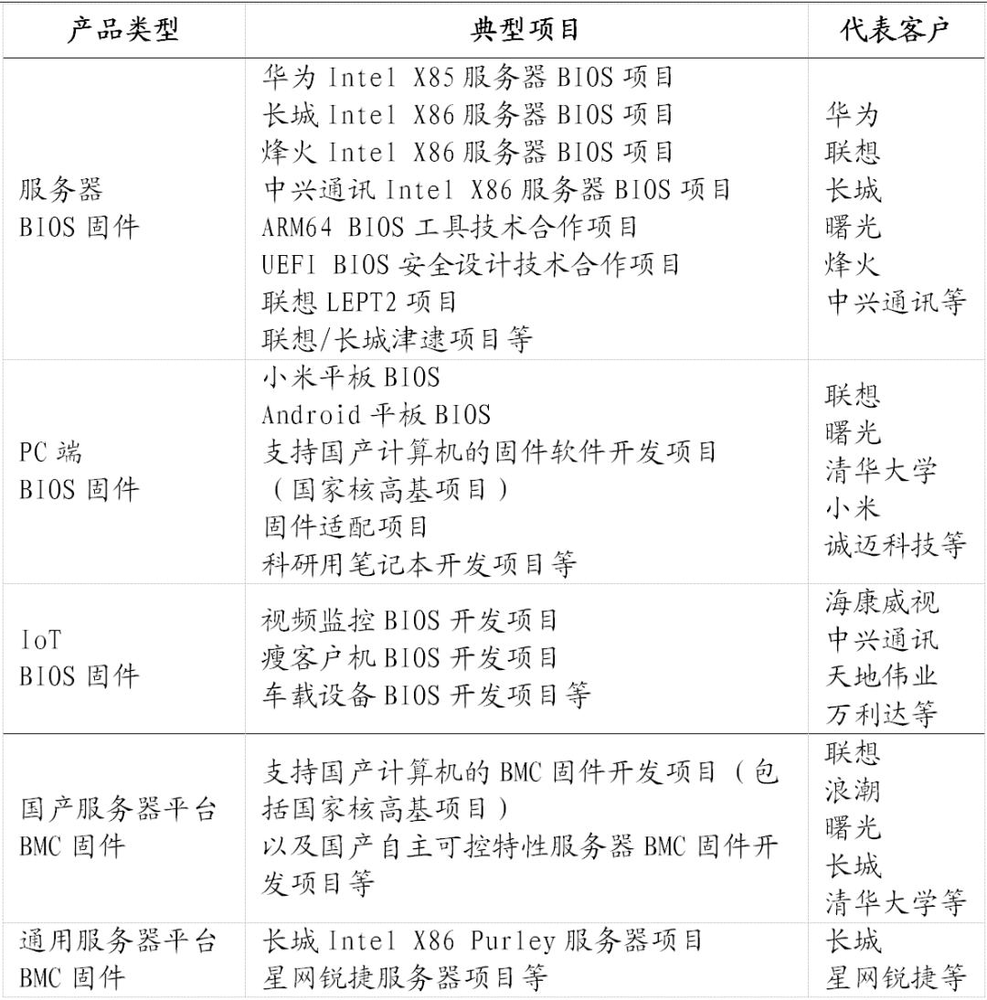​

资料来源：公司公告，兴业证券经济与金融研究院整理

**10、相关公司与风险提示**

BIOS/BMC 固件行业是计算机产业链中一个非常重要的细分行业方向，经过40余年发展，当前全球已经呈现出寡头竞争格局，主流 X86 架构BIOS授权厂商主要有4家，即AMI、Phoenix、Insyde和卓易信息。

**卓易信息目前是中国大陆地区唯一一家获Intel 官方授权的厂商，具备稀缺的赛道卡位优势。** 与此同时，信创产业（含鲲鹏生态）在2020年也将迎来全面发展阶段，卓易信息在非X86架构方面，诸如 基于MIPS/ARM/Alpha 芯片架构，也具备卓越的研发能力，有望充分享受行业红利，并迎来高速发展。

来源：架构师技术联盟

## 结语

如果您看完本文后有所收获， 还希望您随手点个`在看`​ 、或者`分享转发`​。您的支持是我坚持分享的最大动力！

​​

  往期精彩

◆  [必看 | Linux系列学习书籍免费送](http://mp.weixin.qq.com/s?__biz=MzI3NzQ4MTE4Mw%3D%3D&chksm=eb64d6d1dc135fc7c7c4173affc8fe90aad3ec52410cb867c55e662666d427559fd3c3f1795a&idx=2&mid=2247484769&scene=21&sn=4ea3eb8538551fadd2a8b6970430ce7a#wechat_redirect)！

◆  [利用expect批量修改Linux服务器密码](https://blog.csdn.net/weixin_38889300/article/details/106682771)

◆  n[ginx+Keepalived 实现高可用集群](http://mp.weixin.qq.com/s?__biz=MzI3NzQ4MTE4Mw%3D%3D&chksm=eb64d529dc135c3f9558d3b2e400387db0367f5515957d8d373decc9e6ee699306f4b5ca8353&idx=1&mid=2247485081&scene=21&sn=36f25bc47332565ce778b77bec5ec68b#wechat_redirect)

◆  [干货 | LVM快照学习](https://blog.csdn.net/weixin_38889300/article/details/106682778)

◆  [硬核 | 送你一份操作系统词典！值得收藏](https://blog.csdn.net/weixin_38889300/article/details/106233768)

◆  [抓包工具tcpdump用法说明](https://blog.csdn.net/weixin_38889300/article/details/105743448)

◆  [零成本 | 手把手教你搭建个人博客](https://blog.csdn.net/weixin_38889300/article/details/105743429)

◆  [实战 | Hadoo大数据集群搭建](http://mp.weixin.qq.com/s?__biz=MzI3NzQ4MTE4Mw%3D%3D&chksm=eb64d78edc135e98503e24685c66df4c20bde0579bd338436c2c4dba92635cc2dd224d86fe57&idx=1&mid=2247484478&scene=21&sn=be9153d011c877a1da9297ed465a9405#wechat_redirect)

◆[【深度好文】终于有人把云计算、大数据和AI讲明白了](https://blog.csdn.net/weixin_38889300/article/details/105743432)

◆  [亿级web系统负载均衡几种实现方式](https://blog.csdn.net/weixin_38889300/article/details/106682828)

◆  [一文带你读懂zookeeper在大数据生态的应用](https://blog.csdn.net/weixin_38889300/article/details/105898236)

​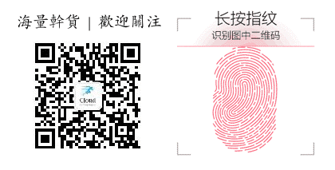​

```
好文和朋友一起看~
```
