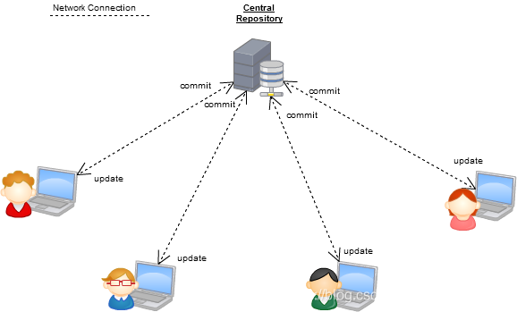
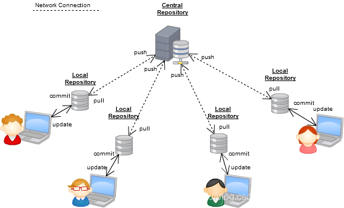

# Version Control System

版本控制系统（Version Control System，VCS）是指对软件开发过程中各种程序代码、配置文件及说明文档等文件变更的管理，是软件配置管理的核心思想之一，最主要的功能就是追踪文件的变更。

***本地版本控制系统***

第一代版本控制系统被称为**本地版本控制系统**。通过加锁将并发执行转换成顺序执行。 一次只能有一个人处理某个文件。具体流程如下：

1. 首先应该把文件放在一个服务器上，方便使用者上传或下载文件
2. 任何人想对某文件修改时，需要先把这个文件加锁，通过 `checkout`​ 指令，使得其他人无法修改
3. 当修改完成之后，需要释放锁，通过 `checkin`​ 指令，形成一个新的版本，存放到服务器端。

第一代版本控制系统主要有 RCS、SCCS

> **悲观锁**
> 每次获取数据的时候，都会担心数据被修改，所以每次获取数据的时候都会进行加锁，确保在自己使用的过程中数据不会被别人修改，使用完成后进行数据解锁。由于数据进行加锁，期间对该数据进行读写的其他线程都会进行等待。

‍

***集中式版本控制系统***

第二代版本控制系统被称为**集中式版本控制系统（Centralized Version Control Systems，CVCS）** ，其对同步修改更加宽容，但有一个明显的限制，用户必须在允许提交之前将当前修订合并到他们的工作中。

由上图可看到，在集中式版本控制系统中，如果服务器嗝屁了，那么所有的开发者就只能干瞪眼了！因为，SVN 对于项目的管理是依赖于服务器中的中心仓库的！我们的更改必须要提交到服务器中的中心仓库。

第二代版本控制系统主要有 CVS、SourceSafe、Subversion、Team Foundation Server、SVK。

> **乐观锁**
> 每次获取数据的时候，都不会担心数据被修改，所以每次获取数据的时候都不会进行加锁，但是在更新数据的时候需要判断该数据是否被别人修改过。如果数据被其他线程修改，则不进行数据更新，如果数据没有被其他线程修改，则进行数据更新。由于数据没有进行加锁，期间该数据可以被其他线程进行读写操作。
> 乐观锁一般会使用版本号机制或 CAS 算法实现。

‍

**分布式式版本控制系统**

第三代版本控制系统被称为**分布式式版本控制系统（Distributed Version Control Systems，DVCS）** ，其允许合并和提交分开。在每个使用者电脑上就有一个完整的数据仓库，没有网络依然可以使用

由上图可看到，分布式式版本控制系统也可以有个服务器端的仓库，用来同步各开发者的私有仓库！在分布式版本控制系统中，每个参与者的本地也会有一个完整的仓库。即使服务器端崩溃，我们仍然可以使用 Git（仅在本地仓库管理我们的代码），在网络具备时，再和服务器进行同步即可！

第三代版本控制系统主要有 Bazaar、Git、Mercurial、BitKeeper，、Monotone。目前，第三代版本控制系统已经大有一同江湖的趋势。

‍

## Git与SVN对比

​`SVN`​是集中式管理的版本控制器，而`Git`​是分布式管理的版本控制器，这是两者之间最核心的区别。  
​`SVN`​只有一个单一的集中管理的服务器，保存所有文件的修订版本，而协同工作的人们都通过客户端连到这台服务器，取出最新的文件或者提交更新。  
​`Git`​每一个终端都是一个仓库，客户端并不只提取最新版本的文件快照，而是把原始的代码仓库完整地镜像下来，每一次的提取操作，实际上都是一次对代码仓库的完整备份。  
相对来说分布式管理系统功能更强大一些，但同样的上手难度也就高一些，当然分布式代码版本管理系统并不一定适合所有团队，比如中小团队可能更关心的只是成本更低，简单易用，那么`SVN`​等这类集中式版本管理工具还是更为适合，但是不管团队最终选用什么代码版本管理工具，只要适合自己的团队的开发流程和工作方式，并且代码管理顺畅就可以了。

### 详细对比

|差异|SVN|Git|
| ----------| ------------------------------------------------------------------------------------------------------------------------------------------------------------------------------------------------------------| --------------------------------------------------------------------------------------------------------------------------------------------------------------------------------------------------------------------------|
|系统特点|1. 集中式版本控制系统，文档管理很方便。 2. 企业内部并行集中开发  3. `windows`​系统上开发推荐使用  4. 克隆慢 |1. 分布式系统，代码管理很方便。   2. 开源项目开发。   3. `Mac`​、`Linux`​系统上开发推荐使用。   4. 克隆快 |
|灵活性|1. 搭载`SVN`​的服务器如果出现故障，就无法与之交互。 2. 所有的`SVN`​操作都需要中央仓库交互，例如拉分支，看日志等。  |1. 可以单机操作，`Git`​服务器故障也可以在本地`Git`​仓库工作。 2. 除了push和pull或fetch操作，其他都可以在本地操作。 3. 根据自己开发任务任意在本地创建分支。 4. 日志都是在本地查看，效率较高。|
|安全性|较差，定期备份，并且是整个`SVN`​都得备份。|较高，每个开发者的本地就是一套完整版本库，记录着版本库的所有信息。|
|分支方面|1. 拉分支更像是`copy`​一个路径。 2. 可针对任何子目录进行`branch`​。 3. 拉分支的时间较慢，因为拉分支相当于`copy`​。 4. 创建完分支后，影响全部成员，每个人都会拥有这个分支。 5. 多分支并行开发较重，工作较多而且繁琐。|1. 我可以在`Git`​的任意一个提交点`commit point`​开启分支。 2. 拉分支时间较快，因为拉分支只是创建文件的指针和`HEAD`​。 3. 自己本地创建的分支不会影响其他人。 4. 比较适合多分支并行开发。 5. `Git checkout hash`​切回之前的版本，无需版本回退。 6. 强大的`cherry-pick`​。|
|工作流程|1. 每次更改文件之前都得`update`​操作，有的时候修改过程中这个文件有更新，`commit`​不会成功。 2. 有冲突，会打断提交动作，冲突解决是一个提交速度的竞赛：手快者，先提交，平安无事；手慢者，后提交，可能遇到麻烦的冲突解决。|1. 开始工作前进行`fetch`​操作，完成开发工作后`push`​操作，有冲突解决冲突。 2. `Git`​的提交过程不会被打断，有冲突会标记冲突文件。 3. `Gitflow`​经典流程。 |
|内容管理|​`SVN`​对中文支持好，操作简单。|对程序的源代码管理方便，代码库占用的空间少，易于分支化管理。|
|学习成本|使用起来更方便，`SVN`​对中文支持好，操作简单。|更在乎效率而不是易用性，成本较高，有很多独有的命令如`rebase`​、远程仓库交互的命令等等。|
|权限管理|​`SVN`​的权限管理相当严格，可以按组、个人针对某个子目录的权限控制，每个目录下都会有个`.SVN`​的隐藏文件。|​`Git`​没有严格的权限管理控制，只有账号角色划分。|
|管理平台|有功能非常完善的插件。|除功能插件外，还有`Gitlab`​、`Gerrit`​、`Github`​等。|

‍

‍
