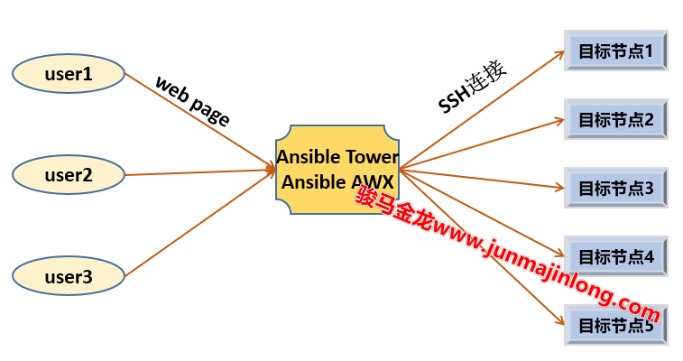

# Ansible tower

## 1. 使用Ansible之痛

Ansible是Agentless的，除了在控制端装一下Ansible之外，几乎不需要对目标节点做任何操作，而且因为Ansible默认基于SSH连接，执行任务时会将任务指令发送给目标节点执行。这样的运行模式固然带来了极大的方便，但是也带来了问题。

当只有一个人使用Ansible管理所有目标节点时，问题不大，但如果多人同时使用Ansible管理所有目标节点，问题就会变得复杂：

* (1).所有人都要配置和所有的目标主机的SSH主机互信
* (2).所有人都要有相同的inventory包括其中的变量
* (3).甚至所有人都要共享playbook，比如要有相同的Role，相同的变量文件
* (4).不知道某个自动化操作是谁执行的，也不知道什么时候执行以及确切的执行了哪些任务
* (5)…….

所以，对单个人来说，Ansible足够方便，但是对于多人来说，它的方便之处正好成为了它的不方便之处，需要各用户进行协调。

​​

对于这种服务分散并要求协调的现象，一般的解决方案就是提供一个中间人作为代理(比如数据中心、服务注册)，在这个中间层聚集所有信息。

## 2. Ansible Tower简介

Ansible  Tower或Ansible  AWX就是Ansible到各目标节点的中间人，它们提供网页图形界面的方式来完成原本由Ansible命令行完成的工作。其中，Ansible  AWX是Ansible Tower的开源社区版，是Tower的上游版本，Ansible  Tower则是RedHat提供的商业版，其也提供所管理目标节点数量受限(50个节点)的免费版本。

AWX/Tower扮演的角色如图：

​​

现在，Ansible相关的SSH认证信息、任务文件、变量文件等等内容全部都集中到了AWX/Tower中间层，所有管理员全部登录到该中间层来统一管理目标节点。而且由于所有人使用的都是中间层的内容，这消除了各个管理员之间的差异性。

除此之外，AWX/Tower还具有其它功能，比如：

* (1).所有Ansible命令行能实现的，Tower都能实现
* (2).提供了基于角色的访问控制(RBAC)，即身份认证和权限管理功能，这是必要的，不能不加区分地让所有人都能做所有操作
* (3).记录所有执行结果
* (4).消息通知
* (5).定时任务
* ……

本文将介绍Tower，AWX操作大多类似。

## 3. 安装Tower

Ansible Tower由多个组件组成(tower自身、postgres、rabbitmq、memcached等等)，各组件可以运行在多个节点或容器中。对于简单的环境来说，可以将它们全部集中在一个节点中，即使用Tower all-in-on的部署方式。

本文采用all-in-one的方式在一台主机上部署Tower 3.6.3所需所有组件。

### 3.1 安装环境配置

安装Tower 3.6.3版本要求：

* CentOS 7.4+（对于CentOS 7，低于7.4版本无法安装）
* 至少4G内存(2G会报错)
* 64位系统
* 不同Tower版本要求不同，请务必参考[https://docs.ansible.com/ansible-tower/latest/html/installandreference/install_notes_reqs.html](https://docs.ansible.com/ansible-tower/latest/html/installandreference/install_notes_reqs.html)

在开始体验之前，先将防火墙、Selinux关闭。

```bash
systemctl stop firewalld
systemctl stop iptables
iptables -F ; iptables -Z ; iptables -X

setforce 0
sed -ri 's/^(SELINUX)=/\1=disabled/' /etc/sysconfig/selinux

```

此外，还要求提供os、extras、epel三个yum源以及Python 3。如下是我的yum源配置：

```bash
$ yum repolist -v | grep -iE 'repo-(id|baseurl)'
Repo-id      : base/7/x86_64
Repo-baseurl : https://mirrors.huaweicloud.com/centos/7/os/x86_64/

Repo-id      : epel/x86_64
Repo-baseurl : https://mirrors.huaweicloud.com/epel/7Server/x86_64/

Repo-id      : extras/7/x86_64
Repo-baseurl : https://mirrors.huaweicloud.com/centos/7/extras/x86_64/

Repo-id      : updates/7/x86_64
Repo-baseurl : https://mirrors.huaweicloud.com/centos/7/updates/x86_64/
```

安装python3：

```bash
yum -y install python36
```

### 3.2 安装Tower

如果是虚拟机做实验，建议做好快照。

下载Ansible Tower 3.6.3并解压：

```bash
mkdir tower ; cd tower

# 这里下载目前最新版本的tower，即3.6.3版
# 在https://releases.ansible.com/ansible-tower/setup-bundle/列出了所有版本
wget https://releases.ansible.com/ansible-tower/setup-bundle/ansible-tower-setup-bundle-latest.el7.tar.gz

tar xf ansible-tower-setup-bundle-latest.el7.tar.gz
cd ansible-tower-setup-bundle-3.6.3-1
```

在此目录中有如下文件：

```bash
$ ls -1F
backup.yml
bundle/
group_vars/
install.yml
inventory
licenses/
README.md
rekey.yml
restore.yml
roles/
setup.log
setup.sh*
```

其中setup.sh中包含了环境检测、安装tower的逻辑，在其中通过ansible-playbook执行了install.yml，install.yml中包含了安装tower的所有任务，且默认使用该目录下的inventory文件。如下是摘自setup.sh中的部分内容：

```bash
INVENTORY_FILE="inventory"
OPTIONS=""
PLAYBOOK="install.yml"
...
ansible-playbook -i "${INVENTORY_FILE}" -v $OPTIONS $PLAYBOOK 2>&1
```

inventory文件的原始内容：

```bash
$ grep -Ev '^#|^$' inventory 
[tower]          #<==安装tower的节点
localhost ansible_connection=local
[database]       #<==安装postgres的节点
[all:vars]
admin_password=''
pg_host=''
pg_port=''
pg_database='awx'
pg_username='awx'
pg_password=''
pg_sslmode='prefer'  # set to 'verify-full' for client-side enforced SSL
rabbitmq_username=tower
rabbitmq_password=''
rabbitmq_cookie=cookiemonster
```

这里有三项必须配置项：

```bash
admin_password=''      # 登录tower web界面的密码，即管理tower的密码
pg_password=''         # postgres数据库的密码
rabbitmq_password=''   # rabbitmq的密码
```

在此，我将这些密码全部设置为`123456`​。

然后执行setup.sh脚本，便会自动开始在本机上进行安装所有组件：

```bash
$ ./setup.sh

# 安装完成将显示如下信息
The setup process completed successfully.
Setup log saved to /var/log/tower/setup-2020-04-06-12:59:43.log
```

安装完成后，可以使用`tower-manage`​命令修改默认用户admin的登录密码(登录tower网页所需的密码)：

```bash
$ tower-manage changepassword admin
```

### 3.3 登录tower

Tower安装完成后，将自动启动nginx并监听在80和443端口上。所以，可打开浏览器登录Tower，如`https://192.168.200.73`​。

登录之后会要求提供License文件，可以点击进去申请免费的试用License(申请后可能需要等待一段不短的时间)，免费试用版支持最多管理50个节点。

​​

## 4.让Ansible Tower执行playbook

Ansible Tower是管理员和被管理目标节点的中间层，它集中了Ansible相关的资源。

在使用Ansible命令行来管理一个新的目标节点时，一般流程如下：

* (1).配置Ansible端和目标节点的SSH主机互信，即将Ansible端的SSH公钥分发到目标节点
* (2).将该目标节点添加到inventory中的某个地方
* (3).编写playbook或者获取已有playbook
* (4).使用ansible-playbook命令指定inventory并执行指定的playbook文件

使用Ansible Tower后，管理员操作的是Ansible Tower主机，所以需要配置Tower节点和目标节点的SSH主机互信，且在Tower中设置inventory，并添加主机。然后指定要执行的playbook，最后将它们全部整合在一起，执行。

这里需要先明确几个Tower中的核心概念：

* Credential：配置Tower节点和其它主机的通信凭据，包括基于SSH密钥的连接、从git上获取内容、提供Vault密码等
* Inventory：和命令行中的inventory概念一样
* Project：对应一个项目，一个项目中可能包含一个完整的功能，只不过项目可能简单到只有一个playbook文件，也可能复杂到包含很多的Role
* Template：将Credential、Inventory、Project整合起来，等价于一个ansible-playbook命令，鼠标点击Template便可使其运行，且因为Template已保存，所以可重复点击执行任务
* Job：每次运行Template中涉及的过程称为一个Job
