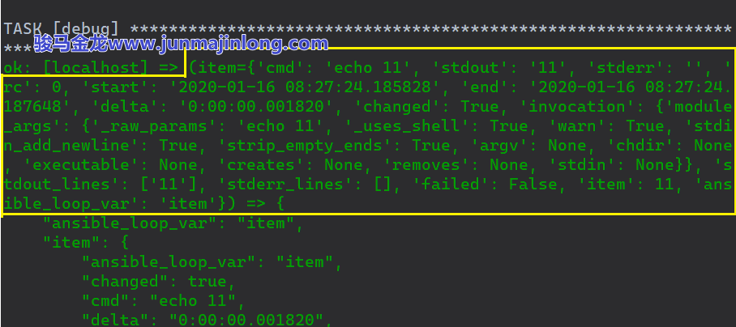

# 7. 循环迭代的进阶

　　在前面的文章中曾多次涉及到循环迭代操作，且都使用loop指令来完成。这个指令是Ansible2.5加入的，在此版本之前，Ansible的循环迭代均使用 with\_xxx 来完成，比如with\_list、 with\_dict等 等，其中loop 指令和with\_list指令是等价的。

　　with\_xxx 语法的循环迭代都使用对应的lookup插件来实现（比如with\_list 使用的是lookup的list插件），如果存在某lookup插件xxx，就可以使用with\_xxx 来迭代。而且lookup插件的功能不可能从Ansible中移除，所以尽管官方推荐使用loop指令，但with\_xxx 语法将来也仍然有效，应该不会被移除。

　　相对来说，`with_xxx`​语法要更直观、更简洁他更简单一些，而loop语法在结合了一些Filter函数后，也能实现绝大多数的`with_xxx`​功能。

　　至于使用loop还是`with_xxx`​循环语法，可随意。本文会以`with_xxx`​语法来介绍一部分循环迭代的用法(因为lookup插件太多了，介绍常见的足以)，然后给出它们等价的loop语法。

### 7.1 with\_list

　　最简单的循环就是迭代一个列表。

　　例如，在Ansible本地端的/tmp目录下创建两个文件：

```bash
---
- hosts: localhost
  gather_facts: false
  tasks: 
    - file:
        name: "/tmp/{{item}}"
        state: touch
      with_list: 
        - "filename1"
        - "filename2"

```

　　与上面`with_list`​等价的loop语法：

```bash
- file:
    name: "/tmp/{{item}}"
    state: touch
  loop: 
    - "filename1"
    - "filename2"

```

### 7.2 with\_items和with\_flattened

　　​`with_list`​用于迭代简单列表，有时候列表中会嵌套列表。

　　例如：

```bash
a: [b, c, [d, e], f]

aa:
  - bb
  - cc  
  - 
     - dd
     - ee
  - ff

```

　　如果想要迭代这种嵌套列表结构，使用`with_items`​。注意，它也可以迭代普通非嵌套列表，所以它可以完全替代`with_list`​。

　　以`a: [b,c,[d,e],f]`​为例，`with_items`​迭代该结构后，会先将第一层的嵌套列表压平(flatten)，得到`[b,c,d,e,f]`​，然后再迭代该列表。

　　例如：

```bash
---
- hosts: localhost
  gather_facts: false
  vars: 
    a: [b, c, [d, e], f]
  tasks: 
    - debug: 
        var: item
      with_items: "{{a}}"

```

　　注意，`with_items`​只压平嵌套列表的第一层，不会递归压平第二层、第三层…

　　例如：

```bash
[b, c, [d, e], f, [g, h, [i, j], k]]
# with_items压平后得到：
[b, c, d, e, f, g, h, [i, j], k]

```

　　与`with_items`​等价的loop指令的写法为：

```bash
loop: "{{ nested_list | flatten(levels=1) }}"

```

　　由上面的写法可推测，筛选器函数`flatten()`​默认会递归压平所有嵌套列表，如果只是压平第一层，需指定参数`levels=1`​。

　　此外，还存在lookup插件：items、flattened，前者只压第一层，后者递归压平所有嵌套层次。例如：

```bash
---
- hosts: localhost
  gather_facts: false
  vars: 
    a: [b, c, [d, e], f, [g,h,[i,j], k]]
  tasks: 
    - debug: 
        var: item
      with_flattened: "{{a}}"

```

### 7.3 with\_indexed\_items

　　如果迭代列表时，还想要获取每个元素的索引位，则可以使用`with_indexed_items`​。

　　它使用的`indexed_items`​插件会修改原列表，为每个元素加上数值索引。看示例便知：

```bash
---
- hosts: localhost
  gather_facts: false
  vars: 
    a: [b, [c, d], e]
  tasks: 
    - debug:
        var: lookup('indexed_items', a)

```

　　执行，得到的输出结果为：

```bash
[
  [ 0, "b" ],
  [ 1, [ "c", "d" ] ],
  [ 2, "e" ]
]

```

　　很明显，第一个元素”b”的索引为0，第三个元素”e”的索引为2。

　　那么使用`with_indexed_items`​迭代的时候，就可以通过`item.0`​来获取每个元素所在的索引位，`item.1`​来获取每个元素的值。

　　但是一定要注意，`with_indexed_items`​和`indexed_items`​ lookup插件的效果并不同，`with_indexed_items`​会先压平(只压一个层次)嵌套列表，然后为压平后的列表加上索引值。

　　例如：

```bash
---
- hosts: localhost
  gather_facts: false
  vars: 
    a: [b, [c, d], e]
  tasks: 
    - debug:
        msg: "index: {{item.0}}, value: {{item.1}}"
      with_indexed_items: "{{a}}"

```

　　执行结果：

```bash
ok: [localhost] => (item=[0, 'b']) => {
    "msg": "index: 0, value: b"
}
ok: [localhost] => (item=[1, 'c']) => {
    "msg": "index: 1, value: c"
}
ok: [localhost] => (item=[2, 'd']) => {
    "msg": "index: 2, value: d"
}
ok: [localhost] => (item=[3, 'e']) => {
    "msg": "index: 3, value: e"
}

```

　　与`with_indexed_items`​等价的loop写法为：

```bash
debug:
  msg: "{{ index }} - {{ item }}"
loop: "{{ items|flatten(levels=1) }}"
loop_control:
  index_var: index

```

　　先压平再指定索引变量名为index。`loop_control`​用于控制循环时的一些行为，后文会详细解释其用法。

### 7.4 with\_dict

　　​`with_dict`​用于迭代一个字典结构，迭代时可以使用`item.key`​表示每个字典元素的key，`item.value`​表示每个字典元素的value。

　　例如：

```bash
---
# test.yml
- hosts: localhost
  gather_facts: false
  vars: 
    users:
      junmajinlong_key:
        name: junmajinlong
        age: 18
      fairy_key:
        name: fairy
        age: 22
  tasks:
    - debug:
        msg: "who: {{item.key}} && 
              name: {{item.value.name}} && 
              age: {{item.value.age}}"
      with_dict: "{{users}}"

```

　　执行该playbook，输出结果的一部分如下所示：

```bash
$ ansible-playbook test.yml
TASK [debug] ********************
{
  "msg": "who: junmajinlong_key && name: junmajinlong && age: 18"
}
{
  "msg": "who: fairy_key && name: fairy && age: 22"
}

```

　　与`with_dict`​等价的loop指令有两种写法：

```bash
loop: "{{lookup('dict', users)}}"
loop: "{{users | dict2items}}"

```

　　这两种写法应该都不难理解，它们的效果是完全一样的，所以只解释第一种写法。

　　​`with_dict`​内部使用的是lookup的dict插件，该插件的作用是将一个dict转换成一个包含了`key`​和`value`​的列表结构(请看官方手册对dict插件的语法介绍[https://docs.ansible.com/ansible/latest/plugins/lookup/dict.html](https://docs.ansible.com/ansible/latest/plugins/lookup/dict.html))。

　　例如，对于之前的users字典来说，经过`lookup('dict',users)`​或`users|dict2items`​操作之后，可以得到：

```bash
users:
  - key: junmajinlong_key
    value: 
      name: "junmajinlong"
      age: 18

  - key: fairy_key
    value: 
      name: "fairy",
      age: 22

```

　　正是因为转换后得到的列表的每个元素都包含了`key`​和`value`​这两个特殊的字典key，才使得迭代时可以使用`item.key`​和`item.value`​。

　　另外，在Ansible 2.8中可以自定义`dict2items`​筛选器函数得到的key和value的名称。例如：

```bash
loop: "{{users | dict2items(key_name='k',value_name='v')}}"

```

　　它将得到如下列表结构：

```bash
users:
  - k: junmajinlong_key
    v: 
      name: "junmajinlong"
      age: 18

  - k: fairy_key
    v: 
      name: "fairy",
      age: 22

```

　　所以，引用的时候使用`item.k`​和`item.v`​即可。

### 7.5 with\_together

　　​`with_together`​用于结合两个(或多个)列表并迭代，它使用`together`​ lookup插件。如果各位熟悉一门动态编程语言(比如Python)，则很容易理解，together插件的功能就是`zip()`​函数的功能。不了解也没关系，一句话就能解释清楚。

　　假设有两个列表`['a', 'b']`​和`['aa', 'bb']`​，执行：

```bash
lookup('together', ['a','b'], ['aa','bb'] )

```

　　将得到一个新的列表`[['a', 'aa'], ['b', 'bb']]`​。

　　它的作用已经很明确了，就是两个列表之间的元素根据索引位一一对应并组合起来。

　　如果两个列表长度不同呢？比如：

```bash
lookup('together', ["a", "b", "c"], ["aa", "bb"]
```

　　将得到`[["a", "aa"], ["b", "bb"], ["c", null]]`​。

　　再来理解`with_together`​的用法就很容易了。迭代变量`item`​表示每个子列表，`item.0`​表示每个子列表的第一个元素，`item.1`​表示每个子列表的第二个元素，`item.N`​表示每个子列表的第N+1个元素。

　　例如：

```bash
---
- hosts: localhost
  gather_facts: false
  tasks: 
    - debug:
        msg: "{{item.0}}, {{item.1}}, {{item.2}}"
      with_together: 
        - [a, b, c]
        - [aa, bb]
        - [aaa, bbb, ccc]

```

　　得到的结果：

```bash
ok: [localhost] => (item=['a', 'aa', 'aaa']) => {
    "msg": "a, aa, aaa"
}
ok: [localhost] => (item=['b', 'bb', 'bbb']) => {
    "msg": "b, bb, bbb"
}
ok: [localhost] => (item=['c', None, 'ccc']) => {
    "msg": "c, , ccc"
}

```

　　与`with_together`​等价的loop写法为：

```bash
# 以最长的列表为基准，短列表缺少的元素默认以None填充
# 输出"a, aa, aaa", "b, bb, bbb", "c, , ccc"
- debug:
    msg: "{{item.0}}, {{item.1}}, {{item.2}}"
  loop: "{{ ['a','b','c'] | zip_longest(['aa','bb'],['aaa','bbb','ccc']) | list }}"

# 以最长的列表为基准，短列表缺少的元素以指定的值填充
# 输出"a, aa, aaa", "b, bb, bbb", "c, X, ccc"
- debug:
    msg: "{{item.0}}, {{item.1}}, {{item.2}}"
  loop: "{{ ['a','b','c'] | zip_longest(['aa','bb'],['aaa','bbb','ccc'],fillvalue='X') | list }}"

# 以最短的列表为基准，长列表多出的元素直接切断
# 输出"a, aa, aaa", "b, bb, bbb"
- debug:
    msg: "{{item.0}}, {{item.1}}, {{item.2}}"
  loop: "{{ ['a','b','c'] | zip(['aa','bb'],['aaa','bbb','ccc']) | list }}"

```

### 7.6 with\_sequence

　　Shell命令行下有一个很好用的命令`seq`​，可用于生成连续数。

　　Ansible的lookup插件`sequence`​也可以用来生成连续数(Jinja2的range也可以生成连续数，稍后便会介绍)。其中：

* (1).start参数指定序列的起始数，不指定该参数时默认从1开始
* (2).end参数指定序列的终止数
* (3).stride参数指定序列的步进值。不指定该参数时，步进为1(官方手册指明start大于end时，步进默认-1，但我测试时报错)
* (4).format参数指定序列的输出格式，遵循printf风格。看下面示例便知用法
* (5).count参数指定生成序列数的个数，不能和end参数共存

　　此外，`sequence`​插件的各个参数可以简写为如下格式：

```bash
[start-]end[/stride][:format]

```

　　例如，下面是等价的写法

```bash
q('sequence', 'start=2 end=9 stride=2 format=a%02d')
q('sequence', '2-9/2:a%02d')

```

　　它们都将得到`[ "a02", "a04", "a06", "a08" ]`​。

　　而`q('sequence', '3:a%02d')`​将得到`["a01", "a02", "a03"]`​。

　　再来看`with_sequence`​。例如：

```bash
---
- hosts: localhost
  gather_facts: false
  tasks: 
    - debug:
        msg: "_{{item}}_"
      with_sequence: start=0 end=3 format=a%02d

```

　　执行结果：

```bash
ok: [localhost] => (item=a00) => {
    "msg": "_a00_"
}
ok: [localhost] => (item=a01) => {
    "msg": "_a01_"
}
ok: [localhost] => (item=a02) => {
    "msg": "_a02_"
}
ok: [localhost] => (item=a03) => {
    "msg": "_a03_"
}

```

　　需要注意的是，因为生成的每个序列数都会经过字符串格式化，所以得到的每个序列元素都是字符串。如果想要转换成数值，需使用Jinja2的Filter。例如：

```bash
---
- hosts: localhost
  gather_facts: false
  tasks: 
    - debug:
        msg: "{{1 + item|int}}"
      with_sequence: start=0 end=3

```

　　与`with_sequence`​等价的loop写法为：

```bash
- debug:
    msg: "{{ 'a%02d' | format(item) }}"
  loop: "{{ range(0, 4 + 1, 2)|list }}"

```

　　Jinja2的`range()`​也可以生成序列数。语法：

```bash
range(start,end,step)

```

　　注意range()不包含结尾数end。例如：

```bash
range(0,3)  ->  0 1 2
range(0,10,2)  ->  0 2 4 6 8

```

### 7.7 with\_subelements

　　​`with_subelements`​用于迭代遍历子元素(特指一个列表类型的子元素)，它使用lookup的`subelements`​插件。

　　何为子元素？正常情况下迭代一个列表时，这个列表的模样可能是这样的：

```bash
logfiles:
  - /tmp/a.log
  - /tmp/b.log

student: 
  - name: junmajinlong
    age: 18
  - name: xiaowoniu
    age: 22

```

　　但如果上面字典的key(即logfiles和student)自身在列表内，那么它所在的字典就是外层列表中的一个元素，即子元素。例如：

```bash
files: 
  - configfiles:
      - /tmp/a.conf
      - /tmp/b.conf
  - logfiles:
      - /tmp/a.log
      - /tmp/b.log

persons:
  - student:
      - name: junmajinlong
        age: 18
      - name: xiaowoniu
        age: 22
  - teacher:
      - name: mayun
        age: 55
      - name: mahuateng
        age: 44

```

　　想要迭代这样的数据结构内层的一个子元素列表，其实并不那么方便。比如想要迭代files中的logfiles列表，可以写成如下方式：

```bash
loop: "{{files[1].logfiles}}"

```

　　上面将索引号硬编码了，是一种不友好不灵活的方式。另一方面，如果每个列表元素内还有相同的子元素名称，且想要迭代所有这些子元素，就更麻烦了。比如下面的结构：

```bash
vars:
  families:
    - father: Bob
      children:
        - name: Mike
          age: 4
        - name: Kate
          age: 7
    - father: Alex
      children:
        - name: Pete
          age: 12
        - name: Sara
          age: 17

```

　　想要迭代所有的children子列表项，直接迭代的方式会非常麻烦。

　　好在，Ansible已经提供了一个称为`subelements`​的lookup插件，它可以查询到指定名称的子元素，并重写列表，方便之后的迭代操作。

　　看一个示例：

```bash
---
- hosts: localhost
  gather_facts: false
  vars:
    families:
      - father: Bob
        mother: Lisa
        children:
          - name: Mike
            age: 4
          - name: Kate
            age: 7
      - father: Alex
        mother: Alice
        children:
          - name: Pete
            age: 12
          - name: Sara
            age: 17
  tasks: 
    - debug:
        var: lookup('subelements', families ,'children')

```

　　上面lookup的第三个参数`children`​表示的是要从families列表中查询的子元素，subelements插件会重写列表。至于如何重写，看下面的执行结果就知道了：

```bash
ok: [localhost] => {
  "lookup('subelements', families ,'children')": [
    [
      {"father": "Bob","mother": "Lisa"},
      {"age": 4,"name": "Mike"}
    ],
    [
      {"father": "Bob","mother": "Lisa"},
      {"age": 7,"name": "Kate"}
    ],
    [
      {"father": "Alex","mother": "Alice"},
      {"age": 12,"name": "Pete"}
    ],
    [
      {"father": "Alex","mother": "Alice"},
      {"age": 17,"name": "Sara"}
    ]
  ]
}

```

　　所以，`with_subelements`​迭代子元素的时候，可以通过`item.0.father`​和`item.0.mother`​访问原列表中的项，使用`item.1.age`​和`item.1.name`​访问子列表中的项。

　　例如：

```bash
---
- hosts: localhost
  gather_facts: false
  vars:
    families:
      - father: Bob
        mother: Lisa
        children:
          - name: Mike
            age: 4
          - name: Kate
            age: 7
      - father: Alex
        mother: Alice
        children:
          - name: Pete
            age: 12
          - name: Sara
            age: 17
  tasks: 
    - debug: 
        msg: "father: {{item.0.father}}, 
              mother: {{item.0.mother}}, 
              name: {{item.1.name}}, 
              age: {{item.1.age}}"
      with_subelements: 
        - "{{families}}"
        - children

```

　　与`with_subelements`​等价的`loop`​写法为：

```bash
- debug:
    msg: "father: {{item.0.father}}, 
          mother: {{item.0.mother}}, 
          name: {{item.1.name}}, 
          age: {{item.1.age}}"
  loop: "{{families | subelements('children')}}"

```

### 7.8 with\_nested

　　​`with_nested`​可以按照结合律的方式迭代两个或多个列表。

　　先看lookup `nested`​插件的效果。例如，两个列表`['a','b']`​和`[1,2,3]`​通过`nested`​操作一番：

```bash
---
- hosts: localhost
  gather_facts: false
  tasks: 
    - debug:
        msg: "{{lookup('nested',['a','b'],[1,2,3])}}"

```

　　将得到：

```bash
ok: [localhost] => {
    "msg": [
        ["a", 1],
        ["a", 2],
        ["a", 3],
        ["b", 1],
        ["b", 2],
        ["b", 3]
    ]
}

```

　　所以，在`with_nested`​迭代的时候，可以使用`item.0`​来访问第一个列表的元素，`item.1`​访问第二个列表的元素，`item.N`​访问第N+1个列表的元素。

　　示例：

```bash
---
- hosts: localhost
  gather_facts: false
  tasks: 
    - debug:
        msg: "list1: {{item.0}}, list2: {{item.1}}"
      with_nested:
        - ['a','b']
        - [1,2,3]

```

　　执行结果：

```bash
ok: [localhost] => (item=['a', 1]) => {
    "msg": "list1: a, list2: 1"
}
ok: [localhost] => (item=['a', 2]) => {
    "msg": "list1: a, list2: 2"
}
ok: [localhost] => (item=['a', 3]) => {
    "msg": "list1: a, list2: 3"
}
ok: [localhost] => (item=['b', 1]) => {
    "msg": "list1: b, list2: 1"
}
ok: [localhost] => (item=['b', 2]) => {
    "msg": "list1: b, list2: 2"
}
ok: [localhost] => (item=['b', 3]) => {
    "msg": "list1: b, list2: 3"
}

```

　　与`with_nested`​等价的loop写法是：

```bash
- debug:
    msg: "list1: {{item.0}}, list2: {{item.1}}"
  loop: "{{ ['a','b'] | product( [1,2,3] ) | list}}"

```

　　product()筛选器可以将多个列表进行排列组合，组合效果和`nested`​插件的效果是一样的。

### 7.9 with\_random\_choice

　　从列表中随机选取一个元素。

　　用法直接看示例：

```bash
---
- hosts: localhost
  gather_facts: false
  vars: 
    my_list: ["a","b","c","d"]
  tasks: 
    - debug:
        msg: "{{ item }}"
      with_random_choice: "{{ my_list }}"

    - debug:
        msg: "{{ my_list|random }}"

```

　　这个功能只需random()筛选器即可，无需loop指令。

### 7.10 with\_fileglob

　　lookup插件`fileglob`​可以使用通配符来通配文件名，所以`with_fileglob`​用于迭代通配到的每个文件名。

　　例如：

```bash
---
- hosts: localhost
  gather_facts: no
  tasks: 
    - copy: 
        src: "{{item}}" 
        dest: /tmp/
      with_fileglob:
        - /etc/m*.conf
        - /etc/*.cnf

```

　　执行结果：

```bash
TASK [copy] ********************************
changed: [localhost] => (item=/etc/man_db.conf)
changed: [localhost] => (item=/etc/mke2fs.conf)
changed: [localhost] => (item=/etc/my.cnf)

```

　　因为并非直接迭代数据结构，所以`with_fileglob`​没有对应的loop写法。

### 7.11 with\_lines

　　lookup插件`lines`​用于从命令的执行结果中读取每一行，所以`with_lines`​用于迭代命令输出结果的每一行。

　　这功能也是非常实用的，比如find找出一堆文件，然后进行操作(比如copy)。

　　例如：

```bash
---
- hosts: localhost
  gather_facts: no
  tasks: 
    - copy: 
        src: "{{item}}" 
        dest: /tmp/shell_script/
      with_lines:
        - find ~ -maxdepth 1 -type f -name "a*.sh"

```

　　因为并非直接迭代数据结构，所以`with_lines`​没有对应的loop写法。

　　关于`with_xxx`​循环迭代的内容就介绍这么多，解释的已经足够多了，各位只需记住一点：只要有某个名为xxx的lookup插件，就可以编写对应的`with_xxx`​来迭代。

### 7.12 循环和when

　　当`with_xxx`​或`loop`​指令和when指令一起使用时，when将在循环的内部进行条件判断。也就是说，`when`​决定每轮迭代时是否执行一个任务，而不是决定整个循环是否进行。

　　例如下面的示例中，将输出3和4两个元素。

```bash
---
- hosts: localhost
  gather_facts: false
  tasks:
    - debug:
        var: item
      loop: [1,2,3,4]
      when: item >= 3

```

　　那要如何对整个循环进行判断：满足条件时才执行循环，否则不循环。

　　没有好办法，Ansible只支持when条件判断指令。所以，只能间接地完成目标，比如将when的条件人为设置为每轮循环都布尔false，这样每轮循环都跳过，相当于没执行循环。例如：

```bash
---
- hosts: localhost
  gather_facts: false
  tasks:
    - debug:
        var: item
      loop: [1,2,3,4]
      when: false

```

　　或者也可以使用一层block指令包围loop所在的任务，然后将when放在block层次，这样在层次上更为直观、可读一些，但功能和上面所说的是完全一致的，因为block级别的when指令会拷贝到所有子任务中。

　　例如，上面的playbook完全等价于：

```bash
---
- hosts: localhost
  gather_facts: false
  tasks:
    - block:
        - debug:
            var: item
          loop: [1,2,3,4]
      when: false

```

　　另外一种需求是判断某个需要迭代的变量(比如列表变量、字典变量)是否已定义，如果定义了则正常迭代，否则跳过整个循环。

```bash
---
- hosts: localhost
  gather_facts: false
  vars: 
    mylist: [1,2,3,4]
  tasks:
    - debug:
        var: item
      loop: "{{ mylist | default( [] ) }}"
      when: item >= 2

```

　　上面使用了`default()`​筛选器函数，它的作用是，如果筛选器符号(那根竖线)左边的变量未定义，则以该筛选器的参数作为默认值。本例是以空列表`[]`​作为默认值。所以，如果注释上面的mylist变量，则默认迭代空列表。

　　如果要迭代的是字典，则可按照如下方式处理：

```bash
---
- hosts: localhost
  gather_facts: false
  vars: 
    mydict: 
      one: 1
      two: 2
      three: 3
  tasks:
    - debug:
        var: item.key
      loop: "{{ mydict | default( {} ) | dict2items }}"
      when: item.value >= 2

```

### .7.13 循环和register

　　当register和循环指令结合一起使用的时候，效果和单独使用时不太一样。

　　看示例就知道了：

```bash
---
- hosts: localhost
  gather_facts: false
  vars: 
    mylist: [11, 22]
  tasks:
    - debug:
        var: item
      loop: "{{ mylist }}"
      register: res
    - debug: 
        var: res

```

　　其中第二个debug任务的执行结果如下：

```bash
ok: [localhost] => {
  "res": {
    "changed": false,
    "msg": "All items completed",
    "results": [
      {
        "ansible_loop_var": "item",
        "changed": false,
        "failed": false,
        "item": 11
      },
      {
        "ansible_loop_var": "item",
        "changed": false,
        "failed": false,
        "item": 22
      }
    ]
  }
}

```

　　再来一个shell模块的示例：

```bash
---
- hosts: localhost
  gather_facts: false
  vars: 
    mylist: [11,22]
  tasks:
    - shell: echo {{item}}
      loop: "{{ mylist }}"
      register: res
    - debug: 
        var: res

```

　　其中第二个任务的执行结果为：

```bash
ok: [localhost] => {
  "res": {
    "changed": true,
    "msg": "All items completed",
    "results": [
      {
        "ansible_loop_var": "item",
        "changed": true,
        "cmd": "echo 11",
        "delta": "0:00:00.001643",
        "end": "2020-01-16 06:40:05.012729",
        "failed": false,
        "invocation": {
          "module_args": {
            ......
          }
        },
        "item": 11,
        "rc": 0,
        "start": "2020-01-16 06:40:05.011086",
        "stderr": "",
        "stderr_lines": [],
        "stdout": "11",
        "stdout_lines": [
          "11"
        ]
      },
      {
        "ansible_loop_var": "item",
        ......
        "stdout": "22",
        "stdout_lines": [
          "22"
        ]
      }
    ]
  }
}

```

　　可见，当register和循环指令结合时，会将每轮迭代的模块执行结果以一个字典的方式追加在一个名为`results`​的列表中。即：

```bash
"res": {
  "changed": true,
  "msg": "All items completed",
  "results": [
    {
      ...第一轮迭代模块返回值...
    },
    {
      ...第二轮迭代模块返回值...
    }
  ]
}

```

　　所以，可使用`res.results`​来访问每轮的迭代结果。例如，再次迭代遍历这些结果：

```bash
---
- hosts: localhost
  gather_facts: false
  vars: 
    mylist: [11,22]
  tasks:
    - shell: echo {{item}}
      loop: "{{ mylist }}"
      register: res
    - debug: 
        var: item.stdout
      loop: "{{res.results}}"

```

### 7.14 循环的控制：loop\_control

　　不知大家是否还记得，在第七章整理nginx Role的时候曾用过一个`loop_control`​指令来控制循环的一些行为。下面我要介绍的，就是Ansible提供的循环控制功能。

　　循环控制功能需要在使用循环的时候使用`loop_control`​指令，该指令有一些参数，每种参数都是一个控制开关。

#### 1.label参数

　　循环迭代时，每轮迭代过程中都会将当前的item输出(要么输出到屏幕，要么输出到日志)。如果所迭代的每项的内容(即每个item)很短，这倒无所谓，但如果item的内容很长，则可读性比较差。

　　看一个示例先：

```bash
---
- hosts: localhost
  gather_facts: false
  vars: 
    mylist: [11,22]
  tasks:
    - shell: echo {{item}}
      loop: "{{ mylist }}"
      register: res
    - debug: 
        var: item.stdout
      loop: "{{res.results}}"

```

　　下图是第一次迭代debug任务时的输出结果：

​​

　　使用`label`​参数可以自定义迭代时显示的内容来替代默认显示的item。例如：

```bash
---
- hosts: localhost
  gather_facts: false
  vars: 
    mylist: [11,22]
  tasks:
    - shell: echo {{item}}
      loop: "{{ mylist }}"
      register: res
    - debug: 
        var: item.stdout
      loop: "{{res.results}}"
      loop_control:
        label: "hhhh"

```

　　再执行，将显示为：

```bash
TASK [debug] ********************
ok: [localhost] => (item=hhhh) => {
    "ansible_loop_var": "item",
    "item": {
    ...........

```

#### 2.pause参数

　　​`loop_control`​的pause参数可以控制每轮迭代之间的时间间隔。

　　例如：

```bash
---
- hosts: localhost
  gather_facts: false
  vars: 
    mylist: [11,22]
  tasks:
    - debug: 
        var: item
      loop: "{{mylist}}"
      loop_control:
        pause: 1

```

　　这表示第一轮迭代后，等待一秒，再进入第二轮迭代。

#### 3.index\_var参数

　　​`index_var`​参数可以指定一个变量，这个变量可以记录每轮循环迭代过程中的索引位，也即表示当前是第几轮迭代。

　　例如：

```bash
---
- hosts: localhost
  gather_facts: false
  vars: 
    mylist: [11,22]
  tasks:
    - debug: 
        msg: "index: {{idx}}, value: {{item}}"
      loop: "{{mylist}}"
      loop_control:
        index_var: idx

```

　　输出结果：

```bash
ok: [localhost] => (item=11) => {
    "msg": "index: 0, value: 11"
}
ok: [localhost] => (item=22) => {
    "msg": "index: 1, value: 22"
}

```

　　通过`index_var`​，可以进行一些条件判断。比如只在第一轮循环时执行某任务：

```bash
---
- hosts: localhost
  gather_facts: false
  vars: 
    mylist: [11,22]
  tasks:
    - debug: 
        msg: "index: {{idx}}, value: {{item}}"
      when: idx == 0
      loop: "{{mylist}}"
      loop_control:
        index_var: idx

```

#### 4.loop\_var参数

　　循环迭代时，默认都使用`item`​作为迭代变量，一般情况下这没什么问题。

　　但如果出现内外嵌套的循环，内层的迭代变量将覆盖外层的迭代变量所谓内外嵌套的循环，主要体现在循环结合`include_tasks`​指令，而所导入的任务文件中又有循环的情况。这种情况在第七章整理Nginx Role的时候已经遇到过一次。

　　例如，playbook文件main.yml内容如下：

```yaml
---
- hosts: localhost
  gather_facts: no 
  tasks: 
    - include_tasks: test.yml 
    - loop: [1,2,3] 


#所导入的test.yml内容：


---
- debug: 
    msg: "{{item}}" 
  loop: ['a','b','c'] 
```

　　执行playbook，将输出3次”a”、”b”和”c”，且此时因为内部循环的迭代变量item覆盖了外层迭代变量item，使得无法在内部循环中引用外部循环的信息。

　　要避免内外嵌套循环的迭代变量冲突问题，可以使用`loop_var`​参数来修改迭代变量。

　　例如，下面示例中将外层循环的迭代变量修改为`out_item`​：

```yaml
# main.yml
---
- hosts: localhost
  gather_facts: no
  tasks:
    - include_tasks: test.yml
      loop: [1,2,3]
      loop_control:
        loop_var: out_item

# test.yml
---
- debug: 
    msg: "inner_item: {{item}}, outer_item: {{out_item}}"
  loop: ['a','b','c']

```

#### 5.extended参数

　　从Ansible 2.8开始，还支持使用`extended`​参数来获取更多循环的信息。

```yaml
loop_control:
  extended: yes

```

　　打开`extended`​的开关后，将可以在循环内部使用下面一些变量。

|变量名|含义|
| ----------------------------| --------------------------------------------------------------|
|ansible\_loop.allitems|循环中所有的item|
|ansible\_loop.index|本轮迭代的索引位，即第几轮迭代(从1开始计数)|
|ansible\_loop.index0|本轮迭代的索引位，即第几轮迭代(从0开始计数)|
|ansible\_loop.revindex|本轮迭代的逆向索引位(距离最后一个item的长度，从1开始计数)|
|ansible\_loop.revindex0|本轮迭代的逆向索引位(距离最后一个item的长度，从0开始计数)|
|ansible\_loop.first|如果本轮迭代是第一轮，则该变量值为True|
|ansible\_loop.last|如果本轮迭代是最后一轮，则该变量值为True|
|ansible\_loop.length|循环要迭代的轮数，即item的数量|
|ansible\_loop.previtem|本轮迭代的前一轮的item值，如果当前是第一轮，则该变量未定义|
|ansible\_loop.nextitem|本轮迭代的下一轮的item值，如果当前是最后一轮，则该变量未定义|

　　来个示例，循环迭代一个包含4个元素的列表，并在第一轮迭代时输出上面所有变量的值。

```yaml
---
- hosts: localhost
  gather_facts: false
  tasks: 
    - debug:
        msg: 
          - "ansible_loop.allitems: {{ansible_loop.allitems}}"
          - "ansible_loop.index: {{ansible_loop.index}}"
          - "ansible_loop.index0: {{ansible_loop.index0}}"
          - "ansible_loop.revindex: {{ansible_loop.revindex}}"
          - "ansible_loop.revindex0: {{ansible_loop.revindex0}}"
          - "ansible_loop.first: {{ansible_loop.first}}"
          - "ansible_loop.last: {{ansible_loop.last}}"
          - "ansible_loop.length: {{ansible_loop.length}}"
          - "ansible_loop.previtem: {{ansible_loop.previtem | default('')}}"
          - "ansible_loop.nextitem: {{ansible_loop.nextitem}}"
      when: ansible_loop.first
      loop: "{{mylist}}"
      loop_control:
        extended: yes
      vars: 
        mylist: ['a','b','c','d']

```

　　上面的when指令使用了`ansible_loop.first`​来判断是否是第一轮迭代，通过`ansible_loop.index`​也可以判断。此外，刚才也介绍过使用`index_var`​的方式来判断处于第几轮判断。

　　另外，上面的msg参数使用了列表形式，如果不使用列表，debug输出的时候，所有内容都会输出在同一行中，而使用列表则每项都单独成行输出。

　　下面是执行结果：

```yaml
TASK [debug] **********************************
ok: [localhost] => (item=a) => {
    "msg": [
        "ansible_loop.allitems: ['a', 'b', 'c', 'd']",
        "ansible_loop.index: 1",
        "ansible_loop.index0: 0",
        "ansible_loop.revindex: 4",
        "ansible_loop.revindex0: 3",
        "ansible_loop.first: True",
        "ansible_loop.last: False",
        "ansible_loop.length: 4",
        "ansible_loop.previtem: ",
        "ansible_loop.nextitem: b"
    ]
}
skipping: [localhost] => (item=b)
skipping: [localhost] => (item=c)
skipping: [localhost] => (item=d)

```
