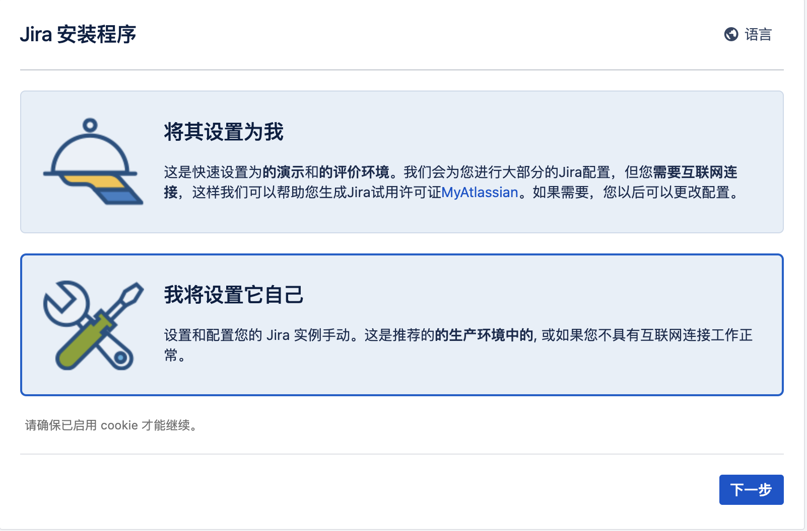

# Atlassian之jiar和confluence的docker部署安装 

## jira

JIRA 是一个缺陷跟踪管理系统，为针对缺陷管理、任务追踪和项目管理的商业性应用软件，开发者是澳大利亚的Atlassian。

```bash
FROM cptactionhank/atlassian-jira-software:8.1.0

USER root

# 将代理破解包加入容器
COPY "atlassian-agent.jar" /opt/atlassian/jira/

# 设置启动加载代理包
RUN echo 'export CATALINA_OPTS="-javaagent:/opt/atlassian/jira/atlassian-agent.jar ${CATALINA_OPTS}"' >> /opt/atlassian/jira/bin/setenv.sh
```

### 目录

```bash
- JIRA
  --Dockerfile
  --atlassian-agent.jar
```

### 打包运行docker

```bash
docker build -t dakewe/jira:v8.1.0 .

docker run --name jira --detach --publish 8080:8080 dakewe/jira:v8.1.0
```

### 软件运行

​​

​​

### 破解

```bash
java -jar atlassian-agent.jar -d -m 82607314@qq.com -n dakewe -p jira -o http://localhost:8090 -s B5WY-IHN3-GITJ-FAA7

// 或
docker exec confluence java -jar /opt/atlassian/confluence/atlassian-agent.jar \
    -p jira \
    -m 82607314@qq.com \
    -n 82607314@qq.com \
    -o http://localhost:8090 \
    -s BNZF-ITXS-8W2V-IWQP
```

## confluence

Atlassian Confluence（简称Confluence）是一个专业的wiki程序。它是一个知识管理的工具，通过它可以实现团队成员之间的协作和知识共享。

```bash
FROM cptactionhank/atlassian-confluence:7.9.3

USER root

# 将代理破解包加入容器
COPY "atlassian-agent.jar" /opt/atlassian/confluence/

# 设置启动加载代理包
RUN echo 'export CATALINA_OPTS="-javaagent:/opt/atlassian/confluence/atlassian-agent.jar ${CATALINA_OPTS}"' >> /opt/atlassian/confluence/bin/setenv.sh
```

### 目录

```bash
- Confluence
  --Dockerfile
  --atlassian-agent.jar
```

### 打包运行

```bash
docker build -f Dockerfile -t dakewe/confluence:7.9.3 .

docker run --name confluence --detach --publish 8081:8090 dakewe/confluence:7.9.3
```

### 破解

```bash
java -jar atlassian-agent.jar -d -m 82607314@qq.com -n DAKEWE -p conf -o http://103.39.231.195 -s BJRF-N4SL-YE98-QPJA

// 或
docker exec confluence java -jar /opt/atlassian/confluence/atlassian-agent.jar \
    -p conf \
    -m 82607314@qq.com \
    -n 82607314@qq.com \
    -o http://localhost:8090 \
    -s BNZF-ITXS-8W2V-IWQP
```

## mysql示例

```bash
--创建jira数据库及用户
create database jiradb character set 'UTF8';
create user jirauser identified by 'jira';
grant all privileges on *.* to 'jirauser'@'%' identified by 'jira' with grant option;
grant all privileges on *.* to 'jirauser'@'localhost' identified by 'jira' with grant option;
flush privileges;


--创建confluence数据库及用户
create database confdb character set 'UTF8';
create user confuser identified by 'conf';
grant all privileges on *.* to 'confuser'@'%' identified by 'conf' with grant option;
grant all privileges on *.* to 'confuser'@'localhost' identified by 'conf' with grant option;
flush privileges;

-- 设置confdb事务级别
show variables like 'tx%';
set session transaction isolation level read committed;
show variables like 'tx%';
```
