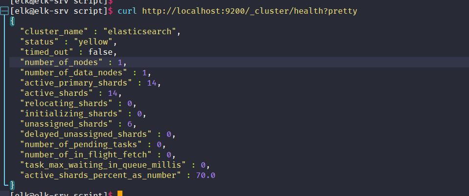

# elk优化-日常运维

## 1.ELK集群redis服务因数据量太大导致内存使用率暴涨故障修复

　　`vim /data/filebeat/filebeat.yml`

```bash
filebeat.inputs:
- type: log
  enabled: true
  paths:
    - /data/microService/data/logs/client/client.*.out
  tags: ["client"]
  tail_files: true
# 当您第一次在一组日志文件上运行 Filebeat 时，可以使用此设置来避免索引旧的日志行。
# 第一次运行后，我们建议禁用此选项，否则您可能会在文件轮换期间丢失行。
  
output.redis:
  hosts: ["192.168.10.142:6379"]
  password: "Ninestar123"
  key: "xylc"
  db: 0
  timeout: 20

```

## 2.elasticsearch  内存使用优化

　　`vim /data/elasticsearch/config/jvm.options`

```bash
-Xms4g
-Xmx4g

```

## 3.单节点elasticsearch状态为yellow

　　`curl http://localhost:9200/_cluster/health?pretty`



　　因为单点部署Elasticsearch, 默认的分片副本数目配置为1，而相同的分片不能在一个节点上，所以就存在副本分片指定不明确的问题，所以显示为yellow，可以通过在Elasticsearch集群上添加一个节点来解决问题，如果不想这么做，可以删除那些指定不明确的副本分片（当然这不是一个好办法）。

```bash
curl -X PUT "localhost:9200/_settings" -H 'Content-Type: application/json' -d'{"number_of_replicas":0}'

```

## 4.ELK索引管理

　　线上部署了ELK+Redis日志分析平台环境, 随着各类日志数据源源不断的收集, 发现过了一段时间之后, ELK查看会原来越慢, 重启elasticsearch服务器节点之前同步时间也会很长,  这是因为长期以来ELK收集的索引没有删除引起的。

```bash
# 1.在elasticsearch节点上使用下面命令查看elk的索引
curl -s "http://localhost:9200/_cat/shards"|grep UNASSIGNED

# 2.删除索引
curl -XDELETE  http://localhost:9200/索引名

#可以先将要删除的索引查看出来存到临时文件里, 然后进行批量删除 (索引多的话, 删除操作会耗费一点时间) 
curl -XGET 'http://localhost:9200/_cat/shards'|awk '{print $1}'|uniq > /tmp/elk-index.tmp
for i in $(cat /tmp/elk-index.tmp);do curl -XDELETE  http://localhost:9200/$i;done

# 3.为了方便可以在计划任务里面加定时任务删除7天之前的日志索引 

```

```bash
#!/bin/bash
#The index 7 days ago
curl -XGET 'http://localhost:9200/_cat/shards' |awk '{print $1}' | grep xylc | grep `date -d "7 days ago" +%Y-%m-%d` |uniq > /tmp/elk-index.tmp
 
for index_name in `cat /tmp/elk-index.tmp` 
do
    curl -XDELETE  http://localhost:9200/$index_name
    echo "${index_name} delete success" >> /tmp/del_elasticseatch_index.log
done

```
