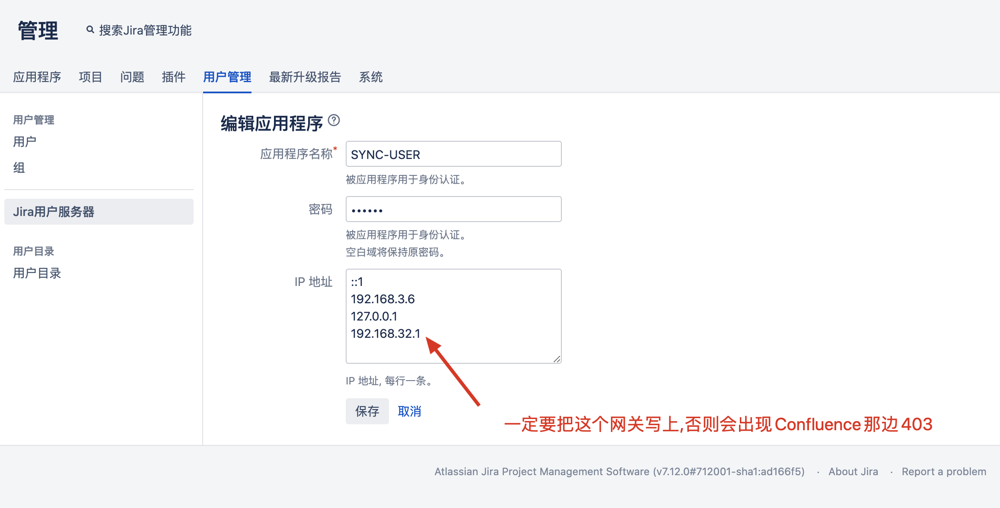
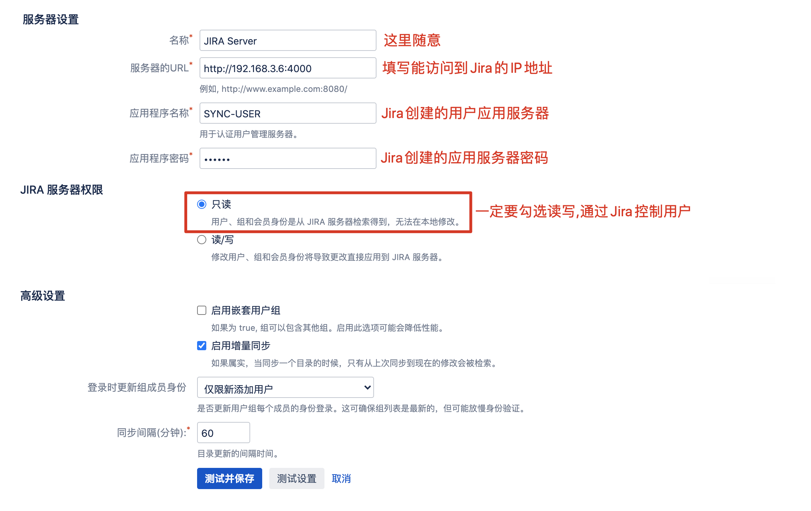

# jira和confluence的docker部署

参考：[http://junyao.tech/posts/ca7b5bb.html](http://junyao.tech/posts/ca7b5bb.html)

atlassian-agent下载地址：

https://github.com/x14k3/resource/releases/download/atlassian-agent/atlassian-agent-v1.2.3.jar

https://github.com/x14k3/resource/releases/download/atlassian-agent/atlassian-agent-v1.3.1.jar

版本信息

```bash
jira: 8.16.1
confluence: 7.9.3
mysql: 5.7.37
stassian-agent: 1.3.1
```

‍

dockerfile目录结构

```bash
[root@localhost atlassian]# tree
.
├── confluence-dockerfile
│   ├── atlassian-agent.jar
│   └── Dockerfile
├── jira-dockerfile
│   ├── atlassian-agent.jar
│   └── Dockerfile
└── mysql-dockerfile
    └── Dockerfile

3 directories, 5 files
```

‍

## 安装 mysql

### dockerfile

```bash
FROM mysql:5.7.37
MAINTAINER sundongsheng@nstc.com.cn
LABEL version="5.7.37"
RUN echo '[mysqld] \n\
character_set_server = utf8mb4 \n\
collation-server = utf8mb4_bin \n\
lower_case_table_names = 1 \n\
max_connections = 2000 \n\
log_bin_trust_function_creators = 1 \n\
transaction_isolation = READ-COMMITTED \n\
innodb_log_file_size = 2G \n\
innodb_large_prefix = ON \n\
innodb_default_row_format = DYNAMIC' \
>> /etc/mysql/mysql.conf.d/mysqld.cnf
RUN /bin/cp /usr/share/zoneinfo/Asia/Shanghai /etc/localtime && echo 'Asia/Shanghai' >/etc/timezone
```

### 构建镜像

```bash
docker build -t doshe11/mysql:5.7.37 ./
```

### 启动容器

```bash
docker run -d --name mysql -v /data/mysql:/var/lib/mysql \
-p 3306:3306 -e MYSQL_ROOT_PASSWORD=Ninestar123 doshe11/mysql:5.7.37;

# 查看启动日志
docker logs -f mysql
```

‍

### 添加数据库和用户

```sql
docker exec -it mysql /bin/bash

mysql -u root -pNinestar123

--创建数据库jira
--create database jira default character set utf8 collate utf8_bin;
mysql> create database jira default character set utf8mb4 collate utf8mb4_bin;
--用户jira，密码：
mysql> grant all on jira.* to 'jira'@'%' identified by 'Ninestar123';
mysql>flush privileges;


--创建数据库confluence
mysql> create database confluence default character set utf8mb4 collate utf8mb4_bin;
--用户confluence，密码：
mysql> grant all on confluence.* to 'confluence'@'%' identified by 'Ninestar123';
mysql>flush privileges;
```

‍

## 安装 jira

JIRA 是一个缺陷跟踪管理系统，为针对缺陷管理、任务追踪和项目管理的商业性应用软件，开发者是澳大利亚的Atlassian。

### Dockerfile

```bash
FROM cptactionhank/atlassian-jira-software:latest
#FROM cptactionhank/atlassian-jira-software:8.1.0
USER root
#将代理破解包加入容器
COPY "atlassian-agent.jar" /opt/atlassian/jira/
#设置启动加载代理包
RUN echo 'export CATALINA_OPTS="-javaagent:/opt/atlassian/jira/atlassian-agent.jar ${CATALINA_OPTS}"' >> /opt/atlassian/jira/bin/setenv.sh
```

### 构建镜像

```bash
docker build -t doshe11/jira:latest ./
```

### 启动容器

```bash

docker run -d  --name jira \
-p  9001:8080 \
-v /data/jira:/var/atlassian/jira \
doshe11/jira:latest


#内部程序运行目录（没必要映射）
/opt/atlassian/jira
#内部数据目录
/var/atlassian/jira
```

### 破解

```bash
docker exec jira java -jar /opt/atlassian/jira/atlassian-agent.jar \
-d -m doshell@qq.com -n doshe11 -p jira -o http://localhost:8080 -s B5F4-M1P0-4W49-BYV5
# -s 服务器id,输入许可的时候会提示
```

## 安装 confluence

Atlassian Confluence（简称Confluence）是一个专业的wiki程序。它是一个知识管理的工具，通过它可以实现团队成员之间的协作和知识共享。

### Dockerfile

```bash
FROM cptactionhank/atlassian-confluence:latest
#FROM cptactionhank/atlassian-confluence:7.13.7
USER root
#将代理破解包加入容器
COPY "atlassian-agent.jar" /opt/atlassian/confluence/
#设置启动加载代理包
RUN echo 'export CATALINA_OPTS="-javaagent:/opt/atlassian/confluence/atlassian-agent.jar ${CATALINA_OPTS}"' >> /opt/atlassian/confluence/bin/setenv.sh
```

‍

### 构建镜像

```bash

docker build -f Dockerfile -t doshe11/confluence:latest ./
```

### 启动容器

```bash
docker run -d --name confluence \
-p 9002:8090 \
-v /data/confluence:/var/atlassian/confluence \
doshe11/confluence:latest

#内部程序运行目录（没必要映射）
/opt/atlassian/confluence
#内部数据目录
/var/atlassian/confluence
```

### 破解

```bash
docker exec confluence java -jar /opt/atlassian/confluence/atlassian-agent.jar \
-d -m doshe11@qq.com -n doshe11 -p conf -o http://localhost:8090 -s BERS-NMP5-3D78-1CHO
```

‍

## 安装后的优化配置

### 合并jira和confluence

登录Jira

1. 以管理员身份登录Jira
2. 点击右上角的小齿轮标志，点击系统进入下一步
3. 点击应用程序，选择应用程序链接,进入下一步
4. 输入Confluence的URL：192.168.1.18:8090，点击创建新链接
5. 勾选服务器有相同的用户和用户名，点击继续

登录Confluence

1. 点击继续后，会自动跳转到confluence验证界面，这里输入管理员账号密码
2. 管理员账号登录confluence，依次点击右上角的"管理">>一般管理>>点击左侧"管理"中的"应用程序链接">>"创建新链接"，然后添加jira的url地址，然后单击创建新链接（Create new link）
3. 可以进行jira与confluence切换

### confluence和jira用户账户同步设置

#### 创建 `Jira`​ 用户服务器



#### `Confluence`​ 配置 `Jria`​ 用户应用服务器



#### 测试同步用户并调整优先级

- 当创建用户之后, 只有用户登录了, 才会同步到 `Confluence`​ 服务器
- 但是你创建的组, 必须要手动同步
- 更新用户权限后, 必须要手动同步


‍

### 单点登陆

‍

### JIRA新增用户的默认组配置

登录Jira

1. 以管理员身份登录Jira
2. 点击右上角的小齿轮标志，点击应用程序进入下一步
3. 点击应用程序，选择应用程序访问权，进入下一步
4. 勾选默认组

### JIRA和Confluence更改JVM内存大小

配置jira

```bash
docker exec -it jira /bin/bash
vi /opt/atlassian/jira/bin/setenv.sh
-------------------------------------------
JVM_MINIMUM_MEMORY="2048m"
JVM_MAXIMUM_MEMORY="4096m"      # 找到这两行修改

```

‍

配置confluence

```bash
docker exec -it confluence /bin/bash

vi /opt/atlassian/confluence/bin/setenv.sh
-------------------------------------------
CATALINA_OPTS="-XX:G1ReservePercent=20 ${CATALINA_OPTS}"                                              
CATALINA_OPTS="-Djava.awt.headless=true ${CATALINA_OPTS}"                                             
CATALINA_OPTS="-Datlassian.plugins.enable.wait=300 ${CATALINA_OPTS}"                                  
CATALINA_OPTS="-Xms2048m -Xmx4096m -XX:+UseG1GC ${CATALINA_OPTS}"        # 找到改行修改                               
CATALINA_OPTS="-Dsynchrony.enable.xhr.fallback=true ${CATALINA_OPTS}"
```

### 管理员会话提示功能

管理员会话提示主要包括两种场景

- 管理员登录后台之后，如果有几分钟不到后台进行操作，会提示再次填写账户密码登录后台
- 管理员从后台退出访问前台界面时总是提示“您可以临时访问管理功能，如果不再需求请取消访问”这样的信息提示。

以上两种提示主要是为了系统的安全，避免被其它人恶意访问操作，影响系统的不稳定性。

对于以上两种情况，JIRA给出了相关的配置，允许我们做相应的修改

1. 再次登录JIRA后台密码提示的时长设置  
    管理员登录后台不进行操作，系统默认会话时长为10分钟，如果我们需要改变这个时长，我们可以按如下方式进行操作  
    1、停掉JIRA  
    2、进入JIRA应用目录{JJIRA_APPLICATION_DIR }/WEB-INFO/classes  
    3、找到文件：**jira-config.properties**  
    4、增加一行代码：`jira.websudo.timeout = 10`​  
    5、重新启动JIRA  
    这个参数是控制后台不操作会话过期的时长的，单位为分钟
2. 管理员访问后台不再需要密码访问

作为管理员，每一次登录后台再转到前台，总会有一个提示，如下：


关掉的具体步骤如下

1. 停掉JIRA
2. 进入JIRA应用目录{JIRA_APPLICATION_DIR}/WEB-INFO/classes
3. 找到文件：jira-config.properties
4. 增加一行代码：jira.websudo.is.disabled = true
5. 重新启动JIRA

不建议这么做，因为安全的问题；如做上以上设置后，作为管理员登录JIRA后，如果进入到后台，即不用再录入密码了，非常的不安全；

### 后台日志报错 Establishing SSL connection without 解决

```
WARN：Establishing SSL connection without server’s identity verification is not recommended. According to MySQL 5.5.45+, 5.6.26+ and 5.7.6+ requirements SSL connection must be established by default if explicit option isn’t set. For compliance with existing applications not using SSL the verifyServerCertificate property is set to ‘false’. You need either to explicitly disable SSL by setting useSSL=false, or set useSSL=true and provide truststore for server certificate verification.
```

- 原因：MySQL5.7.6 以上版本要默认要求使用SSL连接，如果不使用需要通过设置 useSSL=false 来声明。
- 解决方案：在mysql连接字符串url中加入useSSL=true或者false即可，如下：

```bash
# Jira找到配置文件/var/atlassian/jira/dbconfig.xml修改mysql连接字符串如下：
jdbc:mysql://address=(protocol=tcp)(host=mysql)(port=3306)/jira?sessionVariables=default_storage_engine=InnoDB&amp;useSSL=false

# Confluence找到配置文件//var/atlassian/confluence/confluence.cfg.xml修改mysql连接字符串如下：
<property name="hibernate.connection.url">jdbc:mysql://172.17.0.2:3306/confluence?useSSL=false</property>


# 修改后重启服务
docker-compose restart jira
docker-compose restart confluence
```

‍
