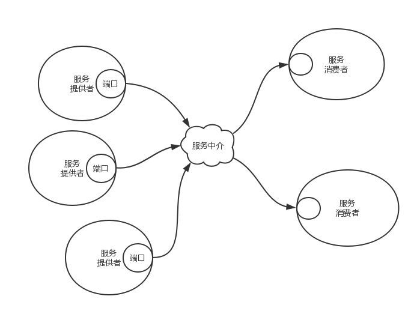

# nacos 概述

# 服务发现

服务发现是指使用一个注册中心来记录分布式系统中的全部服务的信息，以便其他服务能够快速的找到这些已注册的服务。如下图的服务中介

服务中介就是一个字典，字典里有很多key/value键值对，key是服务名称，value是服务提供者的地址列表。**服务注册就是调用字典的Put方法塞东西，服务查找就是调用字典的Get方法拿东西**。

当服务提供者节点挂掉时，要求服务能够及时取消注册，比便及时通知消费者重新获取服务地址。

当服务提供者新加入时，要求服务中介能及时告知服务消费者，你要不要尝试一下新的服务。

---

# 配置中心

在分布式系统中，最适用的一种组件间通信方式就是消息发布与订阅。即构建一个配置共享中心，数据提供者在这个配置中心发布消息，而消息使用者则订阅他们关心的主题，一旦主题有消息发布，就会实时通知订阅者。通过这种方式可以做到分布式系统配置的集中式管理与动态更新。

---

# 分布式锁

当在分布式系统中，数据只有一份（或有限制），此时需要利用锁的技术控制某一时刻修改数据的进程数。与单机模式下的锁不仅需要保证进程可见，分布式环境下还需要考虑进程与锁之间的网络问题。

分布式锁可以将标记存在内存，只是该内存不是某个进程分配的内存而是公共内存如 Redis、Memcache。至于利用数据库、文件等做锁与单机的实现是一样的，只要保证标记能互斥就行。

因为etcd使用Raft算法保持了**数据的强一致性**，某次操作存储到集群中的值必然是全局一致的，所以很容易实现分布式锁。锁服务有两种使用方式，一是保持独占，二是控制时序。
