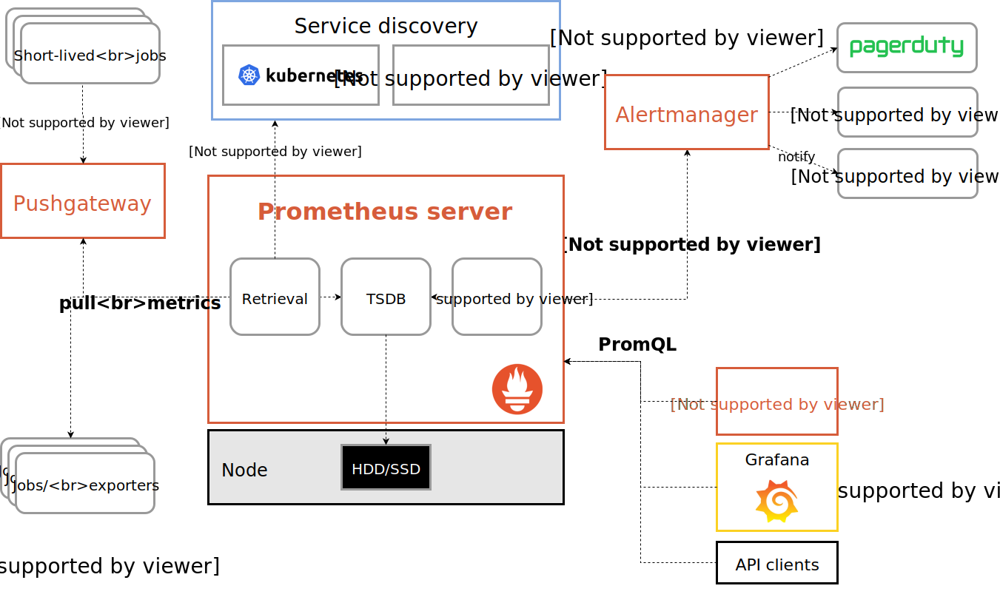

# 1.1 prometheus简介

[Prometheus](https://github.com/prometheus) 是由前 Google 工程师从 2012 年开始在 [Soundcloud](http://soundcloud.com/) 以开源软件的形式进行研发的系统监控和告警工具包，自此以后，许多公司和组织都采用了 Prometheus 作为监控告警工具。Prometheus 的开发者和用户社区非常活跃，它现在是一个独立的开源项目，可以独立于任何公司进行维护。为了证明这一点，Prometheus 于 2016 年 5 月加入 [CNCF](https://cncf.io/) 基金会，成为继 [Kubernetes](http://kubernetes.io/) 之后的第二个 CNCF 托管项目。[Prometheus](https://prometheus.io) 是由 SoundCloud 开源监控告警解决方案，从 2012 年开始编写代码，再到 2015 年 github 上开源以来，已经吸引了 9k+ 关注，以及很多大公司的使用；2016 年 Prometheus 成为继 k8s 后，第二名 CNCF([Cloud Native Computing Foundation](https://cncf.io/)) 成员。

## Prometheus 的主要优势

* 由指标名称和和键/值对标签标识的时间序列数据组成的多维数据模型。
* 强大的查询语言PromQL。
* 不依赖分布式存储；单个服务节点具有自治能力。
* 时间序列数据是服务端通过 HTTP 协议主动拉取获得的。
* 也可以通过中间网关来推送时间序列数据。
* 可以通过静态配置文件或服务发现来获取监控目标。
* 支持多种类型的图表和仪表盘。

## Prometheus 的架构

Prometheus 的整体架构以及生态系统组件如下图所示：

​​

从这个架构图，也可以看出 Prometheus 的主要模块包含， Server,  Exporters, Pushgateway, PromQL, Alertmanager, WebUI 等。

它大致使用逻辑是这样：

1. Prometheus server 定期从静态配置的 targets 或者服务发现的 targets 拉取数据。
2. 当新拉取的数据大于配置内存缓存区的时候，Prometheus 会将数据持久化到磁盘（如果使用 remote storage 将持久化到云端）。
3. Prometheus 可以配置 rules，然后定时查询数据，当条件触发的时候，会将 alert 推送到配置的 Alertmanager。
4. Alertmanager 收到警告的时候，可以根据配置，聚合，去重，降噪，最后发送警告。
5. 可以使用 API， Prometheus Console 或者 Grafana 查询和聚合数据。

## Prometheus 的组件

* [Prometheus Server](https://github.com/prometheus/prometheus)， 主要用于抓取数据和存储时序数据，另外还提供查询和 Alert Rule 配置管理

  > Prometheus Server是Prometheus组件中的核心部分，负责实现对监控数据的获取，存储以及查询。 Prometheus Server可以通过静态配置管理监控目标，也可以配合使用Service  Discovery的方式动态管理监控目标，并从这些监控目标中获取数据。其次Prometheus  Server需要对采集到的监控数据进行存储，Prometheus  Server本身就是一个时序数据库，将采集到的监控数据按照时间序列的方式存储在本地磁盘当中。最后Prometheus  Server对外提供了自定义的PromQL语言，实现对数据的查询以及分析。  
  > Prometheus Server内置的Express Browser UI，通过这个UI可以直接通过PromQL实现数据的查询以及可视化。  
  > Prometheus Server的联邦集群能力可以使其从其他的Prometheus Server实例中获取数据，因此在大规模监控的情况下，可以通过联邦集群以及功能分区的方式对Prometheus Server进行扩展。
  >

  ‍
* [client libraries](https://prometheus.io/docs/instrumenting/clientlibs/)，用于对接 Prometheus Server, 可以查询和上报数据

  ‍
* [push gateway](https://github.com/prometheus/pushgateway) ，用于批量，短期的监控数据的汇总节点，主要用于业务数据汇报等

  > 由于Prometheus数据采集基于Pull模型进行设计，因此在网络环境的配置上必须要让Prometheus  Server能够直接与Exporter进行通信。  当这种网络需求无法直接满足时，就可以利用PushGateway来进行中转。可以通过PushGateway将内部网络的监控数据主动Push到Gateway当中。而Prometheus  Server则可以采用同样Pull的方式从PushGateway中获取到监控数据。
  >
* 各种汇报数据的 [exporters](https://prometheus.io/docs/instrumenting/exporters/) ，例如汇报机器数据的 node_exporter,  汇报 MongoDB 信息的 [MongoDB exporter](https://github.com/dcu/mongodb_exporter) 等等

  > Exporter将监控数据采集的端点通过HTTP服务的形式暴露给Prometheus Server，Prometheus Server通过访问该Exporter提供的Endpoint端点，即可获取到需要采集的监控数据。  
  > 一般来说可以将Exporter分为2类：
  >

  * 直接采集：这一类Exporter直接内置了对Prometheus监控的支持，比如cAdvisor，Kubernetes，Etcd，Gokit等，都直接内置了用于向Prometheus暴露监控数据的端点。
  * 间接采集：间接采集，原有监控目标并不直接支持Prometheus，因此我们需要通过Prometheus提供的Client  Library编写该监控目标的监控采集程序。例如： Mysql Exporter，JMX Exporter，Consul Exporter等。
* 用于告警通知管理的 [alertmanager](https://github.com/prometheus/alertmanager)

  > 在Prometheus  Server中支持基于PromQL创建告警规则，如果满足PromQL定义的规则，则会产生一条告警，而告警的后续处理流程则由AlertManager进行管理。在AlertManager中我们可以与邮件，Slack等等内置的通知方式进行集成，也可以通过Webhook自定义告警处理方式。AlertManager即Prometheus体系中的告警处理中心。
  >

## Prometheus vs Zabbix

* Zabbix 使用的是 C 和 PHP, Prometheus 使用 Golang, 整体而言 Prometheus 运行速度更快一点。
* Zabbix 属于传统主机监控，主要用于物理主机，交换机，网络等监控，Prometheus 不仅适用主机监控，还适用于 Cloud, SaaS, Openstack，Container 监控。
* Zabbix 在传统主机监控方面，有更丰富的插件。
* Zabbix 可以在 WebGui 中配置很多事情，但是 Prometheus 需要手动修改文件配置。

‍

## 注意

* Prometheus 的数据是基于时序的 float64 的值，如果你的数据值有更多类型，无法满足。
* Prometheus  不适合做审计计费，因为它的数据是按一定时间采集的，关注的更多是系统的运行瞬时状态以及趋势，即使有少量数据没有采集也能容忍，但是审计计费需要记录每个请求，并且数据长期存储，这个  Prometheus 无法满足，可能需要采用专门的审计系统。

‍

## 总结

* Prometheus 属于一站式监控告警平台，依赖少，功能齐全。
* Prometheus 支持对云或容器的监控，其他系统主要对主机监控。
* Prometheus 数据查询语句表现力更强大，内置更强大的统计函数。
* Prometheus 在数据存储扩展性以及持久性上没有 InfluxDB，OpenTSDB，Sensu 好。
