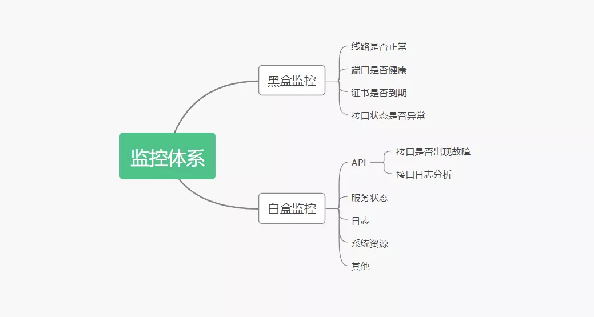

# 网络探测：Blackbox Exporter

　　‍

　　在本章的前几个小节中我们主要介绍了Prometheus下如何进行白盒监控，我们监控主机的资源用量、容器的运行状态、数据库中间件的运行数据。 这些都是支持业务和服务的基础设施，通过白盒能够了解其内部的实际运行状态，通过对监控指标的观察能够预判可能出现的问题，从而对潜在的不确定因素进行优化。而从完整的监控逻辑的角度，除了大量的应用白盒监控以外，还应该添加适当的黑盒监控。黑盒监控即以用户的身份测试服务的外部可见性，常见的黑盒监控包括HTTP探针、TCP探针等用于检测站点或者服务的可访问性，以及访问效率等。

　　‍

　　**黑盒监控**：主要关注的现象，一般都是正在发生的东西，例如出现一个告警，业务接口不正常，那么这种监控就是站在用户的角度能看到的监控，重点在于能对正在发生的故障进行告警。

　　**白盒监控**：主要关注的是原因，也就是系统内部暴露的一些指标，例如redis的info中显示redis slave down，这个就是redis info显示的一个内部的指标，重点在于原因，可能是在黑盒监控中看到redis down，而查看内部信息的时候，显示redis port is refused connection。

​​

## 使用Blackbox Exporter

　　Blackbox Exporter是Prometheus社区提供的官方黑盒监控解决方案，其允许用户通过：HTTP、HTTPS、DNS、TCP以及ICMP的方式对网络进行探测。用户可以直接使用go get命令获取Blackbox Exporter源码并生成本地可执行文件：

```
go get prometheus/blackbox_exporter
```

　　运行Blackbox Exporter时，需要用户提供探针的配置信息，这些配置信息可能是一些自定义的HTTP头信息，也可能是探测时需要的一些TSL配置，也可能是探针本身的验证行为。在Blackbox Exporter每一个探针配置称为一个module，并且以YAML配置文件的形式提供给Blackbox Exporter。 每一个module主要包含以下配置内容，包括探针类型（prober）、验证访问超时时间（timeout）、以及当前探针的具体配置项：

```
  # 探针类型：http、 tcp、 dns、 icmp.
  prober: <prober_string>

  # 超时时间
  [ timeout: <duration> ]

  # 探针的详细配置，最多只能配置其中的一个
  [ http: <http_probe> ]
  [ tcp: <tcp_probe> ]
  [ dns: <dns_probe> ]
  [ icmp: <icmp_probe> ]
```

　　下面是一个简化的探针配置文件blockbox.yml，包含两个HTTP探针配置项：

```
modules:
  http_2xx:
    prober: http
    http:
      method: GET
  http_post_2xx:
    prober: http
    http:
      method: POST
```

　　通过运行以下命令，并指定使用的探针配置文件启动Blockbox Exporter实例：

```
blackbox_exporter --config.file=/etc/prometheus/blackbox.yml
```

　　启动成功后，就可以通过访问[http://127.0.0.1:9115/probe?module=http_2xx&amp;target=baidu.com](http://127.0.0.1:9115/probe?module=http_2xx&target=baidu.com)对baidu.com进行探测。这里通过在URL中提供module参数指定了当前使用的探针，target参数指定探测目标，探针的探测结果通过Metrics的形式返回：

```
# HELP probe_dns_lookup_time_seconds Returns the time taken for probe dns lookup in seconds
# TYPE probe_dns_lookup_time_seconds gauge
probe_dns_lookup_time_seconds 0.011633673
# HELP probe_duration_seconds Returns how long the probe took to complete in seconds
# TYPE probe_duration_seconds gauge
probe_duration_seconds 0.117332275
# HELP probe_failed_due_to_regex Indicates if probe failed due to regex
# TYPE probe_failed_due_to_regex gauge
probe_failed_due_to_regex 0
# HELP probe_http_content_length Length of http content response
# TYPE probe_http_content_length gauge
probe_http_content_length 81
# HELP probe_http_duration_seconds Duration of http request by phase, summed over all redirects
# TYPE probe_http_duration_seconds gauge
probe_http_duration_seconds{phase="connect"} 0.055551141
probe_http_duration_seconds{phase="processing"} 0.049736019
probe_http_duration_seconds{phase="resolve"} 0.011633673
probe_http_duration_seconds{phase="tls"} 0
probe_http_duration_seconds{phase="transfer"} 3.8919e-05
# HELP probe_http_redirects The number of redirects
# TYPE probe_http_redirects gauge
probe_http_redirects 0
# HELP probe_http_ssl Indicates if SSL was used for the final redirect
# TYPE probe_http_ssl gauge
probe_http_ssl 0
# HELP probe_http_status_code Response HTTP status code
# TYPE probe_http_status_code gauge
probe_http_status_code 200
# HELP probe_http_version Returns the version of HTTP of the probe response
# TYPE probe_http_version gauge
probe_http_version 1.1
# HELP probe_ip_protocol Specifies whether probe ip protocol is IP4 or IP6
# TYPE probe_ip_protocol gauge
probe_ip_protocol 4
# HELP probe_success Displays whether or not the probe was a success
# TYPE probe_success gauge
probe_success 1
```

　　从返回的样本中，用户可以获取站点的DNS解析耗时、站点响应时间、HTTP响应状态码等等和站点访问质量相关的监控指标，从而帮助管理员主动的发现故障和问题。

## 与Prometheus集成

　　接下来，只需要在Prometheus下配置对Blockbox Exporter实例的采集任务即可。最直观的配置方式：

```
- job_name: baidu_http2xx_probe
  params:
    module:
    - http_2xx
    target:
    - baidu.com
  metrics_path: /probe
  static_configs:
  - targets:
    - 127.0.0.1:9115
- job_name: prometheus_http2xx_probe
  params:
    module:
    - http_2xx
    target:
    - prometheus.io
  metrics_path: /probe
  static_configs:
  - targets:
    - 127.0.0.1:9115
```

　　这里分别配置了名为baidu_http2x_probe和prometheus_http2xx_probe的采集任务，并且通过params指定使用的探针（module）以及探测目标（target）。

　　那问题就来了，假如我们有N个目标站点且都需要M种探测方式，那么Prometheus中将包含N * M个采集任务，从配置管理的角度来说显然是不可接受的。 在第7章的“服务发现与Relabel”小节，我们介绍了Prometheus的Relabeling能力，这里我们也可以采用Relabling的方式对这些配置进行简化，配置方式如下：

```
scrape_configs:
  - job_name: 'blackbox'
    metrics_path: /probe
    params:
      module: [http_2xx]
    static_configs:
      - targets:
        - http://prometheus.io    # Target to probe with http.
        - https://prometheus.io   # Target to probe with https.
        - http://example.com:8080 # Target to probe with http on port 8080.
    relabel_configs:
      - source_labels: [__address__]
        target_label: __param_target
      - source_labels: [__param_target]
        target_label: instance
      - target_label: __address__
        replacement: 127.0.0.1:9115
```

　　这里针对每一个探针服务（如http_2xx）定义一个采集任务，并且直接将任务的采集目标定义为我们需要探测的站点。在采集样本数据之前通过relabel_configs对采集任务进行动态设置。

* 第1步，根据Target实例的地址，写入`__param_target`​标签中。`__param_<name>`​形式的标签表示，在采集任务时会在请求目标地址中添加`<name>`​参数，等同于params的设置；
* 第2步，获取__param_target的值，并覆写到instance标签中；
* 第3步，覆写Target实例的`__address__`​标签值为BlockBox Exporter实例的访问地址。

　　通过以上3个relabel步骤，即可大大简化Prometheus任务配置的复杂度:

​​

　　接下来，我们将详细介绍Blackbox中常用的HTTP探针使用方式

## HTTP探针

　　HTTP探针是进行黑盒监控时最常用的探针之一，通过HTTP探针能够网站或者HTTP服务建立有效的监控，包括其本身的可用性，以及用户体验相关的如响应时间等等。除了能够在服务出现异常的时候及时报警，还能帮助系统管理员分析和优化网站体验。

　　在上一小节讲过，Blockbox Exporter中所有的探针均是以Module的信息进行配置。如下所示，配置了一个最简单的HTTP探针：

```
modules:
  http_2xx_example:
    prober: http
    http:
```

　　通过prober配置项指定探针类型。配置项http用于自定义探针的探测方式，这里有没对http配置项添加任何配置，表示完全使用HTTP探针的默认配置，该探针将使用HTTP GET的方式对目标服务进行探测，并且验证返回状态码是否为2XX，是则表示验证成功，否则失败。

### 自定义HTTP请求

　　HTTP服务通常会以不同的形式对外展现，有些可能就是一些简单的网页，而有些则可能是一些基于REST的API服务。 对于不同类型的HTTP的探测需要管理员能够对HTTP探针的行为进行更多的自定义设置，包括：HTTP请求方法、HTTP头信息、请求参数等。对于某些启用了安全认证的服务还需要能够对HTTP探测设置相应的Auth支持。对于HTTPS类型的服务还需要能够对证书进行自定义设置。

　　如下所示，这里通过method定义了探测时使用的请求方法，对于一些需要请求参数的服务，还可以通过headers定义相关的请求头信息，使用body定义请求内容：

```
http_post_2xx:
    prober: http
    timeout: 5s
    http:
      method: POST
      headers:
        Content-Type: application/json
      body: '{}'
```

　　如果HTTP服务启用了安全认证，Blockbox Exporter内置了对basic_auth的支持，可以直接设置相关的认证信息即可：

```
http_basic_auth_example:
    prober: http
    timeout: 5s
    http:
      method: POST
      headers:
        Host: "login.example.com"
      basic_auth:
        username: "username"
        password: "mysecret"
```

　　对于使用了Bear Token的服务也可以通过bearer_token配置项直接指定令牌字符串，或者通过bearer_token_file指定令牌文件。

　　对于一些启用了HTTPS的服务，但是需要自定义证书的服务，可以通过tls_config指定相关的证书信息：

```
 http_custom_ca_example:
    prober: http
    http:
      method: GET
      tls_config:
        ca_file: "/certs/my_cert.crt"
```

### 自定义探针行为

　　在默认情况下HTTP探针只会对HTTP返回状态码进行校验，如果状态码为2XX（200 <= StatusCode < 300）则表示探测成功，并且探针返回的指标probe_success值为1。

　　如果用户需要指定HTTP返回状态码，或者对HTTP版本有特殊要求，如下所示，可以使用valid_http_versions和valid_status_codes进行定义：

```
  http_2xx_example:
    prober: http
    timeout: 5s
    http:
      valid_http_versions: ["HTTP/1.1", "HTTP/2"]
      valid_status_codes: []
```

　　默认情况下，Blockbox返回的样本数据中也会包含指标probe_http_ssl，用于表明当前探针是否使用了SSL：

```
# HELP probe_http_ssl Indicates if SSL was used for the final redirect
# TYPE probe_http_ssl gauge
probe_http_ssl 0
```

　　而如果用户对于HTTP服务是否启用SSL有强制的标准。则可以使用fail_if_ssl和fail_if_not_ssl进行配置。fail_if_ssl为true时，表示如果站点启用了SSL则探针失败，反之成功。fail_if_not_ssl刚好相反。

```
  http_2xx_example:
    prober: http
    timeout: 5s
    http:
      valid_status_codes: []
      method: GET
      no_follow_redirects: false
      fail_if_ssl: false
      fail_if_not_ssl: false
```

　　除了基于HTTP状态码，HTTP协议版本以及是否启用SSL作为控制探针探测行为成功与否的标准以外，还可以匹配HTTP服务的响应内容。使用fail_if_matches_regexp和fail_if_not_matches_regexp用户可以定义一组正则表达式，用于验证HTTP返回内容是否符合或者不符合正则表达式的内容。

```
  http_2xx_example:
    prober: http
    timeout: 5s
    http:
      method: GET
      fail_if_matches_regexp:
        - "Could not connect to database"
      fail_if_not_matches_regexp:
        - "Download the latest version here"
```

　　最后需要提醒的时，默认情况下HTTP探针会走IPV6的协议。 在大多数情况下，可以使用preferred_ip_protocol=ip4强制通过IPV4的方式进行探测。在Bloackbox响应的监控样本中，也会通过指标probe_ip_protocol，表明当前的协议使用情况：

```
# HELP probe_ip_protocol Specifies whether probe ip protocol is IP4 or IP6
# TYPE probe_ip_protocol gauge
probe_ip_protocol 6
```

　　除了支持对HTTP协议进行网络探测以外，Blackbox还支持对TCP、DNS、ICMP等其他网络协议，感兴趣的读者可以从Blackbox的Github项目中获取更多使用信息

#### [https://github.com/prometheus/blackbox_exporter](https://github.com/prometheus/blackbox_exporter)。
