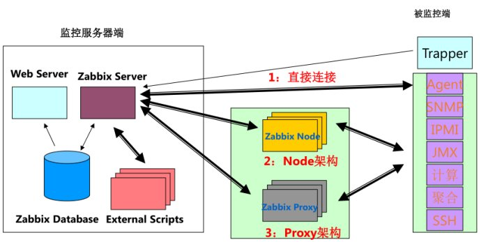

# Zabbix 简介

官方网站：[http://www.zabbix.com/](http://www.zabbix.com/ "http://www.zabbix.com/")  

**Zabbix 能监控各种网络参数，保证服务器系统的安全运营；并提供灵活的通知机制以让系统管理员快速定位、解决存在的各种问题。是一个基于 Web 界面的提供分布式系统监视以及网络监视功能的企业级的开源解决方案。**

**Server：**​[Zabbix server](https://www.zabbix.com/documentation/4.0/zh/manual/concepts/server) 是 Zabbix软件的核心组件，agent 向其报告可用性、系统完整性信息和统计信息。server也是存储所有配置信息、统计信息和操作信息的核心存储库。

**数据库：** 所有配置信息以及 Zabbix 采集到的数据都被存储在数据库中。

**Web 界面：** 该界面是 Zabbix server 的一部分，通常（但不一定）和 Zabbix server 运行在同一台物理机器上。

**Proxy：**​[Zabbix proxy](https://www.zabbix.com/documentation/4.0/zh/manual/concepts/proxy) 可以代替 Zabbix server采集性能和可用性数据。Zabbix proxy在Zabbix的部署是可选部分；但是proxy的部署可以很好的分担单个Zabbix server的负载。

**Agent：**​[Zabbix agents](https://www.zabbix.com/documentation/4.0/zh/manual/concepts/agent) 部署在被监控目标上，用于主动监控本地资源和应用程序，并将收集的数据发送给 Zabbix server。

‍

## 监控功能

主机的性能监控、网络设备性能监控、数据库性能监控、多种告警方式、详细的报表图表绘制；

监控主机 zabbix 有专用的 agent，可以监控Linux、Windows、FreeBSD等。

监控网络设备 zabbix 通过SNMP，SSH等

可监控对象：

* 设备：服务器、路由器、交换机等
* 软件：OS、网络、应用程序等
* 主机性能指标监控
* 故障监控：宕机，服务器不可用，主机不可达

‍

## zabbix 工作原理

一个监控系统运行的大概流程是这样的：

**zabbix agent  需要安装到被监控的主机上，它负责定期收集各项数据，并发送到 zabbix server 端，zabbix server  将数据存储到数据库中，zabbix web 根据数据在前端进行展示和绘图。这里 agent 收集数据分为主动和被动两种模式：**

**主动：** agent 请求server 获取主动的监控项列表，并主动将监控项内需要检测的数据提交给server / proxy

**被动：** server 向 agent 请求获取监控项的数据，agent 返回数据。

‍

## zabbix 工作进程

默认情况下 zabbix 包含6个进程：zabbix_agentd、zabbix_get、zabbix_proxy、zabbix_sender、zabbix_server，另外一个zabbix_java_gateway是可选的，这个需要单独安装。

**zabbix_server：** zabbix  服务端守护进程。zabbix_agentd、zabbix_get、zabbix_sender、zabbix_proxy、zabbix_java_gateway的数据最终都是提交到server（说明：当然不是数据都是主动提交给zabbix_server，也有的是  server 主动去取数据）

**zabbix_agentd：** 客户端守护进程，此进程收集客户端数据，例如cpu负载、内存、硬盘使用情况等。

**zabbix_proxy：** zabbix 代理守护进程。功能类似server，唯一不同的是它只是一个中转站，它需要把收集到的数据提交/被提交到 server 里。

**zabbix_get：** zabbix 工具，单独使用的命令，通常在 server 或者 proxy 端执行获取远程客户端信息的命令。通常用于排错。例如在 server 端获取不到客户端的内存数据，可以使用 zabbix_get 获取客户端的内容的方式来做故障排查。

**zabbix_sender：** zabbix 工具，用于发送数据给 server 或者 proxy，通常用于耗时比较长的检查。很多检查非常耗时间，导致 zabbix 超时。于是在脚本执行完毕之后，使用 sender 主动提价数据。

**zabbix_java_gateway：** zabbix2.0之后引入的一个功能。顾名思义：Java网络，类似agentd，但是只用于 Java 方面。需要特别注意的是，它只能主动去获取数据，而不能被动获取数据。它的数据最终会给到 server 或者proxy。

‍

## zabbix 常用术语解释

参考官档：[https://www.zabbix.com/documentation/4.0/zh/manual/definitions](https://www.zabbix.com/documentation/4.0/zh/manual/definitions)

1）主机（host）：要监控的网络设备，可由IP或DNS名称指定；  
2）主机组（host group）：主机的逻辑容器，可以包含主机和模板，但同一个组织内的主机和模板不能互相链接；主机组通常在给用户或用户组指派监控权限时使用；  
3）监控项（item）：一个特定监控指标的相关的数据；这些数据来自于被监控对象；item是zabbix进行数据收集的核心，相对某个监控对象，每个item都由"key"标识；  
4）触发器（trigger）：一个表达式，用于评估某监控对象的特定item内接收到的数据是否在合理范围内，也就是阈值；接收的数据量大于阈值时，触发器状态将从"OK"转变为"Problem"，当数据再次恢复到合理范围，又转变为"OK"；  
5）事件（event）：触发一个值得关注的事情，比如触发器状态转变，新的agent或重新上线的agent的自动注册等；  
6）动作（action）：指对于特定事件事先定义的处理方法，如发送通知，何时执行操作；  
7）报警升级（escalation）：发送警报或者执行远程命令的自定义方案，如每隔5分钟发送一次警报，共发送5次等；  
8）媒介（media）：发送通知的手段或者通道，如Email、Jabber或者SMS等；  
9）通知（notification）：通过选定的媒介向用户发送的有关某事件的信息；  
10）远程命令（remote command）：预定义的命令，可在被监控主机处于某特定条件下时自动执行；  
11）模板（template）：用于快速定义被监控主机的预设条目集合，通常包含了item、trigger、graph、screen、application以及low-level discovery rule；模板可以直接链接至某个主机；  
12）应用（application）：一组item的集合；  
13）web场景（web scennario）：用于检测web站点可用性的一个活多个HTTP请求；  
14）前端（frontend）：Zabbix的web接口；

‍

## zabbix 监控架构

在实际监控架构中，zabbix根据网络环境、监控规模等 分了三种架构：**server-client、master-node-client、server-proxy-client ** 三种。

**1、server-client 架构**

　　zabbix的最简单的架构，监控服务器和被监控机之间不经过任何代理，直接由 zabbix server 和 zabbix agentd之间进行数据交互。适用于网络比较简单，设备比较少的监控环境。

**2、server-proxy-client 架构**

　　其中 proxy 是server、client 之间沟通的一个桥梁，proxy 本身没有前端，而且其本身并不存放数据，只是将  agentd 发来的数据暂时存放，而后再提交给server，该架构经常是和 master-node-client  架构做比较的架构，一般适用于跨机房、跨网络的中型网络架构的监控。

**3、master-node-client 架构**

　　该架构是 zabbix 最复杂的监控架构，适用于跨网络、跨机房、设备较多的大环境。每个node 同时也是一个 server  端，node下面可以接 proxy，也可以直接接client。node有自己的配置文件和数据库，其要做的是将配置信息和监控数据向 master  同步，master 的故障或损坏不影响 node 其下的架构的完整性。

