# Zabbix 自动发现与自动注册

现在有这样一个需求，公司采购了100台主机，并且需要监控这100台主机，这个工作量有点大。如果真是一台一台的去弄的话，最近这一两天就什么都别做了，而且效率还低。我们可以把这100台连好网络，在部署系统的过程中让这些主机自动配置并启动好zabbix-agent服务。然后让zabbix server自动添加这100台主机，这样的话不仅提升效率，还能节省下大量时间，这个自动添加有两种方式：

自动发现（被动模式）：**zabbix Server 主动的去发现所有的客户端**，然后将客户端的信息登记在服务端的机器上

自动注册（主动模式）：z**abbix agent主动上报自己的信息**，发送给zabbix Server

# 自动发现

1.配置自动发现

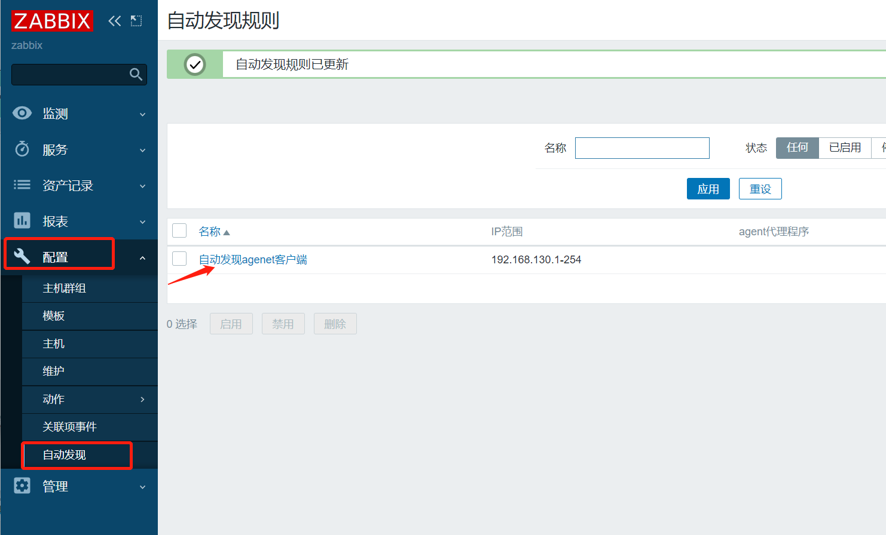​

2.配置自动发现后的动作

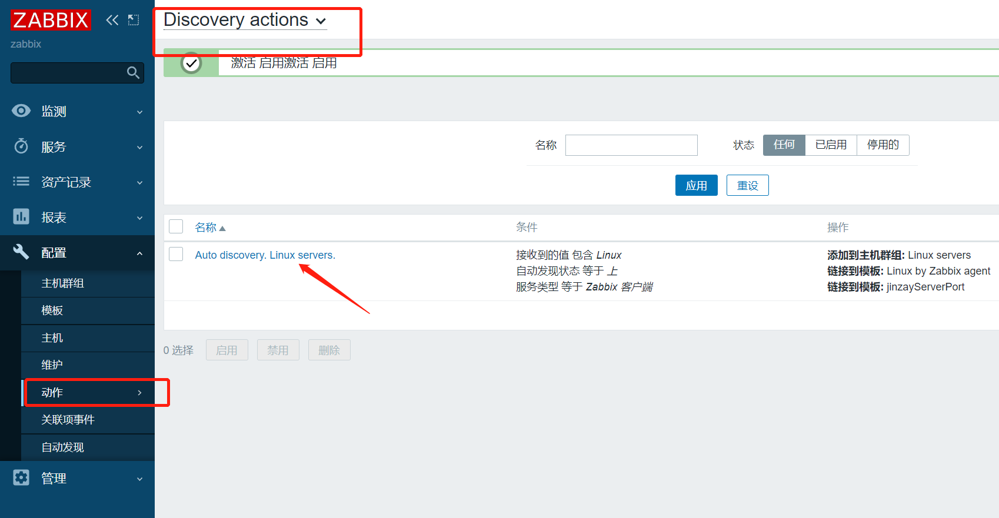​

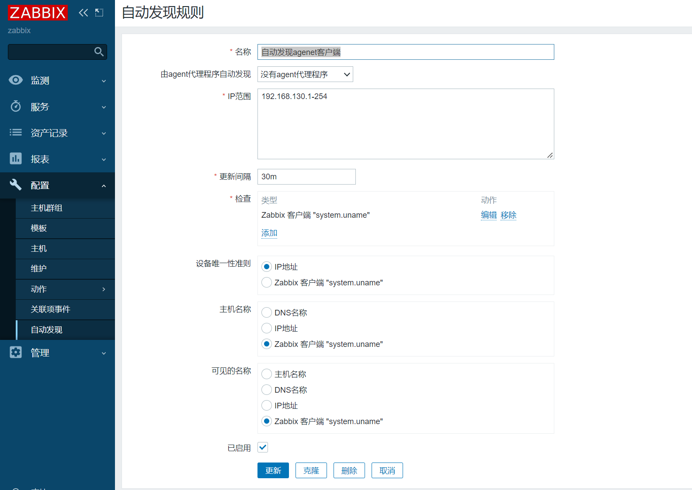​

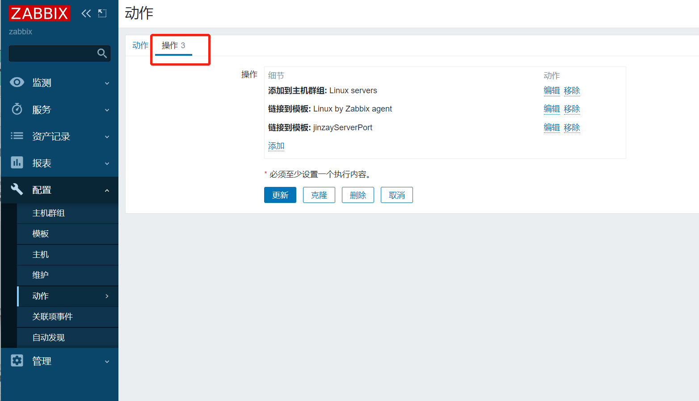​

---

# 自动注册

1.修改agent配置文件

```python
######################## 主动模式（agent > server） ########################
ServerActive=192.168.10.145 # zabbix服务端的ip和端口。
StartAgents=0               # 关闭被动模式，开启主动模式，此时agent客户端不会监听10050端口
HostnameItem=system.hostname
# Autoregistration actions 
HostMetadata=linuxAuto

```

2.配置自动注册适用的模板

克隆被动模式的模板，都修改为主动式

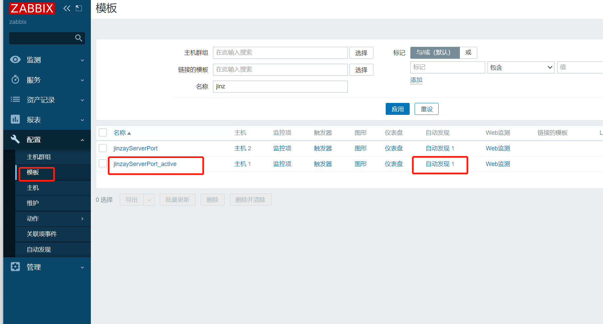​

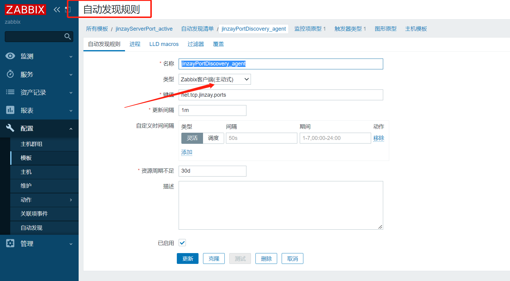​

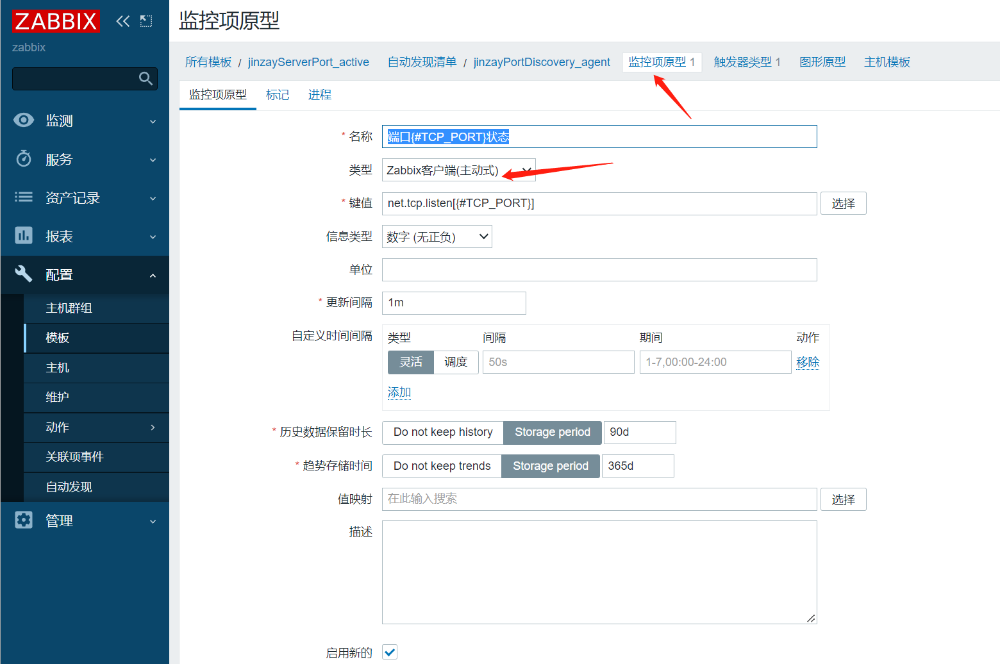​

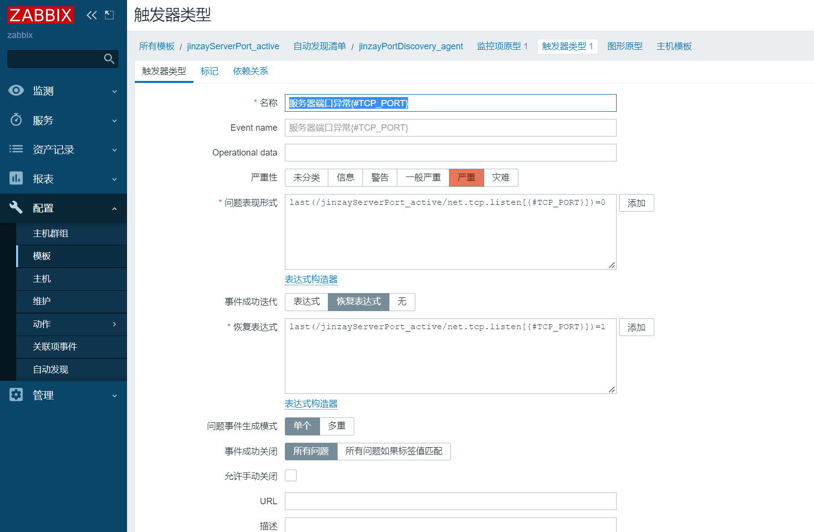​

3.配置自动注册动作

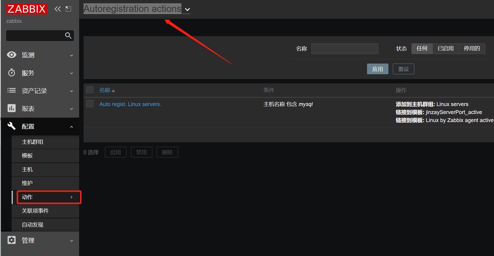​

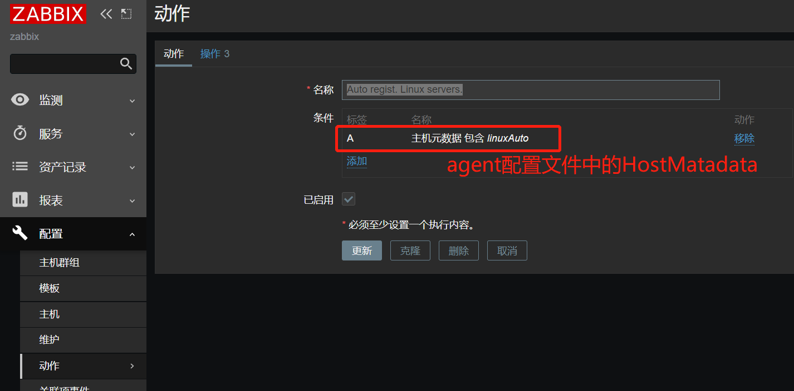​

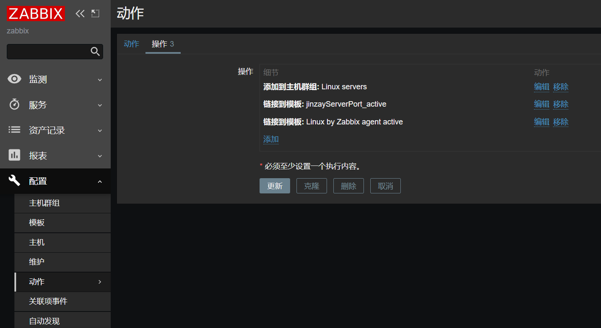​

4.启动agent客户端

**注意：**  使用主动模式，配置->主机->可用性中的”ZBX”是不变绿的，这点要注意。

‍
