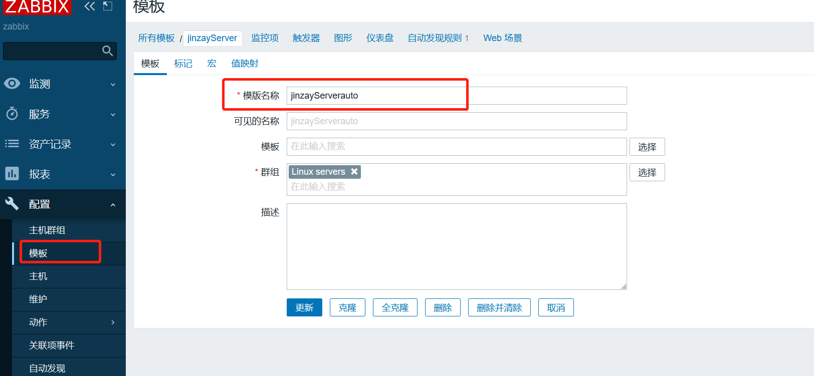
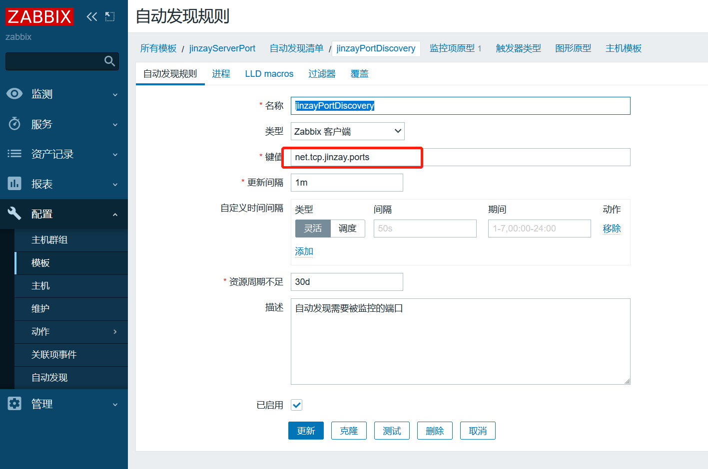
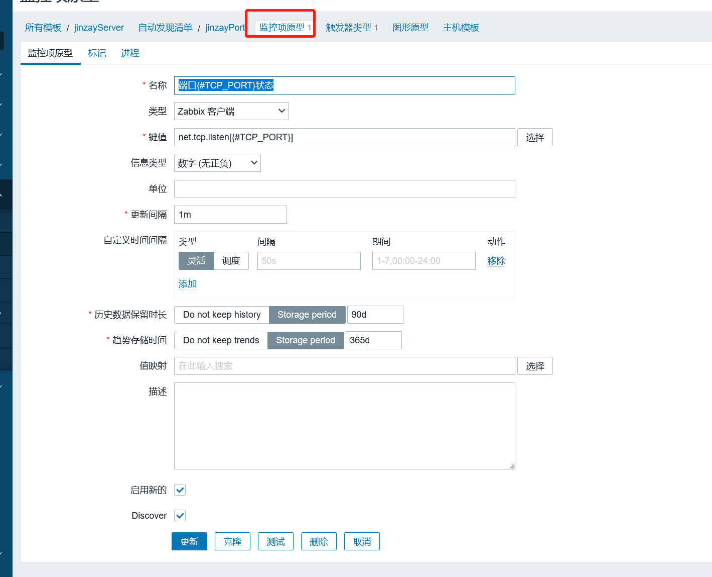
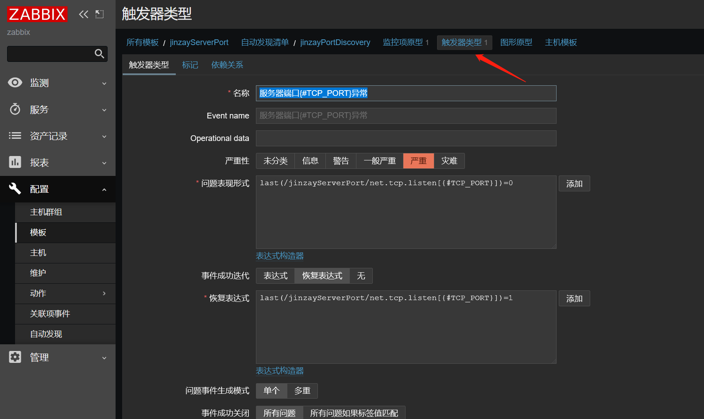
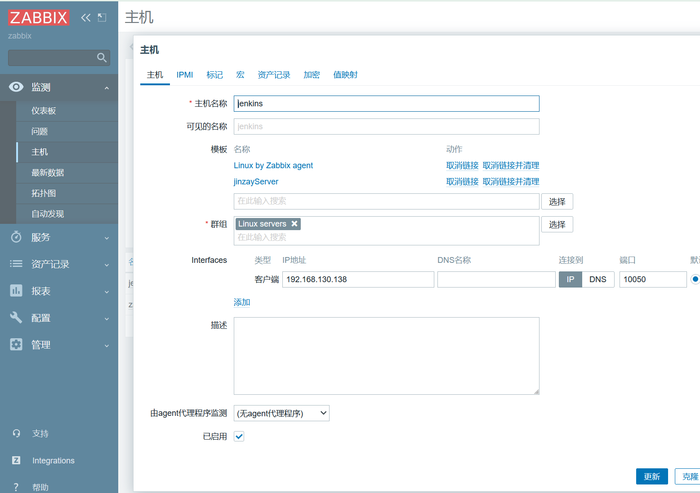
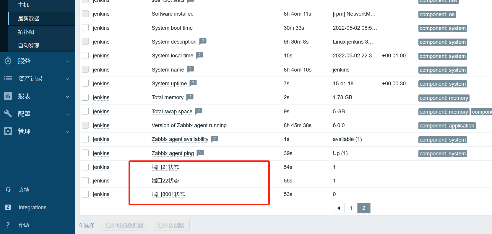

# Zabbix 配置监听多个端口

## zabbix_agent端操作

1.编写脚本

`vim /data/zabbix/script/ports.py `

```python
#!/usr/bin/python
#coding:utf-8  

import os, json
# 声明一个空列表   
port_list=[]
# 声明字典（字典是一个个键值对） 
port_dict={"data":None}
# 方式一：被监听的端口（手动设置）
port_active_list=["22","8080","21","8001"]
# 方式二：被监听的端口（自动扫描所有端口）
#cmd='netstat -tnlp|egrep -i "$1"|awk {\'print $4\'}|awk -F\':\' \'{if ($NF~/^[0-9]*$/) print $NF}\'|sort |uniq   2>/dev/null'
# os.popen    打开一个管道或命令。返回值是一个连接到管道的打开的文件对象
# readlines() 读取所有行，并返回列表
# local_ports=os.popen(cmd).readlines()  

for port in port_active_list:
# 声明列表中的字典
    pdict={}
# 赋予字典key和value，将port行尾的换行符去掉
    pdict["{#TCP_PORT}"]=port.replace("\n", "")
# 将多个字典添加到列表  
    port_list.append(pdict)
# 最后将添加了多个字典的列表再赋值给data字典
# 字典data的值是一个列表[],而列表里面是多个字典{"{#TCP_PORT}": "8001"}   
port_dict["data"]=port_list
# 将python对象编码成Json字符串（字典到json）
# 将数据根据keys的值进行排序
# indent是缩进的意思 
jsonStr = json.dumps(port_dict, sort_keys=True, indent=4)

print jsonStr
```

`chmod 744 /data/zabbix/script/ports.py`

`chown zabbix:zabbix /data/zabbix/script/ports.py`

2.修改agent客户端配置文件

```bash
UnsafeUserParameters=1
UserParameter=net.tcp.jinzay.ports,/data/zabbix/script/ports.py
```

3.重启客户端服务

4.在服务端测试

`zabbix_get -s 192.168.130.138 -p 10050 -k net.tcp.jinzay.ports `

## zabbix_server端操作

1.添加模板

​

2.添加自动发现规则

​

3.添加监控项原型

​

4.添加触发器原型

​

5.将主机关联模板

​

5.点击主机的最新数据

​
