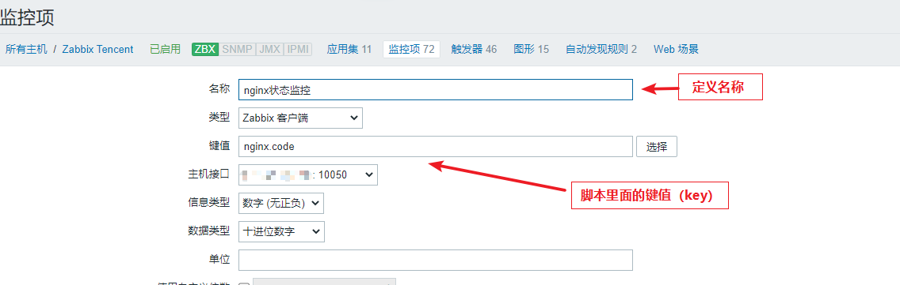
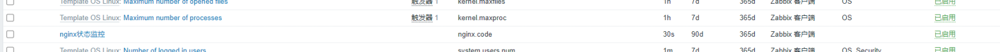
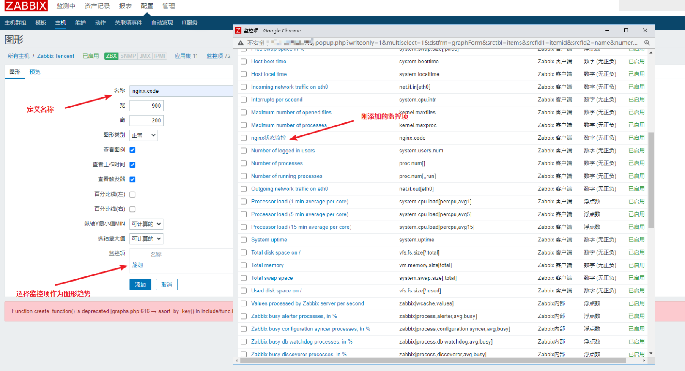
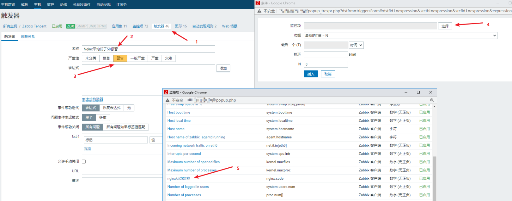

# Zabbix 配置自定义监控项

1. 修改agent客户端配置文件

   ```bash
   # 启用自定义key
   UnsafeUserParameters=1
   # 自定义监控项 UserParameter=<key>,<command>
   UserParameter=my.port,ss -tln|grep 8080|wc -l
   ```
2. 重启agnet
3. 通过服务端的zabbix-get命令测试

   ```bash
   ./zabbix_get -s 192.168.130.138 -k 'my.port'
   1
   ```
4. 在zabbix_web添加新的 监控项 触发器 图形

   ```bash
   添加监控项 （完毕后滑倒最下面更新即可） 配置-->主机-->监控项-->创建监控项
   ```

​

添加成功（如下 状态正常已启用） 异常：会显示不支持（红色），正常则显示已启用（绿色）  
​​

​

接下来添加触发器（步骤如下图） ps:按着自己的要求设置N值触发器即可 然后更新  
​​

​
