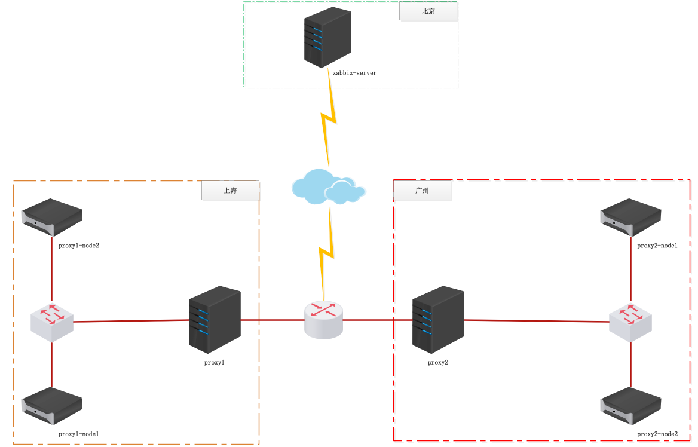
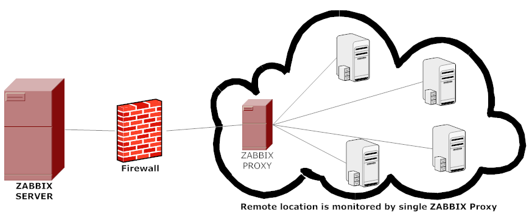

# Zabbix分布式监控系统

　　生产环境中，我们为了实现地域容灾，我们会把服务器放在不同的地域，如果一台zabbix server去监控的话，延迟会高，因为中国的网络由很多运营商在经营，包括联通，移动，电信，教育等等，有玩游戏的同学应该清楚，家里是联通的网络，你去会去电信的服务器么？不会，因为延迟太高。为什么延迟高？因为运营商之间的出口带宽是有限制的，为什么有限制？因为费用不一样，你在便宜的运营商这里办宽带，在贵的运营商这里玩，这种事，换做是谁都不会高兴的。有的同学说我用游戏加速器怎么延迟就低了？使用游戏加速器相当于在大家都从一扇门进出的时候，你发现了一扇窗，而这扇窗就你自己在用，但是当其他人也发现了这扇窗之后呢？所以即便是使用了游戏加速器，在上网高峰时，延迟还是高，只不过没有那么拥挤而已。说完了为什么延迟会高，我们再看一下另外一个问题，这种把服务器放在不同的地域也会造成zabbix server压力也会很大，所以为了避免这种情况，我们的处理方法就是将权利下发，在不同的地域都找一个机器来充当代理，本地的监控工作由代理(proxy)来完成，代理完成收集工作后交给zabbix server，zabbix server在将收到的数据统一整理展示到web。

　　其实这个例子很简单就是你开了很多分公司，你一个人去管理这些分公司的员工的话，你是管不全面的，所以我们的方法是在每个分公司弄一个负责人，负责人管当地的员工，你管负责人。有问题他们集中向你汇报就好了。这样你就能很顺利的掌控全局了。

　　**架构图**

​​

　　所以在这个分布式监控的架构中的流程是

　　1、zabbix server发布指令给代理

　　2、zabbix-proxy将指令发给被监控主机

　　3、被监控机将数据汇报给zabbix-proxy

　　4、zabbix-proxy再交给zabbix-server

　　5、zabbix-server将数据展示

　　这样解决了延迟问题，只要保证一条线路畅通就可以了，至于保证一条线路畅通的手段就看你的公司了，有钱可以接专线，没钱可以使用VPN，实在不行可以直接走广域网

### 实验拓扑图

​​

　　在这个架构中我们至少需要三台机器，他们的角色为

- **zabbix-server：**  192.168.98.200
- **zabbix-proxy：**  192.168.98.205
- **被监控主机：**  192.168.98.xxx

### 实验步骤

　　部署server监控平台 (略)

　　部署proxy代理平台

　　被监控机安装zabbix-agent（略）

## 一、部署zabbix-proxy代理平台

### 1.1、安装zabbix-proxy平台

```
#设置yum源
[root@proxy ~]# cat >> /etc/yum.repos.d/zabbix.repo <<EOF
[zabbix]
name=Zabbix Official Repository - $basearch
baseurl=http://repo.zabbix.com/zabbix/4.4/rhel/8/$basearch/
#baseurl=https://mirrors.aliyun.com/zabbix/zabbix/4.4/rhel/8/$basearch/
enabled=1
gpgcheck=0
gpgkey=file:///etc/pki/rpm-gpg/RPM-GPG-KEY-ZABBIX-A14FE591

[zabbix-non-supported]
name=Zabbix Official Repository non-supported - $basearch
baseurl=http://repo.zabbix.com/non-supported/rhel/8/$basearch/
enabled=1
gpgkey=file:///etc/pki/rpm-gpg/RPM-GPG-KEY-ZABBIX
gpgcheck=0

#安装软件包
[root@proxy ~]# dnf -y install mariadb-server mariadb zabbix-proxy-mysql zabbix-agent

############################################################
注意：如果无法连接公网的源，可以用浏览器将软件包下载到本地，然后自己创建本地源
step1
[root@proxy ~]# dnf install createrepo -y

step2
[root@proxy ~]# createrepo zabbix/（此路径为存放软件包的路径）

step3
[root@proxy ~]# vim /etc/yum.repos.d/server.repo 
[server-app]
name=server-app
enable=1
gpgcheck=0
baseurl=file:///mnt/AppStream
[server-os]
name=server-os
enable=1
gpgcheck=0
baseurl=file:///mnt/BaseOS
[zabbix]
name=zabbix
enabled=1
gpgcheck=0
baseurl=file:///root/zabbix

step4
[root@proxy ~]# dnf -y install mariadb-server mariadb zabbix-proxy-mysql zabbix-agent
############################################################


#mariadb设置
#启动服务
[root@proxy ~]# systemctl enable mariadb
Created symlink from /etc/systemd/system/multi-user.target.wants/mariadb.service to /usr/lib/systemd/system/mariadb.service.
[root@proxy ~]# systemctl start mariadb
[root@proxy ~]# mysqladmin -u root password '123456'
#创建数据库 zabbix_proxy及管理用户
[root@proxy ~]# mysql -u root -p
MariaDB [(none)]> create database zabbix_proxy character set utf8 collate utf8_bin;
Query OK, 1 row affected (0.00 sec)

MariaDB [(none)]>  grant all privileges on zabbix_proxy.* to zabbix@localhost identified by '123456';
Query OK, 0 rows affected (0.00 sec)

MariaDB [(none)]> flush privileges;
Query OK, 0 rows affected (0.00 sec)

MariaDB [(none)]> exit
Bye

#导入数据
[root@proxy ~]# zcat /usr/share/doc/zabbix-proxy-mysql/schema.sql.gz |mysql -u zabbix -p123456 zabbix_proxy
```

### 1.2、修改proxy配置文件

```
[root@proxy ~]# egrep "^(Server|Hostname|DBPass)" /etc/zabbix/zabbix_proxy.conf 
Server=192.168.98.200		#将数据汇报给谁
Hostname=zabbix_proxy		#自己的名字
DBPassword=123456				#数据库密码
```

### 1.3、关于proxy的监控问题

　　由于proxy既是监控也是被监控机，所以本机的agent的服务器地址可以设置本机或者server地址，这里建议设置server地址。因为这样zabbix server能够直接监控到本机的状态

```
[root@proxy ~]# egrep "^(Server|Hostname)" /etc/zabbix/zabbix_agentd.conf 
Server=192.168.98.200
ServerActive=192.168.98.200
Hostname=proxy 
```

### 1.4、启动服务

```
[root@proxy ~]# systemctl enable zabbix-proxy zabbix-agent
Created symlink from /etc/systemd/system/multi-user.target.wants/zabbix-proxy.service to /usr/lib/systemd/system/zabbix-proxy.service.
Created symlink from /etc/systemd/system/multi-user.target.wants/zabbix-agent.service to /usr/lib/systemd/system/zabbix-agent.service.
[root@proxy ~]# systemctl start zabbix-proxy zabbix-agent
```

　　查看一下日志显示的内容，以及确认下端口是否打开

```
[root@proxy ~]# tail -f /var/log/zabbix/zabbix_proxy.log
34539:20200215:133633.989 proxy #13 started [history syncer #2]
 34547:20200215:133633.990 proxy #21 started [poller #4]
 34548:20200215:133633.996 proxy #22 started [poller #5]
 34546:20200215:133633.998 proxy #20 started [poller #3]
 34551:20200215:133634.000 proxy #25 started [preprocessing manager #1]
 34550:20200215:133634.003 proxy #24 started [icmp pinger #1]
 34549:20200215:133634.003 proxy #23 started [unreachable poller #1]
 34552:20200215:133635.011 proxy #26 started [preprocessing worker #1]
 34554:20200215:133635.014 proxy #28 started [preprocessing worker #3]
 34553:20200215:133635.019 proxy #27 started [preprocessing worker #2]
 34534:20200215:133641.038 cannot send proxy data to server at "192.168.98.200": proxy "zabbix_proxy" not found
 34534:20200215:133642.041 cannot send proxy data to server at "192.168.98.200": proxy "zabbix_proxy" not found
 34534:20200215:133643.044 cannot send proxy data to server at "192.168.98.200": proxy "zabbix_proxy" not found
 34534:20200215:133644.046 cannot send proxy data to server at "192.168.98.200": proxy "zabbix_proxy" not found
 34534:20200215:133645.049 cannot send proxy data to server at "192.168.98.200": proxy "zabbix_proxy" not found

[root@proxy ~]# netstat -ntlp 
Active Internet connections (only servers)
Proto Recv-Q Send-Q Local Address           Foreign Address         State       PID/Program name    
tcp        0      0 0.0.0.0:10050           0.0.0.0:*               LISTEN      33953/zabbix_agentd 
tcp        0      0 0.0.0.0:10051           0.0.0.0:*               LISTEN      33960/zabbix_proxy  
tcp6       0      0 :::10050                :::*                    LISTEN      33953/zabbix_agentd 
tcp6       0      0 :::10051                :::*                    LISTEN      33960/zabbix_proxy  
tcp6       0      0 :::3306                 :::*                    LISTEN      33219/mysqld        
```

　　通过查看日志，我们发现日志当中好像有报错，这个我们一会再说，通过查看端口可以发现zabbix_proxy与zabbix_server使用的端口是一样的，所以这两个角色不能配置在一台主机上

### 1.5、监控平台设置

　　刚才我们在查看日志的时候发现日志中好像有错误提示，这个提示产生的原因就是服务端不认这个代理，代理给服务端发数据，服务端不要，所以我们要告诉服务端，它的代理是谁

　　管理—agent代理程序

​​

　　选择 创建代理 进入代理设置模式

​​

　　设置代理名称:一定要和proxy配置文件中的Hostname一致

　　设置代理模式：主动

　　1）proxy主动模式

　　zabbix_proxy主动发数据给zabbix_server(proxy的默认模式)

```
# vim /etc/zabbix/zabbix_proxy.conf
ProxyMode=0							--此参数为0表示proxy主动模式	
```

　　2）proxy被动模式

　　zabbix_server找zabbix_proxy为收集数据

```
# vim /etc/zabbix/zabbix_proxy.conf
ProxyMode=1						   --此参数为1表示proxy主动模式						  
```

　　警告

```
为了避免服务端不识别代理或者其它主机的情况，建议在zabbix_server最好给代理名字及其它主机做个解析
[root@zabbix ~]# vim /etc/hosts
192.168.98.205  proxy zabbix_proxy 
```

## 二、设置被监控机

```
[root@node4 ~]# egrep "^(Server|Hostname)" /etc/zabbix/zabbix_agentd.conf 
Server=192.168.98.205
ServerActive=192.168.98.205
Hostname=node4

[root@node4 ~]#  systemctl restart zabbix-agent
[root@node2 ~]# netstat -ntlp 
Active Internet connections (only servers)
Proto Recv-Q Send-Q Local Address           Foreign Address         State       PID/Program name     
tcp        0      0 0.0.0.0:10050           0.0.0.0:*               LISTEN      7836/zabbix_agentd  
tcp6       0      0 :::10050                :::*                    LISTEN      7836/zabbix_agentd  
```

## 三、验证

　　由于之前配置过自动注册，所以应该在主机列表中能看到就算成功了。

　　配置—主机

​​

　　看到了，node2后面有一个zabbix_proxy 说明该主机走的是代理模式。

　　如果查看监测–图形时很久不出图，建议分别重启zabbix_proxy和客户端的zabbix-proxy以及zabbix-agent服务
