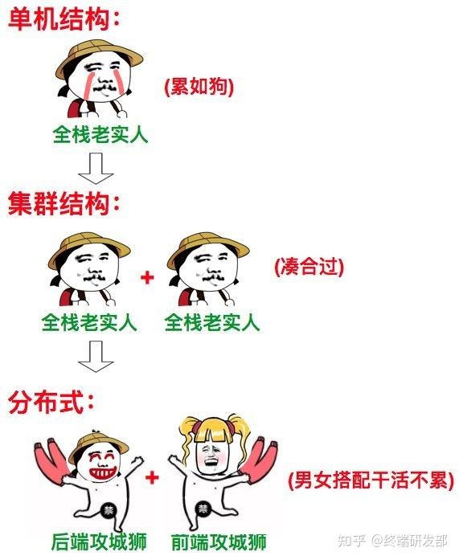
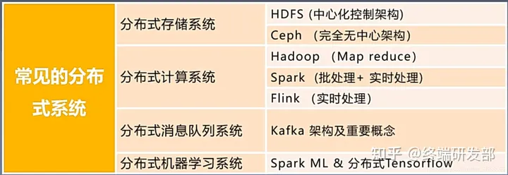

# 分布式

要理解分布式系统，主要需要明白一下2个方面：

1.分布式系统一定是由多个节点组成的系统。其中，节点指的是计算机服务器，而且这些节点一般不是孤立的，而是互通的。

2.这些连通的节点上部署了我们的节点，并且相互的操作会有协同。

不同的业务模块部署在不同的服务器上或者同一个业务模块分拆多个子业务，部署在不同的服务器上，解决高并发的问题，提供可扩展性以及高可用性，业务中使用分布式的场景主要有分布式存储以及分布式计算。分布式存储中可以将数据分片到多个节点上，不仅可以提高性能（可扩展性），同时也可以使用多个节点对同一份数据进行备份。

## **分布式环境的特点**

1. 分布性：服务部署空间具有多样性
2. 并发性：程序运行过程中，并发性操作是很常见的。比如同一个分布式系统中的多个节点，同时访问一个共享资源。数据库、分布式存储
3. 无序性：进程之间的消息通信，会出现顺序不一致问题

## **分布式环境下面临的问题**

1. 网络通信：网络本身的不可靠性，因此会涉及到一些网络通信问题
2. 网络分区(脑裂)：当网络发生异常导致分布式系统中部分节点之间的网络延时不断增大，最终导致组成分布式架构的所有节点，只有部分节点能够正常通信
3. 三态：在分布式架构里面多了个状态：超时，所以有三态： 成功、失败、超时
4. 分布式事务：ACID(原子性、一致性、隔离性、持久性)
5. 中心化和去中心化：冷备或者热备

分布式架构里面，很多的架构思想采用的是：当集群发生故障的时候，集群中的人群会自动“选举”出一个新的领导。

最典型的是： zookeeper / etcd

## 集群与分布式区别

集群：复制模式，每台机器做一样的事。

分布式：两台机器分工合作，每台机器做的不一样。

## 常见的分布式系统

