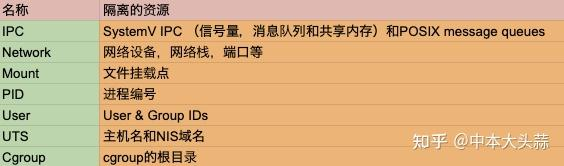
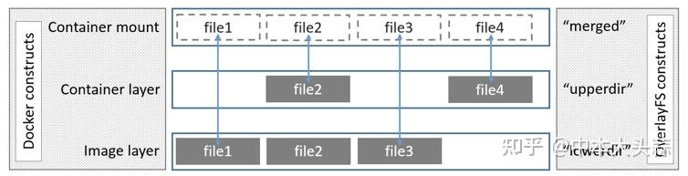

# overlay2原理

‍

我们知道container其实就是一个进程，与普通进程不同的时，container进程通过一些隔离技术做到了container之间的互相隔离。docker container主要有三个核心隔离技术：`namespace`​、`cgroups`​、`rootfs`​

‍

## 1. Namespace

Namespace（命名空间）是Linux内核的一项功能，该功能对内核资源进行分区，使一组进程看到一组资源，而另一组进程看到另一组资源。Namespace有很多种，包括下表中列出的7种。

​​

其中比较重要的有network，mount和PID namespace。

## 2. Cgroups

Cgroups 是 control groups  的缩写，是Linux内核提供的一种可以限制，记录，隔离进程组(process  groups)所使用物理资源的机制。主要功能有：资源限制(Resource  limiting)，优先级分配(Prioritization)，资源统计（Accounting)，进程控制（Control）等。

## 3. Rootfs

rootfs 是 docker 容器在启动时**内部进程可见的文件系统**，即  docker 容器的根目录。当我们运行docker exec命令进入container的时候看到的文件系统就是rootfs。rootfs  通常包含一个操作系统运行所需的文件系统，例如可能包含典型的类 Unix 操作系统中的目录系统，如  /dev、/proc、/bin、/etc、/lib、/usr、/tmp 及运行 docker 容器所需的配置文件、工具等。

就像Linux启动会先用只读模式挂载rootfs，运行完完整性检查之后，再切换成读写模式一样。Docker   deamon为container挂载rootfs时，也会先挂载为只读模式，但是与Linux做法不同的是，在挂载完只读的rootfs之后，docker  deamon会利用联合挂载技术（Union  Mount）在已有的rootfs上再挂一个读写层。container在运行过程中文件系统发生的变化只会写到读写层，并通过whiteout技术隐藏只读层中的旧版本文件。

# overlayFS的介绍以及实操

> docker deamon会利用**联合挂载技术（Union Mount**）在已有的rootfs上再挂一个读写层。

什么是联合挂载技术？我的理解是，联合挂载技术是建立在底层文件系统（ext4fs，xfs等等）之上的一种挂载技术，他可以将原来底层文件系统中的不同目录进行**合并（merge）** ，然后向我们呈现出合并之后的一个文件系统。

而overlayFS则是联合挂载技术的一种实现。除了overlayFS以外还有aufs，VFS，Brtfs，device   mapper等技术。虽然实现细节不同，但是他们做的事情都是相同的。Linux内核为Docker提供的overalyFS驱动有2种：overlay2和overlay，overlay2是相对于overlay的一种改进，在inode利用率方面比overlay更有效。

overlayfs通过三个目录来实现：lower目录、upper目录、以及work目录。三种目录合并出来的目录称为merged目录

* lower目录：可以是多个，是处于最底层的目录，作为**只读层**
* upper目录：只有一个，作为**读写层**
* work目录：为工作基础目录，挂载后内容会被清空，且在使用过程中其内容用户不可见，
* merged目录：为最后联合挂载完成给用户呈现的统一**视图，** 也就是说merged目录里面本身并**没有任何实体文件**，给我们展示的只是参与联合挂载的目录里面文件而已，真正的文件还是在lower和upper中。所以，在merged目录下编辑文件，或者直接编辑lower或upper目录里面的文件都会影响到merged里面的视图展示。

执行mount命令挂载overlayFS的语法为：

```bash
mount -t overlay overlay -o lowerdir=lower1:lower2:lower3,upperdir=upper,workdir=work merged_dir
```

理论也讲的差不到了，我们来看看实际中怎么用overlayFS吧。

执行以下命令：

```text
 mkdir -p /tmp/test/{A,B,C,worker}
cd /tmp/test
echo "From A" > A/a.txt
echo "From A" > A/b.txt
echo "From A" > A/c.txt 
echo "From B" > B/a.txt
echo "From B" > B/d.txt
echo "From C" > C/b.txt
echo "From C" > C/e.txt
```

创建如下图所示的一个文件结构

```text
root@test:/tmp/test# tree
.
├── A
│   ├── a.txt
│   ├── b.txt
│   └── c.txt
├── B
│   ├── a.txt
│   └── d.txt
├── C
│   ├── b.txt
│   └── e.txt
└── worker

4 directories, 7 files
```

接下来我们将A和B作为lower目录，C作为upper目录，worker做为work目录，进行联合挂载，并将挂载点放在`/tmp/test/merged`​ 上，执行以下命令

```text
# /tmp/test目录下
mkdir merged
mount -t overlay overlay -o lowerdir=A:B,upperdir=C,workdir=worker /tmp/test/merged
```

现在我们来看看merged文件夹里面都有啥？首先看看文件结构

```text
root@test:/tmp/test# cd merged/
root@test:/tmp/test/merged# tree
.
├── a.txt
├── b.txt
├── c.txt
├── d.txt
└── e.txt

0 directories, 5 files
root@test:/tmp/test/merged# 
```

可以看到之前的目录A、B、C被合并到了一起，并且相同文件名的文件会进行“覆盖”，这里覆盖并不是真正的覆盖，而是当合并时候目录中两个文件名称都相同时，merged层目录会显示离它最近层的文件。如下图所示，层级关系中upperdir比lowerdir更靠近merged层，而多个lowerdir的情况下，写的越靠前的目录离merged层目录越近。（这里merged层的file为虚线外框，表示文件实际上并不在merged目录下）

​​

‍
