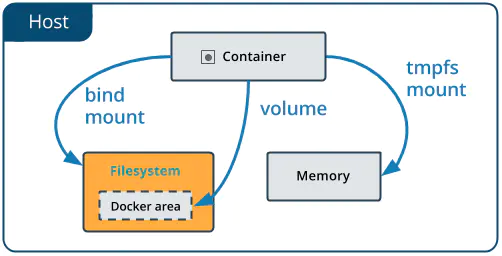

# docker 数据卷

docker的理念：将应用和环境打包成一个镜像如果数据都在容器中，那么删除容器，数据将会丢失！
为了很好的实现数据保存和数据共享，Docker提出了Volume这个概念，简单的说就是绕过默认的联合文件系统，而以正常的文件或者目录的形式存在于宿主机上。又被称作数据卷。

**数据卷的特点**

1. 数据卷存在于宿主机的文件系统中，独立于容器，和容器的生命周期是分离的；
2. 数据卷可以是目录也可以是文件，容器可以利用数据卷与宿主机进行数据共享，实现了容器间的数据共享和交换；
3. 容器启动初始化时，如果容器使用的镜像包含了数据，这些数据会拷贝到数据卷中；
4. 容器对数据卷的修改是实时进行的；
5. 数据卷的变化不会影响镜像的更新。数据卷是独立于联合文件系统，镜像是基于联合文件系统。镜像与数据卷之间不会相互影响。

# Docker 数据持久化

`bind mounts`、`Volumes`、和`tepfs mounts`三种方式，还有就是共享其他容器的数据卷，其中`tmpfs`是一种基于内存的临时文件系统。`tmpfs mounts`数据不会存储在磁盘上。



- Volumes 存储在 Docker Host 文件系统的一个路径下，这个路径是由 Docker 来进行管理，路径默认是  /var/lib/docker/volumes/，非 Docker 的进程不能去修改这个路径下面的文件，所以说Volumes  是持久存储数据最好的一种方式。
- Bind mounts 可以存储在 Docker Host 文件系统的任何位置，它们甚至可能是重要的系统文件或目录，非 Docker 的进程或者 Docker 容器可能随时对其进行修改，存在潜在的安全风险。
- Tmpfs 只存储在 Docker Host 的系统内存中，不会写入到系统的文件系统中，不会持久存储。

## bind mount

> 将host机器的目录mount到container中。但是bind mount在不同的宿主机系统是不可移植的，比如Windows和Linux的目录结构是不一样的，bind mount所指向的host目录也不能一样。这也是为什么bind mount不能出现在Dockerfile中的原因，因为这样Dockerfile就不可移植了。​

```bash
docker run -d --name test --mount type=bind,source=/path/on/host,destination=/path/in/container  镜像id
docker run -d --name test -v /path/on/host:/path/in/container  镜像id
```

如果host机器上的目录不存在，docker会自动创建该目录。

如果container中的目录不存在，docker会自动创建该目录。

如果container中的目录已经有内容，那么docker会使用host上的目录将其覆盖掉。

## volume

> volume也是绕过container的文件系统，直接将数据写到host机器上，只是volume是被docker管理的，docker下所有的volume都在host机器上的指定目录下/var/lib/docker/volumes

```bash
docker volume create  [name]    # 创建一个数据卷
docker volume inspect [name]    # 展示一个或多个数据卷的详细信息
docker volume ls                # 列出所有的数据卷
docker volume prune             # 移除未使用的数据卷
docker volume rm      [name]    # 移除一个或多个数据卷，不能移除被容器使用的数据卷
```

```bash
docker volume create my-olume
#参数--mount默认状况下用来挂载volume，但也能够用来建立bind mount和tmpfs。若是不指定type选项，则默认为挂载volume，volume是一种更为灵活的数据管理方式，volume能够经过docker volume命令集被管理。
docker run -dit --mount type=volume,source=my-volume,destination=/path/in/container  ImageID
```

**Dockerfile中的VOLUME**

在Dockerfile中，我们也可以使用VOLUME指令来申明contaienr中的某个目录需要映射到某个volume：

`#Dockerfile VOLUME /foo`

这表示，在docker运行时，docker会创建一个匿名的volume，并将此volume绑定到container的/foo目录中，如果container的/foo目录下已经有内容，则会将内容拷贝的volume中。也即，Dockerfile中的`VOLUME /foo`与`docker run -v /foo alpine`的效果一样。

Dockerfile中的VOLUME使每次运行一个新的container时，都会为其自动创建一个匿名的volume，如果需要在不同container之间共享数据，那么我们依然需要通过`docker run -it -v my-volume:/foo`的方式将/foo中数据存放于指定的my-volume中。

```bash
docker run -d --name test2 --volumes-from test1 mysql:5.7
```

# volume(-v)与mount的使用总结

用户可以通过docker run的--volume/-v或--mount选项来创建带有数据卷的容器，但这两个选项有些微妙的差异，在这里总结梳理一下。

## --volume(-v)

参数--volume（或简写为-v）只能创建bind mount。示例：

```bash
docker run -d --name test -v /path/on/host:/path/in/container:rw  镜像id
```

- 如果指定/path/on/host则必须是绝对路径，如果路径不存在则会自动创建
- 实例中的rw为读写，ro为只读

## --mount

参数--mount默认情况下用来挂载volume，但也可以用来创建bind  mount和tmpfs。如果不指定type选项，则默认为挂载volume，volume是一种更为灵活的数据管理方式，volume可以通过docker  volume命令集被管理。示例：

```bash
docker run -dit --mount type=volume,source=my-volume,destination=/path/in/container  ImageID
```

创建bind mount和挂载volume的比较

|对比项|bind mount|volume|
| --------------| -------------------| --------------------------|
|Source位置|用户指定|/var/lib/docker/volumes/|
|Source为空|覆盖dest为空|保留dest内容|
|Source非空|覆盖dest内容|覆盖dest内容|
|Source种类|文件或目录|只能是目录|
|可移植性|一般（自行维护）|强（docker托管）|
|宿主直接访问|容易（仅需chown）|受限（需登陆root用户）*|

*注释：Docker无法简单地通过sudo chown someuser: -R  /var/lib/docker/volumes/somevolume来将volume的内容开放给主机上的普通用户访问，如果开放更多权限则有安全风险。而这点上Podman的设计就要理想得多，volume存放在$HOME/.local/share/containers/storage/volumes/路径下，即提供了便捷性，又保障了安全性。无需root权限即可运行容器，这正是Podman的优势之一，实际使用过程中的确受益良多。
