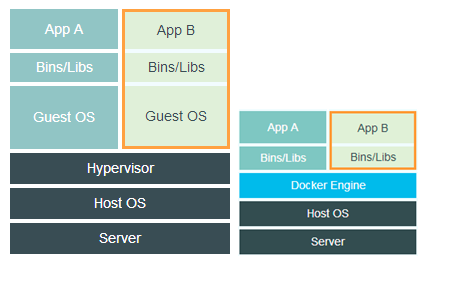
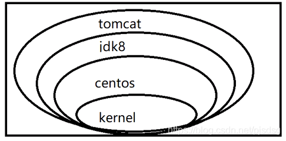

# docker 概述

## Docker简介

　　容器是应用程序层的抽象，它将代码和依赖关系打包在一起。多个容器可以在同一台机器上运行，并与其他容器共享操作系统内核，每个容器在用户空间中作为孤立进程运行。容器占用的空间少于虚拟机（容器映像的大小通常为几十MB），并且几乎立即启动。

　　容器映像是一个软件的轻量级独立可执行软件包，**包含运行它所需的一切：代码，运行时，系统工具，系统库，设置**。不管环境如何，集装箱化软件都可以运行相同的Linux和Windows应用程序。容器将软件与其周围环境隔离开来，例如开发环境和登台环境之间的差异，并有助于减少在同一基础架构上运行不同软件的团队之间的冲突。

## Docker底层实现

　　Docker 项目的目标是实现轻量级的操作系统虚拟化解决方案。 Docker 的基础是 Linux 容器（LXC）等技术。

　　在 LXC 的基础上 Docker 进行了进一步的封装，让用户不需要去关心容器的管理，使得操作更为简便。用户操作 Docker 的容器就像操作一个快速轻量级的虚拟机一样简单。

　　linux container是一种虚拟化技术，docker使用该技术在内核层面由两个独立的机制保证，一个保证资源的隔离性，名为namespace；一个进行资源的控制，名为cgroup。

　　下面的图片比较了 Docker 和传统虚拟化方式的不同之处，可见容器是在操作系统层面上实现虚拟化，直接复用本地主机的操作系统，而传统方式则是在硬件层面实现。

## Docker的三大组件

### 镜像（Image）

　　**Docker镜像就是一个Linux的文件系统（Root FileSystem），这个文件系统里面包含可以运行在Linux内核的程序以及相应的数据。**

　　一般而言， Linux分为两个部分：**Linux内核（Linux Kernel）与用户空间**，而真正的Linux操作系统，是指Linux内核，我们常用的Ubuntu、CentOS等操作系统其实是不同厂商在Linux内核基础上添加自己的软件与工具集（tools）形成的发布版本（Linux Distribution）。

　　因此，我们也可以把**镜像看成是上面所说的用户空间**，当Docker通过镜像创建一个容器时，就是将镜像定义好的用户空间作为独立隔离的进程运行在宿主机的Linux内核之上。

　　**Docker镜像原理**

　　**UnionFS (联合文件系统)**

　　UnionFS(联合文件系统): Union文件系统(UnionFS)是一种分层、轻量级并且高性能的文件系统，它支持对文件系统的修改作为一次提交来**一层层的叠加**，同时可以将不同目录挂载到同一个虚拟文件系统下(unite several directories into a single virtual filesystem)。Union文件系统是Docker镜像的基础。镜像可以通过分层来进行继承, 基于基础镜像(没有父镜像)， 可以制作各种具体的应用镜像。

　　特性: 一次同时加载多个文件系统，但从外面看起来，只能看到一个文件系统，联合加载会把各层文件系统叠加起来，这样最终的文件系统会包含所有底层的文件和目录。

　　**Docker镜像加速原理**

　　docker的镜像实际上**由一层一层的文件系统组成**，这种层级的文件系统UnionFS。

　　**bootfs(boot file system)**  主要包含bootloader和kernel，bootloader主要是引导加载kernel，Linux刚启动时会加载bootfs文件系统，**在Docker镜像的最底层是bootfs**。这一层与我们典型的Linux/Unix系统是一样的, 包含boot加载器和内核。当boot加载完成之后整个内核就都在内存中了，此时内存的使用权已由bootfs转交给内核，此时系统也会卸载bootfs。

　　**rootfs(root file system)**  在bootfs之上。包含的就是典型Linux系统中的/dev, /proc, /bin, /etc等标准目录和文件。rootfs就是各种不同的操作系统发行版，比如Ubuntu，Centos等等。

　　对于一个精简的OS, rootfs 可以很小, 只需要包含最基本的命令, 工具和程序库即可, 因为底层直接用宿主机的 kernel, 自己只需要提供 rootfs 就可以了. 也正是这个最底层的东西发生的改变使容器变为秒级 !

　　**分层的镜像**

　　以我们的pull为例，在下载的过程中我们可以看到docker的镜像好像是在一层一层的在下载

　　**为什么Docker镜像要采用这种分层结构呢?**

　　最大的一个好处就是**共享资源**比如：有多个镜像都从相同的base镜像构建而来，那么宿主机只需在磁盘上保存一份base镜像,同时内存中也只需加载一份base镜像，就可以为所有容器服务了。而且镜像的每一层都可以被共享。

　　**特点**

　　Docker镜像都是只读的, 当容器启动时, 一个新的可写层被加载到镜像的顶部 !

　　这一层也就是我们通常说的容器层, 容器层底下的都叫镜像层 !

### 容器（Container）

　　**容器与镜像的关系，就如同面向编程中对象与类之间的关系**。

　　因为容器是通过镜像来创建的，所以必须先有镜像才能创建容器，而生成的容器是一个独立于宿主机的隔离进程，并且有属于容器自己的网络和命名空间。

### 仓库（Repository）

　　**仓库是集中存储镜像的地方。**

　　公共仓库一般是指Docker Hub，前面我们已经多次介绍如何从Docker Hub获取镜像，除了获取镜像外，我们也可以将自己构建的镜像存放到Docker Hub，这样，别人也可以使用我们构建的镜像。
