# OpenStack之Neutron组件详解

# 一、简介

## 概述

1. 传统的网络管理方式很大程度上依赖于管理员手工配置和维护各种网络硬件设备；而云环境下的网络已经变得非常复杂，特别是在多租户场景里，用户随时都可能需要创建、修改和删除网络，网络的连通性和隔离不已经太可能通过手工配置来保证了。
2. 如何快速响应业务的需求对网络管理提出了更高的要求。传统的网络管理方式已经很难胜任这项工作，而“软件定义网络（software-defined networking, SDN）”所具有的灵活性和自动化优势使其成为云时代网络管理的主流。
3. Neutron 的设计目标是实现“网络即服务（Networking as a Service）”。为了达到这一目标，在设计上遵循了基于 SDN 实现网络虚拟化的原则，在实现上充分利用了 Linux 系统上的各种网络相关的技术。
4. SDN 模式服务— NeutronSDN( 软件定义网络 ), 通过使用它，网络管理员和云计算操作员可以通过程序来动态定义虚拟网络设备。Openstack 网络中的 SDN 组件就是 Quantum.但因为版权问题而改名为Neutron 。

## 基本概念

* **Network**：是一个隔离的二层广播域。Neutron 支持多种类型的 Network，包括 Local, Flat, VLAN, VxLAN 和 GRE。

  * &#x20;Local网络与其他网络和节点隔离。Local 网络中的 instance 只能与位于同一节点上同一网络的 Instance 通信，主要用于单机测试。
  * Flat 网络是无 vlan tagging 的网络。Flat 网络中的 instance 能与位于同一网络的 instance 通信，并且可以跨多个节点。
  * &#x20;VLAN 网络是具有 802.1q tagging 的网络，是一个二层的广播域，同一 Vlan 中的 instance 可以通信，不同 vlan 只能通过 router 通信。vlan 网络可跨节点，是应用最广泛的网络类型。
  * Vxlan 是基于隧道技术的 overlay 网络。Vxlan 网络通过唯一的 segmentation ID（也叫 VNI）与其他 Vxlan 网络区分。vxlan 中数据包会通过 VNI 封装成 UDP 包进行传输。因为二层的包通过封装在三层传输，能够克服 VLAN 和物理网络基础设施的限制。
  * GRE 是与 Vxlan 类似的一种 overlay 网络。主要区别在于使用 IP 包而非 UDP 进行封装。
* **Subnet**：是一个 IPv4 或者 IPv6 地址段。Instance 的 IP 从 Subnet 中分配。每个 Subnet 需要定义 IP 地址的范围和掩码。

  * Network 与 Subnet 是 1对多 关系。同一个Network 的 Subnet 可以是不同的 IP 段，但CIDR不能重叠

  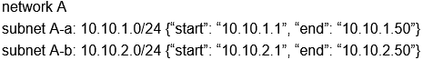

  * Network Namespace：是一种网络的隔离机制，通过网络命名空间的每个 router 都有自己独立的路由表
* **Port**：是虚拟交换机上的一个端口。Port 上定义了 MAC 地址和 IP 地址，当 instance 的虚拟网卡 VIF（Virtual Interface） 绑定到 Port 时，Port 会将 MAC 和 IP 分配给 VIF。

  * Project、Network、Subnet、Port之间的关系：Project 1 : m Network 1 : m Subnet 1 : m Port 1 : 1 VIF m : 1 Instance。

## 功能

> Neutron 为整个 OpenStack 环境提供网络支持，包括**二层交换，三层路由，负载均衡，防火墙和 VPN 等**。Neutron 提供了一个灵活的框架，通过配置，无论是开源还是商业软件都可以被用来实现这些功能。&#x20;

* 二层交换 Switching

  * Nova 的 Instance 是通过虚拟交换机连接到虚拟二层网络的。Neutron 支持多种虚拟交换机，包括 Linux 原生的 Linux Bridge 和 Open vSwitch。 Open vSwitch（OVS）是一个开源的虚拟交换机，它支持标准的管理接口和协议。
  * 利用 Linux Bridge 和 OVS，Neutron 除了可以创建传统的 VLAN 网络，还可以创建基于隧道技术的 Overlay 网络，比如 VxLAN 和 GRE（Linux Bridge 目前只支持 VxLAN
* 三层路由 Routing

  * &#x20;Instance 可以配置不同网段的 IP，Neutron 的 router（虚拟路由器）实现 Instance 跨网段通信。router 通过 IP forwarding，iptables 等技术来实现路由和 NAT。
  * Neutron 路由器是一个三层的（L3）的抽象，其模拟物理路由器，为用广提供路由、NAT等服务，在 Openstack网络中，不用子网之间的通信需要路由器，网络与外部网络之间的通信更需要路由器。
  * Neutron 提供虚拟路由器，也支持物理路由器。例如，两个隔离的ⅥLAN网络之间需要实现通信，可以通过物理路由器实现，由物理路由器提供相应的 IP 路由表，确保两个IP子网之间的通信，将两个VLAN网络中的虚拟机默认网关分别设置为路由路由器的接口A和B的IP地址。VLAN中的虚拟机要与 VLANB中的虚拟机通信时，数据包将通过LANA中的物理网卡到达路由器，有物理路由器转发到 VLAN B中的物理网卡，在到目的的虚拟机。

  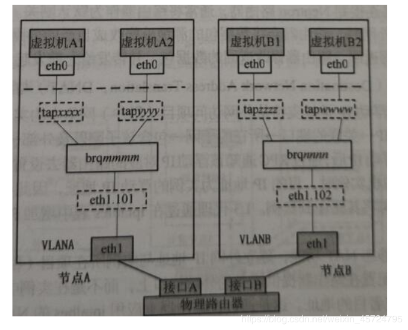
* 负载均衡 Load Balancing

  1. Openstack 在 Grizzly 版本第一次引入了 Load-Balancing-as-a-Service（LBaaS），提供了将负载分发到多个 instance 的能力。
  2. LBaaS 支持多种负载均衡产品和方案，不同的实现以 Plugin 的形式集成到 Neutron，目前默认的 Plugin 是 HAProxy。
* 防火墙 Firewalling

  1. Neutron 通过 Security Group 和 Firewall-as-a-Service 两种方式来保障 instance 和网络的安全性。
  2. Security Group 通过 iptables 限制进出的 instance 的网络包。
  3. Firewall-as-a-Service FWaas 通过 iptables 限制进出虚拟路由器的网络包。

# 二、架构

## 核心架构

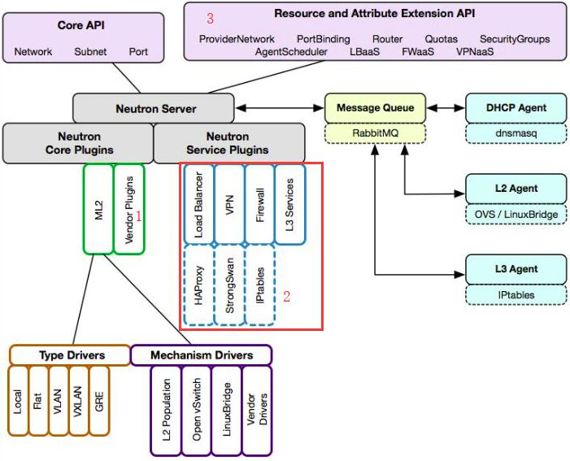

1. Neutron Server：对外提供 OpenStack 网络 API，接收请求，并调用 Plugin 处理请求。
2. Plugin：处理 Neutron Server 发来的请求，维护 OpenStack 逻辑网络状态， 并调用 Agent 处理请求。
3. Agent：处理 Plugin 的请求，负责在 network provider 上真正实现各种网络功能。
4. Network Provider：提供网络服务的虚拟或物理网络设备，例如 Linux Bridge，Open vSwitch 或者其他支持 Neutron 的物理交换机。
5. Queue：Neutron Server，Plugin 和 Agent 之间通过 Messaging Queue 通信和调用。
6. Database：存放 OpenStack 的网络状态信息，包括 Network, Subnet, Port, Router 等。

## 组件详解

### 1.Neutron Server 详解

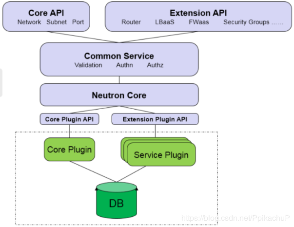

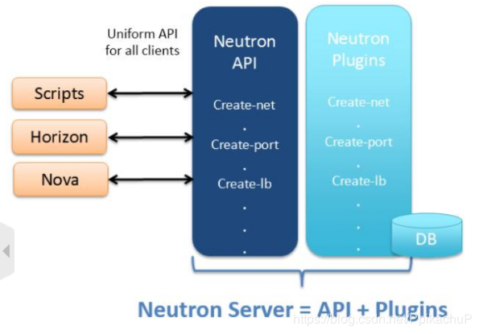

1. Core API：对外提供管理 network, subnet 和 port 的 RESTful API。
2. Extension API：对外提供管理 router, load balance, firewall 等资源 的 RESTful API。
3. Commnon Service：认证和校验 API 请求。
4. Neutron Core：Neutron server 的核心处理程序，通过调用相应的 Plugin 处理请求。
5. Core Plugin API：定义了 Core Plgin 的抽象功能集合，Neutron Core 通过该 API 调用相应的 Core Plgin。
6. Extension Plugin API：定义了 Service Plgin 的抽象功能集合，Neutron Core 通过该 API 调用相应的 Service Plgin。
7. Core Plugin：实现了 Core Plugin API，在数据库中维护 network, subnet 和 port 的状态，并负责调用相应的 agent 在 network provider 上执行相关操作，比如创建 network。
8. Service Plugin：实现了 Extension Plugin API，在数据库中维护 router, load balance, security group 等资源的状态，并负责调用相应的 agent 在 network provider 上执行相关操作，比如创建 router。

### 2.ML2 Core Plugin 详解

　　1.  Neutron 可以通过开发不同的 plugin 和 agent 支持不同的网络技术，但是随着支持的 network provider 数量的增加，开发人员面临两个突出的问题：

* 只能在 OpenStack 中使用一种 core plugin，多种 network provider 无法共存。只使用一个 core plugin 本身没有问题。但问题在于传统的 core plugin 与 core plugin agent 是一一对应的。也就是说，如果选择了 linux bridge plugin，那么 linux bridge agent 将是唯一选择，就必须在 OpenStack 的所有节点上使用 linux bridge 作为虚拟交换机（即 network provider）。
* 不同 plugin 之间存在大量重复代码，开发新的 plugin 工作量大。所有传统的 core plugin 都需要编写大量重复和类似的数据库访问的代码，大大增加了 plugin 开发和维护的工作量。

　　2\. Moduler Layer 2（ML2）：是 Neutron 在 Havana 版本实现的一个新的 core plugin，用于替代原有的 linux bridge plugin 和 open vswitch plugin。 作为新一代的 core plugin，提供了一个框架，允许在 OpenStack 网络中同时使用多种 Layer 2 网络技术，不同的节点可以使用不同的网络实现机制。

　　3\. ML2 对二层网络进行抽象和建模，引入了 type driver 和 mechansim driver。这两类 driver 解耦了 Neutron 所支持的网络类型（type）与访问这些网络类型的机制（mechanism），其结果就是使得 ML2 具有非常好的弹性，易于扩展，能够灵活支持多种 type 和 mechanism。

* Type Driver：Neutron 支持的每一种网络类型都有一个对应的 ML2 type driver。type driver 负责维护网络类型的状态，执行验证，创建网络等。 ML2 支持的网络类型包括 local, flat, vlan, vxlan 和 gre。&#x20;
* Mechansim Driver：Neutron 支持的每一种网络机制都有一个对应的 ML2 mechansim driver。mechanism driver 负责获取由 type driver 维护的网络状态，并确保在相应的网络设备（物理或虚拟）上正确实现这些状态。

  1. Agent-based类型：包括 linux bridge, open vswitch 等
  2. Controller-based类型：包括 OpenDaylight, VMWare NSX 等
  3. 基于物理交换机：包括 Cisco Nexus, Arista, Mellanox 等。

  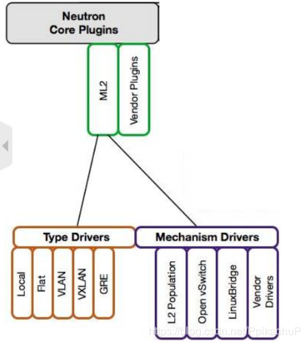

### 3.Service Plugin / Agent 详解

1. Core Plugin/Agent 负责管理核心实体：net, subnet 和 port。而对于更高级的网络服务，则由 Service Plugin/Agent 管理。
2. Service Plugin 及其 Agent 提供更丰富的扩展功能，包括路由，load balance，firewall等。
3. DHCP：dhcp agent 通过 dnsmasq 为 instance 提供 dhcp 服务。
4. Routing：l3 agent 可以为 project（租户）创建 router，提供 Neutron subnet 之间的路由服务。路由功能默认通过 IPtables 实现。
5. Firewall：l3 agent 可以在 router 上配置防火墙策略，提供网络安全防护。另一个与安全相关的功能是 Security Group，也是通过 IPtables 实现。 Firewall 与 Security Group 的区别在于：

   1. Firewall 安全策略位于 router，保护的是某个 project 的所有 network。
   2. Security Group 安全策略位于 instance，保护的是单个 instance。
6. Load Balance：Neutron 默认通过 HAProxy 为 project 中的多个 instance 提供 load balance 服务。

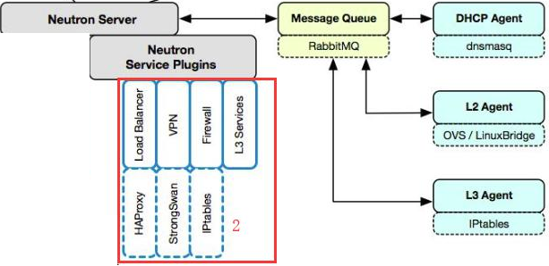

## 部署方式

1. 计算节点和控制节点

   
2. 多个节点，适合大规模的OpenStack平台

   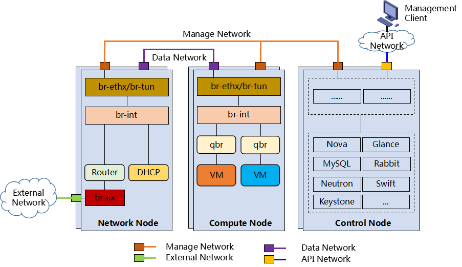

# 三、Open vSwitch

## 简介

1. 概念：Open vSwitch，简称OVS，是一个虚拟交换软件，主要用于虚拟机VM环境，作为一个虚拟交换机，支持Xen/XenServer, KVM, and VirtualBox多种虚拟化技术。
2. 作用：让大规模网络自动化可以通过编程扩展，支持跨越多个物理服务器的分布式环境，同时仍然支持标准的管理接口和协议（例如NetFlow, sFlow, SPAN, RSPAN, CLI, LACP, 802.1ag）。
3. 工作原理

   1. 在虚拟化的环境中，一个虚拟交换机主要有两个作用：传递虚拟机之间的流量，以及实现虚拟机和外界网络的通信。
   2. 内核模块实现了多个“数据路径”（类似于网桥），每个都可以有多个“vports”（类似于桥内的端口）。每个数据路径也通过关联一下流表（flow table）来设置操作，而这些流表中的流都是用户空间在报文头和元数据的基础上映射的关键信息，一般的操作都是将数据包转发到另一个vport。当一个数据包到达一个vport，内核模块所做的处理是提取其流的关键信息并在流表中查找这些关键信息。当有一个匹配的流时它执行对应的操作。如果没有匹配，它会将数据包送到用户空间的处理队列中（作为处理的一部分，用户空间可能会设置一个流用于以后碰到相同类型的数据包可以在内核中执行操作）。

## 组成

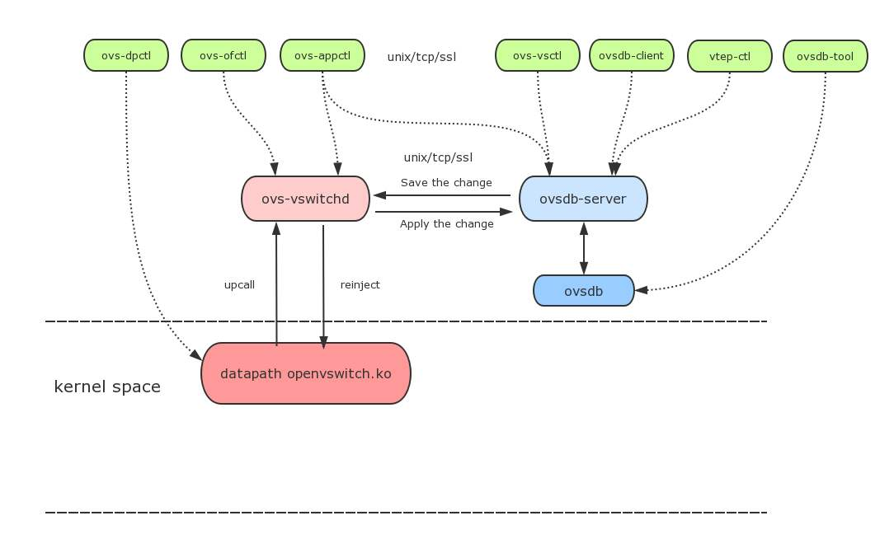

1. ovs-vswitchd：守护程序，实现交换功能，和Linux内核兼容模块一起，实现基于流的交换flow-based switching。
2. ovsdb-server：轻量级的数据库服务，主要保存了整个OVS的配置信息，包括接口啊，交换内容，VLAN啊等等。ovs-vswitchd会根据数据库中的配置信息工作。
3. ovs-dpctl：一个工具，用来配置交换机内核模块，可以控制转发规则。
4. ovs-vsctl：网桥、接口等的创建、删除、设置、查询等。
5. ovs-appctl：主要是向OVS守护进程发送命令的，一般用不上。
6. ovsdbmonitor：GUI工具来显示ovsdb-server中数据信息。
7. ovs-controller：一个简单的OpenFlow控制器
8. ovs-ofctl：用来控制OVS作为OpenFlow交换机工作时候的流表内容。

## 工作流程

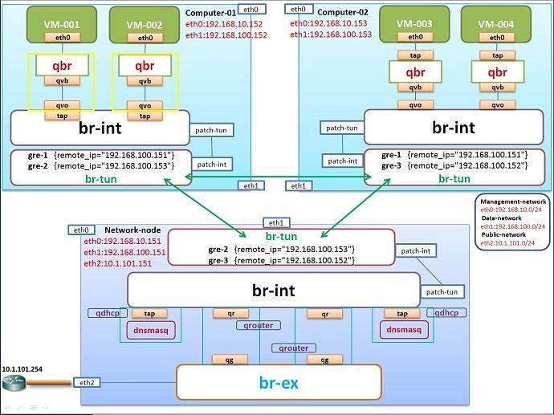

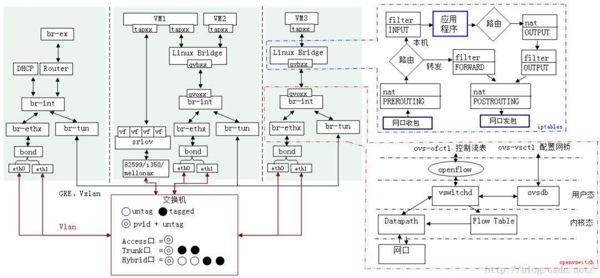

1. VM实例 instance 产生一个数据包并发送至实例内的虚拟网络接口VNIC，图中就是instance中的eth0.
2. 这个数据包会传送到物理节点上的VNIC接口，如图就是vnet接口vnet1。
3. 数据包从vnet NIC出来，到达桥（虚拟交换机）br100上.
4. 数据包经过交换机的处理，从物理节点上的物理接口发出，如图中物理节点上的eth0.
5. 数据包从eth0出去的时候，是按照物理节点上的路由以及默认网关操作的，这个时候该数据包其实已经不受我们的linux-box的控制了,进入报文的传输环节。

# 四、常用操作

## 网络、子网、路由、端口管理

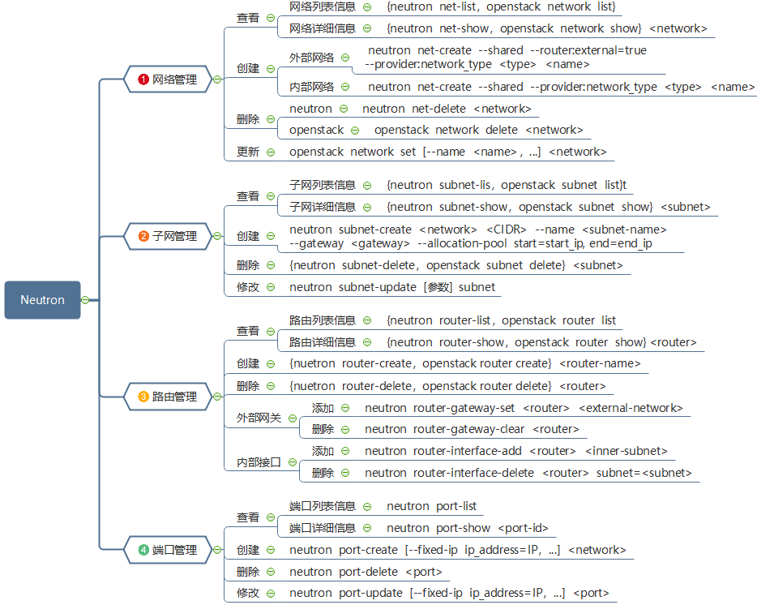

## 防火墙管理

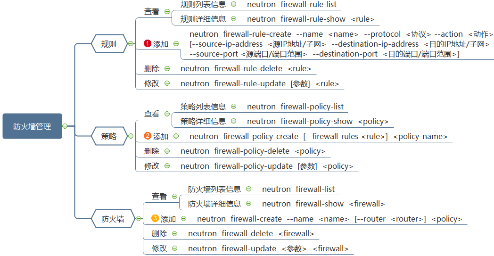

## 负载均衡管理

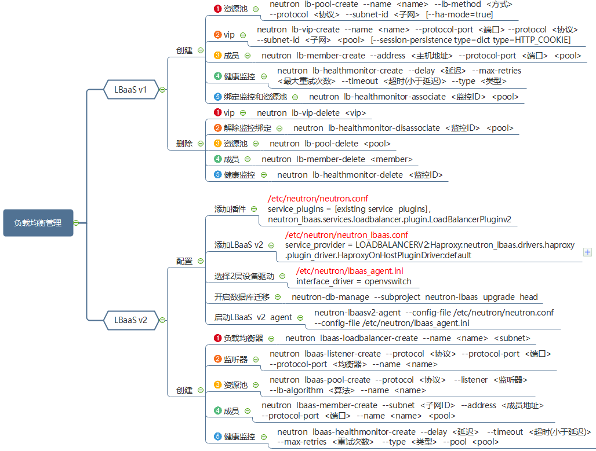

## Open vSwitch 管理

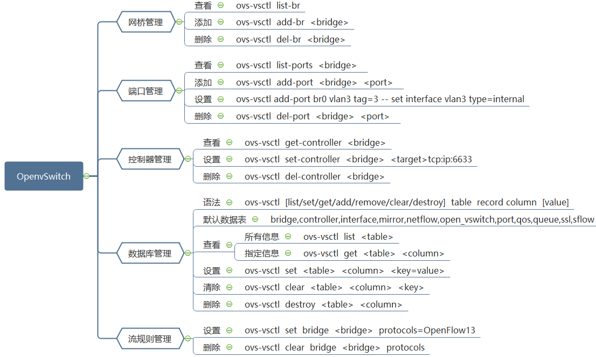
