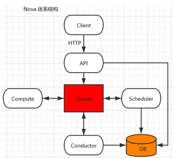
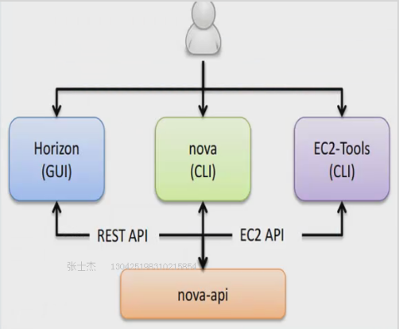
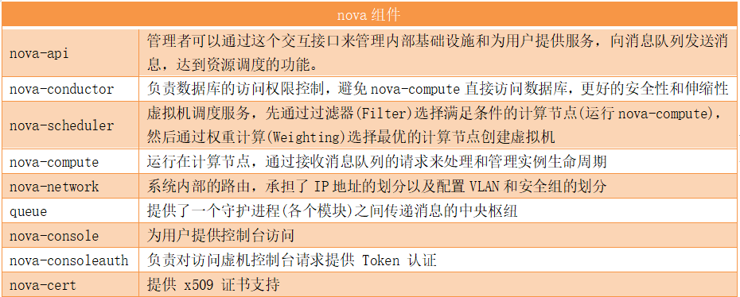
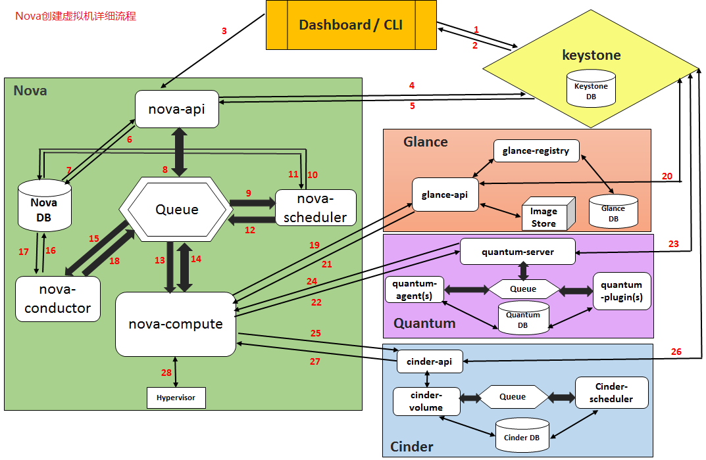
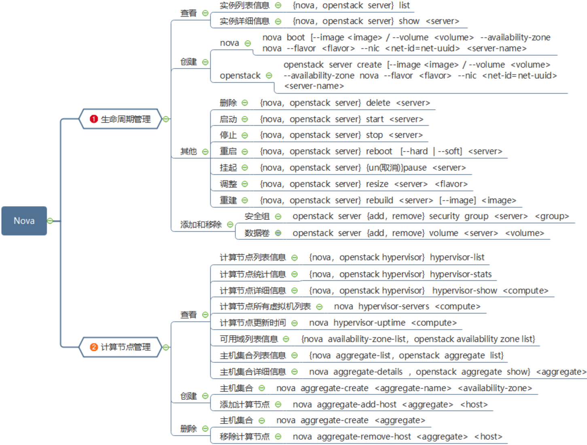
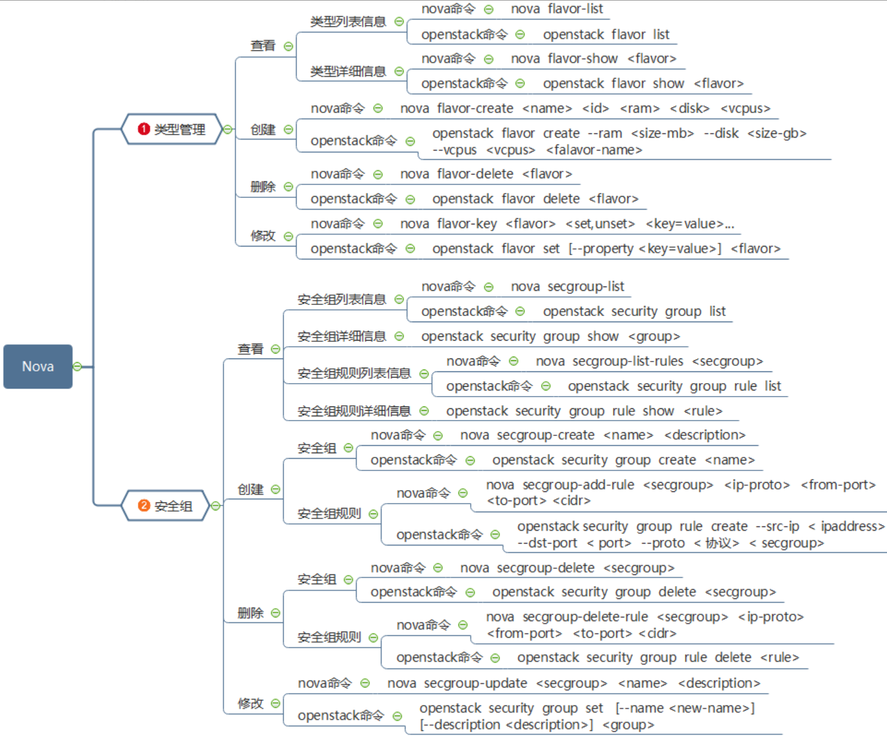
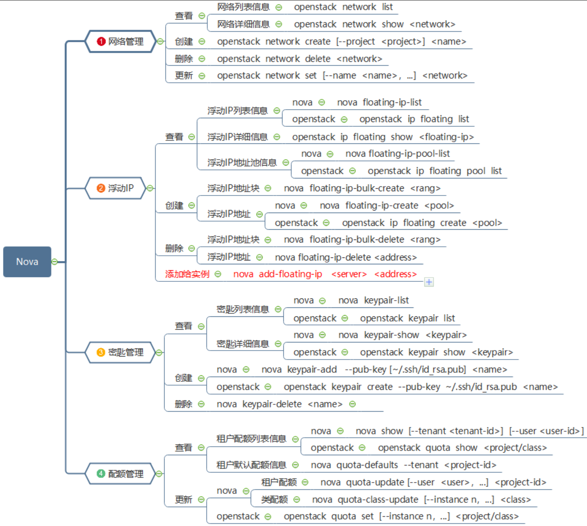

# OpenStack之Nova组件详解

# 一、作用

1. Nova是OpenStack最核心的服务模块，负责管理和维护云计算环境的计算资源，负责整个云环境虚拟机生命周期的管理。
2. Nova是OpenStack的计算服务，负责维护和管理的网络和存储，提供计算服务。

# 二、体系结构

# 三、组件

- **nova-api**：实现了RESTful API功能，是外部访问Nova的唯一途径。接收外部的请求并通过Message Queue将请求发送给其他的服务组件，同时也兼容EC2 API，所以也可以用EC2的管理工具对nova进行日常管理。
- **nova-scheduler：**  决策虚拟机创建在哪个主机（计算节点）上。决策一个虚拟机应该调度到某物理节点，需要分为两个步骤：

  1. 过滤（filter）：过滤出可以创建虚拟机的主机。

  2\. 计算权值（weight）：根据权重大小进行分配，默认根据资源可用空间进行权重排序。
- **nova-compute：**  负责虚拟机的生命周期管理，创建并终止虚拟机实例的工作后台程序hypervisor api
- **nova-conductor：**  计算节点访问数据的中间件，nova-compute服务和数据库之间的中间件。它消除了对云数据库的直接访
- **nova-api-metadata：**  从实例中接收元数据请求。nova-api-metadata服务通常在nova-network安装时使用的是多宿主模式运行。
- nova-placement-api：跟踪每个计算提供者的仓库和使用情况。（S版本之后，作为独立的服务组件）
- **nova-consoleauth：**  用于控制台的授权验证，授权控制台代理提供的用户令牌。此服务必须运行用于控制台代理工作。您可以运行任何类型的代理，而不是集群配置中的单nova-consoleauth服务。
- **Queue：**  在守护进程之间传递消息的中心。通常使用RabbitMQ也可以用另一个基于AMQP的消息队列，例如ZeroMQ。

# 四、工作流程

1. 界面或命令行通过RESTful API向keystone获取认证信息。
2. keystone通过用户请求认证信息，正确后生成token返回给对应的认证请求。
3. 界面或命令行通过RESTful API向nova-api发送一个创建虚拟机的请求（携带token）。
4. nova-api接受请求后向keystone发送认证请求，查看token是否为有效用户。
5. keystone验证token是否有效，如有效则返回有效的认证和对应的角色（注：有些操作需要有角色权限才能操作）。
6. 通过认证后nova-api检查创建虚拟机参数是否有效合法后和数据库通讯。
7. 当所有的参数有效后初始化新建虚拟机的数据库记录。
8. nova-api通过rpc.call向nova-scheduler请求是否有创建虚拟机的资源(Host ID)。
9. nova-scheduler进程侦听消息队列，获取nova-api的请求。
10. nova-scheduler通过查询nova数据库中计算资源的情况，并通过调度算法计算符合虚拟机创建需要的主机。
11. 对于有符合虚拟机创建的主机，nova-scheduler更新数据库中虚拟机对应的物理主机信息。
12. nova-scheduler通过rpc.cast向nova-compute发送对应的创建虚拟机请求的消息。
13. nova-compute会从对应的消息队列中获取创建虚拟机请求的消息。
14. nova-compute通过rpc.call向nova-conductor请求获取虚拟机消息。
15. nova-conductor从消息队队列中拿到nova-compute请求消息。
16. nova-conductor根据消息查询虚拟机对应的信息。
17. nova-conductor从数据库中获得虚拟机对应信息。
18. nova-conductor把虚拟机信息通过消息的方式发送到消息队列中。
19. nova-compute从对应的消息队列中获取虚拟机信息消息。
20. nova-compute通过keystone的RESTfullAPI拿到认证的token，并通过HTTP请求glance-api获取创建虚拟机所需要镜像。
21. glance-api向keystone认证token是否有效，并返回验证结果。
22. token验证通过，nova-compute获得虚拟机镜像信息(URL)。
23. nova-compute通过keystone的RESTfull API拿到认证k的token，并通过HTTP请求neutron-server获取创建虚拟机所需要的网络信息。
24. neutron-server向keystone认证token是否有效，并返回验证结果。
25. token验证通过，nova-compute获得虚拟机网络信息。
26. nova-compute通过keystone的RESTfull API拿到认证的token，并通过HTTP请求cinder-api获取创建虚拟机所需要的持久化存储信息。
27. cinder-api向keystone认证token是否有效，并返回验证结果。
28. token验证通过，nova-compute获得虚拟机持久化存储信息。
29. nova-compute根据instance的信息调用配置的虚拟化驱动来创建虚拟机。

# 五、常用操作

## 1.生命周期和虚拟机管理

## 2.云主机类型和安全组管理

## 3.网络、浮动IP、密匙和配额管理

