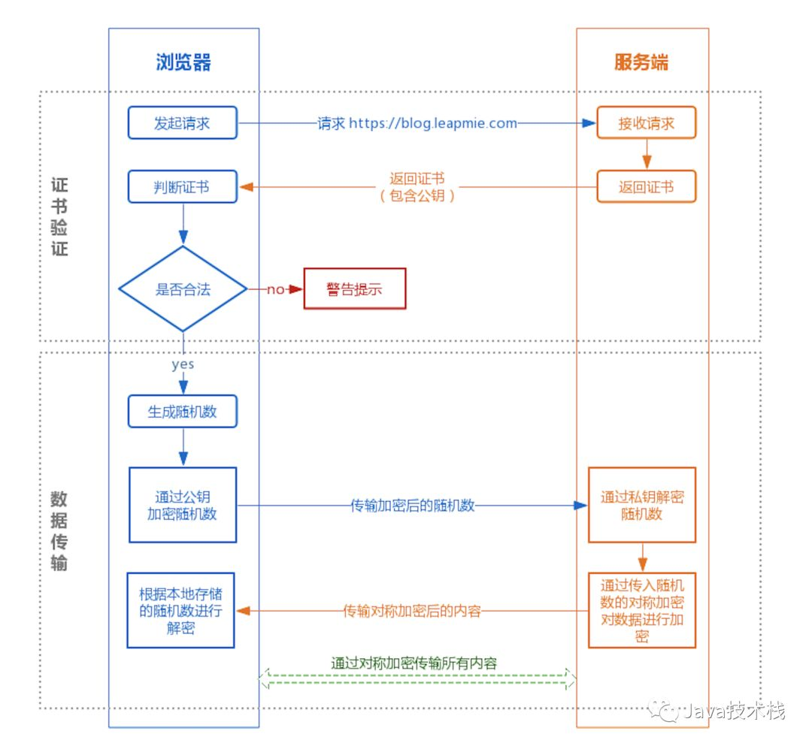

# https原理

## **HTTPS 的实现原理**

大家可能都听说过 HTTPS 协议之所以是安全的是因为 HTTPS 协议会对传输的数据进行加密，而加密过程是使用了非对称加密实现。但其实，HTTPS 在内容传输的加密上使用的是对称加密，非对称加密只作用在证书验证阶段。

HTTPS的整体过程分为证书验证和数据传输阶段，具体的交互过程如下：

① 证书验证阶段

1. 浏览器发起 HTTPS 请求
2. 服务端返回 HTTPS 证书
3. 客户端验证证书是否合法，如果不合法则提示告警

② 数据传输阶段

1. 当证书验证合法后，在本地生成随机数
2. 通过公钥加密随机数，并把加密后的随机数传输到服务端
3. 服务端通过私钥对随机数进行解密
4. 服务端通过客户端传入的随机数构造对称加密算法，对返回结果内容进行加密后传输
