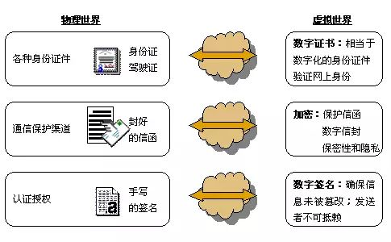
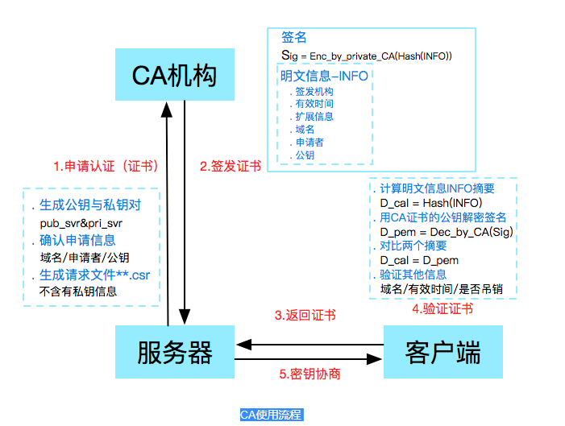
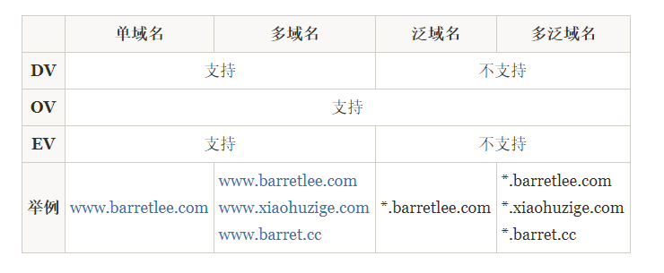

# 数字证书,CA,CA证书,证书链 

## 数字证书

　　数字证书就是互联网通讯中标志通讯各方身份信息的一串数字，提供了一种在互联网上验证通信实体身份的方式。

　　数字证书不是数字身份证，而是身份认证机构盖在数字身份证上的一个章或印（或者说加在数字身份证上的一个签名）。其作用类似于现实生活中司机的驾驶执照或日常生活中的身份证。

​​

　　数字证书就是CA发行的，CA是Certificate Authority的缩写，也叫“证书授权中心”。它是负责管理和签发证书（即服务器证书，由域名、公司信息、序列号和签名信息组成）的第三方机构，作用是检查证书持有者身份的合法性，并签发证书，以防证书被伪造或篡改。任何个体/组织都可以扮演 CA 的角色，只不过难以得到客户端的信任，能够受浏览器默认信任的 CA 大厂商有很多，其中 TOP5 是 Symantec、Comodo、Godaddy、GolbalSign 和 Digicert。

　　所以，CA实际上是一个机构，负责“证件”印制核发。就像负责颁发身份证的公安局、负责发放行驶证、驾驶证的车管所。

## CA证书

　　CA 证书就是CA颁发的证书。 CA证书也就我们常说的数字证书，包含证书拥有者的身份信息，CA机构的签名，公钥和私钥。身份信息用于证明证书持有者的身份；CA签名用于保证身份的真实性；公钥和私钥用于通信过程中加解密，从而保证通讯信息的安全性。

　　CA是权威可信的第三方机构，是“发证机关”。CA证书是CA发的“证件”，用于证明自身身份，就像身份证和驾驶证。

​​

　　**流程介绍:**

* a、服务方S向第三方机构CA提交公钥、组织信息、个人信息(域名)等信息并申请认证;
* b、CA通过线上、线下等多种手段验证申请者提供信息的真实性，如组织是否存在、企业是否合法，是否拥有域名的所有权等;
* c、如信息审核通过，CA会向申请者签发认证文件-证书。证书包含以下信息：申请者公钥、申请者的组织信息和个人信息、签发机构 CA的信息、有效时间、证书序列号等信息的明文，同时包含一个签名; 签名的产生算法：首先，使用散列函数计算公开的明文信息的信息摘要，然后，采用 CA 的私钥对信息摘要进行加密，密文即签名;
* d、客户端 C 向服务器 S 发出请求时，S 返回证书文件;
* e、客户端 C读取证书中的相关的明文信息，采用相同的散列函数计算得到信息摘要，然后，利用对应 CA的公钥解密签名数据，对比证书的信息摘要，如果一致，则可以确认证书的合法性，即公钥合法;
* f、客户端然后验证证书相关的域名信息、有效时间等信息;
* g、客户端会内置信任CA的证书信息(包含公钥)，如果CA不被信任，则找不到对应 CA的证书，证书也会被判定非法。

　　**辅助理解：**

　　1，后来，苏珊感觉不对劲，发现自己无法确定公钥是否真的属于鲍勃。她想到了一个办法，要求鲍勃去找”证书中心”（certificate authority，简称CA），为公钥做认证。证书中心用自己的私钥，对鲍勃的公钥和一些相关信息一起加密，生成”数字证书”（Digital Certificate）。
2，鲍勃拿到数字证书以后，就可以放心了。以后再给苏珊写信，只要在签名的同时，再附上数字证书就行了。
3，苏珊收信后，用CA的公钥解开数字证书，就可以拿到鲍勃真实的公钥了，然后就能证明”数字签名”是否真的是鲍勃签的。

　　**注意:**

　　1、申请证书不需要提供私钥，确保私钥永远只能服务器掌握;
2、证书的合法性仍然依赖于非对称加密算法，证书主要是增加了服务器信息以及签名;
3、内置 CA 对应的证书称为根证书，颁发者和使用者相同，自己为自己签名，即自签名证书
4、证书=公钥+申请者与颁发者信息+签名;

　　**服务器证书分类:**

　　可以通过两个维度来分类，一个是商业角度，一个是业务角度。

​​

　　需要强调的是，不论是 DV、OV 还是 EV 证书，其加密效果都是一样的！ 它们的区别在于：

* DV（Domain Validation），面向个体用户，安全体系相对较弱，验证方式就是向 whois 信息中的邮箱发送邮件，按照邮件内容进行验证即可通过；
* OV（Organization Validation），面向企业用户，证书在 DV 证书验证的基础上，还需要公司的授权，CA 通过拨打信息库中公司的电话来确认；
* EV（Extended Validation），打开 Github 的网页，你会看到 URL 地址栏展示了注册公司的信息，这会让用户产生更大的信任，这类证书的申请除了以上两个确认外，还需要公司提供金融机构的开户许可证，要求十分严格。

　　‍

## RSA密钥交换算法

　　客户端使用服务器端`RSA`​公钥加密 `Pre Master`​ 发给服务器。服务器使用自己的`RSA`​私钥尝试解密，解密成功即得到 `Pre Master`​。于是客户端、服务器端分享了一个秘密，这个秘密就是 `Pre Master`​。

　　这个秘密只有双方知道，任何第三方都无法知道。所以双方可以以此秘密推导出加密/解密的Key，用于保证http的安全。

　　**客户端为何要相信对方扔过来RSA公钥就是服务器的:**

　　客户端使用CA的公钥就可以将数字签名解密，得到摘要。看看得到的摘要与自己计算证书的摘要是不是相同，相同就说明一个事实，证书确实是CA颁发的。

　　‍

## 证书链

　　CA根证书和服务器证书中间增加一级证书机构，即中间证书，证书的产生和验证原理不变，只是增加一层验证，只要最后能够被任何信任的CA根证书验证合法即可。

* a.服务器证书 server.pem 的签发者为中间证书机构 inter，inter 根据证书 inter.pem 验证 server.pem 确实为自己签发的有效证书;
* b.中间证书 inter.pem 的签发 CA 为 root，root 根据证书 root.pem 验证 inter.pem 为自己签发的合法证书;
* c.客户端内置信任 CA 的 root.pem 证书，因此服务器证书 server.pem 的被信任。

　　**二级证书结构存在的优势：**

* a.减少根证书结构的管理工作量，可以更高效的进行证书的审核与签发;
* b.根证书一般内置在客户端中，私钥一般离线存储，一旦私钥泄露，则吊销过程非常困难，无法及时补救;
* c.中间证书结构的私钥泄露，则可以快速在线吊销，并重新为用户签发新的证书;
* d.证书链四级以内一般不会对 HTTPS 的性能造成明显影响。

　　**证书链有以下特点：**

* a.同一本服务器证书可能存在多条合法的证书链。因为证书的生成和验证基础是公钥和私钥对，如果采用相同的公钥和私钥生成不同的中间证书，针对被签发者而言，该签发机构都是合法的 CA，不同的是中间证书的签发机构不同;
* b.不同证书链的层级不一定相同，可能二级、三级或四级证书链。中间证书的签发机构可能是根证书机构也可能是另一个中间证书机构，所以证书链层级不一定相同。

### 证书链格式

　　一般证书链格式是`.chain`​，证书定义顺序是**倒序**的，即先权威CA再根CA。

　　以根CA+一个权威CA举例：

```css
-----BEGIN CERTIFICATE-----
权威CA公钥
-----END CERTIFICATE-----

-----BEGIN CERTIFICATE-----
根CA公钥
-----END CERTIFICATE-----
```

　　证书链中也可包含主体与签发信息,仅用于便于确定证书所属不参与认证，举例：

```armasm
subject=C = CN, O = XXXX, CN = XXXX RSACA
issuer=C = CN, O = XXXX, CN = XXXX ROOT RSACA
-----BEGIN CERTIFICATE-----
权威CA公钥
-----END CERTIFICATE-----

subject=C = CN, O = XXXX, CN = XXXX ROOT RSACA
issuer=C = CN, O = XXXX, CN = XXXX ROOT RSACA
-----BEGIN CERTIFICATE-----
根CA公钥
-----END CERTIFICATE-----
```

### 合并域名证书与证书链

　　Nginx等web服务器需要将证书链与域名证书合并成PEM文件，作为公钥直接使用。

　　域名证书内容如下：

```css
-----BEGIN CERTIFICATE-----
域名公钥
-----END CERTIFICATE-----
```

　　证书链如下：

```css
-----BEGIN CERTIFICATE-----
权威CA公钥
-----END CERTIFICATE-----

-----BEGIN CERTIFICATE-----
根CA公钥
-----END CERTIFICATE-----
```

　　其合并证书链方法，即以 域名证书、权威CA证书、根CA证书 顺序，将证书内容复制到同一文件中。

　　合并结果如下：

```css
-----BEGIN CERTIFICATE-----
域名公钥
-----END CERTIFICATE-----

-----BEGIN CERTIFICATE-----
权威CA公钥
-----END CERTIFICATE-----

-----BEGIN CERTIFICATE-----
根CA公钥
-----END CERTIFICATE-----
```

　　合并出的证书直接作为公钥证书代替证书。

```bash
# 1、生成P10申请书
https://ssl.cfca.com.cn/Web/tool
# 2、生成服务器证书
https://cs.cfca.com.cn/cgi-bin/compoundCertDownload/v_input.do?displayAgreement=true

# 3、会生成2个文件
key.txt      # 私钥
cert.cer     # 服务器证书
csr.txt      # P10
=================================

##### 私钥 #####
SSL.KEY可以直接修改名称为priv.key

##### 公钥 #####
# 公钥生成（server.crt）通过文本编辑器合成一个
cert.cer           # 服务器证书
CFCA_ACS_OCA31.cer # 中级证书
CFCA_ACS_CA.cer    # 根证书

------------------------------------------------

##### ca证书链 #####
# CA证书链生成（ca.crt）通过文本编辑器合成一个
CFCA_ACS_OCA31.cer # 中级证书
CFCA_ACS_CA.cer    # 根证书

# 提示证书不安全
1.是否是证书签发机构
2.证书有效期
3.证书是否绑定域名
4.时间同步
```

## 扩展阅读

### P7B提取证书链与公钥证书

　　P7B格式是同时包含证书链和域名公钥证书的，可以通过openssl命令提取。

> 以下命令输出证书的顺序是不对的，需要按subject和issuer描述调整顺序，域名证书->权威CA->根CA

```bash
## p7b可指定PEM或DER格式，也可以经过base64加密
## 以下列出常见几条命令：
# PEM格式未base64
openssl pkcs7 -inform PEM -print_certs -in xxx.p7b -out public.pem
# DER格式未base64
openssl pkcs7 -inform DER -print_certs -in xxx.p7b -out public.pem
# PEM+base64
base64 -d xxx.p7b | openssl pkcs7 -inform PEM -print_certs -out public.pem
# DER+base64
base64 -d xxx.p7b | openssl pkcs7 -inform DER -print_certs -out public.pem
```

### 校验PEM证书与密钥是否配套

```bash
# 两者输出同样的md5值说明配套
openssl x509 -noout -modulus -in public.pem |openssl md5
openssl rsa -noout -modulus -in private.key |openssl md5
```

　　参考：[https://www.cnblogs.com/hellxz/p/17803916.html](https://www.cnblogs.com/hellxz/p/17803916.htm)

　　‍
