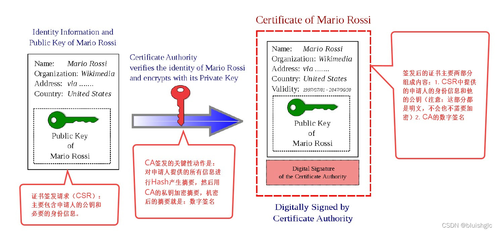
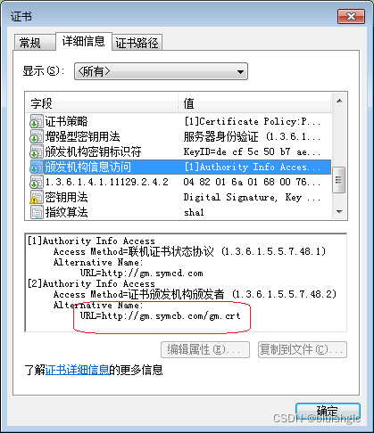

# 证书签发的原理与流程

相关文档

[openssl](001%20shell自动化运维/shell%20命令手册/tools/openssl.md)    [cfssl](ca制作工具/cfssl.md)    [easy-rsa3](ca制作工具/easy-rsa3.md)    [数字证书,CA,CA证书,证书链](数字证书,CA,CA证书,证书链%20.md)

## 1 生成证书的步骤与原理

要理解创建证书的每一步操作必须要先理解创建证书的流程和每一步的含义。生成证书的标准流程是这样的：

- 生成自己的私钥文件(.key）
- 基于私钥生成证书请求文件(.csr或.req)
- 将证书请求文件(.csr)提交给证书颁发机构（CA），CA会对提交的证书请求中的所有信息生成一个摘要，然后使用CA根证书对应的私钥进行加密，这就是所谓的“签名”操作，完成签名后就会得到真正的签发证书(.cer或.crt)
- 用户拿到签发后的证书，可能需要导入到自己的密钥库中，如Java的keystore，或根据需要再进行各种格式转换(.pem .p12 .jks等等)

注意：

再次解释一下“签名”的含义，这个概念很关键。在CA签发的证书中，包含申请者的公钥在内，几乎所有的数据都是明文的，也都是申请者自己提供的（当然CA需要审核），签发的证书唯一多出来的信息就是基于申请者提供的所有信息生成了一份摘要，然后用CA自己的私钥对摘要进行了加密，这段加密后的密文被称之为“签名”，这部分数据是返还的签发证书(.cer或.crt)中多出来的关键数据。下图是CA签发证书的原理：



---

## 2 标准的CA签发流程

对应文章开头提及的证书生成流程，标准CA签发流程中的第三步是需要CA机构操作的，我们会解释CA机构要做的工作。

### 2.1 创建私钥（.key)

```bash
openssl genrsa -out my.key 2048
```

### 2.2 基于私钥创建证书签名请求（.csr）

```bash
openssl req -new -key my.key -out my.csr -subj "/C=CN/ST=shanghai/L=shanghai/O=example/OU=it/CN=domain1/CN=domain2"
```

这一操作有一个关键点：除了在请求中提交了申请人的一些组织信息之外，最重要的就是把上次生成的私钥作为参数传给命令行，这是因为命令行工具能根据私钥算出对应的公钥，公钥是未来证书的核心组成部分。

### 2.3 （可选）直接同时生成私钥和证书签名请求

上述两个操作是可以通过一条命令完成的，即同时生成my.key和my.csr两个文件：

```bash
openssl req -new -newkey rsa:2048 -nodes -keyout my.key -out my.csr -subj "/C=CN/ST=shanghai/L=shanghai/O=example/OU=it/CN=domain1/CN=domain2"

# 两个关键参数：
# -newkey rsa:2048  生成一个新的证书签名请求，同时生成一个2048位的RSA私钥
# -nodes            不对新私钥加密
```

### 2.4 将证书申请请求（.csr）提交给CA认证机构来申请证书（.crt）

如上所述，此为事务性的审批操作，无本地命令行操作。但是在CA机构那里，执行人员一定会使用CA自己的密钥对CSR进行签名操作，这一步操作与我们将在第4节介绍的**使用私有CA证书对应的私钥进行签名**性质上是一样的。

简单将：从CSR到CRT，就是一个签名过程，这个过程需要用签发方的私钥。走标准CA签发流程，是CA机构来操作，用的是他的根证书对应的私钥来签名；走自签名证书或私有CA证书的流程，用的就是自己的私钥。

### 2.5 CA机构生成CA证书链

绝大多书情况下，CA机构返还不是一个单一的证书，而一个证书链。关于[数字证书,CA,CA证书,证书链](数字证书,CA,CA证书,证书链%20.md)，我们会单独起一篇文章进行解释。这里先简单介绍一下：通常机构颁发的证书中会包含完整的[数字证书,CA,CA证书,证书链](数字证书,CA,CA证书,证书链%20.md)，可以直接使用。如果没有包含完整的[数字证书,CA,CA证书,证书链](数字证书,CA,CA证书,证书链%20.md)，浏览器通常会自动下载并补全上级证书，安装完成后不再显示安全警告。在颁发的证书中都会有它的上级和下级证书的相关信息，也包括下载地址，所以浏览器是可以自动下载补全的。但很多企业内网往往不允许连接到互联网，无法补全证书链。所以最好的办法是先[补全证书链](数字证书,CA,CA证书,证书链%20.md)，再部署到网站上。

一张标准的证书，都会包含自己的颁发者名称，以及颁发者机构访问信息： Authority Info Access，其中就会有颁发者CA证书的下载地址。

在这里插入图片描述



通过这个URL，我们可以获得这个证书的颁发者证书，即中间证书。Windows、IOS、MAC都支持这种证书获取方式。

---

## 3 生成自签名证书

### 3.1 创建私钥（.key）

```bash
openssl genrsa -out my.key 2048
```

### 3.2 基于私钥（.key）创建证书签名请求（.csr）

```bash
openssl req -new -key my.key -out my.csr -subj "/C=CN/ST=shanghai/L=shanghai/O=example/OU=it/CN=domain1/CN=domain2"
```

### 3.3 （可选）直接同时生成私钥（.key）和证书签名请求（.csr）

```bash
openssl req -new -newkey rsa:2048 -nodes -keyout my.key -out my.csr -subj "/C=CN/ST=shanghai/L=shanghai/O=example/OU=it/CN=domain1/CN=domain2"
```

### 3.4 使用自己的私钥（.key）签署自己的证书签名请求（.csr），生成自签名证书（.crt）

```bash
openssl x509 -req -in my.csr -out my.crt -signkey my.key -days 3650
```

对于这条命令，要注意以下几点：

1. 这个命令是openssl x509，-req是参数，和前面生成证书签名请求的openssl req命令不同。
2. -signkey my.key配置清晰地表明使用自己的私钥进行签名。

### 3.5 （可选）直接同时生成私钥（.key）和自签名证书（.crt）

上述三步操作也可以通过一个命令一次完成：

```bash
openssl req -x509 -newkey rsa:2048 -nodes -keyout my.key -out my.crt -days 3650  -subj "/C=CN/ST=shanghai/L=shanghai/O=example/OU=it/CN=domain1/CN=domain2"
```

这个命令要和3.3仔细区分开，3.3的命令是openssl req -new -newkey ...，这里的openssl req -x509 -newkey ...，关键的区别就是把-new改成了-x509，-x509参数指明要输出的是一个证书，所以我们out文件是.crt后缀，而如果没有-x509，生成是证书签名请求，out文件就得是.csr后缀

---

## 4 生成私有CA签发的证书

与生成自签名证书不同地方在于，生成自签名证书场景下只有一个参与方，请求证书和签发证书都是自己，而生成私有CA证书的场景里开始涉及两个角色了:

- 签发证书的一方：CA（主要牵涉的是CA私钥和根证书）
- 请求签发证书的一方：如服务器

为了变于区别，我们把它相关的文件分别用ca和server加以区别

### 4.1 生成CA私钥（ca.key）和CA自签名证书（ca.crt）

为了简化操作，我们会仿照3.5的操作，一步生成CA私钥和CA自签名证书。

```bash
openssl req -x509 -newkey rsa:2048 -nodes -keyout ca.key -out ca.crt -days 3650  -subj "/C=CN/ST=shanghai/L=shanghai/O=example/OU=it/CN=domain1/CN=domain2"
```

可以看到私有CA证书其实就是一个普通的自签名证书，至此环节时，还没有任何特殊之处。

### 4.2 生成Server端私钥（server.key）和证书签名请求（server.csr）

也是为了简化操作，我们仿照3.3节，一步生成成Server端私钥（server.key）和证书签名请求（server.csr）

```bash
openssl req -new -newkey rsa:2048 -nodes -keyout server.key -out server.csr -subj "/C=CN/ST=shanghai/L=shanghai/O=example/OU=it/CN=domain1/CN=domain2"
```

### 4.3 使用CA证书（ca.crt）与密钥（ca.key）签署服务器的证书签名请求（server.csr），生成私有CA签名的服务器证书（server.crt）

接下来是关键的一步了！

```bash
openssl x509 -req -in server.csr -CA ca.crt -CAkey ca.key -CAcreateserial -out server.crt -days 3650
```

对比3.4节生成自签名证书的命令行，我们可以看到，这里没有了-signkey my.key参数，而是改为了 -CA ca.crt -CAkey ca.key

- 关于-CAcreateserial  
  当签署证书时，CA 需要为每个证书生成一个唯一的序列号，由于每个证书的序列号对于每个颁发者都必须是唯一的，因此颁发者需要跟踪它以前使用过哪些序列号，以确保它不会重复使用任何序列号。OpenSSL 提供了一种使用序列号文件进行跟踪的简单方法。当你指定 -CAcreateserial 时，它会将序列号 01 或一个随机数分配给签名证书，然后创建此序列号文件。在未来的签名操作中，应该使用 -CAserial 和该文件的名称，而不是-CAcreateserial，并且 OpenSSL 将为每个签名的证书增加该文件中的值。这样，你可以用一个颁发者证书签署一堆证书，并且它们的所有序列号都是唯一的。

最后，我们还可以使用如下命令来验证server.crt是否真得是由ca签发的：

```bash
openssl verify -CAfile ca.crt server.crt
```

如果显示OK，就是验证成功了。

---

## 5 附录一：openssl req命令参数说明

由于创建证书的关键命令是openssl req命令，此处特别罗列一个这个命令的关键参数。

```bash
-days <n>           # 指定证书有效期，默认是30天，与 -x509 选项一起使用
-newkey rsa:2048    # 生成一个新的证书申请，同时生成一个 2048 位的 RSA 私钥
-keyout <keyfile>   # 新私钥要写入的文件
-nodes              # 不对新私钥加密
-key <keyfile>      # 读取指定的私钥文件.
-text               # 同时打印纯文本版本和编码版本信息
-noout              # 不打印编码后版本 (BASE64编码)
-new                # 生成一个新的证书申请，会提示用户输入相关字段的值，如果没有 -key 选项，会使用指定配置文件中的信息生成一个新的 RSA 私钥.
-x509               # 输出自签名的证书，而不是请求一个证书. 通常用于生成测试证书或自签名的根证书.
-subj <arg>         # 申请人信息，格式是 /C=CN/O=Corp/.../CN=www.ez.com，可以使用 \ 转义，不会跳过空格.
-[digets]           # 指定签署请求时使用的信息摘要算法，如 -md5，-sha1，-sha256

```

---

## 6 附录二：openssl req的-subj参数说明

```bash
/C= Country 国家
/ST= State or Province 省
/L= Location or City 城市
/O= Organization 组织或企业
/OU= Organization Unit 部门
/CN= Common Name 域名或IP
```
