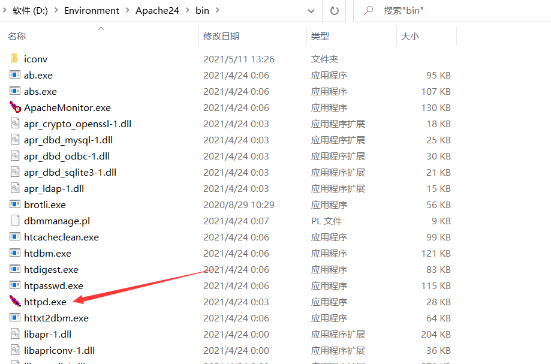
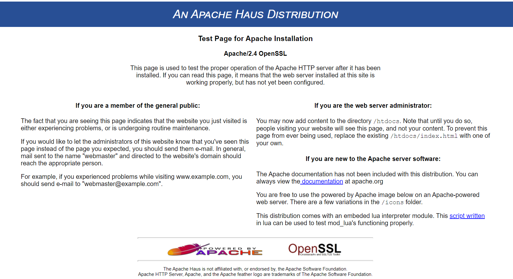
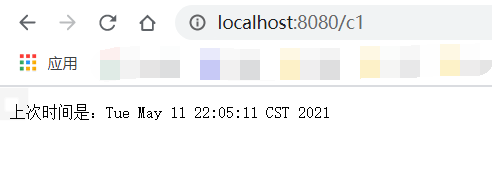
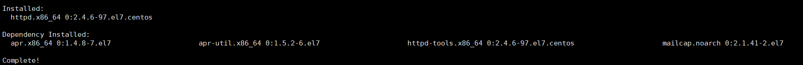
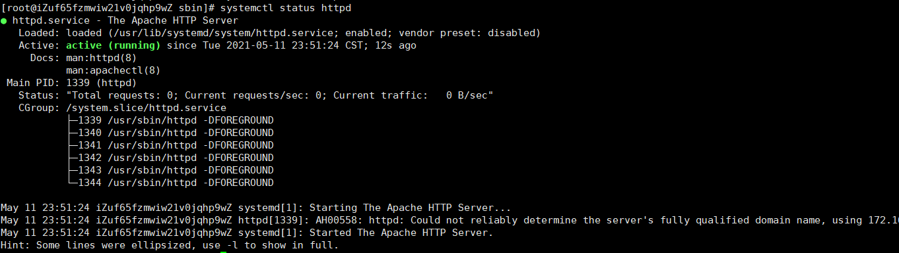

# 部署Apache服务器

Apache在Windows下的下载、安装、部署及代理Tomcat

## Apache简介

Apache(音译为[阿帕奇](https://baike.baidu.com/item/%E9%98%BF%E5%B8%95%E5%A5%87/374191))是世界使用排名第一的Web[服务器](https://baike.baidu.com/item/%E6%9C%8D%E5%8A%A1%E5%99%A8)软件。它可以运行在几乎所有广泛使用的[计算机平台](https://baike.baidu.com/item/%E8%AE%A1%E7%AE%97%E6%9C%BA%E5%B9%B3%E5%8F%B0/2606037)上，由于其[跨平台](https://baike.baidu.com/item/%E8%B7%A8%E5%B9%B3%E5%8F%B0/8558902)和安全性被广泛使用，是最流行的Web服务器端软件之一。它快速、可靠并且可通过简单的API扩充，将[Perl](https://baike.baidu.com/item/Perl)/[Python](https://baike.baidu.com/item/Python)等[解释器](https://baike.baidu.com/item/%E8%A7%A3%E9%87%8A%E5%99%A8/10418965)编译到服务器中。（摘自：百度百科）

## 入门

以下来自Apache官方[文档](http://httpd.apache.org/docs/2.4/getting-started.html)

如果您对Apache HTTP Server完全陌生，甚至根本不运行网站，那么您可能都不知道从哪里开始，或者不知道要问什么问题。本文档将向您介绍基础知识。

## 客户端，服务器和URL

网络上的地址用URL（统一资源定位符）表示，URL指定协议（例如`http`​），服务器名（例如 `www.apache.org`​），URL路径（例如 `/docs/current/getting-started.html`​）以及可能`?arg=value`​用于将其他参数传递给服务器的查询字符串（例如）。服务器。

客户端（例如Web浏览器）使用指定的协议连接到服务器（例如Apache HTTP Server），并使用URL路径**请求**资源。

URL路径可以表示服务器上的任何事物。它可以是文件（如`getting-started.html`​），处理程序（如[server-status](http://httpd.apache.org/docs/2.4/mod/mod_status.html)）或某种程序文件（如`index.php`​）。我们将在下面的“[网站内容”](http://httpd.apache.org/docs/2.4/getting-started.html#content)部分中对此进行更多讨论。

服务器将发送一个**响应**包括一个状态码和，任选地，响应体。状态代码指示请求是否成功，如果没有成功，则表明存在哪种错误情况。这告诉客户端应如何处理响应。您可以在[HTTP Server Wiki中](http://wiki.apache.org/httpd/CommonHTTPStatusCodes)阅读有关可能的响应代码的信息 。

事务的详细信息以及任何错误条件都将写入日志文件。下面在“[日志文件和故障排除”](http://httpd.apache.org/docs/2.4/getting-started.html#logs)部分中对此进行了更详细的讨论。

## 主机名和DNS

为了连接到服务器，客户端首先必须将服务器名称解析为IP地址-服务器在Internet上的位置。因此，为了使您的Web服务器可访问，服务器名必须在DNS中。

如果您不知道如何执行此操作，则需要与网络管理员或Internet服务提供商联系，以执行此步骤。

一个以上的主机名可能指向同一IP地址，并且一个以上的IP地址可以连接到同一台物理服务器。因此，您可以使用称为[虚拟主机](http://httpd.apache.org/docs/2.4/vhosts/)的功能在同一台物理服务器上运行多个网站。

如果要测试不可通过Internet访问的服务器，则可以在主机文件中放置主机名，以便进行本地解析。例如，`www.example.com`​出于测试目的，您可能希望在主机文件中放置一条记录，以将请求映射到本地系统。此项看起来像：

```shell
127.0.0.1 www.example.com
```

主机文件可能位于`/etc/hosts`​或 `C:\Windows\system32\drivers\etc\hosts`​。

您可以在[Wikipedia.org/wiki/Hosts_(file）上](http://en.wikipedia.org/wiki/Hosts_(file))了解有关主机文件的更多信息，并在[Wikipedia.org/wiki/Domain_Name_System上](http://en.wikipedia.org/wiki/Domain_Name_System)了解有关DNS的更多信息。

## 配置文件和指令

通过简单的文本文件配置Apache HTTP Server。这些文件可能位于各种位置，具体取决于您安装服务器的方式。这些文件的公共位置可以[在httpd Wiki中](http://wiki.apache.org/httpd/DistrosDefaultLayout)找到。如果从源安装了httpd，则配置文件的默认位置为 `/usr/local/apache2/conf`​。默认配置文件通常称为`httpd.conf`​。在服务器的第三方发行版中，这也可能有所不同。

为了便于管理，该配置通常分为多个较小的文件。这些文件是通过`Include`​指令加载的。这些子文件的名称或位置并不是很神奇，并且从一个安装到另一个安装可能会有很大的不同。安排和细分这些文件对**您**来说是最有意义的。如果默认情况下您的文件排列对您没有意义，请随时重新排列。

通过在这些配置文件中放置[配置指令](http://httpd.apache.org/docs/2.4/mod/quickreference.html)来[配置](http://httpd.apache.org/docs/2.4/mod/quickreference.html)服务器。指令是一个关键字，后跟一个或多个设置其值的参数。

的“这个问题_我应该在哪里把该指令？_ ”你想要一个指令是有效的，一般考虑回答。如果它是一个全局设置，它应该出现在配置文件中，任何外`<Directory>`​，`<Location>`​，`<VirtualHost>`​，或其他部分。如果仅适用于特定目录，则应将其放在`<Directory>`​引用该目录的 部分中，依此类推。有关这些部分的进一步讨论，请参见“[配置部分”](http://httpd.apache.org/docs/2.4/sections.html)文档。

除了主要配置文件外，某些指令还可以放入`.htaccess`​内容目录中的 文件中。 `.htaccess`​文件主要用于无法访问主服务器配置文件的人员。您可以`.htaccess`​在[`.htaccess`](http://httpd.apache.org/docs/2.4/howto/htaccess.html)​[howto中](http://httpd.apache.org/docs/2.4/howto/htaccess.html)阅读有关文件的更多信息 。

## 网站内容

网站内容可以采用许多不同的形式，但可以大致分为静态和动态内容。

静态内容是诸如HTML文件，图像文件，CSS文件以及位于文件系统中的其他文件之类的东西。该`DocumentRoot`​指令指定应在文件系统中放置这些文件的位置。该指令可以全局设置，也可以针对每个虚拟主机设置。查看您的配置文件，以确定如何为您的服务器设置。

通常，`index.html`​当请求目录而不指定文件名时，将提供名为的文档。例如，如果`DocumentRoot`​设置为， `/var/www/html`​并且请求 `http://www.example.com/work/`​，则文件 `/var/www/html/work/index.html`​将被提供给客户端。

动态内容是在请求时生成的任何内容，并且可能从一个请求更改为另一个请求。可以通过多种方式生成动态内容。各种[处理程序](http://httpd.apache.org/docs/2.4/handler.html)可用于生成内容。可以编写[CGI程序](http://httpd.apache.org/docs/2.4/howto/cgi.html)来为您的站点生成内容。

诸如mod\_php之类的第三方模块可用于编写执行各种操作的代码。许多使用各种语言和工具编写的第三方应用程序都可以在Apache HTTP Server上下载和安装。对这些第三方事物的支持不在本文档的范围内，您应该找到它们的文档或其他支持论坛来回答有关它们的问题。

## 下载，安装和配置（Windows）

## 下载

可以从[许多第三方供应商](http://httpd.apache.org/docs/current/platform/windows.html#down)处获得适用于Microsoft Windows的Apache httpd 。

稳定版本-最新版本：

* [2.4.46](http://httpd.apache.org/download.cgi#apache24)（发布于2020-08-07）

## 安装

Linux从源代码构建的过程请参考[官方文档](http://httpd.apache.org/docs/2.4/en/install.html)

Windows可直接下载构建好的版本

Apache HTTP Server Project本身不提供二进制版本的软件，仅提供源代码。

如果您不能自己编译Apache HTTP Server，则可以从Internet上可用的大量二进制发行版中获取二进制软件包。

在Microsoft Windows上部署Apache httpd以及可选的PHP和MySQL的流行选项包括：

* [ApacheHaus](http://www.apachehaus.com/cgi-bin/download.plx)
* [Apache Lounge](http://www.apachelounge.com/download/)
* [Bitnami WAMP Stack](http://bitnami.com/stack/wamp)
* [WampServer](http://www.wampserver.com/)
* [XAMPP](http://www.apachefriends.org/en/xampp.html)

解压到本地目录即可

​​

## 配置

配置文件位于`/conf/httpd.conf`​中

在40行附近把原来的`SRVROOT`​注释，新增一个`SRVROOT`​，值为Apache实际的目录

```properties
#Define SRVROOT "/Apache24"
Define SRVROOT "D:\Environment\Apache24"
ServerRoot "${SRVROOT}"
```

## 运行

通过运行`bin`​目录下的httpd.exe来开启Apache服务

​​

在终端中输入

```shell
httpd.exe
```

即可运行

接下来访问[http://localhost/](http://localhost/)即可展示Apache测试页

​​

即表示成功访问到了位于`/htdocs/index.html`​文档

## 访问动态文档

### Apache代理tomocat，转发请求

1. 编辑`Apache24\conf\httpd.conf`​

取消以下内容注释

```properties
#LoadModule headers_module modules/mod_headers.so
#LoadModule proxy_module modules/mod_proxy.so
#LoadModule proxy_http_module modules/mod_proxy_http.so
#Include conf/extra/httpd-vhosts.conf
```

将以下：

```properties
<Directory />
AllowOverride none
Require all denied
</Directory>
```

改为：

```properties
<Directory />
AllowOverride none
Require all granted
Header set Access-Control-Allow-Origin *
</Directory>
```

2. 编辑`Apache24\conf\extra\httpd-vhosts.conf`​

首先，将所有内容全部注释，然后在最后添加以下内容（//为注释）（中文不要写到配置文件，会报错，导致apache无法启动）

```properties
<VirtualHost *:80>
ServerName localhost #代理服务的域名
ServerAlias localhost #同上
ProxyPass / http://127.0.0.1:8080/ #要代理的地址，套接字
ProxyPassReverse / http://127.0.0.1:8080/ #意思同上
ErrorLog "logs/lbtest-error.log"
CustomLog "logs/lbtest-access.log" common
</VirtualHost>
```

然后依次启动Tomcat服务，Apache服务

首先访问Tomcat地址http://localhost:8080/c1

​​

然后访问Apache代理的地址

​​

代理动态文档正常

## 下载，安装和配置（Linux）

## Apache服务概览

> 软件包： httpd, httpd-devel, httpd-manual
> 服务类型：由systemd启动的守护进程
> 配置单元： /usr/lib/systemd/system/httpd.service
> 守护进程： /usr/sbin/httpd
> 端口： 80(http), 443(https)
> 配置： /etc/httpd/
> Web文档： /var/www/html/

Apache日志记录目录：/var/log/httpd/
该目录下有两种文件：

```shell
access_log # 记录客户端访问Apache的信息，比如客户端的ip
error_log # 记录访问页面错误信息
```

Apache服务启动的记录日志：

```shell
/var/log/messages # 这个日志是系统的大集合
```

## 安装Apache

```bash
yum install httpd
```

​​

## 设置httpd服务开机启动

```bash
systemctl enable httpd
Created symlink from /etc/systemd/system/multi-user.target.wants/httpd.service to /usr/lib/systemd/system/httpd.service.
```

## 启动Apache

```bash
systemctl start httpd
```

## 查看Apache的状态

```bash
systemctl status httpd
```

​​

通过服务器IP直接访问

​​

## Apache命令

停止Apache服务

```bash
systemctl stop httpd
```

启动Apache服务

```bash
systemctl start httpd
```

重启Apache服务

```bash
systemctl restart httpd
```

禁用Apache开机自启动

```bash
systemctl disable httpd
```

Apache开机自启动

```bash
systemctl enable httpd
```

更改配置后重新加载Apache服务

```bash
systemctl reload httpd
```

### Apache的主配置文件

​`/etc/httpd/conf/httpd.conf`​安装完后就可以到Apache的默认目录`/var/www/html`​ 添加一个简单的index.html

```html
<!DOCTYPE html>
<head>
<title>test</title>
</head>
<body>
<p>Hello World!</p>
</body>
</html>
```

再次在浏览器输入ip地址就会显示以下界面

​​
