# kafka 可视化测试工具

　　‍

　　使用Kafka的小伙伴，有没有为无法直观地查看 Kafka 的 Topic 里的内容而发过愁呢？

　　下面推荐给大家一款带有可视化页面的Kafka工具：**Kafka Tool** （目前最新版本是 **2.0.4**）

## kafka Tool 工具下载

### 下载地址

　　[http://www.kafkatool.com/download.html](http://www.kafkatool.com/download.html)

### 下载界面

　　不同版本的Kafka对应不同版本的工具，个人使用的是0.11，所以下载的是最新的2.0.4版本

​​

​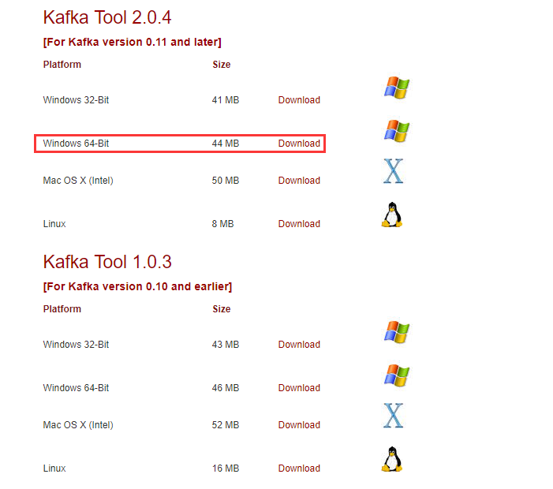​

　　如果是Windows，直接点击exe文件，一键安装即可。

---

## Kafka Tool 工具使用

### 1、Kafka 连接配置

#### 1）启动 Kafka Tool

　　在安装目录下，双击可执行文件 **kafkatool.exe**，启动 Kafka Tool

​​

#### 2）配置 Kafka 连接信息

　　提示配置相应的连接信息

​​

　　依次填写红框中的信息，点击“**Ping**” 和 “**Test**”测试连接情况；测试通过后，点击“Add”进行添加

​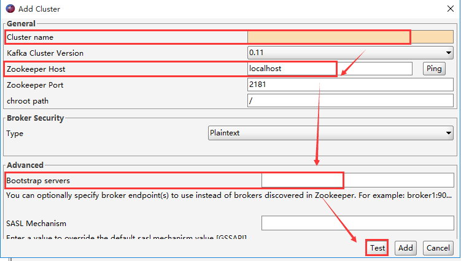​

　　 **【注意】** 需要在 C:\\Windows\\System32\\drivers\\etc 下的 **hosts** 文件中，添加入 kafka 的集群域名

　　例如，添加如下配置（此处需要根据实际情况配置，配置保存后，需要重启KafkaTools才能读取hosts文件中的内容）：

```
10.10.21.107<span> kafka1
</span>10.10.21.108<span> kafka2
</span>10.10.21.109 kafka3
```

### 2、查看 Kafka 数据

#### 1）查看 Kafka 数据

　　选择一个Topic --> Data，点击查询即可看到数据（但是Key和Message是二进制的，不能直观的看到具体的消息信息，需要设置展示格式）

　　Messages选择**Newest**，表示查看**最新**的Kafka数据；

　　结果列表中的每列，通过点击表头，可以按照升序或者降序排序（一般用在**时间字段**排序，方便查看最新数据）。

​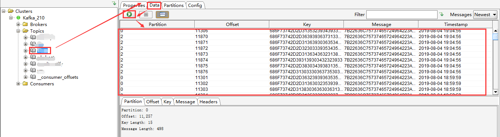​

#### 2）设置 Kafka 数据展示格式

　　在Tools -->Settings --> Topics，将 Key 和 Message 均设置为String 保存。这样是全局设置，对所有 Topic 均生效。

​​

​​

　　如果只是想单独设置某个 Topic，可以选中某个 Topic，在 Properties --> Content Type 中，将显示格式设置为String，点击 Update --> Refresh 即可生效

​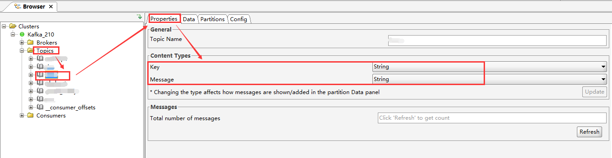​

　　设置后的数据列表如下

​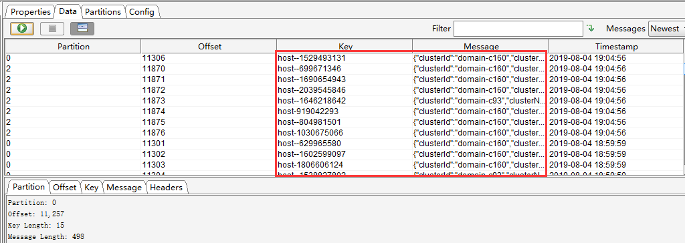​

#### 3）查看具体某一条消息

　　选中某一个message，点击“Message”查看详情，默认是“Text”格式（如果想看到JSON格式，只需要设置下“View Data As”即可）

​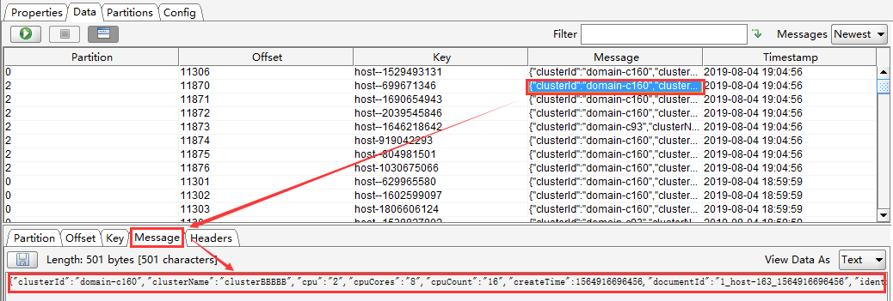​

​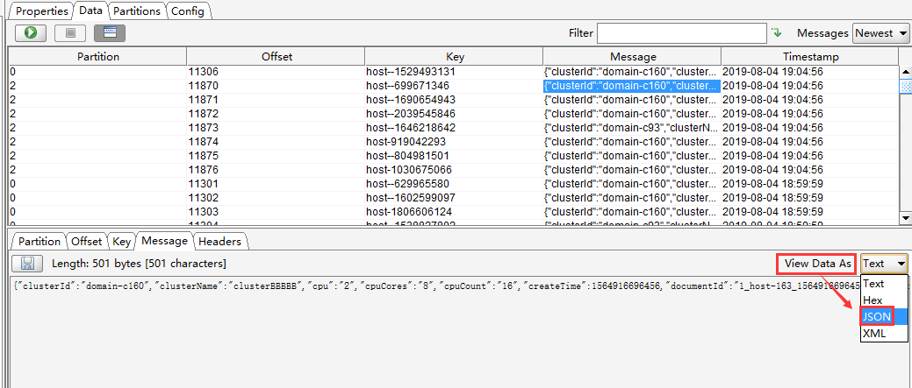​

　　“View Data As”设置为 JSON 后，消息信息格式如下

​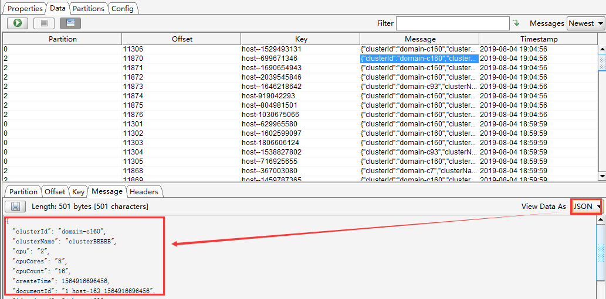​

#### 4）过滤查询 Kafka 消息

　　可以按照Offset（偏移量），Key（消息key），Message（消息主体），Regex（正则表达式）进行单个或者组合查询

​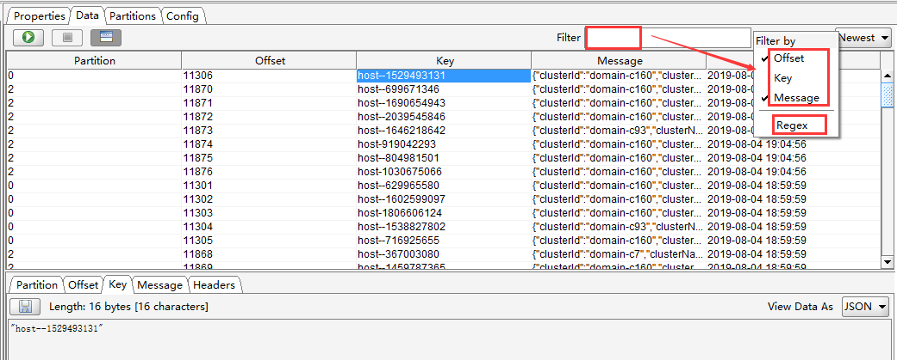​

### 3、使用 Kafka Tool 创建 Topic

#### 1）创建 Topic

　　步骤如下：
1、鼠标右键点击 “Topics” 文件夹图标 --> 选择 “Create Topic”，或者点击“Topics”，单击右侧页面中的“+”，会弹出“Add Topic”页面；
2、填写需要创建的Topic名称，分区数和备份数，点击“Add”添加，即可创建 topic。

　　效果如下：

​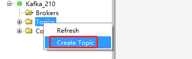​

​​

​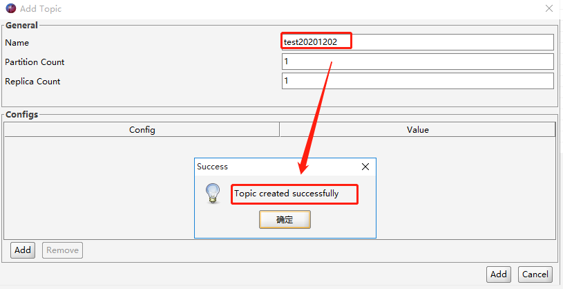​

#### 2）查看创建的 Topic

　　创建的出来的 topic， 可以在 Topic 列表或者通过 Kafka topic 命令查看。
自测的截图如下：

​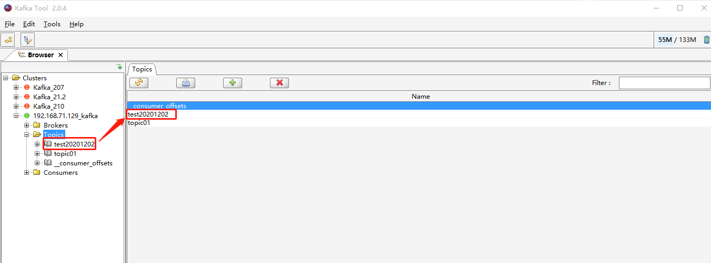​

​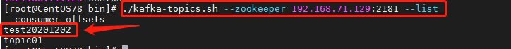​

#### 3）删除 Topic

　　如果因为失误导致创建的 topic 不是自己想要的，想进行删除，也可以通过 KafkaTool 进行界面化删除。

　　效果如下：

​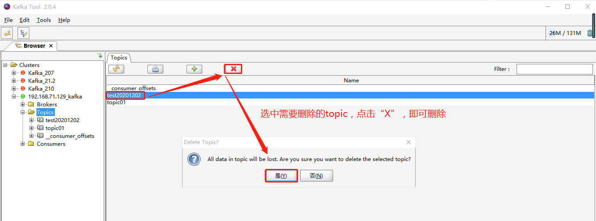​

​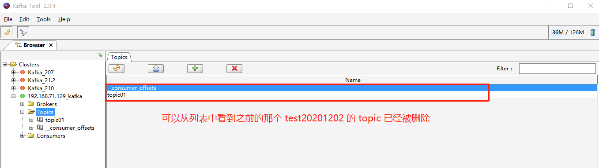​

​​

#### 4）补充说明

　　如果通过 Kafka Tool 创建 topic 失败，请确认如下两点：

　　**a）是否按照如下截图配置的Cluster Connection**

　　（本次举例是单台机器，如果实际是集群，需要把 bootstrap servers进行集群配置，如3台集群配置：192.168.71.129:9092,192.168.71.130:9092,192.168.71.131:9092）

​​

　　**b）是否按照博客里的说明在hosts文件中配置了域名**

​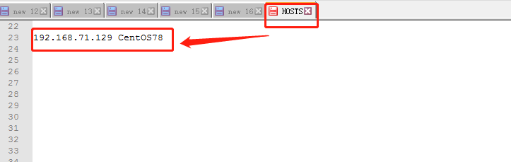​

　　如果上述两点均已确认无误，依旧不能通过 Kafka Tool 正确创建出 topic。

　　请确认 Kafka 服务本身是否正常，是否可以通过 kafka topic 命令创建出来 topic。

### 4、使用 Kafka Tool 模拟发送 Messages

　　操作步骤如下：

　　点击“Topics” --> 选择一个 topic（如：topic01） --> 选择分区（如：Partition 0），点击右侧“Data”里的“+”，会弹出“Add Message”页面。
其中，Key 和 Message 均支持两种方式：From file 和 Enter Manually\[Text\]
**From file**：就是数据来源于文件，需要上传文件（个人建议上传txt格式文件）
**Enter Manually[Text]** ：手动输入
二者可以混合搭配使用，并且 Key 和 Message **二者必须有值**，否则会报错！！！

　　效果如下：

​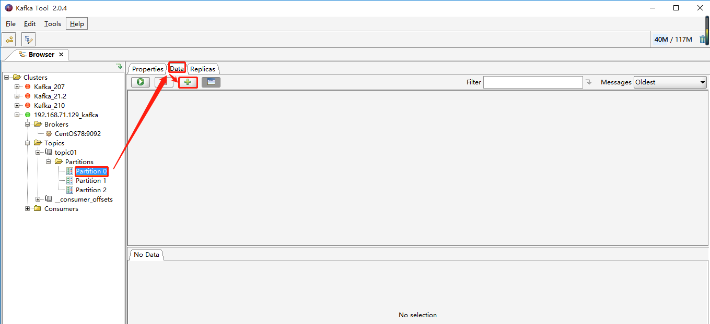​

#### 1）场景1：Key 和 Message 均选择手动输入

​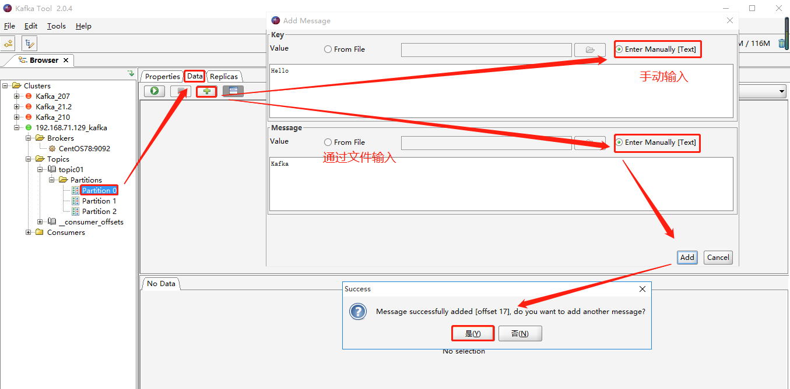​

#### 2）场景2：Key 和 Message 均选择来自文件

​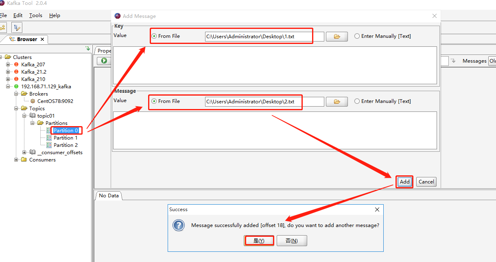​

#### 3）场景3：Key 和 Message 其中一个来自文件，一个来自手动输入

​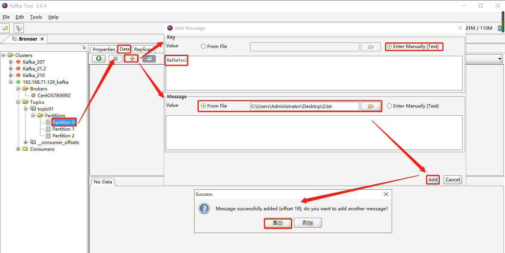​

​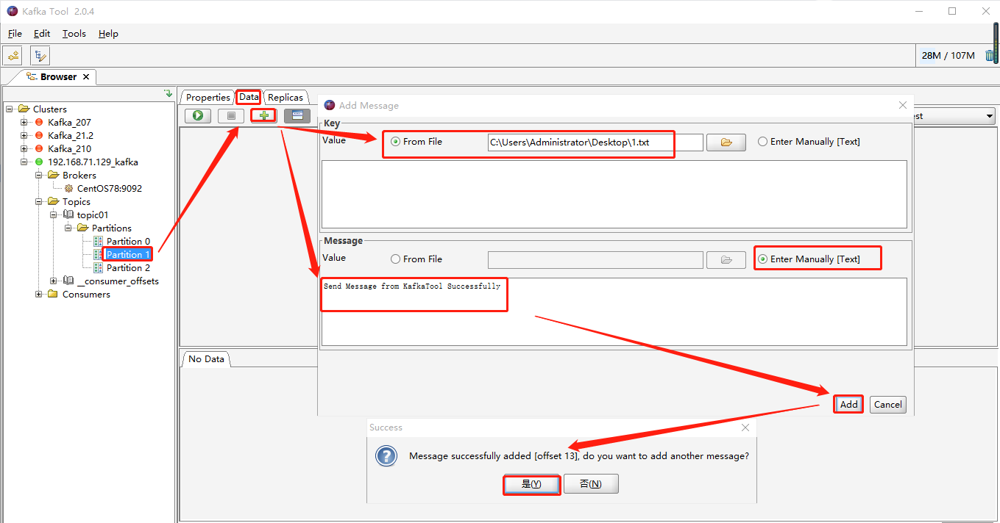​

　　2.txt 文件中内容如下：

​​

#### 4）消费者消费到的模拟数据

　　截图如下：

​​

　　消费命令如下：

```
./kafka-console-consumer.<span>sh</span> --bootstrap-server <span>192.168</span>.<span>71.129</span>:<span>9092</span> --topic topic01
```

### PS：

　　希望本篇博文对大家有所帮助~

　　强烈推荐给大家一款 **SSH客户端神器之 MobaXterm ：**​[https://www.cnblogs.com/miracle-luna/p/12008869.html](https://www.cnblogs.com/miracle-luna/p/12008869.html)
