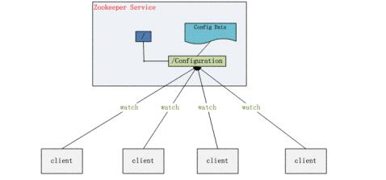
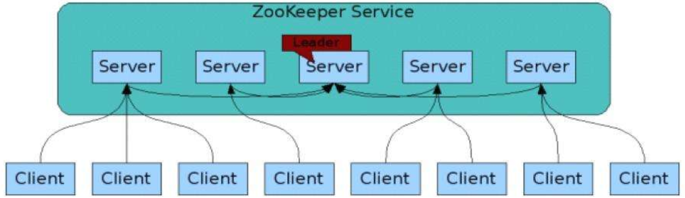
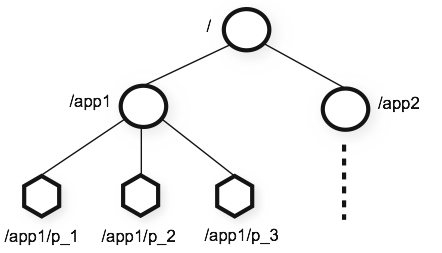
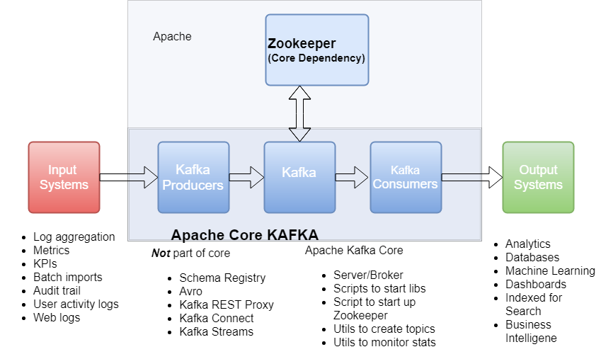
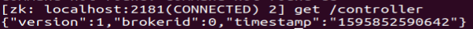

# Kafka 为什么 Kafka 依赖 ZooKeeper？

## 1.基本介绍

　　ZooKeeper 的官网是：[https://zookeeper.apache.org/](https://zookeeper.apache.org/)。在官网上是这么介绍 ZooKeeper 的：ZooKeeper 是一项集中式服务，用于维护配置信息，命名，提供分布式同步和提供组服务。

　　当我们编写程序的时候，通常会将所有的配置信息保存在一个配置文件中，例如账号、密码等信息，后续直接修改配置文件就行了，那分布式场景下如何配置呢？如果说每台机器上都保存一个配置文件，这时候要一台台的去修改配置文件难免出错，而且要管理这些机器也会变得复杂和困难，ZooKeeper 的出现就是为了解决这类问题，实现高度可靠的分布式系统。

## 2.基本功能

　　**1）配置管理**

　　　　ZooKeeper 为分布式系统提供了一种配置管理的服务：集中管理配置，即将全局配置信息保存在 ZooKeeper 服务中，方便进行修改和管理，省去了手动拷贝配置的过程，同时还保证了可靠和一致性。

　　​

　　**2）命名服务**

　　　　在分布式系统中，经常需要对应用或者服务进行统一命名，便于识别和区分开来，而 ZooKeeper 就提供了这种服务。

　　**3）分布式锁**

　　　　锁应该都不陌生，没有用过也听说过，在多个进程访问互斥资源的时候，需要加上一道锁。在分布式系统中，分布式程序分布在各个主机上的进程对互斥资源进行访问时也需要加锁。

　　　　分布式锁应当具备以下条件：

* 在分布式系统环境下，一个方法在同一时间只能被一个机器的一个线程执行；
* 高可用的获取锁与释放锁；
* 高性能的获取锁与释放锁；
* 具备可重入特性（可理解为重新进入，由多于一个任务并发使用，而不必担心数据错误）；
* 具备锁失效机制，防止死锁；
* 具备非阻塞锁特性，即没有获取到锁将直接返回获取锁失败。

　　**4）集群管理**

　　　　在分布式系统中，由于各种各样的原因，例如机器故障、网络故障等，导致集群中的节点增加或者减少，集群中有些机器需要感知到这种变化，然后根据这种变化做出对应的决策。

　　‍

## 3.基本架构

　　　　ZooKeeper 的基本架构图如下：

　　​

　　　　我们需要知道以下几点：

* Client 表示客户端，是请求发送方，数量不限；
* Server 表示服务端，是请求接收方，数量不限；
* Client 可以连接到每个 Server，每个 Server 中的数据都是一样的；
* ZooKeeper 启动时，会从所有 Server 中选取一个作为 leader（Paxos 协议），每个 follower 都会和 leader 建立连接；
* leader 负责进行数据更新等操作，并将数据同步到 follower 中，以此实现数据一致性。

## 4.ZooKeeper节点

　　 　　我们使用 znode来明确表示 ZooKeeper 的数据节点。下图表示的是 ZooKeeper 的命名层次空间，名称是由斜杠（/）分隔的一系列路径元素。

 　　​

　　　　znode 有四种类型 ：

　　**1）PERSISTENT（持久节点）**

　　　　默认的节点类型。持久化保存的节点，创建节点的客户端与 ZooKeeper 断开连接后，该节点依旧存在 。

　　**2）PERSISTENT_SEQUENTIAL（持久顺序节点）**

　　　　所谓顺序节点，就是在创建节点时，ZooKeeper 根据创建的时间顺序给该节点名称进行编号，适合用于分布式锁、分布式选举等场景。创建时添加 -s 参数即可。

　　**3）EPHEMERAL（临时节点）**

　　　　和持久节点相反，当创建节点的客户端与 ZooKeeper 断开连接后，临时节点会自动删除，适用于心跳、服务发现等场景。创建时添加参数-e 即可。

　　**4）EPHEMERAL_SEQUENTIAL（临时顺序节点）**

　　　　顾名思义，该类节点结合了临时节点和顺序节点的特征，在创建节点时，ZooKeeper 根据创建的时间顺序给该节点名称进行编号，当创建节点的客户端和 ZooKeeper 断开连接后，节点自动删除。创建时添加 -e -s 参数即可。

　　　　**ZooKeeper 实现分布式锁就是利用了临时顺序节点。**

　　　　首先在 ZooKeeper 中创建一个持久节点 ParentLock，每当有客户端想要获得锁时，就在 ParentLock  下创建一个临时顺序节点，如果该节点是第一个，则获得锁，如果不是，则找到排序比它靠前的一个节点并注册  Watcher，用于监听节点是否存在。若第一个节点运行完毕，其客户端会调用指令删除该节点，或者其客户端崩溃，第一个节点也会自动删除，而第二个节点监听到该节点被删除，再经过查询确认就能获得锁了。不难发现 ZooKeeper 实现的分布式锁相当于是一个等待锁的队列，能够提升抢锁的效率，但是因为需要创建和删除节点，导致性能较低。

## 5.Kafka + ZooKeeper

　　ZooKeeper 作为给分布式系统提供协调服务的工具被 kafka  所依赖。在分布式系统中，消费者需要知道有哪些生产者是可用的，而如果每次消费者都需要和生产者建立连接并测试是否成功连接，那效率也太低了，显然是不可取的。而通过使用 ZooKeeper 协调服务，Kafka 就能将 Producer，Consumer，Broker 等结合在一起，同时借助  ZooKeeper，Kafka 就能够将所有组件在无状态的条件下建立起生产者和消费者的订阅关系，实现负载均衡。

​​

　　**1）Broker 信息**

　　　　在 ZooKeeper 上会有一个专门用来进行 Broker 服务器列表记录的节点，节点路径为 /brokers/ids。Kafka  的每个 Broker 启动时，都会在 ZooKeeper 中注册，创建 /brokers/ids/[0-N] 节点，写入 IP，端口等信息，每个 Broker 都有一个 BrokerId。Broker 创建的是临时节点，在连接断开时节点就会自动删除，所以在 ZooKeeper  上就可以通过 Broker 中节点的变化来得到 Broker 的可用性。

　　**2）Topic 信息**

　　　　在 Kafka 中可以定义很多个 Topic，每个 Topic 又被分为很多个 Partition。一般情况下，每个  Partition 独立在存在一个 Broker 上，所有的这些 Topic 和 Broker 的对应关系都由 ZooKeeper 进行维护。

　　**3）负载均衡**

　　　　生产者需要将消息发送给 Broker，消费者需要从 Broker 上获取消息，通过使用 ZooKeeper，就都能监听 Broker 上节点的状态信息，从而实现动态负载均衡。

　　**4）offset 信息**

　　　　在上一篇博客中提到过，offset 用于记录消费者消费到的位置，在老版本（0.9以前）里 offset 是保存在 ZooKeeper 中的。

　　**5）Controller 选举**

　　　　在 Kafka 中会有多个 Broker，其中一个 Broker 会被选举成为 Controller（控制器），在任意时刻，Kafka 集群中有且仅有一个控制器。Controller 负责管理集群中所有分区和副本的状态，当某个分区的 leader 副本出现故障时，由  Controller 为该分区选举出一个新的 leader。Kafka 的 Controller 选举就依靠 ZooKeeper  来完成，成功竞选为 Controller 的 Broker 会在 ZooKeeper 中创建 /controller 这个临时节点，在  ZooKeeper 中使用 get 命令查看节点内容：

　　​

　　　　其中“version”在目前版本中固定为1，“brokerid”表示 Broker 的编号，“timestamp”表示竞选称为 Controller 时的时间戳。

　　　　当 Broker 启动时，会尝试读取 /controller  中的“brokerid ”，如果读取到的值不是-1，则表示已经有节点竞选成为 Controller  了，当前节点就会放弃竞选；而如果读取到的值为-1，ZooKeeper 就会尝试创建 /controller 节点，当该 Broker  去创建的时候，可能还有其他 Broker 一起同时创建节点，但只有一个 Broker 能够创建成功，即成为唯一的 Controller。
