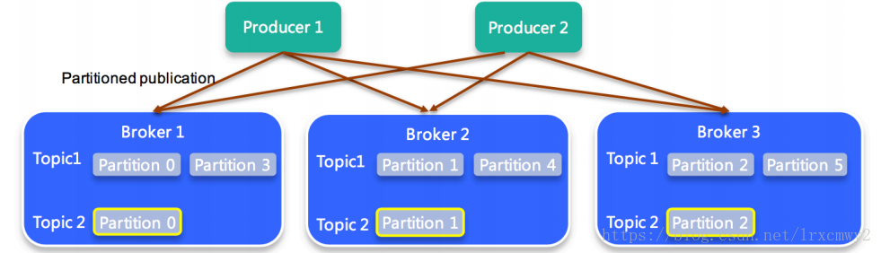
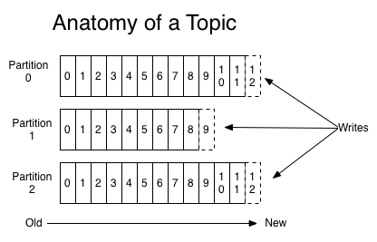
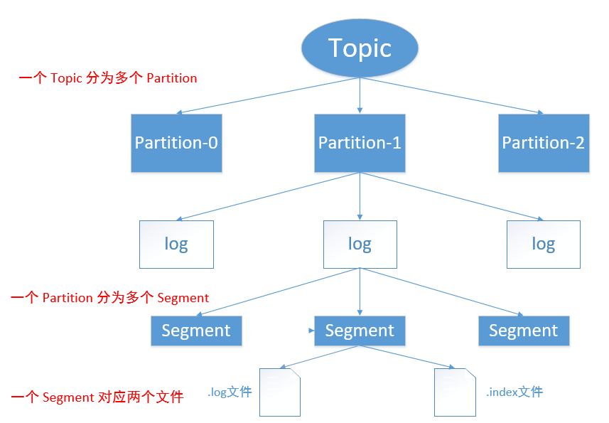
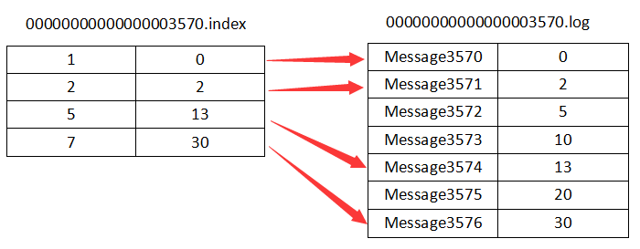
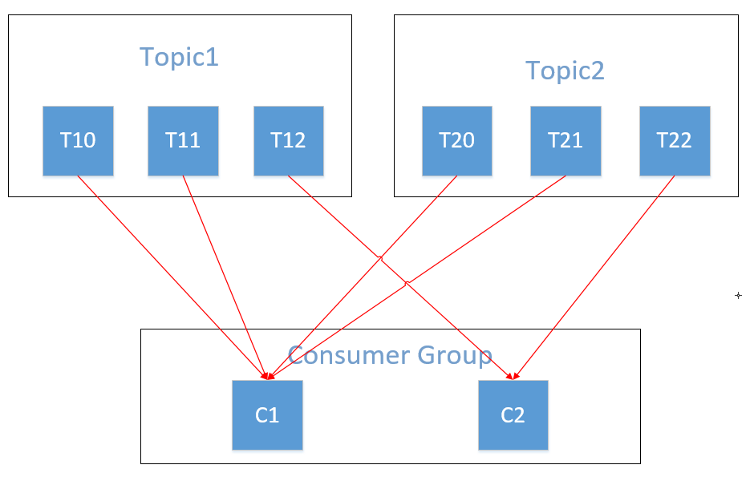
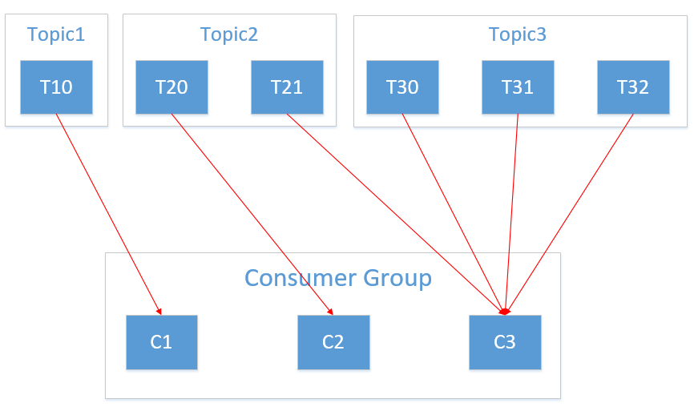
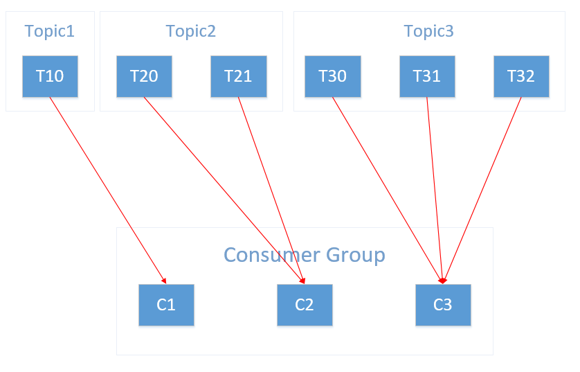
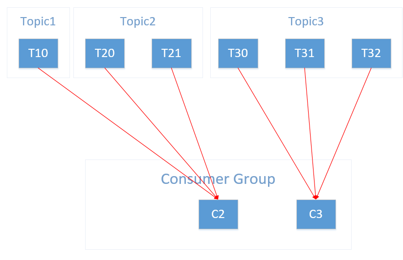

# Kafka 数据日志、副本机制和消费策略

## 一、Kafka 数据日志

### 1.主题 Topic

　　　　Topic 是逻辑概念。

　　　　主题类似于分类，也可以理解为一个消息的集合。每一条发送到 Kafka 的消息都会带上一个主题信息，表明属于哪个主题。

　　　　Kafka 的主题是支持多用户订阅的，即一个主题可以有零个、一个或者多个消费者来订阅该主题的消息。

### 2.分区 Partition

#### 1）分区原因

* 方便集群扩展，因为一个 Topic 由多个 Partition 组成，而 Partition 又可以通过调整以适应不同的机器，因而整个集群就可以适应任意大小的数据；
* 方便提高并发，因为可以以 Partition 为单位进行读写。

#### 2）分区概念

　　　　Partition 是物理概念，一个 Partition 就对应于一个文件夹。

　　　　在 Kafka 中每个主题都可以划分成多个分区，每个主题至少有一个分区，同一个主题的分区之间所包含的消息是不一样的。每个分区只会存在于一个 Broker 上。

　　​

　　　　每个消息在被添加到分区中的时候，都会带一个 offset（偏移量），它是消息在分区中的编号。通过设置 offset，Kafka 可以保证分区内的消息是有序的，但跨分区的消息是无序的。

　　​

#### 3）分区策略

* 在指明 Partition 的情况下，直接将指明的值作为 Partition 的值；
* 在未指明 Partition 但有 key 的情况下，将 key 的哈希值和该 Topic 中 Partition 的数量进行求余操作，其结果作为 Partition 的值；
* 在未指明 Partition 的值也没有 key 的情况下，第一次调用时生成一个随机整数，之后在这个整数上自增，将其值和该 Topic 中 Partition 的数量进行求余操作，其结果作为 Partition 的值，即 round-robin 算法。round-robin：轮询调度算法，原理是每一次把来自用户的请求轮流分配给内部中的服务器，从1开始，直到 N（内部服务器个数），然后重新开始循环。

### 3.数据日志

　　​

　　　　 对于每一个主题，Kafka 保持一个分区日志文件 log，而生产者生产的消息会不断添加到 log 文件末尾，为了防止 log 文件过大导致效率降低，Kafka 采用了**分片**和**索引**的机制，每个 Partition 分为多个 Segment，每个 Segment 又由两个文件组成  **“.index”索引文件**和 **“.log”数据文件**。这些文件位于一个文件夹下，文件夹的命名规则为：Topic 名称+ Partition 序号，而 index 和 log  文件的命名是根据当前 Segment 的第一条消息的 offset 偏移量来命名的。

　　　　在 index 文件中，是使用 key-value 结构来存储的，key 是 Message 在 log 文件中的编号，value 就是消息值。但是 Index 文件中并没有给每条消息都建立索引，而是采用了稀疏存储的方式，每隔一定字节的数据建立一条索引。这样避免了索引文件占用过多的空间，从而可以将索引文件保留在内存中 。

　　​

## 二、Kafka 副本机制

### 1.副本 Replica

　　　　Replica 是 Partition 的副本。每个 Partition 可以有多个副本，这多个副本之中，只有一个是 leader，其他都是 follower，所有的读写请求都通过 leader 来完成，follower 只负责备份数据。follow 会均匀分配到多个 Broker 上，当 leader 所在的机器挂掉之后，会从 follower 中重新选出一个副本作为 leader 继续提供服务。

　　　　那么为什么有这么多的副本却只使用 leader 来提供服务呢？如果都用上不是可以提高性能吗？这其实就是一致性和可用性之间的取舍了，如果多个副本同时进行读写操作，很容易出现问题。例如在读取消息时，一个消费者没有读取到，而另一个消费者却读取到了，因为这个消费者读取的是 leader 副本，显然这样是不行的。所以为了保证一致性，只使用一个 leader 副本来提供服务。

### 2.Commit 策略

　　　　Commit：指 leader 通知 Producer ，数据已经成功收到。Kafka 尽量保证 Commit 后即使 leader 挂掉，其他 flower 都有该条数据。

　　　　我们已经知道一个 Partition 可以有多个副本，当有数据写入 leader 时，这些 follower 是怎么复制数据的？下面是两种策略：

* 同步复制：只有所有的 follower 把数据都复制之后才 Commit，这种策略的一致性好，但可用性不高，当 follower 数量较多时，复制过程就会很耗时。
* 异步复制：只要 leader 拿到数据就立即 Commit，然后 follower 再复制，这种策略的可用性高，但一致性较差，例如在 Commit 之后 leader 挂掉，其他 follow 中就都没有该数据了。

　　　　那么 Kafka 使用的是什么策略呢？Kafka 使用了一种 **ISR （in-sync Replica）机制**：

* leader 会维护一个与其基本保持同步的 Replica 列表，称为 ISR(in-sync Replica)；
* 每个 Partition 都会有一个 ISR ，而且是由 leader 动态维护；
* 如果 ISR 中有一个 flower 比一个 leader 落后太多，或者超过一定时间没有请求复制数据，则将其移除；
* 当 ISR 中所有 Replica 都向 leader 发送 ACK 时，leader 才会 Commit。

### 3.ACK 机制

　　　　ACK：为了保证 Producer 发送的消息能够到达指定的 Topic，每个 Partition 收到消息之后要向 Producer 发送 ACK（acknowledgement）确认收到，如果 Producer 收到了 ACK，就会进行下一轮的发送，否则重新发送消息。

　　　　对于某些不太重要的数据，对数据的完整性没有严格的要求，可以容忍少量数据的丢失，Kafka 就没有必要等 ISR 中的所有 follower 都复制完，所以 Kafka 提供了三种可靠性级别，供用户进行选择和配置：

* 0：Producer 不用等待接收 ACK，只要数据接收到就返回，此时提供了最低的延迟，但若出现故障，会丢失数据；
* 1：Producer 等待 ACK，leader 接收成功后发送 ACK，丢失数据会重发，但若 follower 同步前 leader 挂掉了，会丢失数据；
* \-1：Producer 等待 ACK，leader 接收到数据，follower 同步完数据后发送 ACK，但若 follower 同步完，而 ACK 还没发送 leader 就挂掉了，会出现数据重复。

## 三、Kafka 消费策略

### 1.消费者组 Consumer Group

　　　　Consumer Group，消费者组，一个消费者组包含多个消费者，这些消费者共用一个 ID，即 Group ID，组内的消费者协调消费所订阅的主题的所有分区，当然了，每个分区只能由一个消费者进行消费。

### 2.偏移量 offset

　　　　offset ，偏移量，记录的是消费位置信息，即在消费者消费数据的过程中，已经消费了多少数据。

　　　　要获取 offset 的信息，需要知道消费者组的 ID 、主题和分区 ID。在老版本的 Kafka 中（0.9以前），offset 信息是保存在 ZooKeeper 中的，目录结构如下：

> /consumers/<groupId>/offsets/<topic>/<partitionId>

　　 　　但在新版本中（0.9及其之后的版本），Kafka 增加了一个主题：\_\_consumers\_offsets，将 offset 信息写入这个 Topic。不过这个 Topic 默认是不使用的，若要使用需要修改相应的设置，需要在 consumer.properties 中设置：

> exclude.internal.topics=false

　　　　查询 \_\_consumer\_offsets Topic 中的所有内容，如果是0.11.0.0之前的版本，使用如下命令：

> bin/kafka-console-consumer.sh --topic \_\_consumer\_offsets --zookeeper localhost:2181 --formatter "kafka.coordinator.GroupMetadataManager\\$OffsetsMessageFormatter" --consumer.config config/consumer.properties --from-beginning

　　　　如果是0.11.0.0及其之后的版本，使用如下命令：

> bin/kafka-console-consumer.sh --topic \_\_consumer\_offsets --zookeeper localhost:2181 --formatter "kafka.coordinator.group.GroupMetadataManager\\$OffsetsMessageFormatter" --consumer.config config/consumer.properties --from-beginning

### 3.消费策略

#### 1）RangeAssignor

　　　　Kafka 默认的消费策略。

　　　　RangeAssignor 策略的原理是按照消费者总数和分区总数进行整除运算来获得一个跨度，然后将分区按照跨度进行平均分配，以保证分区尽可能均匀地分配给所有的消费者。对于每一个 Topic，RangeAssignor 策略会将消费组内所有订阅这个 Topic 的消费者按照名称的字典序排序，然后为每个消费者划分固定的分区范围，如果不够平均分配，那么字典序靠前的消费者会被多分配一个分区。

　　　　假设消费组内有2个消费者 C1 和 C2，都订阅了主题 Topic1 和 Topic2，并且每个主题都有3个分区，那么所订阅的所有分区可以标识为：T10、T11、T12、T20、T21、T22。最终的分配结果为：

　　​

　　　　可以看到这样分配已经不均了，如果将类似的情况扩大，可能出现超出部分消费者消费能力的情况。

#### 2）RoundRobinAssignor

　　　　RoundRobinAssignor 策略的原理是将消费组内所有消费者以及消费者所订阅的所有 Topic 的 Partition 按照字典序排序，然后通过轮询方式逐个将分区以此分配给每个消费者。

　　　　假设有3个主题 Topic1、Topic2、Topic3，分别有1、2、3个分区，那么所订阅的所有分区可以标识为：T10、T20、T21、T30、T31、T32。消费组内有3个消费者 C1、C2、C3，其中 C1 订阅了 Topic1，C2 订阅了 Topic1 和 Topic2，C3 订阅了 Topic1、Topic2 和 Topic3。最终的分配结果为：

　　​

　　　　可以看到该策略也不是十分完美，这样分配其实并不是最优解，因为完全可以将分区 T10 和 T11 分配给消费者 C1。

#### 3）StickyAssignor

　　　　Kafka 从0.11.x 版本开始引入这种分配策略。

　　　　StickyAssignor 策略的分配要尽可能达到两个目的：1是分区的分配要尽可能均匀，2是分区的分配情况要尽可能和上次保持一样。分配情况尽可能保持一样，就好像单词“sticky”，使得分配策略具有“粘性”。

　　　　假设有3个主题 Topic1、Topic2、Topic3，分别有1、2、3个分区，那么所订阅的所有分区可以标识为：T10、T20、T21、T30、T31、T32。消费组内有3个消费者 C1、C2、C3，其中 C1 订阅了 Topic1，C2 订阅了 Topic1 和 Topic2，C3 订阅了 Topic1、Topic2 和 Topic3。最终的分配结果为：

　　​

　　　　可以看到这是一个最优解，而如果此时消费者 C1 从消费者组中移除，分配结果会变为：

　　​

　　　　和上次的分配情况相比，其中五个分区的分配情况都没有改变。
