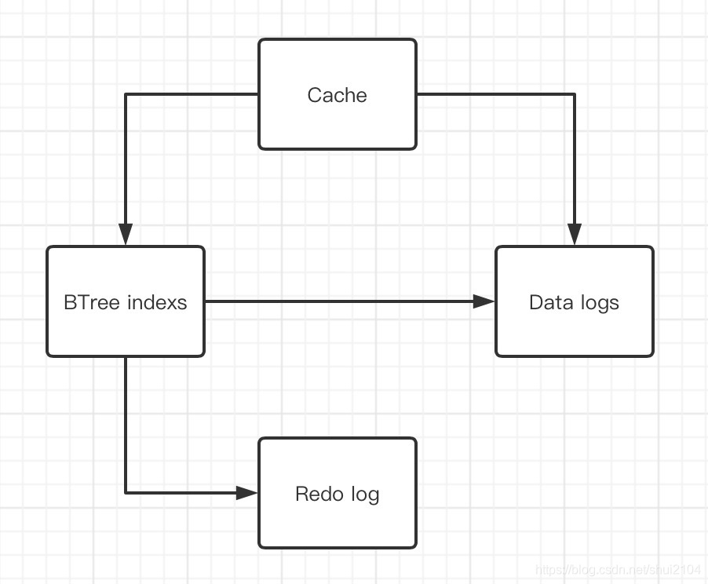
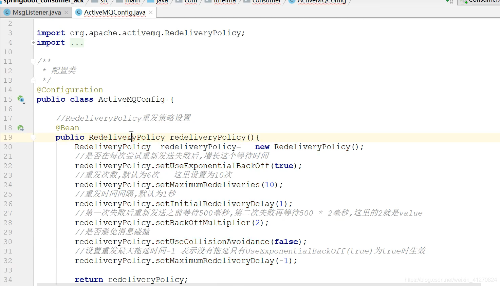

# activemq 优化

# MQ内存

*ActiveMQ运行于JVM之上，所以ActiveMQ的内存大小也取决于JVM的内存大小*

设置mq可使用的jvm内存大小，

`vim ~/bin/env`

```.properties
ACTIVEMQ_OPTS_MEMORY="-Xms2G -Xmx6G"
```

ActiveMQ的内存配置在activemq.xml中，如下所示：

```xml
<systemUsage>
    <systemUsage>
        <!-- broker一直没有可使用空间时，客户端会等待3000毫秒，然后再次尝试.如果此时broker依然没有足够的空间可用，才抛出异常 --> 
        <memoryUsage sendFailIfNoSpaceAfterTimeout="3000">
            <!-- memoryUsage是设置整个ActiveMQ节点的“可用内存限制”。
            这个值不能超过ActiveMQ本身设置的最大内存大小。其中的percentOfJvmHeap属性表示百分比-->
            <memoryUsage percentOfJvmHeap="70" />
        </memoryUsage>
        <storeUsage>
            <!-- storeUsage是设置整个ActiveMQ节点，用于存储“持久化消息”的“可用磁盘空间” -->
            <storeUsage limit="100 gb"/>
        </storeUsage>
        <tempUsage>
            <!-- tempUsage是设置临时文件大小。一旦ActiveMQ服务节点存储的消息达到了memoryUsage的限制，
            非持久化消息就会被转储到 temp store区域，虽然我们说过非持久化消息不进行持久化存储，
            但是ActiveMQ为了防止数据洪峰出现时非持久化消息大量堆积致使内存耗尽的情况出现，
            还是会将非持久化消息写入到磁盘的临时区域——temp store 
            但是它和持久化消息的区别是，重启之后，持久化消息会从文件中恢复，非持久化的临时文件会直接删除。-->
            <tempUsage limit="50 gb"/>
        </tempUsage>
    </systemUsage>
</systemUsage>
```

---

# 网络IO

*ActiveMQ支持多种消息协议，包括AMQP协议、MQTT协议、Openwire协议、Stomp协议等。*​***ActiveMQ在Version 5.13.0+ 版本后，将OpenWire, STOMP, AMQP, MQTT这四种主要协议的端口监听进行了合并，并使用auto关键字进行表示***​ *。也就是说，ActiveMQ将监听这一个端口的消息状态，并自动匹配合适的协议格式。配置如下：*

```xml
<transportConnectors>
    <!--DOS protection, limit concurrent connections to 1000 and frame size to 100MB -->
    <!-- <transportConnector name="openwire" uri="tcp://0.0.0.0:61616?maximumConnections=1000&amp;wireFormat.maxFrameSize=104857600"/>-->
    <transportConnector name="auto" uri="auto://0.0.0.0:61617?maximumConnections=1000" />
</transportConnectors>
```

但是这种优化只是让ActiveMQ的连接管理变得简洁了，并没有提升单个节点的处理性能。

如果您不特别指定ActiveMQ的网络监听端口，那么这些端口都将使用**BIO**网络IO模型。所以为了首先提高单节点的网络吞吐性能，我们需要明确指定Active的网络IO模型为**NIO**，如下所示：

```xml
<transportConnectors>  
     <!-- <transportConnector name="openwire" uri="tcp+nio://0.0.0.0:61616?maximumConnections=1000&amp;wireFormat.maxFrameSize=104857600"/>-->
     <!-- <transportConnector name="openwire" uri="ssl+nio://0.0.0.0:61616?maximumConnections=1000&amp;wireFormat.maxFrameSize=104857600"/>-->
    <transportConnector name="auto+nio" uri="auto+nio://0.0.0.0:61618?maximumConnections=1000"/>  
</transportConnectors> 
```

**bio  是同步阻塞IO模型，nio 是同步非阻塞IO模型。**

接下来应该还要配置这个端口支持的最大连接数量、设置每一条消息的最大传输值、设置NIO使用的线程池最大工作线程数量

```xml
<transportConnector name="auto+nio" uri="auto+nio://0.0.0.0:61608?maximumConnections=1000&amp;wireFormat.maxFrameSize=104857600" />
<!--
maximumConnections=1000                        # 最大连接数
wireFormat.maxFrameSize=104857600         # 设置每一条消息的最大传输值
wireFormat.maxInactivityDuration=90000    # 如果服务器在 90s 内没有接收到某个连接发来的消息，则自动断开该连接；
transport.useInactivityMonitor=true            # 启用"不活动链接监视器"，如果设置为 false，则服务器不监控"不活动连接"；
wireFormat.maxInactivityDurationInitalDelay=120000 # 指定 "不活动链接监视器" 在服务启动后多长时间后启动，在需要并发创建许多连接场景非常能有效的降低服务器开销；
# 设置NIO使用的线程池最大工作线程数量
org.apache.activemq.transport.nio.SelectorManager.corePoolSize=20
org.apache.activemq.transport.nio.SelectorManager.maximumPoolSize=50"

-->
```

**从5.15.0开始，ActiveMQ支持调整NIO的传输线程**
`vim ~/bin/env`

```bash
ACTIVEMQ_OPTS="$ACTIVEMQ_OPTS -Dorg.apache.activemq.transport.nio.SelectorManager.corePoolSize=2000 
-Dorg.apache.activemq.transport.nio.SelectorManager.maximumPoolSize=2000 
-Dorg.apache.activemq.transport.nio.SelectorManager.workQueueCapacity=1024"
# org.apache.activemq.transport.nio.SelectorManager.corePoolSize      核心线程池线程数
# org.apache.activemq.transport.nio.SelectorManager.maximumPoolSize   线程池最大线程数
# org.apache.activemq.transport.nio.SelectorManager.workQueueCapacity 线程池队列容量
# org.apache.activemq.transport.nio.SelectorManager.rejectWork        当达到容量时，允许使用IOException拒绝工作，以便可以保留现有的QOS
```

---

# 持久化消息

**非持久化订阅**：消费者只有在线的时候能接收到消息，一旦离线，服务器认为该消费者已离开，不会为其保留消息。等消费者下一次上线时，也只能收到从他上线以后生产者发送的消息。

**持久化订阅**：服务器为离线的消费者保留消息，当消费者离线时，服务器会记录该消费者的离线时间，并为其保留离线期间的所有消息（保存在磁盘上），等其上线后按顺序发给这个消费者。

## 1. KahaDB方式

默认的持久化方式，KahaDB存储是一个基于文件的快速存储消息，所有的消息顺序的添加到一个日志文件中，同时有另一个索引文件记录执行这些日志到存储地址，还有一个事务日志用于消息的恢复操作。
特点：

- 日志形式存储消息；
- 消息索引以B-Tree结果存储，可以快速更新；
- 完全支持JMS事务；
- 支持多种恢复机制，kahadb可以限制每个数据文件的大小。

db.data:      存放B-Tree indexs;
db.redo:      存放redo file，用于恢复B-Tree indexs;
db log files: 用于存储消息，当log日志到了指定的大小，会创建一个新的，当log日志中的消息都被删除，改日志文件将会删除；



- **Cache**：用于临时存储，消息会被发送给消费者，同时将安排存储。如果消息被很快确认，就不需要写入磁盘。
- **BTree Indexes**：保存在磁盘上，称为Metadata Store，对应的是db.data文件。它是对Data Logs以B树的形式索引。消息服务器可以通过此文件快速的重启恢复，因为它是消息的索引，可以恢复出每条消息的location。
- **Data Logs**：对应文件db-XX.log，以日志的形象存储生产者生产的消息。
- **Redo log**：对应db.redo,用于在非正常关机情况下维护索引完整性。

Metadata Store和Metadata Cache需要保证同步，同步的过程叫做**check point**。

**KahaDB的各个可配置属性**

```bash
属性                            默认值                 描述
directory                   activemq-data    # 保存message store数据文件的目录
indexWriteBatchSize       1000           # 批量更新索引的阀值，当要更新的索引到达这个索引时，批量更新到metadata store中
indexCacheSize              10000         # 指定metadata cache的大小
enableIndexWriteAsync   false           # 写入索引文件到metadata store中的方式是否采用异步写入
journalMaxFileLength      32mb         # 消息持久数据文件的大小
enableJournalDiskSyncs   true          # 如果为true，保证使用同步写入的方式持久化消息到journal文件中
cleanupInterval                30000        # 清除（清除或归档）不再使用的journal 文件的时间周期（毫秒）。
checkpointInterval           5000           # 写入索引信息到metadata store中的时间周期（毫秒）
ignoreMissingJournalfiles   false        # 是否忽略丢失的journal文件。如果为false，当丢失了journal文件时，broker启动时会抛异常并关闭
checkForCorruptJournalFiles false    # 如果为true，broker在启动的时候会检测journal文件是否损坏，若损坏便尝试恢复它。
checksumJournalFiles        false        # 如果为true。KahaDB为journal文件生产一个checksum，以便能够检测journal文件是否损坏。
archiveDataLogs                 false        # 如果为true，当达到cleanupInterval周期时，会归档journal文件而不是删除
directoryArchive            null                # 指定归档journal文件存放的路径
databaseLockedWaitDelay   10000    # 在使用主从数据库备份时，等待获取DB上的lock的延迟时间。
maxAsyncJobs                10000          # 等待写入journal文件的任务队列的最大数量。应该大于或等于最大并发producer的数量。配合并行存储转发属性使用。
concurrentStoreAndDispatchTransactions false # 如果为true，转发消息的时候同时提交事务
concurrentStoreAndDispatchTopics       false     # 如果为true，转发Topic消息的时候同时存储消息的message store中。
concurrentStoreAndDispatchQueues       true    # 如果为true，转发Queue消息的时候同时存储消息到message store中。
```

一个跑了满久的activemq停止后再启动就自动退出了（原因是大量死信队列的数据一直被写进kahadb中，然后持久化在磁盘上，磁盘激增导致该问题发生。）

```xml

<!--查看日志有以下报错：
2022-09-29 13:35:57,457 | ERROR | Failed to load message at: 8382:28269677 | org.apache.activemq.store.kahadb.KahaDBStore | ActiveMQ BrokerService[localhost] Task-35291
java.io.EOFException
	at java.io.RandomAccessFile.readFully(RandomAccessFile.java:446)[:1.7.0_67]
	at java.io.RandomAccessFile.readFully(RandomAccessFile.java:424)[:1.7.0_67]
	at org.apache.activemq.util.RecoverableRandomAccessFile.readFully(RecoverableRandomAccessFile.java:75)[activemq-kahadb-store-5.14.5.jar:5.14.5]
	at org.apache.activemq.store.kahadb.disk.journal.DataFileAccessor.readRecord(DataFileAccessor.java:88)[activemq-kahadb-store-5.14.5.jar:5.14.5]
	at org.apache.activemq.store.kahadb.disk.journal.Journal.read(Journal.java:893)[activemq-kahadb-store-5.14.5.jar:5.14.5]
	at org.apache.activemq.store.kahadb.MessageDatabase.load(MessageDatabase.java:1150)[activemq-kahadb-store-5.14.5.jar:5.14.5]
	at org.apache.activemq.store.kahadb.KahaDBStore.loadMessage(KahaDBStore.java:1241)[activemq-kahadb-store-5.14.5.jar:5.14.5]
	at org.apache.activemq.store.kahadb.KahaDBStore$KahaDBMessageStore$4.execute(KahaDBStore.java:593)[activemq-kahadb-store-5.14.5.jar:5.14.5]
	at org.apache.activemq.store.kahadb.disk.page.Transaction.execute(Transaction.java:779)[activemq-kahadb-store-5.14.5.jar:5.14.5]
-->
```

添加一下参数解决：

```xml

<persistenceAdapter>
    <kahaDB directory="${activemq.data}/kahadb"
        <!--忽略丢失的消息文件  -->
        ignoreMissingJournalfiles="true"
        <!--检查消息文件是否损坏 -->
        checkForCorruptJournalFiles="true"
        <!--产生一个checksum，以便能够检测journal文件是否损坏 -->
        checksumJournalFiles="true"/>
</persistenceAdapter>
```

## 2. AMQ存储

和KahaDB一样，AMQ 也是一个文件型数据库，消息信息最终是存储在文件中。内存中也会有缓存数据。
为了提升性能，创建消息的主键索引，进一步提升性能。同时由于AMQ会为每一个Destination创建一个索引，如果使用大量的Queue，索引文件将占用很多磁盘空间，同时Broker奔溃，索引重建的过程非常慢。所以，Destination的数量较少，消息吞吐量是应用程序的主要需求时可以选用此方式存储。

配置方式 conf/activemq.xml：

```xml
<persistenceAdapter> 
	<!--AMQ directory:数据存储路径 syncOnWrite：是否同步写入 maxFileLength：日志文件大小 --> 
	<amqPersistenceAdapter directory="${activemq.data}/kahadb" syncOnWrite="true" maxFileLength="200mb" /> 
</persistenceAdapter>
```

虽然 AMQ 性能略高于 Kaha DB 方式，但是由于其重建索引时间过长，而且索引文件 占用磁盘空间过大，所以已经不推荐使用。

## 3. JDBC存储

 
支持通过 JDBC 将消息存储到关系数据库，性能上不如文件存储，能通过关系型数据库查询到消息的信息。

数据库默认会创建3个表，每个表的作用：

- **activemq_msgs**：queue和topic的消息都存在这个表中
- **activemq_acks**：用于存储订阅关系。如果是持久化Topic，订阅者和服务器的订阅关系在这个表保存
- **activemq_lock**：跟kahadb的lock文件类似，确保数据库在某一时刻只有一个broker在访问(集群环境中才有用)

配置文件的Beans标签中添加：

```xml
<!--配置数据源-->
<bean id="mysql-ds" class="org.apache.commons.dbcp.BasicDataSource" destroy-method="close"> 
  <property name="driverClassName" value="com.mysql.jdbc.Driver"/> 
  <property name="url" value="jdbc:mysql://localhost/activemq?relaxAutoCommit=true"/> 
  <property name="username" value="username"/>
  <property name="password" value="password"/>
  <property name="maxActive" value="200"/>
  <property name="poolPreparedStatements" value="true"/> 
</bean>
<!--dataSource 指定持久化数据库的 bean，createTablesOnStartup 是否在启动的时候创建数据表，默认值是 true，这样每次启动都会去创建数据表了，一般是第一次启动的时候设置为 true，之后改成 false。-->
<persistenceAdapter>
    <jdbcPersistenceAdapter dataSource="#mysql-ds"  createTablesOnStartup="false"/>
</persistenceAdapter> 

```

在每个ActiveMQ的lib目录下加入mysql的驱动包和数据库连接池Druid包。

**JDBC&amp;Journal**
上面用JDBC实现了持久化，Journal呢就是一种缓存，也就是说，加上Journal，JDBC持久化速度将会更快！生产者生产消息，会存到数据库，消费者消费了这条消息，又要从数据库删除，会造成频繁地读库和写库，性能较低。有了journal，生产者生产的消息就会存到journal文件中，如果在journal还未来得及同步消息到DB的时候，消费者就已经将消息消费了，那么这条消息就不用同步到数据库了，这样就可以减轻数据库的压力。

配置方法：将persistenceAdapter标签换成persistenceFactory并配置成如下即可：

```xml
<persistenceFactory>  
   <journalPersistenceAdapterFactory  
      journalLogFiles="4"  
      journalLogFileSize="32768"  
      useJournal="true"  
      useQuickJournal="true"  
      dataSource="#mysql-ds"  
      dataDirectory="activemq-data" />  
</persistenceFactory>
```

## 4. 内存存储（关闭持久化存储）

基于内存的消息存储，就是消息存储在内存中。必须注意JVM使用情况以及内存限制，适用于一些能快速消费的数据量不大的小消息，当MQ关闭或者宕机，未被消费的内存消息会被清空。

配置方式 设置 broker属性值 persistent=“false”：表示不设置持久化存储，直接存储到内存中在broker标签处设置.

```xml
<broker brokerName="test-broker" persistent="false" xmlns="http://activemq.apache.org/schema/core">
  <transportConnectors>
    <transportConnector uri="tcp://localhost:61635"/>
  </transportConnectors>
</broker>

```

---

# 死信队列

缺省持久消息过期，会被送到DLQ，非持久消息不会送到DLQ  (非持久化需要配置)

**导致死信队列的两种情况**

**1、消息处理失败**（消费重试机制处理后）

**2、消息发送过期**（超过activemq设置消息过期时间）

## 1. 消费重试机制

在**默认**情况下，当消息签收失败时ActiveMQ消息服务器会继续每隔1秒钟向消费者端发送一次这个签收失败的消息，默认会尝试6次(加上正常的1次共7次)，如果这7次消费者端全部签收失败，则会给ActiveMQ服务器发送一个“poison ack”，表示这个消息不正常(“有毒”)，这时消息服务器不会继续传送这个消息给这个消费者，而是将这个消息放入死信队列(DLQ，即Dead Letter Queue)。

* **RedeliveryPolicy重发策略设置**

  ```xml
  <!-- 真正可以产生Connection的ConnectionFactory，由对应的 JMS服务厂商提供 -->
  <bean id="activeMQConnectionFactory" class="org.apache.activemq.ActiveMQConnectionFactory">
      <property name="brokerURL" value="tcp://localhost:61636"></property>
      <property name="useAsyncSend" value="true"></property>
      <property name="redeliveryPolicy">
          <bean id="redeliveryPolicy" class="org.apache.activemq.RedeliveryPolicy">
              <!--是否在每次尝试重新发送失败后,增长这个等待时间-->
              <property name="useExponentialBackOff" value="true"></property>
              <!--重发次数,默认为6次-->
              <property name="maximumRedeliveries" value="5"></property>
              <!--重发时间间隔,默认为1秒-->
              <property name="initialRedeliveryDelay" value="1000"></property>
              <!--第一次失败后重新发送之前等待500毫秒,第二次失败再等待500 * 2毫秒,这里的2就是value-->
              <property name="backOffMultiplier" value="2"></property>
              <!--最大传送延迟，只在useExponentialBackOff为true时有效（V5.5），假设首次重连间隔为10ms，倍数为2，那么第 二次重连时间间隔为 20ms，第三次重连时间间隔为40ms，当重连时间间隔大的最大重连时间间隔时，以后每次重连时间间隔都为最大重连时间间隔。-->
              <property name="maximumRedeliveryDelay" value="1000"></property>
          </bean>
      </property>
  </bean>

  ```

  
* **Broker消息重发插件**

  默认情况下，在消息重新投递次数达到配置的最大投递次数（或默认的6次），broker会将消息放入DLQ。我们可以使用broker消息重发插件来改变这一行为。即在一定延迟后，将消息重新投递给原始Destination，如果达到最大重试次数，则放入DLQ。

  ```xml
  <broker schedulerSupport="true">

          <plugins>
              <!-- 重发策略，对于超过重发次数的消息将会被添加到DLQ -->
              <redeliveryPlugin fallbackToDeadLetter="true"
                                sendToDlqIfMaxRetriesExceeded="true">
                  <redeliveryPolicyMap>
                      <redeliveryPolicyMap>
                          <redeliveryPolicyEntries>
                              <!--重发机制，默认重发6，重发延迟基于backOff模式-->
                              <redeliveryPolicy queue="SpecialQueue"
                                  maximumRedeliveries="4"
                                  redeliveryDelay="10000"/>
                          </redeliveryPolicyEntries>

                          <defaultEntry>
                          <!-- 其他Destination的默认处理策略 -->
                          <redeliveryPolicy maximumRedeliveries="4"
                              initialRedeliveryDelay="5000"
                              redeliveryDelay="10000"/>
                          </defaultEntry>
                      </redeliveryPolicyMap>
                  </redeliveryPolicyMap>
              </redeliveryPlugin>
          </plugins>

  </broker>

  ```

## 2. 设置消息过期时间

```xml
<borker>
     <plugins>
         <!-- 86400000ms = 1 day -->
         <timeStampingBrokerPlugin ttlCeiling="86400000" zeroExpirationOverride="86400000" />
     </plugins>
</borker>
```

## 3. 独立死信队列策略

把DeadLetter放入到各自的死信队列中。
对于queue而言：死信通道的前缀默认为"ActiveMQ.DLQ.Queue";
对于topic而言：死信通道的前缀默认为"ActiveMQ.DLQ.Topic";
比如队列order，那么它对应的死信通道为"ActiveMQ.DLQ.Queue.Order";
我们使用"queuePrefix"，"topicPrefix"来指定上述前缀。默认情况下，queue和topic，broker都将使用queue来保存DeadLetter，即死信通道通常为Queue，也可以指定为Topic。

```xml
<!--
指定所有队列使用独立的死信通道（点对点：Queue，不可重复消费）
<policyEntry queue=">">
指定所有队列使用独立的死信通道（发布/订阅：Topic，可以重复消费）
<policyEntry topic=">"> 
-->
<!--以下是指定某个队列(order)使用独立的死信通道-->
<policyEntry queue="order">
    <deadLetterStrategy>
      <individualDeadLetterStrategy queuePrefix="DLQ." useQueueForQueueMessages="false" />
    </deadLetterStrategy>
</policyEntry>
```

## 4. 过期消息不保存到死信队列

如果你只想丢弃过期的消息，不想发送到死信队列，你可以在一个死信队列策略中配置`processExpired=false`。

```xml
<policyEntry queue=">">  
    <deadLetterStrategy>  
        <sharedDeadLetterStrategy processExpired="false" />  
    </deadLetterStrategy>  
</policyEntry>  
```

## 5. 持久消息不保存到死信队列

对于**过期的**，可以通过processExpired属性来控制，对于**消费重试机制**失败的消息，需要通过插件来实现如下：丢弃所有死信;

```xml
<broker>  
    <plugins>  
      <discardingDLQBrokerPlugin dropAll="true" dropTemporaryTopics="true" dropTemporaryQueues="true" />  
    </plugins>  
  </broker>  
</beans>  
```

## 6. 非持久化消息放入死信队列

默认情况下，ActiveMQ不会将不能投递的非持久消息放到死信队列。如果你希望将非持久消息存储到死信队列，你可以在死信队列的策略中设置`processNonPersistent="true"`。

```xml
<policyEntry queue=">">  
    <deadLetterStrategy>  
        <sharedDeadLetterStrategy processNonPersistent="true" />  
    </deadLetterStrategy>  
</policyEntry> 
```

## 7. 定时清理死信队列

默认情况下，ActiveMQ永远不会使发送到DLQ的消息失效。 但是，在ActiveMQ 5.12中，deadLetterStrategy支持到期属性，其值以毫秒为单位。

```xml
<deadLetterStrategy>
    <sharedDeadLetterStrategy processExpired="true" expiration="30000"/>
</deadLetterStrategy>
```

---

# ActiveMQ 认证与授权

`vim activemq/conf/activemq.xml`

```xml
<plugins>
     <simpleAuthenticationPlugin>
           <users>
                <authenticationUser username="${activemq.username}" password="${activemq.password}" groups="users, admins" />
           </users>
     </simpleAuthenticationPlugin>
</plugins>
 


```

使用credentials.properties存储明文凭证

`vim activemq/conf/credentials.properties`

```.properties
activemq.username=username
activemq.password=password
```

---

# Web 控制台安全配置

**修改端口**​`vim activemq/conf/jetty.xml`

```xml
<bean id="jettyPort" class="org.apache.activemq.web.WebConsolePort" init-method="start">
    <!-- 修改port，端口自定义 -->
    <property name="host" value="0.0.0.0"/>
    <property name="port" value="8161"/>
</bean>
```

**修改登录用户名密码**​`vim activemq/conf/jetty-realm.properties`

```.properties
# Defines users that can access the web (console, demo, etc.)
# username: password [,rolename ...]
#用户名:密码,用户组
admin: admin, admin
user: user, user
```
