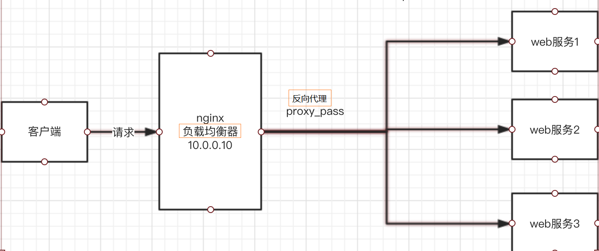

# 7.0 nginx 基础功能配置

# 1.限制IP访问

```nginx
location / { 
  deny 192.168.1.1;       # 拒绝IP
  allow 192.168.1.0/24;   # 允许IP 
  allow 10.1.1.0/16;      # 允许IP 
  deny all;               # 拒绝其他所有IP 
}
```

# 2.其他限制

```nginx
# 指定Nginx服务的用户和用户组
user nginx nginx;
-----------------------------------------
useradd nginx -s /sbin/nologin -M

# 限制http请求方法(只允许GET POST HEAD)
if ($request_method !~ ^(GET|HEAD|POST)$ ) {
  return 403; 
}

# 强制网站使用域名访问
if ( $host !~* 'doshell.com' ) {
    return 403;
}

# 
```

# 3.location

​`location`​ 表示进行路由的匹配，如果匹配则执行对应代码块里的操作。`location`​ 可以使用 **前缀匹配** 以及 **正则匹配**（需要以 `~*`​ 或 `~`​ 开头）。我们这里的配置使用的是前缀匹配。

```nginx
location   =   /uri     # =开头表示精确前缀匹配，只有完全匹配才能生效
location   ^~  /uri     # ^~开头表示普通字符串匹配上以后不再进行正则匹配
location   ~   pattern  # ~开头表示区分大小写的正则匹配
location   ~*  pattern  # ~*开头表示不区分大小写的正则匹配
location   /uri         # 不带任何修饰符，表示前缀匹配
location   /            # 通用匹配，任何未匹配到其他location的请求都会匹配到

###  location 是否以“／”结尾
# 在 ngnix 中 location 进行的是模糊匹配
# 没有“/”结尾时，location/abc/def  可以匹配 /abc/defghi 请求，也可以匹配 /abc/def/ghi 等
# 而有“/”结尾时，location/abc/def/ 不能匹配 /abc/defghi 请求，只能匹配 /abc/def/anything 这样的请求
```

# 4.alias & root

```nginx
#若用alias的话，则访问127.0.0.1/img/目录里面的文件时，ningx会自去/var/www/image/目录找文件
location /img/ {
    alias /var/www/image/;
}

#若用root的话，则访问/127.0.0.1/img/目录下的文件时，nginx会自动去/var/www/image/img/目录下找文件
location /img/ {
    root /var/www/image;
}

```

# 5.缓存和超时

```nginx
client_body_timeout 10;      # 设置客户端请求主体读取超时时间 
client_header_timeout 10;    # 设置客户端请求头读取超时时间 
keepalive_timeout 55;        # 第一个参数指定客户端连接保持活动的超时时间，第二个参数是可选的，它指定了消息头保持活动的有效时间 
send_timeout 10;             # 指定响应客户端的超时时间

client_header_buffer_size 1k;     # 如果(请求行+请求头)的大小如果没超过1k，放行请求  
large_client_header_buffers 4 8k; # (请求行+请求头)最大不能超过32k(4 * 8k)
client_body_buffer_size 128k;
client_max_body_size 1m;
client_body_temp  /data/nginx/client_body_temp  1 2; # 设置存储用户请求体的文件的目录路径
# 如果请求的数据小于client_body_buffer_size直接将数据先在内存中存储。
# 如果请求的值大于client_body_buffer_size小于client_max_body_size，就会将数据先存储到临时文件中
types_hash_max_size 512; # 影响散列表的冲突率
charset UTF-8    # 设置应答的文字格式。
tcp_nopush  on;  # 数据包会累积一下再一起传输，可以提高一些传输效率
tcp_nodelay on;  # 小的数据包不等待直接传输
```

# 6.状态统计

在 nginx 中，有些时候我们希望能够知道目前到底有多少个客户端连接到了我们的网站。我们希望有这样一个页面来专门统计显示这些情况。这个需求在 nginx 中是可以实现的，我们可以通过简单的配置来实现。

```nginx
server {
  location /status {
    stub_status on;
    access_log off;
    }
  }
```

# 7.目录展示及文件访问

```nginx
# mkdir 
location /mkdir/ {
    alias   /data/nginx/data/;
    auth_basic "welcome!";
    auth_basic_user_file /data/nginx/conf/nginx.passwd;
    limit_req zone=one burst=5;
    limit_rate 50k;
    autoindex on;              # 开启目录浏览功能；
    autoindex_exact_size off;  # 关闭详细文件大小统计，让文件大小显示MB，GB单位，默认为b；
    autoindex_localtime on;    # 开启以服务器本地时区显示文件修改日期！
}
```

‍

# 8.目录保护

> 为了保护隐私或者私密文件我们需要对一些网站进行密码保护，比如比如要对网站目录下的test文件夹进行加密认证，那要如何设置nginx目录密码保护呢？

```nginx
# 1.创建密码文件
yum install -y httpd-tools
htpasswd -c ./htpasswd.nginx user password

# 2.修改nginx.conf
autoindex off;      # 禁止目录浏览
server_tokens off;  # 隐藏版本信息

server {
  location /status {
    stub_status on;
    access_log off;
    auth_basic "hello world";
    auth_basic_user_file /data/nginx/conf/passwd.nginx;
    }
  }
```

‍

# 9.虚拟主机

什么是虚拟主机？虚拟主机是一种特殊的软硬件技术，它可以将网络上的计算机分成多个虚拟主机，每个虚拟主机可以独立对外提供www服务，这样就可以实现一台主机对外提供多个web服务，每个虚拟主机之间独立的，互不影响。

**基于端口**

```nginx

server {
  listen 8080
  server_name doshell.cn;
    location / {
      root /data/web/aaa;
      index index.html;
      }
  }
  
server {
  listen 9090;
  server_name doshell.cn;
    location / {
      root /data/web/bbb;
      index index.html;
      }
  }
```

**基于域名**

```nginx

server {
  listen 8080;
  server_name aaa.doshell.cn;
    location / {
      root /data/web/aaa;
      index index.html;
      }
  }
  
server {
  listen 8080;
  server_name bbb.doshell.cn;
    location / {
      root /data/web/bbb;
      index index.html;
      }
  }
```

‍

‍

‍

# 12.负载均衡

Web服务器，直接面向用户，往往要承载大量并发请求，单台服务器难以负荷，我使用多台WEB服务器组成集群，前端使用Nginx负载均衡，将请求分散的打到我们的后端服务器集群中，
实现负载的分发。那么会大大提升系统的吞吐率、请求性能、高容灾

​​

* Nginx要实现负载均衡需要用到proxy\_pass代理模块配置（上一个实验）
* Nginx负载均衡与Nginx代理不同地方在于
* Nginx代理仅代理一台服务器，而Nginx负载均衡则是将客户端请求代理转发至一组upstream虚拟服务池
* Nginx可以配置代理多台服务器，当一台服务器宕机之后，仍能保持系统可用。

**负载均衡4中模式**

* 轮询策略（默认负载均衡策略）
* 最少连接数负载均衡策略
* ip-hash 负载均衡策略
* 权重负载均衡策略

**1. 轮询策略**

轮询负载策略是指每次将请求按顺序轮流发送至相应的服务器上，它的配置示例如下所示：

```nginx
http {
	upstream myapp1 {
    	server srv1.example.com;
    	server srv2.example.com;
    	server srv3.example.com;
    }
  
    server {
	listen 80;
        location / {
        proxy_pass http://myapp1;
        }
    }
}

```

在以上实例中，当我们使用“ip:80/”访问时，请求就会轮询的发送至上面配置的三台服务器上。 Nginx 可以实现 HTTP、HTTPS、FastCGI、uwsgi、SCGI、Memcached 和 gRPC 的负载均衡。

**2. 最少连接数负载均衡**

此策略是指每次将请求分发到当前连接数最少的服务器上，也就是 Nginx 会将请求试图转发给相对空闲的服务器以实现负载平衡，它的配置示例如下：

```nginx
upstream myapp1 {
    least_conn;
    server srv1.example.com;
    server srv2.example.com;
    server srv3.example.com;
}

```

**3. 加权负载均衡**

此配置方式是指每次会按照服务器配置的权重进行请求分发，权重高的服务器会收到更多的请求，这就相当于给 Nginx 在请求分发时加了一个参考的权重选项，并且这个权重值是可以人工配置的。因此我们就可以将硬件配置高，以及并发能力强的服务器的权重设置高一点，以更合理地利用服务器的资源，它配置示例如下：

```nginx
upstream myapp1 {
    server srv1.example.com weight=3;
    server srv2.example.com;
    server srv3.example.com;
}
```

以上配置表示，5 次请求中有 3 次请求会分发给 srv1，1 次请求会分发给 srv2，另外 1 次请求会分发给 srv3。

**4. ip-hash 负载均衡**

以上三种负载均衡的配置策略都不能保证将每个客户端的请求固定的分配到一台服务器上。假如用户的登录信息是保存在单台服务器上的，而不是保存在类似于 Redis 这样的第三方中间件上时，如果不能将每个客户端的请求固定的分配到一台服务器上，就会导致用户的登录信息丢失。因此用户在每次请求服务器时都需要进行登录验证，这样显然是不合理的，也是不能被用户所接受的，所以在特殊情况下我们就需要使用 ip-hash 的负载均衡策略。

ip-hash 负载均衡策略可以根据客户端的 IP，将其固定的分配到相应的服务器上，它的配置示例如下：

```nginx
upstream myapp1 {
    ip_hash;
    server srv1.example.com;
    server srv2.example.com;
    server srv3.example.com;
}
```

‍

# 13.连接&请求频率限制

## limit_conn_module

使用连接频率限制同一IP同时只能有3个连接

```nginx
#limit_conn_zone 指令可以对单个ip、单个会话同时存在的连接数的限制
http {
    ...#省略
    limit_conn_zone $binary_remote_addr zone=addr:10m;
    ...#省略
}
server {
    listen 80 default;
    server_name localhost;
    location ~ "^/test/app/" {
        limit_conn addr 6;      # 
        limit_rate_after 10m;
        limit_rate 1200k;
        limit_conn_status 499;
        limit_conn_log_level warn;
        root  /app;
    }
}

```

说明：

* http 区域，我这里使用的是 1.15 版本的，默认已经安装了对应的模块`ngx_http_limit_conn_module`​。

  * ​`limit_conn_zone`​：是一个固定的名称，下边调用的时候与之对应。
  * ​`$binary_remote_addr`​：表示通过 remote_addr 这个标识来做限制，“binary_” 的目的是缩写内存占用量，是限制同一客户端 ip 地址。
  * ​`zone=addr:10m`​：示生成一个大小为 10M，名字为 addr 的内存区域，用来存储访问的频次信息。
* server 区域，可以直接写在 server 区域内，表示限制所有，也可以写到对应的 location 当中，以表示单独区域限制。

  * ​`limit_conn`​：表示单个 IP 限制最大连接数为 6。
  * ​`limit_rate_after`​：表示请求前 10m 大小时不限速。
  * ​`limit_rate`​：表示单个连接最大连接带宽限制为 1200k。
  * ​`limit_conn_status`​：设置拒绝请求的返回值。值只能设置 400 到 599 之间（默认是 503）。
  * ​`limit_conn_log_level`​：定义日志级别，默认 error。

## limit_req_module

使用请求频率限制对于同一ip的请求，限制平均速率为5个请求/秒

```nginx

# limit_req_zone 指令可进行限流访问，防止用户恶意攻击刷爆服务器
limit_req_zone $binary_remote_addr zone=req_zone:5m  rate=2r/s;
#$binary_remote_addr --二进制格式的客户端地址
#zone=one:10m        --表示生成一个大小为10M，名字为one的内存区域，用来存储访问的频次信息
#rate=1r/s           --表示允许同一个ip地址客户端的访问频次，这里限制的是每秒1次，即每秒只处理一个请求

server {      
  location / {      
    limit_req zone=req_zone burst=5; # limit_req zone=one burst=5 nodelay; 
# zone=one --设置使用哪个配置区域来做限制，与上面limit_req_zone 里的req_zone对应 
# 设置一个大小为5的缓冲区当有大量请求（爆发）过来时，超过了访问频次限制的请求可以先放到这个缓冲区内等待，但是这个等待区里的位置只有5个，超过的请求会直接报503的错误然后返回。
# nodelay：
  # 如果设置，会在瞬时提供处理(burst+rate)个请求的能力，请求超过（burst+rate）的时候就会直接返回503，永远不存在请求需要等待的情况。（这里的rate的单位是：r/s）
  # 如果没有设置，则所有请求会依次等待排队
  } 
```

‍

# 15.启用ipv6

安装 nginx 时，需要将--with-ipv6 模块开启(1.3版本以上自动支持)

```nginx
# 修改nginx.conf
server {
  listen 80 ssl;
  listen [::]:80 ssl ipv6only=on;
  server_name www.doshell.cn;
  ssl_certificate     /data/nginx/ssl/nginx.crt;
  ssl_certificate_key /data/nginx/ssl/nginx.key;
  
    location / {
      root /data/web/client/;
      index index.html;
      }
  }
```

‍

# 16.配置WebDav

DAV的意思是“Distributed Authoring and Versioning”。RFC 2518为HTTP 1.1定义了一组概念和附加扩展方法来把web变成一个更加普遍的读/写媒体，基本思想是一个WebDAV兼容的web服务器可以像普通的文件服务器一样工作；客户端可以通过HTTP装配类似于NFS或SMB的WebDAV共享文件夹。

```bash
# 1.下载ngx-dav-ext-module
git clone --recursive https://github.com/arut/nginx-dav-ext-module

# 2.下载和自己原有的Nginx版本相同的源码包并解压

# 3.备份远nginx目录，保留nginx.conf

# 4.重新编译安装nginx
+ --with-http_dav_module --add-module=/opt/nginx-dav-ext-module

# 5.安装
make && make install
```

配置httpd-tools，参考8.目录保护

```nginx
# 添加webdav配置
###################### obsidian-webdav

    server {
        listen       11052 ssl;
        server_name  www.doshell.cn;
        #证书文件名称
        ssl_certificate /data/nginx/ssl/doshell.crt;
        #私钥文件名称
        ssl_certificate_key /data/nginx/ssl/doshell.key;
        ssl_session_timeout 5m;
        ssl_protocols TLSv1.2 TLSv1.3;
        ssl_ciphers ECDHE-RSA-AES128-GCM-SHA256:HIGH:!aNULL:!MD5:!RC4:!DHE;
        ssl_prefer_server_ciphers on;
        #access_log  logs/host.access.log  main;

		location /obsidian {
            charset utf-8;
            client_max_body_size 1G; # 最大允许上传文件大小
            alias /data/webdav;
            index index.html index.htm;
            autoindex on;
            # autoindex_localtime on;
            set $dest $http_destination;
            # 对目录请求、对URI自动添加"/"
            if (-d $request_filename) {
            rewrite ^(.*[^/])$ $1/;
            set $dest $dest/;
            }
            client_body_temp_path /tmp;
            dav_methods PUT DELETE MKCOL COPY MOVE; #DAV支持的请求方法
            dav_ext_methods PROPFIND OPTIONS LOCK UNLOCK; # DAV扩展支持的请求方法
            create_full_put_path on;  # 启用创建目录支持
            dav_access group:rw all:r; # 创建文件的以及目录的访问权限
            # auth_basic "Authorized Users WebDAV";
            auth_basic "user login";
            auth_basic_user_file /data/nginx/.httpasswd;

        }
    }
```

‍

‍
