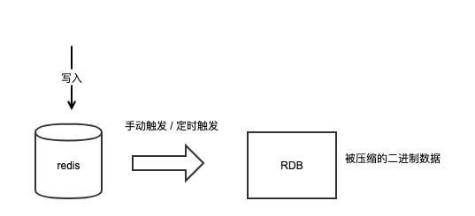
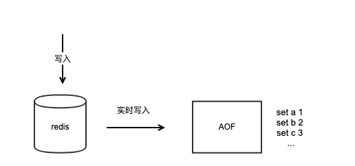

# redis 数据持久化

Redis是一个内存数据库，它的数据都保存在内存中，如果实例宕机，那么数据则全部丢失。如何保证数据的完整性和安全性也是提高服务高可用的重要机制之一。

Redis提供了完善的持久化机制，可以把内存中的数据持久化到磁盘上，方便我们进行备份数据和快速恢复数据。

这篇文章我们就来分析Redis的数据持久化是如何实现的？我们经常听的RDB和AOF有什么区别？以及它们不同的使用场景。

‍

# 持久化方式

Redis 持久化拥有以下三种方式：

* **快照方式**（RDB, Redis DataBase）将某一个时刻的内存数据，以二进制的方式写入磁盘；
* **文件追加方式**（AOF, Append Only File），记录所有的操作命令，并以文本的形式追加到文件中；
* **混合持久化方式**，Redis 4.0 之后新增的方式，混合持久化是结合了 RDB 和 AOF  的优点，在写入的时候，先把当前的数据以 RDB 的形式写入文件的开头，再将后续的操作命令以 AOF 的格式存入文件，这样既能保证 Redis  重启时的速度，又能减低数据丢失的风险。

‍

# RDB

RDB全称`Redis Database Backup file`​（Redis数据备份文件），也被叫做**Redis数据快照**。

我们可以通过执行`save`​或`bgsave`​命令让Redis在本地生成RDB快照文件，这个RDB文件包含了整个实例接近完整的数据内容。



它的优点如下：

* RDB文件数据是被压缩写入的，因此RDB文件的体积要比整个实例内存要小
* 当实例宕机恢复时，加载RDB文件的速度很快，能够在很短时间内迅速恢复文件中的数据

它的缺点也很明显：

* 由于是某一时刻的数据快照，因此它的数据并不全
* 生成RDB文件的代价是比较大的，它会消耗大量的CPU和内存资源

因此RDB比较适用于以下场景：

* 主从全量同步数据
* 数据库备份
* 对于丢失数据不敏感的业务场景，实例宕机后快速恢复数据

Redis主从全量同步数据就是使用RDB文件进行的，我们会在后面的文章详细讲到。

由此可以看出，RDB非常适合做数据备份，我们可以定时让Redis生成RDB文件，然后备份这个快照文件即可。

‍

## RDB相关配置

​`vim ~/redis.conf`​

```bash
# RDB持久化自动触发条件
# 最近15分钟内 至少产生1次写入
save 900 1
# 最近5分钟内 至少产生10次写入
save 300 10
# 最近1分钟内 至少产生10000次写入
save 60 10000

# bgsave持久化失败，是否停止持久化数据到磁盘，yes 表示停止持久化，no 表示忽略错误继续写文件
stop-writes-on-bgsave-error yes

# rdb文件是否压缩
# 文件压缩要是开启的话：Redis 会采用 LZF 算法进行压缩。如果不想消耗 CPU 性能来进行文件压缩的话，可以设置为关闭此功能，这样的缺点是需要更多的磁盘空间来保存文件。
rdbcompression yes

# 写入文件和读取文件时是否开启rdb文件检查，检查是否有无损坏，如果在启动是检查发现损坏，则停止启动。
rdbchecksum yes

# rdb持久化后存放的文件名
dbfilename dump.rdb

# rdb持久化后文件的存放路径
dir ./
```

```
127.0.0.1:6379> config set save ""
OK
```

​

## Copy On Write

在Redis上执行`save`​和`bgsave`​命令都可以生成RDB文件，但前者是在前台执行的，也就是说在生成RDB文件时，会**阻塞整个实例**，在RDB未生成之前，任何请求都是无法处理的，对于内存很大的实例，生成RDB文件非常耗时，显然这是我们不能接受的。

所以通常我们会选择执行`bgsave`​让Redis在后台生成RDB文件，这样Redis依旧可以处理客户端请求，不会阻塞整个实例。

但不是说后台生成RDB就是没有代价的，Redis为了实现后台把内存数据的快照写入文件，采用了操作系统提供的`Copy On Write`​技术，也就是我们熟知的`fork`​系统调用。

​**​`fork`​**​**系统调用会产生一个子进程，它与父进程共享相同的内存地址空间，这样子进程在这一时刻就能拥有与父进程的相同的内存数据。**

虽然子进程与父进程共享同一块内存地址空间，但在`fork`​子进程时，操作系统需要**拷贝父进程的内存页表**给子进程，如果整个Redis实例内存占用很大，那么它的内存页表也会很大，在拷贝时就会比较耗时，同时这个过程会**消耗大量的CPU资源**。在完成拷贝之前父进程也处于阻塞状态，无法处理客户端请求。

​`fork`​执行完之后，子进程就可以扫描自身所有的内存数据，然后把全部数据写入到RDB文件中。

之后父进程依旧处理客户端的请求，当在处理写命令时，父进程会**重新分配新的内存地址空间**，从操作系统申请新的内存使用，不再与子进程共享，这个过程就是`Copy On Write`​（写实复制）名字的由来。这样父子进程的内存就会**逐渐分离**，父进程申请新的内存空间并更改内存数据，子进程的内存数据不受影响。

由此可以看出，在生成RDB文件时，不仅消耗CPU资源，还有需要占用**最多一倍的内存空间**。

我们在Redis执行`info`​命令，可以看到`fork`​子进程的耗时，可以通过这个耗时来评估`fork`​时间是否符合预期。同时我们应该保证Redis机器拥有**足够的CPU和内存资源**，并合理设置生成RDB的时机。

---

​​

# AOF

AOF全称为`Append Only File`​（追加日志文件）。它与RDB不同的是，AOF中记录的是每一个命令的详细信息，包括完整的命令类型、参数等。只要产生写命令，就会实时写入到AOF文件中。

​

## AOF相关配置

​`vim ~/redis.conf`​

```bash
# 表示开启AOF持久化，默认是no表示关闭
appendonly yes 

# AOF持久化文件名
appendfilename "appendonly.aof" 

# 文件刷盘方式[`always` `everysec` `no`]
appendfsync everysec

# 是否重写，默认不重写
no-appendfsync-on-rewrite no  
```

## 刷盘方式

开启AOF后，Redis会把每个写操作的命令记录到文件并持久化到磁盘中，为了保证数据文件的安全性，Redis还提供了文件刷盘的时机：

* ​`appendfsync always`​：每次写入都刷盘，对性能影响最大，占用磁盘IO比较高，数据安全性最高
* ​`appendfsync everysec`​：1秒刷一次盘，对性能影响相对较小，节点宕机时最多丢失1秒的数据
* ​`appendfsync no`​：按照操作系统的机制刷盘，对性能影响最小，数据安全性低，节点宕机丢失数据取决于操作系统刷盘机制

以上可以看出AOF相对于RDB的优点是，AOF数据文件更新比较及时，比RDB保存更完整的数据，这样在数据恢复时能够恢复尽量完整的数据，降低丢失数据的风险。

如果同时存在RDB文件和AOF文件，Redis会**优先使用**AOF文件进行数据恢复。

但它的缺点也很易见：

* 随着时间增长，AOF文件会越来越大
* AOF文件刷盘会增加磁盘IO的负担，可能影响Redis的性能（开启每秒刷盘时）

‍

## AOF重写

针对第一种情况，Redis提供了AOF瘦身的功能，可以设置在AOF文件很大时，自动触发AOF重写，Redis会扫描整个实例的数据，重新生成一个AOF文件达成瘦身的效果。但这个重写过程也需要消耗大量的CPU资源。

```bash
# AOF文件距离上次文件增长超过多少百分比则触发重写
auto-aof-rewrite-percentage 100
# AOF文件体积最小多大以上才触发重写
auto-aof-rewrite-min-size 64mb
```

由于AOF可以最大可能降低丢失数据的风险，所以它一般适用于对丢失数据很敏感的业务场景，例如涉及金钱交易的业务。

## 性能影响

如果AOF的刷盘时机设置为每次写入都刷盘，那么会大大降低Redis的写入性能，因为**每次写命令都需要写入文件并刷到磁盘中才会返回**，当写入量很大时，会增加磁盘IO的负担。

性能与数据安全不能兼得，虽然Redis提供了实时刷盘的机制，但是在真正场景中使用的不多。

通常我们会选择每秒刷盘这种方式，既能保证良好的写入性能，在实例宕机时最多丢失1秒的数据，做到性能和安全的平衡。

‍

# RDB和AOF的总结

我们对RDB和AOF的总结如下表。

|#|RDB|AOF|
| --------------| --------------------------------------------------------------| ----------------------------------------------------|
|持久化方式|生成某一时刻的数据快照文件|实时记录每一个写命令到文件|
|数据完整性|不完整，取决于备份周期|相对完整性高，取决于文件刷盘方式|
|文件大小|压缩二进制写入，文件较小|原始的操作命令，文件大|
|宕机恢复时间|快|慢|
|恢复优先级|低|高|
|持久化代价|高，消耗大量CPU和内存|低，只占用磁盘IO资源|
|使用场景|数据备份、主从全量复制、对丢数据不敏感的业务场景快速数据恢复|对于丢失数据敏感的场景，例如涉及金钱交易相关的业务|

我们需要针对不同的业务场景选择合适的持久化方式，也可以根据RDB和AOF的优点配合使用，保证Redis数据的安全性，又可以兼顾它的性能。

‍

---

‍

# RDB和AOF混合持久化

RDB 和 AOF 持久化各有利弊，RDB 可能会导致一定时间内的数据丢失，而 AOF 由于文件较大则会影响 Redis 的启动速度，为了能同时使用 RDB 和 AOF 各种的优点，Redis 4.0 之后新增了混合持久化的方式。

在开启混合持久化的情况下，AOF 重写时会把 Redis 的持久化数据，以 RDB 的格式写入到 AOF 文件的开头，之后的数据再以 AOF 的格式化追加的文件的末尾。

混合持久化的数据存储结构如下图所示：

​

## 配置方式

`vim ~/redis.conf`​

```bash
aof-use-rdb-preamble yes
```

‍

## 混合持久化的加载流程

混合持久化的加载流程如下：

1. 判断是否开启 AOF 持久化，开启继续执行后续流程，未开启执行加载 RDB 文件的流程；
2. 判断 appendonly.aof 文件是否存在，文件存在则执行后续流程；
3. 判断 AOF 文件开头是 RDB 的格式, 先加载 RDB 内容再加载剩余的 AOF 内容；
4. 判断 AOF 文件开头不是 RDB 的格式，直接以 AOF 格式加载整个文件。

AOF 加载流程图如下图所示： <span data-type="text"> </span>​​​​​

‍
