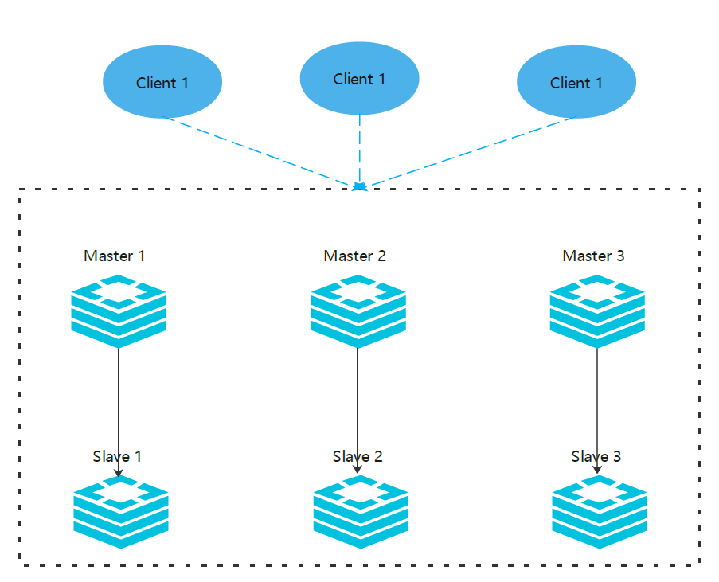

# redis cluster

Redis 的哨兵模式基本已经可以实现高可用，读写分离 ，但是在这种模式下每台 Redis 服务器都存储相同的数据，很浪费内存，所以在 redis3.0 上加入了 Cluster 集群模式，实现了 Redis 的分布式存储，对数据进行分片，也就是说每台 Redis 节点上存储不同的内容；



根据官方推荐，集群部署至少要 3 台以上的 master 节点，最好使用 3 主 3 从六个节点的模式。测试时，也可以在一台机器上部署这六个实例，通过端口区分出来。

|机器名称|IP|端口|
| ----------| ---------------| ------|
|master 1|192.168.0.200|6379|
|master 2|192.168.0.201|6379|
|master 3|192.168.0.202|6379|
|slave 1|192.168.0.203|6379|
|slave 2|192.168.0.204|6379|
|slave 3|192.168.0.205|6379|

### 1. 配置集群

6台服务器都进行以下配置，修改redis.conf

```bash
vim redis.conf
-------------------------------------------
 # bind配置成2个IP地址，一般默认配置为127.0.0.1
bind 20.200.34.145 127.0.0.1 
requirepass Ninestar123
# 从服务器需要配置masterauth 
masterauth Ninestar123
# 后台进程启动
daemonize yes
# redis工作目录
dir /data/redis
# redis日志
logfile "/data/redis/redis.log"
# 定义redis服务启用pid输出文件位置
pidfile "/data/redis/redis.pid" 
# 持久化方式
# appendonly yes
# 保护模式
protected-mode yes
# 启用集群模式
cluster-enabled yes 
# 集群中实例配置文件,根据你启用的节点来命名，最好和端口保持一致，这个是用来保存其他节点的名称，状态等信息的
cluster-config-file nodes-6379.conf
# 超时时间
cluster-node-timeout 5000
```

#### 使用Docker或者内网情况下，外网无法访问集群

上述我们知道了Cluster集群在启动时，会在数据目录下生成一个`nodes.conf`​记录集群信息，其中包含了每个节点的地址和端口，这也是为什么我们通常连接一个节点就可以操作整个集群，在默认情况下：

* 每次集群启动，每个节点会自动获取自己的内网地址并广播给其它节点，这样每个节点将各自节点地址记录在`nodes.conf`​中，并且每次启动`nodes.conf`​都会被刷新
* 通过客户端进行连接时，客户端会先通过连接的节点，获取整个集群每个节点的地址，再重新连接每个集群节点，而客户端获取的集群节点地址，就是对应节点中`nodes.conf`​中的地址

可见这就会导致一个问题：当我们在Docker或者内网环境搭建了一个Cluster集群，客户端在连接时得到的每个节点地址是内网地址，这就导致客户端在外网无法成功连接集群。

事实上这个问题很好解决，我们让每个节点在广播自己地址端口给其它节点时，指定广播自己的外网地址和端口，而不是自动检测到的内网地址端口就可以了。

在每个Cluster的节点配置文件中，加入下列配置：

```config
cluster-announce-ip               #所在服务器外网地址
cluster-announce-port             #外网端口
cluster-announce-bus-port         #节点交互端口

---------------------------------------------------------
[root@localhost redis-cluster]# ./redis-1/bin/redis-cli  -a 8ql6yhy cluster nodes
Warning: Using a password with '-a' or '-u' option on the command line interface may not be safe.
9a3f0dcccf49d4405600418431f99ae2eac8e71d 192.168.133.11:6381@16381 master - 0 1728881560283 3 connected 10923-16383
19c5298e42f6b3d70fa651f1ee13aa60bab5af25 8.123.3.3:4444@14444 myself,master - 0 1728881557000 1 connected 0-5460
429f4b2bdc99347cb429279da18b7fc02e2ddc0f 192.168.133.11:6380@16380 master - 0 1728881559281 2 connected 5461-10922
```

通过上述配置，我们可以指定每个节点启动时，广播给其它节点的自己的地址和端口信息，分别是：

* ​`cluster-announce-ip`​ 配置该节点广播给其它节点的自己的地址，通常填写这个节点所在服务器外网地址即可
* ​`cluster-announce-port`​ 配置该节点广播给其它节点的自己的端口，通常就是`port`​的配置（或者Docker暴露的端口），需保证该端口防火墙已放行
* ​`cluster-announce-bus-port`​ 配置该节点广播给其它节点的自己的集群交互端口（用于集群节点间相互通信、连结的端口），通常是`cluster-announce-port`​配置值加上`10000`​，需保证该端口防火墙已放行

‍

挨个启动所有 redis 节点

```bash
/data/redis/bin/redis-server /data/redis/redis.conf &
```

### 2. 启动集群

自动分配主从节点

```bash
redis-cli -a Ninestar123 --cluster create 192.168.0.200:6379  192.168.0.202:6379 192.168.0.203:6379 192.168.0.204:6379 192.168.0.205:6379 192.168.0.206:6379  --cluster-replicas 1
#--cluster-replicas 1       创建master的时候同时创建一个slave，默认是0 都是主节点
```

手动分配主从节点

```bash
# --cluster-replicas 0 所有节点都是master，使用以下命令创建3个主节点：
redis-cli -a Ninestar123 --cluster create 192.168.0.200:6379  192.168.0.202:6379 192.168.0.203:6379 --cluster-replicas 0
# 增加从节点：
redis-cli -a Ninestar123 --cluster add-node 192.168.0.204:6379 192.168.0.200:6379 --cluster-slave --cluster-master-id ***************
# slave 表示要添加从节点
# cluster-master-id 要添加到哪一个主节点，id是*****
# 192.168.0.204:6379 要添加的从节点
# 192.168.0.200:6379 作为谁的的从主节点，即主节点
```

注意：

* ​`redis-trib.rb`​是在`redis3.x`​版本时所用的一种部署redis集群的工具，`redis-cli`​是`redis4.x`​及更高版本所支持创建集群的工具，在`redis3.x`​版本时`redis-cli`​只是一个客户端连接管理工具。
* ​`redis-cli`​比`redis-trib.rb`​多了一个可以认证集群密码的功能，后者创建的集群不能对有密码的集群节点进行很好的管理，所以后来官方直接废弃了这个工具。
* 用`redis-trib.rb`​创建集群之前需要`配置ruby环境`​，新版本的`redis-cli`​可以直接创建集群环境而不用配置ruby环境。

redis-trib.rb创建集群

```bash
./bin/redis-trib.rb create 192.168.0.100:6379 192.168.0.100:6380 192.168.0.100:6381

# 若需要创建一主一备的集群需注意，如果对集群中实例主备顺序没有要求则可在下边代码中随意写实例的顺序（默认情况下前三台会被识别为Master，后三台实例会成为Slave），若对顺序有要求则最好先创建Master集群，然后依次添加Slave实例
./bin/redis-trib.rb create --replicas 1 192.168.0.100:6379 192.168.0.100:6380 192.168.0.100:6381 192.168.0.100:6382 192.168.0.100:6383 192.168.0.100:6384
```

‍

### 3. 数据验证

```bash
# 注意 集群模式下要带参数 -c，表示集群，否则不能正常存取数据！！！
redis-cli -a Ninestar123 -p 6379 -c

# 设置 k1 v1
127.0.0.1:6379> 
127.0.0.1:6379> set k1 v1
# # 这可以看到集群的特点:把数据存到计算得出的 slot，这里还自动跳到了192.168.0.203
-> Redirected to slot [12706] located at 192.168.0.203:6379
OK
192.168.0.203:6379> 

# 我们还回到 192.168.0.200  获取 k1 试试
redis-cli -a Ninestar123 -p 6379 -c
127.0.0.1:6379> get k1
-> Redirected to slot [12706] located at 192.168.0.203:6379
"v1"
192.168.0.203:6379> 
# 我们可以看到重定向的过程
```

### 4. 集群操作

#### 4.1 查看集群状态

```bash
./redis-cli -c -h 20.200.34.145 -p 6379 -a Ninestar123 cluster info
./redis-cli -c -h 20.200.34.145 -p 6379 -a Ninestar123 cluster nodes
```

#### 4.2 单独查看某个节点状态

```bash
./redis-cli --cluster check 20.200.34.146:6379 -a Ninestar123
```

#### 4.3 删除集群中从节点

```bash
./redis-cli -a password --cluster del-node  host:port  node_id
# host:port:表示的是要删除的那个节点的IP和端口
# node_id:表示的是删除的那个节点的节点ID
```

#### 4.4 添加集群从节点

```bash
./redis-cli -a password --cluster add-node new_host:new_port existing_host:existing_port --cluster-slave --cluster-master-id node_id
# password:客户端配置认证端口，配置文件对应requirepass配置
# new_host:new_port:表示的是要添加的那个从节点的ip和端口
# existing_host:existing_port:表示的是要給哪个主节点添加的从节点
# cluster-slave:表示的是要添加的从节点
# cluster-master-id:表示要给哪个主节点添加从节点，该主节点的节点ID
```

#### 4.5 动态**添加集群主节点**

集群中新加的主节点默认是没有分solt(hash槽)，需要在添加后手动添加

```bash
./redis-cli -a 123456 --cluster add-node new_host:new_port last_existing_host:last_existing_port --cluster-master-id  node_id
# new_host:new_port:为新添加的主节地址和端口
# last_existing_host:last_existing_port:为集群中最后一个主节点地址和端口（根据slots槽做判断共16383槽）
# node_id:主节点的ID值
```

新加的主节点分配hash槽

```bash
./redis-cli  -a 123456 --cluster reshard 20.200.35.202:6479 --cluster-from  7ee28a15eba6daeeb5e6c297faa0d31ff1e883e5 --cluster-to 9be83b00dd145d46c523750654ac7929fdd8db91 --cluster-slots 1365 --cluster-yes
# master_host:master_port:为集群中任何一个主节点信息和主节点端口
# cluster-from  node_id: 表示从哪个节点取出槽，node_id为集群master_host的ID值
# cluster-to  node _id:表示取出的槽分配给哪个节点，node_id为集群新加主节点的ID值
# cluster-slots:表示取出多少槽分配给新主节点
# cluster-yes:不回显槽分配信息，直接移动
```

#### 4.6 **删除集群主节点**

由于主节点的槽中保留key-value数据信息，所以在删除主节点之前需要把数据信息移动到其他主节点上（把节点中hash槽移动到其他节点）

```bash
./redis-cli  -a 123456 --cluster reshard 20.200.35.200:6482 --cluster-from  9be83b00dd145d46c523750654ac7929fdd8db91 --cluster-to 7ee28a15eba6daeeb5e6c297faa0d31ff1e883e5 --cluster-slots 1365 --cluster-yes
```

查看hash槽移动后的节点信息

```bash
./redis-cli -c -h 20.200.35.200 -p 6479 -a 123456 cluster nodes
```

删除主节点

```bash
./redis-cli -a 123456 --cluster del-node 20.200.35.200:6482 9be83b00dd145d46c523750654ac7929fdd8db91
```

‍

### 5. redis集群手动主备切换

Redis 集群中主备切换原则：是使用要升备节点为主节点的地址进行操作。

```bash
./redis-cli -c -h slave_ip -p slave_port -a password cluster failover
# slave_ip:为将要升级主节的备节点地址
# slave_port:为将要升级主节的备节点端口
# password:登陆密码
# cluster failover:为当前节点升为主节，原来主节点降为备节点

# 1.查看原来集群主备关系
./redis-cli -c -h 20.200.35.200 -p 6479 -a 123456 cluster nodes

# 2.进行主备切换操作
./redis-cli -c -h 20.200.35.201 -p 6480 -a 123456
Warning: Using a password with '-a' or '-u' option on the command line interface may not be safe.
20.200.35.201:6480> cluster failover
OK
# 3.查看切换后的主备节点关系
20.200.35.201:6480> cluster nodes
```

### redis cluster启停脚本

```bash
#!/bin/bash
REDIS_PATH="/data/redis"

check(){
$REDIS_PATH/bin/redis-cli -c -h 192.168.2.132 -p 6379  -a 123456 cluster info | grep cluster_state:ok | grep -v grep
if [[ $? == 0 ]];then
	return 0
	else
	return 1
fi
}


stop(){
check 
if [[ $? == 0 ]];then
$REDIS_PATH/bin/redis-cli -c -h 192.168.2.132 -p 6379  -a 123456 shutdown
$REDIS_PATH/bin/redis-cli -c -h 192.168.2.132 -p 6380  -a 123456 shutdown
$REDIS_PATH/bin/redis-cli -c -h 192.168.2.132 -p 6381  -a 123456 shutdown
$REDIS_PATH/bin/redis-cli -c -h 192.168.2.132 -p 6382  -a 123456 shutdown
$REDIS_PATH/bin/redis-cli -c -h 192.168.2.132 -p 6383  -a 123456 shutdown
$REDIS_PATH/bin/redis-cli -c -h 192.168.2.132 -p 6384  -a 123456 shutdown
echo "redis cluster is down"
else 
echo "The redis cluster is abnormal or closed"
fi
}

start(){
check
if [[ $? == 1 ]];then
$REDIS_PATH/bin/redis-server $REDIS_PATH/redis_6379.conf
$REDIS_PATH/bin/redis-server $REDIS_PATH/redis_6380.conf
$REDIS_PATH/bin/redis-server $REDIS_PATH/redis_6381.conf
$REDIS_PATH/bin/redis-server $REDIS_PATH/redis_6382.conf
$REDIS_PATH/bin/redis-server $REDIS_PATH/redis_6383.conf
$REDIS_PATH/bin/redis-server $REDIS_PATH/redis_6384.conf
echo "The redis cluster started successfully"
else
echo "redis cluster is running"
fi
}


restart(){
stop
sleep 5
start
}

case $1 in 
	start)
		start
		;;
	stop)
		stop
		;;
	restart)
		restart
		;;
	*)
		echo "usage sh redisCluster (start|stop|restart)"
		;;
esac

```

‍
